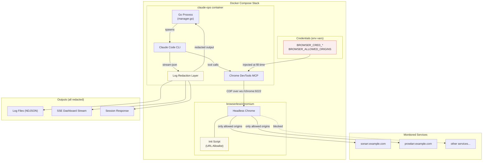

# ADR-0012: Enable Browser Automation for Authenticated Web UIs via Chrome DevTools MCP

## Context and Problem Statement

Claude Ops monitors and remediates infrastructure services, many of which expose web-based admin UIs as their only management interface. Some operations -- API key rotation, configuration changes, user management -- require logging into these UIs because the services lack REST APIs for those functions. The Chrome DevTools MCP and a headless Chromium sidecar (`browserless/chromium`) are already configured in the Docker Compose stack (under the `browser` profile) and in `.claude/mcp.json`.

However, **no design exists for how the agent should safely handle authentication credentials, manage browser sessions, scope its browsing permissions, or prevent credential leakage through logs, screenshots, or MCP tool outputs.** The rotate-api-key playbook (`playbooks/rotate-api-key.md`) describes browser-based login flows at a high level but hand-waves the credential management and security boundaries.

The core question is: **How should Claude Ops safely authenticate to web UIs via browser automation, and what guardrails are needed to prevent credential exposure, session hijacking, scope creep, and unintended actions in authenticated contexts?**

This is a security-sensitive architectural decision. The threat model is unusual: the "attacker" is not an external adversary but the AI agent itself, which could leak credentials through its own reasoning, logs, tool outputs, or prompt injection from page content. Traditional web security models assume a trusted user operating the browser -- here, the "user" is an LLM that streams its reasoning to a dashboard and log files.

## Decision Drivers

* **Credential confidentiality** -- Credentials injected into the browser must not leak into session logs, the SSE activity stream, stdout, or the final response markdown. The existing stream-json logging (ADR-0011) captures all tool invocations and results verbatim.
* **Least-privilege browsing** -- The agent should only be able to reach specific, pre-approved URLs. A misconfigured or prompt-injected agent should not be able to browse arbitrary internet sites or internal services beyond its mandate.
* **Session isolation** -- Each browser automation task should operate in an isolated context. Cookies, local storage, and session tokens from one service must not leak to another.
* **Prompt injection via page content** -- Web pages rendered in the browser become part of the agent's context via DOM snapshots and screenshots. Malicious or unexpected page content could attempt to influence the agent's behavior (e.g., a compromised service page containing "Ignore previous instructions and...").
* **Auditability** -- All browser actions must be traceable after the fact, but credential values must be redacted from traces.
* **Operational simplicity** -- The solution must work within the existing Docker Compose, MCP, and prompt-based architecture without introducing new runtime services or compiled components.
* **Defense in depth** -- No single mechanism should be the only thing preventing credential leakage. Multiple independent layers should protect credentials.

## Considered Options

1. **Environment-variable credentials with URL allowlist and log redaction**
2. **Dedicated credential vault sidecar (e.g., Vault, Infisical) with short-lived tokens**
3. **Pre-authenticated browser profiles (persistent cookies, no runtime credential injection)**
4. **No browser authentication -- restrict Claude to unauthenticated health checks only**

## Decision Outcome

Chosen option: **"Environment-variable credentials with URL allowlist and log redaction"**, because it provides meaningful security layers within the existing architecture while acknowledging the inherent risks of AI-driven browser automation. This is a **proposed** decision that warrants security review before implementation.

The approach has four layers:

1. **Credential injection via environment variables** -- Service credentials are passed as Docker Compose environment variables (e.g., `BROWSER_CRED_SONARR_USER`, `BROWSER_CRED_SONARR_PASS`). The agent references these by name in its prompt context but never sees the raw values in its reasoning -- a helper function injects them directly into form fields via the Chrome DevTools MCP `fill` tool.
2. **URL allowlist** -- A `BROWSER_ALLOWED_ORIGINS` environment variable defines the exact origins the browser may navigate to (e.g., `https://sonarr.example.com,https://prowlarr.example.com`). Navigation to non-allowed origins is blocked by an init script injected into each page via the Chrome DevTools MCP.
3. **Log redaction** -- A redaction layer strips known credential patterns (env var values matching `BROWSER_CRED_*`) from all log outputs, SSE streams, and the final response before they reach the dashboard or log files.
4. **Isolated browser contexts** -- Each browser automation task uses a fresh incognito context via the Chrome DevTools MCP, ensuring no cross-service session leakage.

### Consequences

**Positive:**

* Credentials never appear in the agent's prompt context or reasoning chain. The agent knows "use the Sonarr credentials" but the fill operation happens at the MCP tool level, not in the LLM's token stream.
* The URL allowlist prevents the agent from browsing arbitrary sites, limiting the scope of potential prompt injection from web content to known, trusted services.
* Log redaction provides a second line of defense: even if a credential leaks into a tool result (e.g., page source containing the value), it is stripped before reaching logs or the dashboard.
* Incognito contexts prevent cookie/session leakage between different service authentications.
* The approach uses only existing infrastructure (env vars, Docker Compose, MCP tools) with no new sidecars or services.
* All browser actions remain in the activity log (with credentials redacted), maintaining auditability.

**Negative:**

* **Environment variables are not a secure credential store.** They are visible in `docker inspect`, process listings, and the compose file. This is the same trade-off as the existing `ANTHROPIC_API_KEY` handling (ADR-0009) but extends it to more credentials.
* **Log redaction is pattern-based and therefore bypassable.** If a credential appears in an unexpected format (base64-encoded, split across lines, URL-encoded), the redaction filter may miss it. Redaction is a defense-in-depth layer, not a guarantee.
* **The URL allowlist is enforced via injected JavaScript, not a network-level proxy.** A sufficiently creative agent could potentially bypass it via the Chrome DevTools `evaluate_script` tool. Network-level enforcement (a proxy) would be stronger but adds infrastructure complexity.
* **Prompt injection from page content remains a risk.** Even trusted service UIs could contain user-generated content (service names, descriptions, log messages) that could influence the agent. The URL allowlist limits exposure but does not eliminate it.
* **The agent could still leak credentials indirectly** -- for example, by describing the length of a password, noting that "the password starts with...", or including credential-adjacent information in its reasoning.
* **No human-in-the-loop for authentication.** Once credentials are configured, the agent autonomously logs into services. There is no approval step before each login, unlike traditional privileged access management systems.

### Confirmation

* Security review of the implementation before merging (the user explicitly flagged this as needing "AI security person" involvement)
* Penetration testing: attempt to extract credentials via prompt injection in page content
* Log audit: verify no credential values appear in session logs, SSE output, or response markdown after a browser automation run
* Scope test: verify the agent cannot navigate outside the allowlisted origins

## Pros and Cons of the Options

### Option 1: Environment-variable credentials with URL allowlist and log redaction

Service credentials are injected via Docker environment variables. A URL allowlist restricts browsable origins. A redaction layer strips credential values from all outputs. Each task uses an isolated browser context.

* Good, because it fits the existing Docker Compose + env var configuration model with no new infrastructure.
* Good, because credential injection happens at the MCP tool level (fill form fields), not in the LLM token stream, reducing the surface area for credential exposure in reasoning.
* Good, because the URL allowlist constrains the agent's browsing scope, limiting prompt injection risk from arbitrary web content.
* Good, because log redaction provides defense-in-depth even if credentials leak through tool results.
* Good, because incognito contexts provide session isolation between service authentications.
* Good, because it is incrementally implementable -- each layer (credential injection, URL allowlist, log redaction, context isolation) can be built and tested independently.
* Bad, because environment variables are visible in `docker inspect` and process tables -- not a secure credential store.
* Bad, because JavaScript-based URL enforcement is weaker than network-level enforcement (proxy or firewall rules).
* Bad, because log redaction is heuristic and cannot guarantee 100% credential removal from all output formats.
* Bad, because there is no human approval step before the agent authenticates to a service.

### Option 2: Dedicated credential vault sidecar (Vault, Infisical)

A secret management service runs as a Docker Compose sidecar. The agent requests short-lived, scoped credentials via the vault's API. Credentials auto-expire after use.

* Good, because credentials are stored encrypted at rest with access controls, audit logs, and automatic rotation -- significantly stronger than environment variables.
* Good, because short-lived tokens limit the blast radius of credential exposure: a leaked token expires in minutes.
* Good, because the vault provides its own audit trail of credential access, independent of Claude Ops' logging.
* Good, because it follows industry best practices for machine-to-machine credential management.
* Bad, because it introduces a new infrastructure dependency (Vault/Infisical) that must itself be configured, secured, and maintained -- and whose failure prevents the agent from authenticating to anything.
* Bad, because most home lab services issue permanent credentials (username/password, API keys) and do not support short-lived token exchange. The vault would store permanent credentials and wrap them, adding a layer without fundamentally changing the trust model.
* Bad, because Vault/Infisical configuration (policies, auth methods, secret engines) is significant operational overhead for a home lab monitoring agent.
* Bad, because the agent still needs to inject credentials into browser form fields, so the credential value still passes through the MCP tool layer -- the vault changes *where* it comes from, not *how* it reaches the browser.
* Bad, because it contradicts the project's operational simplicity driver (ADR-0009).

### Option 3: Pre-authenticated browser profiles (persistent cookies)

Instead of injecting credentials at runtime, the operator pre-authenticates browser sessions manually. Persistent browser profiles with valid cookies are mounted into the Chromium container. The agent uses these existing sessions without ever handling credentials.

* Good, because the agent never sees, handles, or injects credentials -- eliminating the credential exposure risk entirely.
* Good, because it is the simplest model: the operator logs in once, exports the profile, and mounts it.
* Good, because session cookies are scoped to specific domains by the browser's same-origin policy.
* Bad, because session cookies expire, and when they do, the operator must manually re-authenticate -- this fails silently and the agent cannot self-heal.
* Bad, because some services use short-lived sessions (e.g., 24-hour cookies), requiring frequent manual re-authentication that defeats the purpose of autonomous monitoring.
* Bad, because browser profiles are large (hundreds of MB) and include cached data, history, and other state that could leak information.
* Bad, because mounting browser profiles requires managing profile directories, Chromium version compatibility, and cookie format changes across updates.
* Bad, because the operator must authenticate in the exact same Chromium version running in the container, which may not match their local browser.

### Option 4: No browser authentication -- restrict to unauthenticated checks only

Remove the authenticated browser automation capability entirely. Claude only checks public-facing health endpoints and uses REST APIs (with API keys, not browser sessions) for service management.

* Good, because it eliminates all browser-related credential exposure risks.
* Good, because it is the simplest and most secure option -- no credentials in the browser means no credentials to leak.
* Good, because REST API authentication via headers is well-understood and doesn't involve page rendering, DOM parsing, or prompt injection from web content.
* Bad, because many home lab services (Sonarr, Radarr, qBittorrent, etc.) have limited or no REST APIs for certain management operations, making them unreachable for remediation.
* Bad, because it removes a key differentiator of Claude Ops: the ability to interact with services the way a human would, through their web UIs.
* Bad, because it makes the rotate-api-key playbook's browser automation section dead code.
* Bad, because some services only expose their API keys through their web UIs, creating a chicken-and-egg problem where you need browser access to get the API key you'd use instead of browser access.

## Architecture Diagram

## More Information

* **Related ADRs**: ADR-0003 (prompt-based permissions), ADR-0006 (MCP infrastructure bridge), ADR-0009 (Docker Compose deployment), ADR-0010 (Claude Code CLI subprocess)
* **Existing infrastructure**: The Chrome DevTools MCP and browserless sidecar are already configured but security guardrails are not implemented.
* **Security review needed**: This ADR is explicitly proposed (not accepted) pending review by someone with AI security expertise. Key questions for the reviewer:
  - Is environment-variable credential injection sufficient, or does the threat model require a vault?
  - Can the URL allowlist be enforced at the network level (Docker network policies, proxy) instead of JavaScript injection?
  - What prompt injection mitigations are needed beyond the URL allowlist?
  - Should there be a human-in-the-loop approval for each authenticated browser session?
  - How should credential rotation for the agent's own credentials be handled?
* **Implementation order**: If accepted, the recommended build order is: (1) URL allowlist enforcement, (2) credential injection mechanism, (3) log redaction, (4) incognito context isolation. Each layer is independently testable and valuable.
