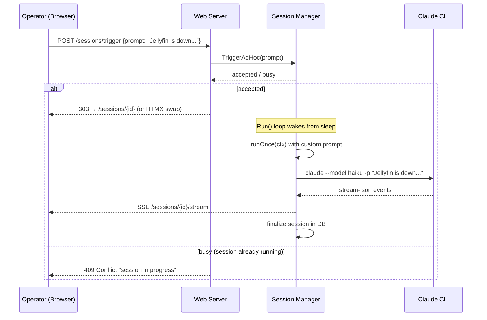

# ADR-0013: Manual Ad-Hoc Session Runs from the Dashboard

## Context and Problem Statement

Currently, Claude Ops sessions are triggered exclusively by the scheduled loop in the session manager (`Manager.Run()`), which runs on a fixed interval (e.g., every 60 minutes). Operators have no way to trigger an on-demand session from the dashboard UI. When something breaks — "Jellyfin is down" or "Can you check the DNS records?" — the operator must wait for the next scheduled run or restart the container.

How should operators be able to kick off an immediate, ad-hoc session from the dashboard with a custom prompt?

## Decision Drivers

* Operators need fast incident response without waiting for the next scheduled interval
* The custom prompt should provide context (e.g., "Jellyfin is down. Can you take a look?") that guides the agent toward the specific issue
* Ad-hoc sessions must coexist safely with the scheduled loop — no concurrent sessions
* Ad-hoc sessions should appear in the same session list and stream via SSE like scheduled ones
* The existing `runOnce()` lifecycle (DB record, log file, SSE streaming, result capture) should be reused, not duplicated

## Considered Options

* **Option A: Channel-based trigger** — The web handler sends a trigger (with prompt text) over a Go channel that the session manager's `Run()` loop selects on, interrupting the sleep timer to start a session immediately.
* **Option B: Direct handler invocation** — The web POST handler calls a public `RunAdHoc(ctx, prompt)` method on the manager, which blocks until the session completes or the request is cancelled.
* **Option C: Queue table in SQLite** — The web handler inserts a row into a `pending_runs` table; the session manager polls this table on each loop iteration and before sleeping.

## Decision Outcome

Chosen option: **Option A (channel-based trigger)**, because it cleanly integrates with the existing `select` loop in `Manager.Run()`, avoids concurrency issues by funneling all session execution through the single loop goroutine, provides immediate wake-up from the sleep timer, and requires no database polling or additional goroutines.

### Consequences

* Good, because ad-hoc sessions execute through the exact same `runOnce()` path as scheduled sessions — same DB records, log files, SSE streaming, and result capture
* Good, because the mutex-guarded `running` flag naturally prevents concurrent sessions (scheduled + ad-hoc or multiple ad-hoc)
* Good, because waking from `time.After` via channel select is idiomatic Go and zero-latency
* Bad, because if a scheduled session is already running, the ad-hoc request must wait (but this is the correct behavior — we don't want concurrent sessions)
* Bad, because the channel is in-memory, so an ad-hoc request is lost if the process crashes before executing it (acceptable given the operator can simply re-submit)

### Confirmation

* An operator can submit a prompt from the dashboard and see the session start within seconds
* The ad-hoc session appears in `/sessions` with a distinguishable trigger type (manual vs scheduled)
* SSE streaming works identically for ad-hoc sessions
* Submitting while a session is running returns an appropriate "session in progress" response

## Pros and Cons of the Options

### Option A: Channel-Based Trigger

The session manager exposes a `TriggerAdHoc(prompt string) error` method that sends the prompt over a buffered channel. The `Run()` loop adds a `case` to its `select` that reads from this channel, overrides the prompt for the next `runOnce()` call, and executes immediately.

* Good, because it integrates naturally with the existing `select { case <-ctx.Done(); case <-time.After(...) }` pattern
* Good, because all session execution stays in the single `Run()` goroutine — no concurrency surprises
* Good, because wake-up from sleep is immediate (channel receive beats timer)
* Good, because minimal code changes — add a channel field, one new `select` case, and a POST handler
* Neutral, because the channel buffer size determines how many pending requests can queue (1 is sufficient)
* Bad, because in-memory channel means requests are lost on process crash (acceptable)

### Option B: Direct Handler Invocation

The web POST handler calls `manager.RunAdHoc(ctx, prompt)` directly, which acquires the mutex, runs the session, and returns. The handler blocks until completion or request timeout.

* Good, because the HTTP request lifecycle maps directly to the session lifecycle
* Good, because the handler can return the session result in the response
* Bad, because it runs the session on the HTTP handler goroutine, not the manager's loop goroutine — introduces concurrency between the scheduled loop and the handler
* Bad, because the `running` mutex would need to become a blocking-wait mechanism rather than a simple guard, adding complexity
* Bad, because long-running sessions (minutes) tie up the HTTP connection, requiring careful timeout handling
* Bad, because if the browser navigates away, the request context cancels and kills the session

### Option C: Queue Table in SQLite

The web handler inserts a `pending_run` row with the prompt text. The session manager checks the table after each session and before sleeping, executing any pending runs.

* Good, because pending requests survive process restarts
* Good, because it provides an audit trail of requested vs executed runs
* Neutral, because it adds a new table and query to the DB layer
* Bad, because the manager must poll the table, adding latency (up to one poll interval)
* Bad, because it adds database round-trips to the hot loop
* Bad, because it's over-engineered for a single-user dashboard where crash recovery of a manual request is not critical

## Architecture Diagram

## More Information

* The ad-hoc prompt replaces the prompt file content for that single run — the system prompt (`--append-system-prompt` with env context) remains the same
* The session DB record should include a `trigger` field distinguishing `"scheduled"` vs `"manual"` and store the custom prompt text
* The dashboard UI needs a form (textarea + submit button) on the index page or a dedicated `/sessions/new` page
* Future enhancement: allow selecting the tier/model for ad-hoc runs (default to Tier 1)
* Related: ADR-0008 (web dashboard), SPEC-0008 (dashboard spec)
