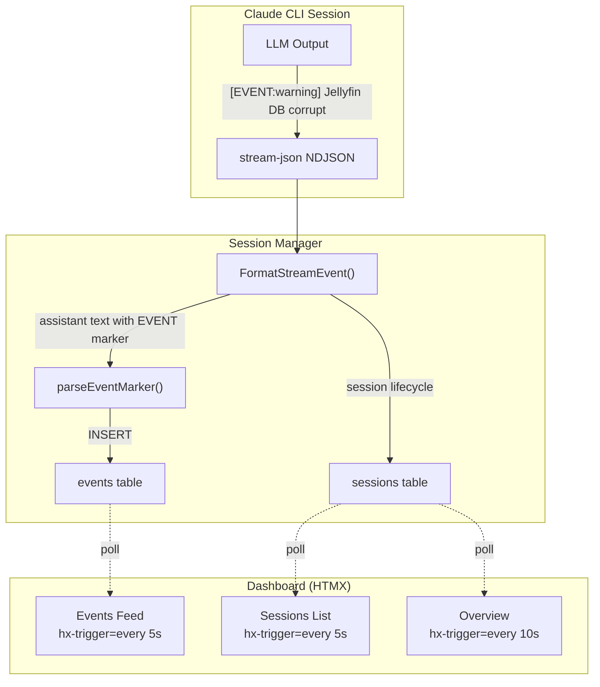

# ADR-0014: Real-Time Dashboard and Events System

## Context and Problem Statement

The dashboard currently has two problems:

1. **Static pages**: The sessions list and overview page are rendered once on load. When a session starts, completes, or changes status, the user must manually refresh to see updates. For a monitoring dashboard, this is unacceptable.

2. **Services section is misplaced**: The Services page duplicates functionality that belongs in external monitoring tools (Uptime Kuma, Prometheus, etc.). Claude Ops should not be a service status dashboard — it's an autonomous agent. What the operator actually needs is a feed of **notable events** the agent discovers: "Jellyfin's database is corrupted," "Restarted nginx after config drift," "DNS resolution failing for 3 services." These are the agent's observations and actions, surfaced as a first-class concept.

How should the dashboard become real-time, and what should replace the Services section?

## Decision Drivers

* The operator should see session status changes without refreshing the page
* The agent should be able to surface notable findings as discrete, severity-tagged events
* Events should flow in real-time — when the agent finds something during a session, it appears immediately in the dashboard
* The solution must work with the existing HTMX + server-rendered HTML architecture (no client-side JS framework)
* Events need persistence (SQLite) so they survive page reloads and are browsable historically
* The approach should be simple enough that a prompt instruction is all the LLM needs to emit events

## Considered Options

* **Option A: HTMX polling + parsed event markers** — Use `hx-trigger="every Ns"` for page sections. Parse a structured marker format (`[EVENT:level] message`) from the LLM's assistant text during stream-json processing. Insert parsed events into a new `events` table.
* **Option B: SSE-driven page updates** — Create a global SSE endpoint that pushes HTML fragments for sessions list, overview, and events feed. Use `htmx-ext-sse` with `sse-swap` to update page sections.
* **Option C: MCP tool for events** — Expose an MCP server with a `create_event` tool that the LLM calls directly to insert events into the database.

## Decision Outcome

Chosen option: **Option A (HTMX polling + parsed event markers)**, because it requires zero new infrastructure (no new SSE endpoints, no MCP server), works reliably with HTMX's built-in polling, and the event parsing piggybacks on the existing stream-json processing pipeline. The LLM just writes a line in a known format — no tool calls needed.

### Consequences

* Good, because HTMX polling is trivial to add (`hx-trigger="every 5s"`) and works with the existing server-rendered architecture
* Good, because event parsing integrates into the existing `FormatStreamEvent` pipeline — no new goroutines or channels
* Good, because the LLM only needs a prompt instruction to emit events; no new tools or MCP configuration
* Good, because removing Services simplifies the codebase and the nav
* Bad, because polling adds server load proportional to connected clients x poll frequency (acceptable for single-user dashboard)
* Bad, because parsed markers can produce false positives if the LLM accidentally outputs the pattern (mitigated by requiring strict format and ignoring tool result blocks)

### Confirmation

* Sessions list updates within 5 seconds when a session starts or completes
* Overview page reflects the current session state without manual refresh
* Events appear in the feed within seconds of the LLM writing them during a session
* Removing Services does not break any existing functionality

## Pros and Cons of the Options

### Option A: HTMX Polling + Parsed Event Markers

Sessions list and overview sections add `hx-trigger="every 5s"` with `hx-get` targeting themselves. The server re-renders the HTML fragment and HTMX swaps it in. For events, the stream-json parser scans assistant text blocks for lines matching `[EVENT:info|warning|critical] message`. Matched events are inserted into an `events` table with session_id, level, message, service (optional), and timestamp.

* Good, because HTMX polling is 2 attributes — zero JavaScript, zero new endpoints
* Good, because event parsing is ~20 lines added to the existing `FormatStreamEvent` function
* Good, because the events table is a simple append-only log, trivial to query and paginate
* Good, because the LLM needs only a prompt section explaining the `[EVENT:...]` format
* Neutral, because polling interval trades off freshness vs server load (5s is a good default)
* Bad, because polling re-renders the full fragment each time (but fragments are small HTML tables)

### Option B: SSE-Driven Page Updates

A new global SSE endpoint (`/stream/dashboard`) pushes HTML fragments when state changes. The hub would need a new "dashboard" channel that the session manager publishes to when sessions start, complete, or emit events.

* Good, because updates are instant — no polling delay
* Good, because it uses the existing SSE infrastructure (hub pattern)
* Bad, because it requires a new SSE endpoint and a new publish channel type
* Bad, because managing SSE subscriptions for page sections is complex (what if the user navigates between pages?)
* Bad, because HTMX SSE swap (`sse-swap`) requires specific event naming and fragment targeting that gets fragile with multiple dynamic sections
* Bad, because it's significantly more complex than polling for marginal latency improvement on a single-user dashboard

### Option C: MCP Tool for Events

Expose an MCP server endpoint that provides a `create_event` tool. The LLM calls it during sessions to insert events. The dashboard polls or uses SSE to display them.

* Good, because it gives the LLM explicit control over event creation (structured input, error handling)
* Good, because events are guaranteed to be well-formed (validated by the tool handler)
* Bad, because it requires running an MCP server alongside the main process
* Bad, because it adds a dependency between the Claude CLI session and a local service
* Bad, because MCP tools add latency to each event creation (tool call round-trip)
* Bad, because it requires MCP configuration changes and is harder to test locally

## Architecture Diagram

## More Information

* **Event marker format**: `[EVENT:info|warning|critical] message` — only parsed from assistant text blocks (not tool results, not user messages). Optional service tag: `[EVENT:warning:jellyfin] message`.
* **Event levels**: `info` (routine observation), `warning` (degraded but not down), `critical` (needs human attention immediately).
* **Events table schema**: `id, session_id, level, service, message, created_at`. Simple append-only log.
* **Prompt integration**: Add an "Event Reporting" section to the tier prompts explaining the format. The agent is instructed to emit events for: service state changes, remediation actions taken, cooldown limit hits, and anything requiring human attention.
* **Removing Services**: Drop `/services`, `/services/{name}` routes, handlers, templates, and the Services nav link. The `health_checks` table stays (the agent still writes to it internally) but it's not exposed in the UI.
* **Overview redesign**: Replace the services grid on the overview page with the latest events feed and a running session indicator.
* Related: ADR-0008 (web dashboard), ADR-0011 (session CLI output), ADR-0013 (ad-hoc sessions)
