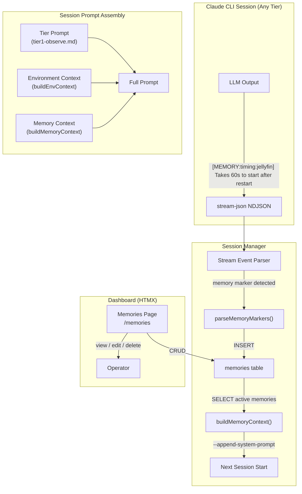

# ADR-0015: Persistent Agent Memory System

## Context and Problem Statement

Claude Ops runs on a schedule — every session is a clean slate. The agent has no memory of previous runs beyond what it can infer from the cooldown state file and health check history. This means the agent cannot learn from experience. Observations like "Jellyfin always takes 60 seconds to start after a restart" or "Postgres needs a manual vacuum weekly" or "Caddy fails if started before WireGuard" are lost after each session. The agent rediscovers the same patterns, makes the same mistakes, and cannot build up operational intuition over time.

Human operators develop mental models of their infrastructure through repeated experience. A persistent memory system would give the agent the same capability — allowing it to record observations, service quirks, timing dependencies, and remediation outcomes that inform future decisions. For example, if the agent learns that restarting Jellyfin always fails on the first attempt but succeeds on the second (after the database releases its lock), it should remember this and adjust its behavior rather than burning a cooldown slot on a known-to-fail first attempt.

How should Claude Ops persist and recall operational knowledge across sessions?

## Decision Drivers

* Memories must be injected into the agent's prompt at session start so they influence decision-making from the first turn
* The context window has a finite budget — memories compete with the tier prompt, environment context, and the agent's working conversation for token space
* All tiers (1, 2, 3) should be able to write memories, since higher tiers learn the most about service behavior during investigation and remediation
* Stale or incorrect memories must be prunable — both automatically (by the agent) and manually (by the operator via the dashboard)
* The solution should integrate with the existing `--append-system-prompt` injection path used by `buildEnvContext()` in the session manager
* The dashboard should provide visibility into what the agent "knows" so the operator can review, edit, and delete memories
* The memory format in the prompt should be structured enough to be useful but not so rigid that it constrains what the agent can record

## Considered Options

* **Option A: Markdown file in state dir** — A `$CLAUDEOPS_STATE_DIR/memory.md` file the agent reads at session start and can append to. Injected via `--append-system-prompt`. Human-readable, editable with any text editor.
* **Option B: SQLite memories table** — Structured storage with columns like (id, category, service, observation, confidence, created_at, session_id). Queried at session start, formatted as text, injected into the prompt. Supports dashboard CRUD.
* **Option C: Event-sourced from existing events** — No new storage. At session start, query recent events from the `events` table and inject a summary. The agent's "memory" is just its own event history.

## Decision Outcome

Chosen option: **Option B (SQLite memories table)**, because it provides the structured storage needed for dashboard CRUD, supports filtering and lifecycle management (confidence scoring, staleness pruning), integrates cleanly with the existing migration-based DB schema, and can be formatted into a prompt-friendly text block at injection time. Unlike a flat markdown file, structured storage lets the operator search, filter, and bulk-manage memories from the dashboard without parsing markdown. Unlike event-sourcing, it separates "what happened" (events) from "what we learned" (memories) — a critical distinction since events are noisy session logs while memories are curated operational knowledge.

### Consequences

* Good, because the existing `db.go` migration pattern (`migrate005`) makes adding a new table trivial and consistent with the rest of the schema
* Good, because the session manager's `buildEnvContext()` function already demonstrates the pattern for injecting text via `--append-system-prompt` — memories follow the same path
* Good, because structured columns (service, category, confidence) enable the dashboard to show memories grouped by service, filter by category, and sort by confidence or recency
* Good, because all three tiers can write memories by emitting a `[MEMORY:...]` marker in their output (same pattern as `[EVENT:...]` from ADR-0014), which the stream-json parser captures
* Good, because the operator gets full visibility and control via the dashboard — they can see what the agent has learned, correct wrong memories, and delete obsolete ones
* Bad, because formatting structured rows into prompt text requires a rendering step that must be maintained as the schema evolves
* Bad, because the agent must learn a new marker format (`[MEMORY:...]`) in addition to the existing `[EVENT:...]` format, adding complexity to the tier prompts
* Bad, because without a size cap, memories could grow to consume a significant portion of the context window over time

### Confirmation

* Memories created during a session appear in the dashboard within seconds (parsed from stream-json like events)
* Memories from previous sessions are present in the system prompt of the next session
* The total memory payload stays within the 2,000-token budget (enforced by the injection code)
* An operator can create, edit, and delete memories from the dashboard
* A memory marked with a specific service (e.g., "jellyfin") appears when that service is being checked

## Pros and Cons of the Options

### Option A: Markdown File in State Dir

A file at `$CLAUDEOPS_STATE_DIR/memory.md` that the agent reads and appends to. At session start, the session manager reads the file and appends its contents to the system prompt via `--append-system-prompt`. The agent writes new memories by appending lines to the file using the `Write` or `Edit` tool. The operator can edit the file directly with any text editor or via a dashboard textarea.

* Good, because it is the simplest possible implementation — a file read at startup and a file write during the session
* Good, because the agent can use natural language and any format it finds useful, with no schema constraints
* Good, because the operator can edit the file with `vim`, `nano`, or any text editor without needing the dashboard
* Good, because it requires zero database changes — no migration, no new queries, no new model types
* Neutral, because the file is human-readable but may become unstructured and hard to parse as it grows
* Bad, because the agent has direct filesystem write access to the memory file, meaning a confused or hallucinating agent could corrupt or overwrite the entire memory with a single bad `Write` call
* Bad, because there is no structured way to filter memories by service, category, or confidence from the dashboard — it's just a text blob
* Bad, because there is no automatic lifecycle management (no timestamps, no confidence decay, no staleness pruning) — the file grows forever unless manually curated
* Bad, because the dashboard can only show a textarea for the entire file contents, with no search, filter, or per-memory edit/delete capability
* Bad, because concurrent writes from the agent (via CLI tools) and the dashboard (via HTTP handler) could cause file corruption without locking

### Option B: SQLite Memories Table

A new `memories` table in the existing SQLite database with columns: `id`, `service` (nullable), `category`, `observation`, `confidence` (float 0-1), `created_at`, `updated_at`, `session_id`, `tier`. At session start, the session manager queries active memories, formats them as a structured text block, and appends them to the system prompt. The agent creates memories by emitting `[MEMORY:category:service] observation` markers in its output (parsed by the stream-json pipeline, like `[EVENT:...]`). The dashboard provides a full CRUD interface for memories.

* Good, because it integrates with the existing migration-based schema — `migrate005` adds the table, consistent with the 4 existing migrations
* Good, because structured columns enable rich dashboard features: filter by service, group by category, sort by confidence or recency, search by observation text
* Good, because the confidence field supports automatic decay — memories that are contradicted or not reinforced can have their confidence lowered, eventually falling below the injection threshold
* Good, because the session_id and tier fields create an audit trail showing which session and which escalation tier produced each memory
* Good, because SQLite handles concurrent access (dashboard reads/writes + agent writes via stream-json parser) safely with WAL mode, which is already configured
* Good, because size budgeting is straightforward — query memories ordered by confidence DESC, accumulate token estimates, stop when the budget is reached
* Neutral, because it requires a new marker format (`[MEMORY:...]`) that must be documented in the tier prompts and parsed in the stream-json pipeline
* Bad, because formatting memories from rows into prompt-friendly text adds a rendering step that must be maintained
* Bad, because the agent cannot directly edit or delete its own memories during a session (it can only create new ones via markers) — corrections require emitting a new memory that supersedes the old one, or the operator manually editing via the dashboard
* Bad, because the structured schema may not capture all the nuance of free-form observations (though the `observation` text field is unbounded)

### Option C: Event-Sourced from Existing Events

No new storage. At session start, query the last N events (or events from the last 7 days) from the existing `events` table, format them as context, and inject into the prompt. The agent's "memory" is derived entirely from its event history — critical and warning events become implicit knowledge about what has gone wrong recently.

* Good, because it requires zero new storage, zero new tables, zero new migrations — events already exist and are already persisted
* Good, because it surfaces real incident history: if Jellyfin was critical 3 times this week, the agent sees that pattern
* Good, because events are already visible in the dashboard — no new UI needed
* Good, because the event markers (`[EVENT:...]`) are already emitted and parsed, so there is no new format to learn
* Bad, because events are noisy session logs ("checking DNS for X", "HTTP 200 from Y"), not curated knowledge — the agent would be injected with hundreds of routine observations alongside the few meaningful patterns
* Bad, because events capture "what happened" but not "what we learned" — "Jellyfin returned 503" is an event, but "Jellyfin takes 60s to start after restart" is a memory. The distinction is critical for decision-making
* Bad, because there is no mechanism for the agent to record new insights that are not tied to a specific check result — observations like "Caddy should be started after WireGuard" don't map to events
* Bad, because the operator cannot curate what the agent "knows" — they can only delete events, which destroys the audit trail
* Bad, because injecting raw events into the prompt would consume a large token budget for low information density, since most events are routine "healthy" observations

## Architecture Diagram



## More Information

### Memory marker format

Following the same convention as `[EVENT:...]` markers from ADR-0014, memories use:

```
[MEMORY:category] observation text
[MEMORY:category:service] observation text about a specific service
```

Categories: `timing` (startup delays, timeout patterns), `dependency` (service ordering, prerequisites), `behavior` (quirks, workarounds, known issues), `remediation` (what works, what doesn't), `maintenance` (scheduled tasks, periodic needs).

### Prompt injection format

Memories are formatted as a structured block appended to the system prompt:

```
## Operational Memory (12 memories, 847 tokens)

### jellyfin
- [timing] Takes 60s to start after restart — wait before checking health (confidence: 0.9)
- [behavior] First restart attempt always fails due to DB lock; second attempt succeeds (confidence: 0.8)

### postgres
- [maintenance] Needs manual VACUUM FULL weekly or performance degrades (confidence: 0.7)

### caddy
- [dependency] Must be started after WireGuard — fails with "no route to host" otherwise (confidence: 0.95)

### general
- [remediation] DNS checks sometimes fail transiently during WireGuard reconnects — retry once before escalating (confidence: 0.6)
```

### Size budget

The memory context is capped at **2,000 tokens** (approximately 8,000 characters). The `buildMemoryContext()` function queries memories ordered by confidence DESC, accumulates a running token estimate (characters / 4), and stops including memories when the budget is reached. This ensures memories never crowd out the tier prompt or working conversation. The 2,000-token budget is a configuration constant that can be adjusted.

### Memory lifecycle

- **Creation**: Agent emits `[MEMORY:...]` markers during any tier session. The stream-json parser inserts them into the `memories` table with `confidence: 0.7` (default).
- **Reinforcement**: If the agent emits a memory that closely matches an existing one (same service + category + similar text), the existing memory's confidence increases (up to 1.0) and its `updated_at` is refreshed.
- **Contradiction**: If the agent emits a memory that contradicts an existing one (same service + category but different conclusion), the old memory's confidence decreases. If it falls below 0.3, it is marked inactive.
- **Staleness**: Memories not reinforced within 30 days have their confidence decayed by 0.1 per week. Memories below 0.3 confidence are excluded from injection (but retained in the DB for audit).
- **Manual curation**: The operator can edit observation text, adjust confidence, or delete memories entirely from the dashboard.

### Dashboard integration

A new `/memories` page in the sidebar (between Events and Cooldowns) shows all memories in a table with columns: service, category, observation, confidence, last updated, source session. The page supports:
- **Inline editing**: Click a memory to edit its observation text or confidence
- **Delete**: Remove individual memories
- **Create**: Manually add a memory (the operator may know things the agent hasn't discovered)
- **Filter**: Filter by service or category
- **Bulk actions**: Select multiple memories to delete or adjust confidence

### Database schema

```sql
CREATE TABLE memories (
    id INTEGER PRIMARY KEY AUTOINCREMENT,
    service TEXT,                          -- nullable, NULL = general memory
    category TEXT NOT NULL,                -- timing, dependency, behavior, remediation, maintenance
    observation TEXT NOT NULL,             -- the actual knowledge
    confidence REAL NOT NULL DEFAULT 0.7,  -- 0.0 to 1.0
    active INTEGER NOT NULL DEFAULT 1,     -- 0 = soft-deleted / below threshold
    created_at TEXT NOT NULL,
    updated_at TEXT NOT NULL,
    session_id INTEGER REFERENCES sessions(id),  -- which session created it
    tier INTEGER NOT NULL DEFAULT 1        -- which tier created it
);

CREATE INDEX idx_memories_service ON memories(service, active);
CREATE INDEX idx_memories_confidence ON memories(confidence, active);
CREATE INDEX idx_memories_category ON memories(category);
```

### Which tiers can write memories

All tiers can emit `[MEMORY:...]` markers:
- **Tier 1 (observe)**: Records patterns from repeated health check observations ("DNS for X has been flaky for 3 consecutive runs")
- **Tier 2 (investigate)**: Records diagnostic findings ("Jellyfin DB lock takes 60s to release after ungraceful shutdown")
- **Tier 3 (remediate)**: Records remediation outcomes ("Restarting postgres before its dependents avoids connection pool exhaustion")

Higher tiers are expected to produce more valuable memories since they do deeper investigation.

### Related decisions

- ADR-0008: Go/HTMX web dashboard (establishes the dashboard architecture)
- ADR-0010: Claude Code CLI subprocess (establishes the `--append-system-prompt` injection pattern)
- ADR-0011: Session page CLI output (establishes the stream-json parsing pipeline)
- ADR-0014: Real-time dashboard and events (establishes the `[EVENT:...]` marker pattern that `[MEMORY:...]` follows)
