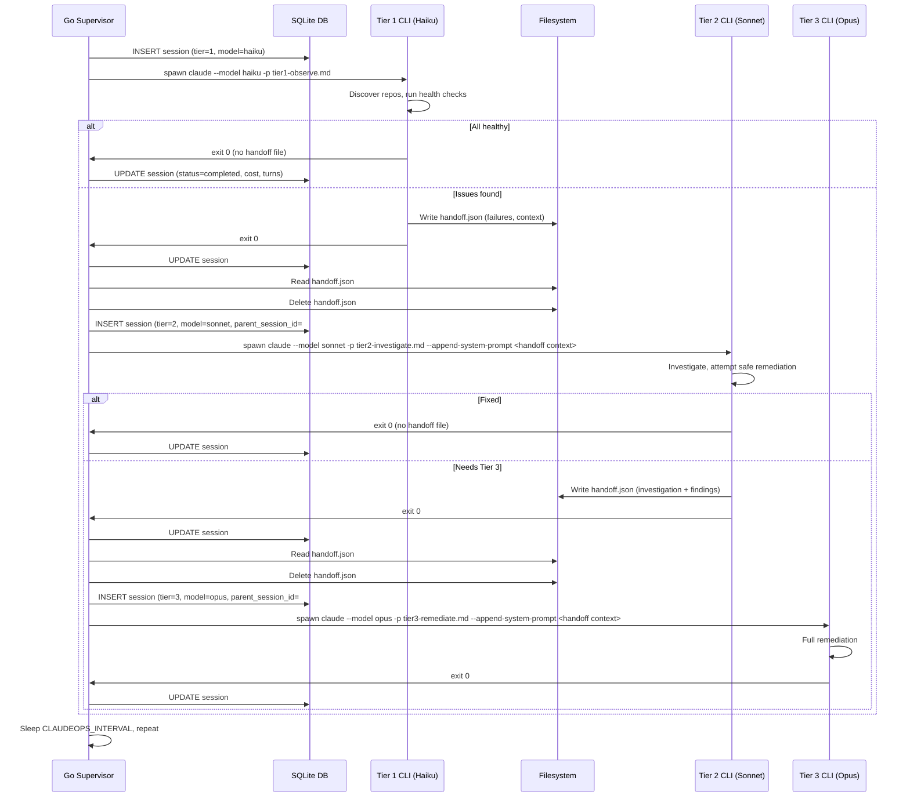

# ADR-0016: Session-Based Escalation with Structured Handoff Files

## Context and Problem Statement

Claude Ops uses a tiered model escalation strategy (ADR-0001) where Tier 1 (Haiku) observes, Tier 2 (Sonnet) performs safe remediation, and Tier 3 (Opus) handles complex recovery. Currently, escalation happens **within a single CLI process**: when Tier 1 detects issues, it uses the Claude Code `Task` tool to spawn Tier 2 as a subagent inside the same session. Tier 2 can similarly spawn Tier 3. This means a single `claude` CLI invocation may contain all three tiers of work.

The Go supervisor (`internal/session/manager.go`) creates one session record per monitoring cycle. It spawns a `claude` CLI process for Tier 1, and if escalation occurs, Tier 2 and Tier 3 run as nested subagents within that same process. The supervisor has no visibility into whether escalation happened, which tier performed remediation, or how costs break down across tiers. The dashboard shows a single session row with aggregated cost, duration, and turn count -- even if the cycle involved all three tiers.

This creates several problems:

1. **No per-tier cost attribution.** A session that cost $2.50 might have spent $0.03 on Tier 1 observation, $0.47 on Tier 2 investigation, and $2.00 on Tier 3 remediation. The operator sees only the $2.50 total.
2. **No escalation visibility.** The dashboard cannot show that Session #18 escalated to Tier 2 and then Tier 3. It just shows one session.
3. **Supervisor has no control over escalation.** The `Task` tool escalation happens entirely within the Claude agent's reasoning. The supervisor cannot enforce cooldowns, respect dry-run mode, or apply policy before escalation occurs.
4. **Session metadata is misleading.** The session record says `tier=1` and `model=haiku`, but the actual work was done by Sonnet and Opus subagents whose costs and actions are invisible in the DB.
5. **Context window pressure.** When Tier 2 and Tier 3 run as subagents inside the Tier 1 process, they share the same context window. Long Tier 1 observations consume tokens that Tier 2/3 could use for investigation.

## Decision Drivers

* **Per-tier observability** -- Operators need to see which tier handled each issue, how much each tier cost, and how long each tier took. This is critical for cost optimization and debugging.
* **Supervisor control over escalation** -- The Go supervisor should decide whether to escalate, not the LLM. This enables policy enforcement (cooldowns, dry-run, max-tier limits) at the application level.
* **Accurate session records** -- Each session row in the database should represent exactly one CLI process with one model, one tier, and one set of metrics.
* **Dashboard escalation chains** -- The web dashboard should display linked session chains: Session #18 (Tier 1, $0.03, 45s) -> Session #19 (Tier 2, $0.47, 2m) -> Session #20 (Tier 3, $2.00, 5m).
* **Backward compatibility** -- The handoff mechanism should not require changes to the Claude Code CLI itself. It should work with the existing `--model`, `-p`, `--append-system-prompt`, and `--allowedTools` flags (ADR-0010).
* **Context fidelity** -- Escalation context (failure details, investigation findings, what was tried) must transfer completely between tiers without loss.

## Considered Options

1. **Session-based escalation with handoff files** -- Tier 1 writes a structured JSON handoff file and exits; the Go supervisor reads it and spawns a new CLI process for Tier 2 with its own session record.
2. **Keep current Task-tool subagent escalation** -- Status quo: tiers escalate via the `Task` tool within a single CLI process.
3. **Hybrid: separate sessions with `--resume`** -- Use the Claude CLI's `--resume` flag to continue a conversation in a new process, preserving conversation history across tiers.

## Decision Outcome

Chosen option: **"Session-based escalation with handoff files"**, because it gives the Go supervisor full control over the escalation lifecycle, produces accurate per-tier session records in the database, and enables the dashboard to display escalation chains with individual cost and duration metrics per tier.

The mechanism works as follows:

1. The Go supervisor spawns a Tier 1 `claude` CLI process as it does today.
2. The Tier 1 prompt instructs the agent: if issues are found, write a structured JSON handoff file to `$CLAUDEOPS_STATE_DIR/handoff.json` containing failure context, then exit normally.
3. When the Tier 1 process exits, the supervisor checks for the handoff file.
4. If the handoff file exists and requests escalation, the supervisor:
   a. Creates a new session record in the DB with `tier=2`, `model=sonnet`, and a `parent_session_id` linking to the Tier 1 session.
   b. Reads the handoff file contents and injects them into the Tier 2 prompt via `--append-system-prompt`.
   c. Spawns a new `claude` CLI process for Tier 2 with the Tier 2 prompt, model, and allowed tools.
   d. Deletes the handoff file.
5. The same pattern applies for Tier 2 -> Tier 3 escalation.
6. After the escalation chain completes (no more handoff files), the supervisor resumes normal scheduling.

The handoff file format is a JSON contract between tiers:

```json
{
  "recommended_tier": 2,
  "services_affected": ["jellyfin", "postgres"],
  "check_results": [
    {
      "service": "jellyfin",
      "check_type": "http",
      "status": "down",
      "error": "HTTP 502 Bad Gateway",
      "response_time_ms": 1250
    }
  ],
  "investigation_findings": "Optional: populated by Tier 2 when escalating to Tier 3",
  "remediation_attempted": "Optional: what was tried and why it failed",
  "cooldown_state": { "...snapshot of relevant cooldown data..." }
}
```

### Consequences

**Positive:**

* Each tier gets its own session record with accurate `tier`, `model`, `cost_usd`, `num_turns`, `duration_ms`, and `status` fields. Operators can see exactly what each tier did and what it cost.
* The dashboard can display escalation chains: Session #18 (Tier 1) -> Session #19 (Tier 2) -> Session #20 (Tier 3), linked via `parent_session_id`.
* The supervisor controls escalation decisions. It can enforce policies before spawning a higher tier: check cooldowns, respect dry-run mode, enforce a maximum tier limit, or skip escalation entirely based on operational rules.
* Each tier runs in its own CLI process with a fresh context window. Tier 2 and Tier 3 are not constrained by tokens consumed during Tier 1 observation.
* The handoff file is human-readable JSON, making it easy to debug escalation decisions by inspecting the file contents.
* No changes to the Claude Code CLI are required. The mechanism uses only existing CLI flags and filesystem I/O.

**Negative:**

* Context must be explicitly serialized into the handoff JSON rather than flowing naturally through the `Task` tool's shared context window. If the handoff format omits important details, the receiving tier loses context.
* The handoff file format becomes a contract that must be maintained. Changes to the format require updating both the prompt instructions (which tell the agent what to write) and the supervisor code (which parses the file).
* The supervisor gains complexity: it must parse handoff files, create linked session records, inject handoff context into prompts, and manage the escalation chain lifecycle.
* There is no interactive back-and-forth between tiers. With the `Task` tool, Tier 1 could theoretically receive a response from Tier 2 and act on it. With handoff files, each tier runs independently and exits.
* A small delay is introduced between tiers (process exit, handoff parsing, new process startup) compared to the nearly instantaneous subagent spawning of the `Task` tool.

### Confirmation

The decision is confirmed when:
* The `sessions` table includes a `parent_session_id` column linking escalated sessions to their parent.
* The Tier 1 prompt writes a handoff file instead of using the `Task` tool for escalation.
* The Go supervisor reads handoff files after each session and spawns the appropriate next-tier process.
* The dashboard displays escalation chains with per-tier cost and duration.
* A monitoring cycle that escalates through all three tiers produces three separate session records in the database.

## Pros and Cons of the Options

### Session-Based Escalation with Handoff Files

* Good, because each tier has its own session record with accurate cost, duration, and turn count metrics.
* Good, because the dashboard can display escalation chains linking parent and child sessions.
* Good, because the Go supervisor controls escalation decisions, enabling policy enforcement (cooldowns, dry-run, max-tier) at the application level rather than relying on LLM compliance.
* Good, because each tier gets a fresh context window, eliminating token pressure from prior tiers.
* Good, because the handoff file is human-readable JSON that can be inspected for debugging.
* Good, because no changes to the Claude Code CLI are required -- only filesystem I/O and existing CLI flags.
* Bad, because context must be explicitly serialized rather than flowing through shared memory, risking information loss if the handoff format is incomplete.
* Bad, because the handoff file format is a new contract between tiers that must be maintained across prompt and supervisor changes.
* Bad, because supervisor complexity increases with handoff parsing, linked session creation, and escalation chain management.
* Bad, because there is no interactive back-and-forth between tiers -- each tier runs independently.
* Bad, because process startup overhead between tiers adds latency compared to in-process subagent spawning.

### Keep Current Task-Tool Subagent Escalation (Status Quo)

* Good, because context flows naturally through the `Task` tool's shared context window -- no serialization required.
* Good, because the supervisor is simple: it spawns one process and waits for it to finish.
* Good, because there is zero latency between tier transitions (subagent spawning is nearly instantaneous).
* Good, because the current implementation works and requires no code changes.
* Bad, because all tiers are aggregated into a single session record, making per-tier cost attribution impossible.
* Bad, because the dashboard cannot show escalation chains -- it shows one session per cycle regardless of how many tiers were involved.
* Bad, because the supervisor has no control over escalation -- the LLM decides when and whether to escalate via the `Task` tool.
* Bad, because session metadata is misleading: `tier=1` and `model=haiku` even when the actual work was done by Sonnet or Opus.
* Bad, because all tiers share one context window, creating token pressure when Tier 1 observation is verbose.
* Bad, because dry-run mode and cooldown enforcement rely entirely on prompt compliance rather than application-level controls.

### Hybrid: Separate Sessions with `--resume`

* Good, because conversation history is preserved across tiers via the `--resume` flag, maintaining full context fidelity.
* Good, because each tier would still get its own process and could have a separate session record.
* Good, because the receiving tier can see the full conversation history, not just a JSON summary.
* Bad, because `--resume` continues the same conversation with the same model and system prompt. Changing the model (Haiku -> Sonnet), allowed tools, or system prompt on resume is not straightforward.
* Bad, because the resumed session carries the full token history from prior tiers, which may exceed context limits for complex multi-tier escalations.
* Bad, because `--resume` is designed for human-interactive continuation, not programmatic tier switching. Using it for escalation would be an unconventional and potentially fragile pattern.
* Bad, because the supervisor would need to track conversation IDs across tiers, adding complexity without the clean separation that handoff files provide.

## Architecture Diagram



## More Information

* **ADR-0001** (Tiered Model Escalation): Established the Haiku -> Sonnet -> Opus escalation pattern. This ADR changes the *mechanism* of escalation (handoff files instead of Task tool) while preserving the *strategy* (three tiers with escalating permissions).
* **ADR-0010** (Claude Code CLI as Subprocess): Established that Claude is invoked via CLI subprocess with flags like `--model`, `-p`, `--allowedTools`, and `--append-system-prompt`. This ADR leverages the same invocation pattern, spawning multiple sequential CLI processes instead of one.
* **Database schema impact**: The `sessions` table requires a new `parent_session_id INTEGER REFERENCES sessions(id)` column to link escalated sessions to their parent. This enables the dashboard to query escalation chains.
* **Prompt changes**: The `Task` tool escalation instructions in `tier1-observe.md` and `tier2-investigate.md` must be replaced with instructions to write `handoff.json`. The `Task` tool can be removed from the Tier 1 and Tier 2 `--allowedTools` list since escalation is now handled by the supervisor.
* **Handoff file lifecycle**: The handoff file is written by the exiting tier, read and deleted by the supervisor before spawning the next tier. It never persists across monitoring cycles. If the supervisor crashes between reading and deleting the file, the next cycle's Tier 1 run will overwrite it with fresh results.
