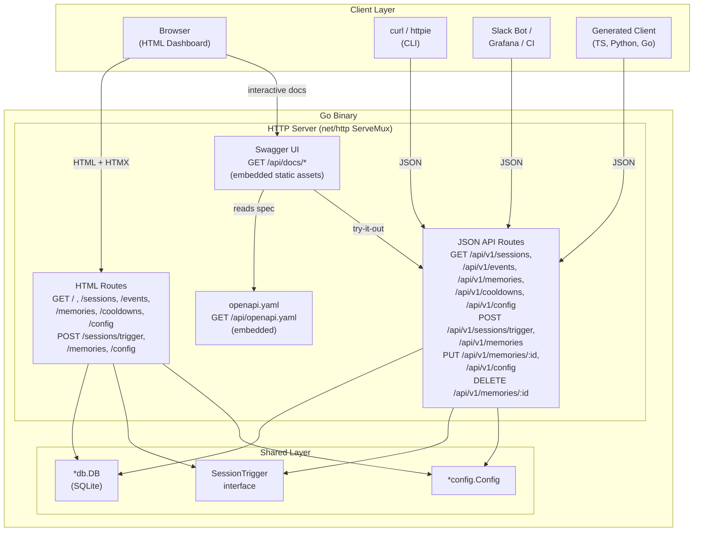

# ADR-0017: REST API with OpenAPI Specification and Swagger UI

## Context and Problem Statement

The Claude Ops dashboard (ADR-0008) currently serves only HTML endpoints. The Go web server at `internal/web/server.go` registers 13 routes that render HTML templates via HTMX partials or full-page layouts. Mutation endpoints (`POST /sessions/trigger`, `POST /memories`, `POST /memories/{id}/update`, `POST /memories/{id}/delete`, `POST /config`) accept form-encoded data and return HTTP redirects or HTMX swap directives.

This HTML-only interface creates several limitations:

- **No programmatic access.** External scripts, CI/CD pipelines, and monitoring dashboards cannot query session history, trigger ad-hoc runs, or read cooldown state without screen-scraping HTML.
- **No integration path.** Tools like Grafana, custom Slack bots, or automation workflows that want to consume Claude Ops data must parse HTML or directly query the SQLite database file.
- **Awkward non-browser usage.** The `POST /sessions/trigger` endpoint (ADR-0013) returns an HTML redirect or HTMX header, making `curl`-based automation require following redirects and ignoring response bodies.
- **No API exploration.** New developers or integration authors have no self-documenting way to discover available endpoints, their parameters, or response shapes. The only documentation is reading Go source code.
- **No contract for client generation.** Without a formal API specification, generating typed clients (TypeScript, Python, Go) requires manual effort and falls out of sync as the API evolves.

The dashboard's data layer (`internal/db/db.go`) already exposes clean methods for all domain objects -- `ListSessions`, `GetSession`, `ListEvents`, `ListMemories`, `InsertMemory`, `UpdateMemory`, `DeleteMemory`, `ListRecentCooldowns`, `GetConfig`, `SetConfig` -- and the view model layer (`internal/web/viewmodel.go`) provides structured types. The gap is purely at the HTTP transport layer: there are no JSON endpoints.

## Decision Drivers

- **Developer experience** -- Integration authors should be able to explore and test the API interactively through Swagger UI, without reading Go source or guessing endpoints.
- **Integration potential** -- External scripts, monitoring dashboards, CI/CD hooks, and chatbot integrations need a stable, documented JSON API to consume Claude Ops data and trigger actions.
- **Simplicity** -- The Go binary already serves HTTP with `net/http` and the standard library's `ServeMux`. Adding JSON handlers alongside HTML handlers is minimal incremental code.
- **Spec-first approach** -- An OpenAPI 3.1 specification file enables automated client generation, contract testing, and documentation that stays in sync with the implementation.
- **Backward compatibility** -- The existing HTML dashboard must continue to work unchanged. The API is additive, not a replacement.
- **Single binary deployment** -- The OpenAPI spec and Swagger UI assets should be embedded in the Go binary via `embed.FS`, requiring no external files or CDN dependencies at runtime.

## Considered Options

1. **JSON API with OpenAPI spec + embedded Swagger UI** -- Add `/api/v1/` endpoints returning JSON alongside the existing HTML routes. Write an OpenAPI 3.1 YAML spec file. Embed Swagger UI static assets in the Go binary and serve them at `/api/docs/`.
2. **JSON API only (no spec or UI)** -- Add JSON endpoints under `/api/v1/` but skip the formal OpenAPI specification and Swagger UI.
3. **Content-negotiation on existing routes** -- Use the `Accept` header on existing HTML routes to return JSON when `Accept: application/json` is present, HTML otherwise.

## Decision Outcome

Chosen option: **"JSON API with OpenAPI spec + embedded Swagger UI"**, because it delivers the full value chain -- programmatic access, interactive documentation, and client generation -- with minimal incremental complexity over a JSON-only approach.

The implementation adds a parallel set of handlers under `/api/v1/` that share the same `*db.DB` and `SessionTrigger` interfaces as the HTML handlers but return `application/json` responses. An OpenAPI 3.1 YAML spec file (`api/openapi.yaml`) defines the contract. Swagger UI is embedded via `embed.FS` and served at `/api/docs/`, pointed at the embedded spec file.

The HTML dashboard continues to serve at `/`, `/sessions`, `/memories`, etc., completely unchanged. The two interfaces coexist on the same HTTP server and port.

### API Endpoints

| Method | Path | Description |
|--------|------|-------------|
| GET | `/api/v1/sessions` | List sessions (query: `?limit=50`) |
| GET | `/api/v1/sessions/{id}` | Get session detail with escalation chain |
| POST | `/api/v1/sessions/trigger` | Trigger an ad-hoc session (JSON body: `{"prompt": "..."}`) |
| GET | `/api/v1/events` | List events (query: `?limit=100`) |
| GET | `/api/v1/memories` | List memories (query: `?service=...&category=...`) |
| POST | `/api/v1/memories` | Create a memory (JSON body) |
| PUT | `/api/v1/memories/{id}` | Update a memory (JSON body) |
| DELETE | `/api/v1/memories/{id}` | Delete a memory |
| GET | `/api/v1/cooldowns` | List recent cooldown actions |
| GET | `/api/v1/config` | Get current runtime configuration |
| PUT | `/api/v1/config` | Update runtime configuration (JSON body) |
| GET | `/api/v1/health` | Health check (returns `{"status": "ok"}`) |

### Consequences

**Positive:**

- External tools can programmatically query sessions, events, memories, and cooldowns via standard HTTP/JSON, enabling integrations with Grafana, Slack bots, and CI/CD pipelines.
- Swagger UI at `/api/docs/` provides an interactive API explorer where developers can read documentation and execute requests directly from the browser.
- The OpenAPI 3.1 spec enables automated client generation via `openapi-generator` for TypeScript, Python, Go, and other languages.
- JSON API handlers reuse the existing `*db.DB` methods and `SessionTrigger` interface, so there is no new data access layer to maintain.
- The spec file serves as living documentation that can be validated against the implementation in CI.
- `curl` and `httpie` become first-class clients for ad-hoc session triggering and memory management.

**Negative:**

- The web package gains a second set of handlers (JSON alongside HTML), roughly doubling the number of route registrations and handler functions. This is straightforward code but increases the surface area.
- The OpenAPI spec file must be kept in sync with the implementation. Spec drift is a common failure mode.
- Embedding Swagger UI adds approximately 3-5 MB to the binary size (compressed static assets).
- The API has no authentication mechanism. This is consistent with the existing HTML dashboard (which also lacks auth), but a JSON API is more likely to be accessed programmatically from outside the local network, increasing the risk surface. Authentication should be addressed separately.
- Versioning the API (`/api/v1/`) commits to backward compatibility within the version. Breaking changes require a new version prefix.

### Confirmation

- All 12 API endpoints return valid JSON with appropriate HTTP status codes (200, 201, 204, 400, 404, 409, 500).
- Swagger UI at `/api/docs/` loads and can execute requests against all endpoints.
- The OpenAPI spec file validates against the OpenAPI 3.1 specification.
- The existing HTML dashboard continues to function identically -- no regressions in HTMX navigation, form submissions, or SSE streaming.
- `curl` examples in the spec work as documented.

## Pros and Cons of the Options

### JSON API with OpenAPI Spec + Embedded Swagger UI

The Go server registers a parallel set of handlers under `/api/v1/` that accept and return JSON. An `api/openapi.yaml` file defines schemas, parameters, and responses. Swagger UI static assets are embedded via `//go:embed` and served at `/api/docs/`.

* Good, because Swagger UI provides zero-setup interactive API exploration -- developers can discover and test endpoints without leaving the browser.
* Good, because the OpenAPI spec enables automated client generation for TypeScript, Python, Go, and other languages via `openapi-generator-cli`.
* Good, because JSON handlers reuse the existing `*db.DB` interface and view model types, requiring no new data access code.
* Good, because embedding the spec and Swagger UI in the binary maintains the single-binary deployment model -- no external files or CDN needed at runtime.
* Good, because the `/api/v1/` prefix cleanly separates API routes from HTML routes, avoiding any interaction or conflict.
* Good, because the spec file can be validated in CI (`openapi-generator validate`), catching spec drift before it reaches production.
* Good, because REST/JSON is the most widely understood API paradigm, minimizing the learning curve for integration authors.
* Neutral, because the OpenAPI spec must be maintained manually (not generated from code), which is typical for Go projects without annotation-based frameworks.
* Bad, because Swagger UI's static assets add 3-5 MB to the binary size.
* Bad, because maintaining two handler sets (HTML + JSON) for the same data increases the code surface area.
* Bad, because the spec file can drift from the implementation if not tested in CI.

### JSON API Only (No Spec or UI)

Add `/api/v1/` JSON endpoints but do not write an OpenAPI spec or embed Swagger UI. Document the API in a markdown file or not at all.

* Good, because it is the simplest implementation -- just add JSON handler functions.
* Good, because it avoids the binary size overhead of embedded Swagger UI assets.
* Good, because there is no spec file to maintain or keep in sync.
* Bad, because without Swagger UI, developers must read source code or a markdown file to understand available endpoints, request formats, and response shapes.
* Bad, because without an OpenAPI spec, client generation requires manual effort and is error-prone.
* Bad, because undocumented APIs tend to accumulate inconsistencies (different error formats, naming conventions, pagination styles) that a spec would enforce.
* Bad, because the lack of interactive documentation significantly reduces developer experience -- the primary motivation for this ADR.

### Content-Negotiation on Existing Routes

Use the `Accept` header on existing routes to return JSON when `Accept: application/json` is present, and HTML otherwise. No new route paths.

* Good, because it avoids duplicating routes -- each resource has one URL.
* Good, because it follows the HTTP spec's content negotiation model.
* Good, because existing URLs work unchanged for browsers (which send `Accept: text/html`).
* Bad, because the existing HTML handlers mix concerns (template rendering, form parsing, HTMX header handling) that are awkward to retrofit with JSON branches.
* Bad, because some operations have fundamentally different semantics in HTML vs JSON: `POST /memories` currently returns a 303 redirect, but the JSON response should return the created resource with a 201 status. Branching on `Accept` within a single handler creates confusing conditional logic.
* Bad, because HTMX partial responses (`HX-Request` header detection) add a third content mode, making the negotiation logic three-way: full HTML, HTMX partial, JSON.
* Bad, because it makes OpenAPI spec writing harder -- the same path returns different content types with different response schemas depending on headers.
* Bad, because POST endpoints that return redirects (303) in HTML mode but created resources (201) in JSON mode would require fundamentally different response handling in the same handler, leading to tangled code.
* Bad, because caching, testing, and debugging become harder when the same URL returns different content types.

## Architecture Diagram

## More Information

- **ADR-0008** established the Go + HTMX + DaisyUI web dashboard architecture. This ADR extends that architecture with a parallel JSON API, not a replacement.
- **ADR-0013** introduced `POST /sessions/trigger` for ad-hoc runs. The JSON API equivalent (`POST /api/v1/sessions/trigger`) returns the created session as JSON instead of an HTML redirect.
- The OpenAPI spec file should live at `api/openapi.yaml` in the repository root and be embedded in the binary via `//go:embed api/openapi.yaml`.
- Swagger UI can be embedded using the `github.com/swaggo/swag` ecosystem or by vendoring the Swagger UI `dist/` directory. The latter avoids code-generation dependencies.
- Authentication is explicitly out of scope for this ADR. The JSON API has the same (lack of) access control as the HTML dashboard. A future ADR should address API authentication (API keys, bearer tokens, or basic auth).
- Rate limiting is not addressed here but should be considered for the `POST /sessions/trigger` endpoint to prevent abuse.
- The `GET /api/v1/sessions/{id}/stream` endpoint (SSE) is intentionally excluded from the initial API scope. SSE streaming is already available at `/sessions/{id}/stream` and works with any HTTP client. Adding it to the API namespace can be done later without breaking changes.
- Pagination for list endpoints should use `?limit=N&offset=M` query parameters, with sensible defaults (limit=50 for sessions, limit=100 for events).
