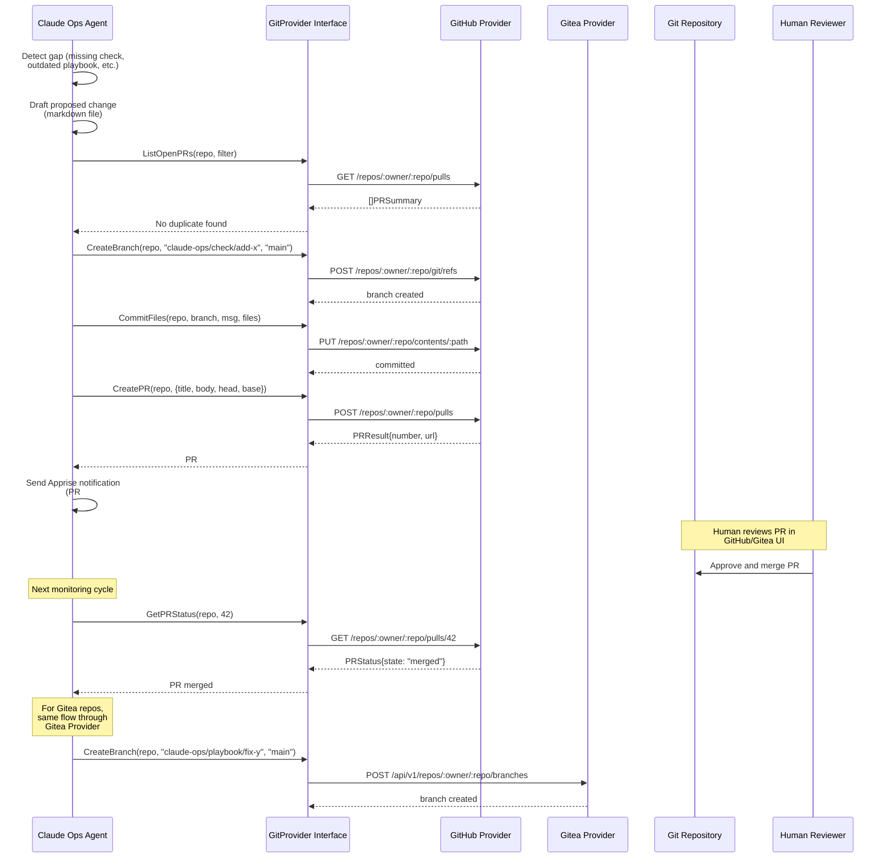

# ADR-0018: PR-Based Workflow for Runbook, Playbook, and Manifest Changes

## Context and Problem Statement

Claude Ops operates on markdown runbooks, playbooks, and checks that define its behavior (`checks/*.md`, `playbooks/*.md`, `prompts/*.md`). Mounted infrastructure repos extend the agent with their own checks, playbooks, and manifests via the convention-based extension model (ADR-0005). Currently, all of these files are read-only from the agent's perspective -- the "Never Allowed" list in CLAUDE.md explicitly prohibits the agent from modifying inventory files, playbooks, Helm charts, Dockerfiles, this runbook, or any prompt files, and from pushing to git repositories.

However, Claude Ops should be able to propose improvements to its own operational procedures. When the agent repeatedly encounters a failure pattern, discovers a missing health check, or identifies a playbook gap, it should be able to author a fix and submit it for human review. The key constraint is that **no change to runbooks, playbooks, manifests, or checks should ever be applied directly** -- every change must go through a pull request so a human can review, approve, and merge it.

The system must support multiple git hosting providers. The operator uses GitHub for the Claude Ops repository and Gitea for infrastructure repos (hosted at `gitea.stump.wtf`). Future operators may use GitLab, Bitbucket, or other providers. The architecture must be pluggable so that adding a new provider requires implementing a well-defined interface, not modifying core logic.

This creates several design tensions:

1. **Safety vs. agency.** The agent's power to propose changes must be carefully scoped. It should create branches, commit changes, and open PRs -- but never push to protected branches, merge its own PRs, or bypass review.
2. **Provider diversity.** GitHub and Gitea have different APIs, authentication mechanisms, and PR models. A unified interface must abstract these differences without leaking provider-specific behavior.
3. **Permission tier alignment.** PR creation involves writing files and interacting with git -- operations that span the current tier boundaries. The system needs clear rules about which tiers can propose changes and what approval gates exist.
4. **Repo scope.** The agent monitors both the Claude Ops repo itself and mounted infrastructure repos. PR-based changes must work for both, with different remotes, authentication, and branch protection rules.

## Decision Drivers

* **Human review is mandatory** -- No operational procedure change should take effect without explicit human approval via a PR review and merge. This is the non-negotiable safety constraint.
* **Pluggable provider architecture** -- The system must support GitHub and Gitea today, and adding a new provider (GitLab, Bitbucket, etc.) should require implementing a defined interface, not modifying core orchestration logic.
* **Integration with existing tier model** -- PR creation must map cleanly onto the existing permission tiers (ADR-0001, ADR-0003). The capability should be available at the appropriate tier without conflicting with existing restrictions.
* **Scope clarity** -- The agent must know which repos it can propose changes to, what kinds of changes are allowed, and where the boundaries are. Overreach (modifying infrastructure config, secrets, network settings) must remain impossible.
* **Operational simplicity** -- The mechanism should not require deploying additional services, webhooks, or CI infrastructure beyond what already exists. It should work with git CLI tools and provider REST APIs.
* **Auditability** -- Every proposed change must be traceable: what the agent observed, why it proposed the change, and the full diff. PR descriptions should contain this context.

## Considered Options

1. **PR-based workflow with a pluggable git provider interface** -- The agent creates a branch, commits changes, and opens a PR via a provider-specific implementation behind a common interface. Humans review and merge.
2. **Direct file edits with git commit and push** -- The agent modifies files in mounted repos and pushes directly to a branch (possibly main). No review gate.
3. **GitOps with webhook-triggered validation** -- The agent writes proposed changes to a staging area. A webhook-triggered CI pipeline validates and applies them. Humans approve via the CI system rather than PR review.
4. **External change-request queue** -- The agent writes proposed changes to a queue (database table, message queue, or filesystem). A separate human-facing tool presents the queue for review and applies approved changes.

## Decision Outcome

Chosen option: **"PR-based workflow with a pluggable git provider interface"**, because it enforces human review through the universally understood pull request model, supports multiple git providers through a clean interface abstraction, and integrates naturally with the existing tiered permission model without requiring new infrastructure.

### Provider Interface

The git provider interface defines the contract that each provider implementation must satisfy:

```go
// GitProvider abstracts git hosting operations for PR-based workflows.
type GitProvider interface {
    // Name returns the provider identifier (e.g., "github", "gitea").
    Name() string

    // CreateBranch creates a new branch from the given base branch.
    CreateBranch(ctx context.Context, repo RepoRef, branch string, base string) error

    // CommitFiles commits one or more file changes to the specified branch.
    CommitFiles(ctx context.Context, repo RepoRef, branch string, message string, files []FileChange) error

    // CreatePR opens a pull request from the head branch to the base branch.
    CreatePR(ctx context.Context, repo RepoRef, pr PRRequest) (*PRResult, error)

    // GetPRStatus returns the current status of a pull request.
    GetPRStatus(ctx context.Context, repo RepoRef, prNumber int) (*PRStatus, error)

    // ListOpenPRs lists open PRs created by the agent (filtered by author or label).
    ListOpenPRs(ctx context.Context, repo RepoRef, filter PRFilter) ([]PRSummary, error)
}

type RepoRef struct {
    Owner    string // org or user
    Name     string // repository name
    CloneURL string // for git operations
}

type FileChange struct {
    Path    string // relative path within the repo
    Content string // new file content
    Action  string // "create", "update", "delete"
}

type PRRequest struct {
    Title       string
    Body        string   // markdown description with context
    HeadBranch  string
    BaseBranch  string
    Labels      []string // e.g., ["claude-ops", "automated"]
}

type PRResult struct {
    Number int
    URL    string
}

type PRStatus struct {
    Number    int
    State     string // "open", "closed", "merged"
    Mergeable bool
    Reviews   []Review
}
```

### Provider Implementations

**GitHub provider:** Uses the `gh` CLI (already available in the Claude Ops container for GitHub Actions CI). Authentication via `GITHUB_TOKEN` environment variable. Branch creation, commits, and PRs use `gh api` calls to the GitHub REST API. This avoids adding a Go dependency on a GitHub client library and leverages the CLI the agent already knows how to use.

**Gitea provider:** Uses the Gitea REST API directly via HTTP. Authentication via `GITEA_TOKEN` environment variable. Gitea's API is intentionally GitHub-compatible for most endpoints, so the implementation is similar but uses different base URLs and handles Gitea-specific response formats.

### Provider Registration and Discovery

Providers are registered in the Go supervisor at startup:

```go
// Provider registry — add new providers here.
var providers = map[string]GitProvider{
    "github": NewGitHubProvider(os.Getenv("GITHUB_TOKEN")),
    "gitea":  NewGiteaProvider(os.Getenv("GITEA_URL"), os.Getenv("GITEA_TOKEN")),
}
```

Repo-to-provider mapping is configured via the repo's `CLAUDE-OPS.md` manifest, which can declare its git provider:

```markdown
## Git Provider

- **provider**: gitea
- **remote**: https://gitea.stump.wtf/joe/home-cluster.git
- **owner**: joe
- **repo**: home-cluster
- **base_branch**: main
```

If no provider is declared, the system infers from the clone URL: `github.com` domains use the GitHub provider, known Gitea domains use the Gitea provider. The Claude Ops repo itself uses GitHub (configured via environment variables).

### Workflow

1. **Detection.** During a monitoring cycle, the agent identifies a gap: a missing health check, an incomplete playbook, an outdated manifest entry, or a pattern it has seen repeatedly.

2. **Drafting.** The agent authors the proposed change -- a new check file, a playbook update, or a manifest correction -- following the existing markdown conventions (ADR-0002).

3. **Branch creation.** The agent creates a branch named `claude-ops/<type>/<short-description>` (e.g., `claude-ops/check/add-jellyfin-health`, `claude-ops/playbook/fix-postgres-restart-wait`).

4. **Commit.** The agent commits the changes with a descriptive message that includes context about what was observed and why the change is proposed.

5. **PR creation.** The agent opens a PR with:
   - A title describing the change
   - A body containing: what was observed, why the change is needed, what the change does, and any relevant monitoring data
   - Labels: `claude-ops`, `automated`
   - The PR targets the repo's default base branch (usually `main`)

6. **Notification.** The agent sends an Apprise notification that a PR has been opened, including the PR URL.

7. **No auto-merge.** The agent never merges its own PRs. A human must review and merge. The agent can check PR status on subsequent runs to track whether proposed changes have been accepted.

### Permission Tier Integration

- **Tier 1 (Haiku):** Cannot create PRs. Can observe patterns and record them as memories (ADR-0015) for later use. Can note in the handoff file that a PR might be warranted.
- **Tier 2 (Sonnet):** Can create PRs for non-critical changes: adding new health checks, updating check thresholds, improving playbook documentation, adding new service entries to manifests. This is the primary tier for PR creation.
- **Tier 3 (Opus):** Can create PRs for structural changes: new playbooks for complex remediation patterns, multi-file changes, or changes that affect multiple repos.

PR creation is explicitly added to the Tier 2 and Tier 3 permission lists in the prompt files. The "Never Allowed" list is updated to replace "Push to git repositories" with "Push to protected branches or merge own PRs" -- pushing to agent-created feature branches is permitted.

### Allowed Change Scopes

The agent MAY propose changes to:
- `checks/*.md` -- new or updated health checks
- `playbooks/*.md` -- new or updated remediation procedures
- `.claude-ops/checks/*.md` -- repo-specific health checks
- `.claude-ops/playbooks/*.md` -- repo-specific playbooks
- `.claude-ops/skills/*.md` -- repo-specific skills
- `CLAUDE-OPS.md` -- manifest updates (new service entries, corrected hostnames)

The agent MUST NOT propose changes to:
- `prompts/*.md` -- tier prompt files (these define the agent's own permissions)
- `CLAUDE.md` -- the main runbook
- `entrypoint.sh` -- the execution loop
- Ansible inventory files (`ie.yaml`, `vms.yaml`)
- Docker Compose files, Dockerfiles, Helm charts
- Any file containing secrets, credentials, or encryption keys
- Network configuration (Caddy, WireGuard, DNS)
- The provider interface or Go application code

### Duplicate PR Prevention

Before creating a PR, the agent checks for existing open PRs with the same scope:
1. Call `ListOpenPRs` filtered by the `claude-ops` label
2. If an open PR already addresses the same file or service, skip creating a duplicate
3. If a previously opened PR was closed without merging, the agent should not immediately re-open the same change -- this likely means the human rejected it

### Consequences

**Positive:**

* Every operational procedure change goes through human review before taking effect, maintaining the safety guarantee that the agent cannot unilaterally modify its own behavior.
* The pluggable provider interface means adding GitLab, Bitbucket, or any other git hosting service requires implementing five methods -- no changes to the agent's core logic, prompts, or workflow.
* PR descriptions contain the agent's observations and reasoning, creating a rich audit trail of why each change was proposed. This is valuable context that would be lost with direct edits.
* The workflow integrates naturally with existing code review practices. Teams already review PRs -- agent-proposed PRs go through the same process.
* Provider discovery from `CLAUDE-OPS.md` manifests means each repo can use a different git provider without central configuration. A GitHub-hosted Claude Ops repo and a Gitea-hosted infrastructure repo coexist naturally.
* Duplicate PR prevention avoids flooding the repo with repeated proposals for the same issue.
* The agent can track PR status across runs, learning whether its proposals are being accepted or rejected.

**Negative:**

* The agent gains write access to git repositories (on feature branches), which is a new capability that expands the attack surface. A compromised or misaligned agent could create branches with misleading content. Mitigation: branch protection rules on main/production branches, mandatory PR reviews, and the `claude-ops/` branch prefix makes agent branches identifiable.
* Provider implementations must be maintained as APIs evolve. GitHub and Gitea API changes could break the agent's ability to create PRs. Mitigation: the interface is narrow (five methods), and both providers have stable, versioned APIs.
* The "Never Allowed" list must be carefully updated. The current blanket "Push to git repositories" is simpler to enforce than the nuanced "Push to agent-created feature branches only." Mitigation: the agent's git operations go through the provider interface, which can enforce branch naming conventions.
* PR review becomes a new operational task for the human operator. If the agent proposes many changes, this could become burdensome. Mitigation: changes should be high-signal (based on repeated observations, not one-off events), and the agent should batch related changes into single PRs.
* Authentication tokens for each provider must be provisioned and managed. This adds configuration complexity, especially for multi-provider setups. Mitigation: tokens are standard environment variables, consistent with the existing configuration model.

## Pros and Cons of the Options

### PR-Based Workflow with Pluggable Git Provider Interface

The agent creates branches, commits changes, and opens PRs through a provider interface. Humans review and merge. Provider implementations for GitHub and Gitea are included.

* Good, because human review is mandatory -- no change takes effect without explicit approval via PR merge.
* Good, because the provider interface is narrow (five methods) and well-defined, making new provider implementations straightforward.
* Good, because PR descriptions capture the agent's reasoning and observations, creating an audit trail that explains why each change was proposed.
* Good, because it integrates with existing code review workflows -- teams already know how to review PRs.
* Good, because provider discovery from `CLAUDE-OPS.md` manifests supports multi-provider setups without central configuration.
* Good, because the scope of allowed changes is explicitly defined and enforced, preventing the agent from modifying its own permissions or infrastructure configuration.
* Bad, because the agent gains write access to git repositories (on feature branches), expanding the attack surface compared to the current read-only model.
* Bad, because provider implementations must track upstream API changes, adding a maintenance burden.
* Bad, because PR review becomes a new operational responsibility for the human operator.
* Bad, because the "Never Allowed" list becomes more nuanced (branch-specific push restrictions instead of a blanket prohibition), which is harder to enforce via prompt instructions.

### Direct File Edits with Git Commit and Push

The agent modifies files in the repo and pushes directly to a branch, bypassing the review process entirely.

* Good, because it is the simplest implementation -- standard git commands with no provider abstraction needed.
* Good, because changes take effect immediately on the next monitoring cycle, with no delay for human review.
* Good, because no authentication tokens for hosting APIs are needed -- only git push credentials.
* Bad, because there is no human review gate. The agent can modify its own operational procedures without oversight, which violates the core safety constraint.
* Bad, because pushing to main/protected branches could introduce broken checks or dangerous playbooks that immediately affect production monitoring.
* Bad, because there is no audit trail beyond the git log. The reasoning behind a change is lost unless the agent writes detailed commit messages.
* Bad, because a misaligned or compromised agent could modify its own permission boundaries by editing prompt files or the runbook.
* Bad, because it fundamentally contradicts the "Never Allowed" prohibition on pushing to git repositories, requiring a significant relaxation of safety constraints.

### GitOps with Webhook-Triggered Validation

The agent writes proposed changes to a staging area. A CI pipeline triggered by a webhook validates the changes (linting, syntax checks, dry-run tests) before they are applied. Humans approve via the CI system.

* Good, because automated validation catches syntax errors and structural problems before human review.
* Good, because the CI pipeline can run the proposed checks/playbooks in a sandbox to verify they work.
* Good, because the staging area decouples the agent's write operation from the actual repo modification.
* Bad, because it requires deploying and maintaining webhook infrastructure, a CI pipeline, and a staging mechanism -- significant operational overhead for a system that deliberately avoids application complexity.
* Bad, because the review and approval happen in the CI system rather than the git hosting platform, fragmenting the review workflow across tools.
* Bad, because the staging area introduces a new state management concern (what happens if the agent writes to staging but the webhook fails?).
* Bad, because it does not address provider pluggability -- the CI pipeline would need provider-specific integration for each git host.
* Bad, because it adds a circular dependency: the infrastructure monitoring tool depends on CI infrastructure that it might also be monitoring.

### External Change-Request Queue

The agent writes proposed changes to a queue (database, filesystem, or message broker). A separate tool presents the queue to humans for review and applies approved changes.

* Good, because the agent never interacts with git at all, maintaining a strict read-only posture toward repositories.
* Good, because the review tool can be tailored to the operator's workflow preferences.
* Good, because queued changes can be batched, prioritized, and managed independently of the monitoring cycle.
* Bad, because it requires building a custom review tool -- there is no existing system for this workflow. PRs are the established, well-understood review mechanism.
* Bad, because it duplicates functionality that git hosting platforms already provide (diff viewing, commenting, approval workflows, merge controls).
* Bad, because the queue introduces a new persistence concern and potential data loss vector.
* Bad, because it fragments the audit trail -- changes appear in the queue system rather than in the git history where operators expect to find them.
* Bad, because it does not leverage the rich PR ecosystem (linked issues, CI checks, code owners, required reviewers) that git hosting platforms provide.
* Bad, because applying approved changes still requires git operations, which means the tool must implement the same provider-specific logic that the PR-based approach handles directly.

## Architecture Diagram



## More Information

* **ADR-0001** (Tiered Model Escalation): PR creation maps to Tier 2 and Tier 3. Tier 1 (observe-only) cannot create PRs but can note that one might be warranted in the handoff file.
* **ADR-0002** (Markdown as Executable Instructions): Proposed changes follow the same markdown conventions as existing checks and playbooks. The agent does not introduce a new format -- it authors the same kind of documents that humans write.
* **ADR-0003** (Prompt-Based Permission Enforcement): The "Never Allowed" list must be refined from "Push to git repositories" to "Push to protected branches or merge own PRs." The prompt files for Tier 2 and Tier 3 gain explicit PR-creation permissions.
* **ADR-0005** (Mounted Repo Extension Model): PR-based changes work for both the Claude Ops repo and mounted repos. Each repo's `CLAUDE-OPS.md` manifest can declare its git provider and remote, enabling multi-provider workflows.
* **ADR-0015** (Persistent Agent Memory): The agent can use memories to track patterns over multiple cycles before proposing a change. A single observation should not trigger a PR -- repeated patterns across multiple runs provide stronger justification.
* **ADR-0016** (Session-Based Escalation): PR creation can happen at any point in the escalation chain. The handoff file can include a `proposed_changes` field for lower tiers to suggest PRs that higher tiers should create.
* **Environment variables**: `GITHUB_TOKEN` (for GitHub API), `GITEA_URL` and `GITEA_TOKEN` (for Gitea API) must be provisioned in the container environment. These follow the same pattern as existing env vars (`ANTHROPIC_API_KEY`, `CLAUDEOPS_APPRISE_URLS`).
* **Branch naming convention**: All agent-created branches use the `claude-ops/` prefix, making them identifiable in branch listings and enabling branch protection rules that restrict the agent to this namespace.
