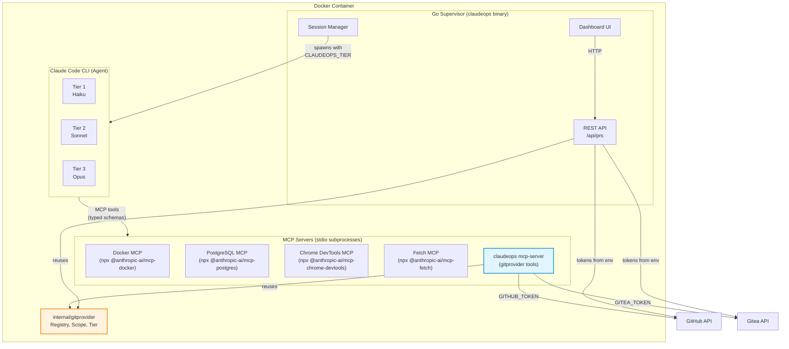
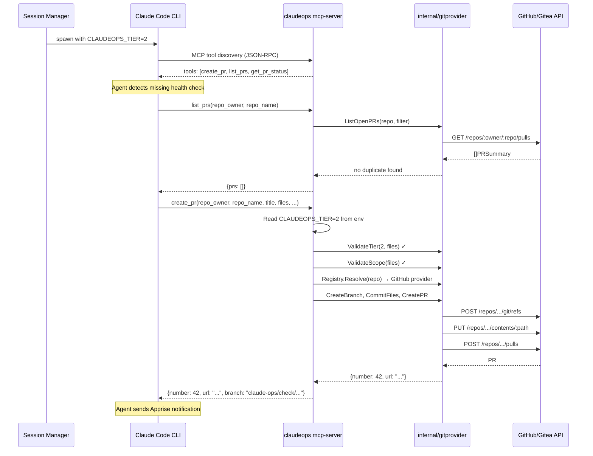

# ADR-0019: MCP Server for Git Provider Interface

## Context and Problem Statement

Claude Ops agents running at Tier 2 and Tier 3 can propose changes to operational procedures (checks, playbooks, manifests) by opening pull requests through the git provider interface defined in ADR-0018. The `internal/gitprovider` package and its REST API surface (`POST /api/prs`, `GET /api/prs`) are implemented and working. However, the agent currently has only one way to use this capability: constructing `curl` commands against the REST API endpoints exposed by the Go supervisor's web server.

This is problematic for several reasons:

1. **Token exposure.** The REST API approach requires the agent to include authentication context in its HTTP requests, or the API must be unauthenticated (relying on network isolation). In contrast, `GITHUB_TOKEN` and `GITEA_TOKEN` are environment variables in the Go process -- if the agent calls curl, it never needs these tokens. But there is a subtler problem: the agent runs with Bash access and can trivially read environment variables via `env` or `printenv`. An MCP server cannot provide absolute token isolation, but it provides defense-in-depth by keeping tokens out of the agent's normal tool-calling workflow. The agent does not need to know or handle tokens to create PRs.

2. **Fragile command construction.** The agent must construct valid JSON payloads and curl commands with correct headers, URL paths, and error handling. This is exactly the kind of unstructured CLI construction that ADR-0006 chose MCP to avoid -- MCP provides typed tool schemas that Claude can reason about reliably, rather than ad-hoc command strings.

3. **Inconsistency with the MCP-first architecture.** ADR-0006 established MCP as the primary infrastructure access layer. Docker operations go through the Docker MCP server. Database queries go through the PostgreSQL MCP server. Browser automation goes through the Chrome DevTools MCP server. But PR operations go through curl-to-REST-API, breaking the established pattern and forcing the agent to context-switch between two interaction models.

4. **Tier enforcement gap.** The REST API checks the `tier` field in the JSON body, trusting the agent to self-report its tier accurately. An MCP server can read the `CLAUDEOPS_TIER` environment variable set by the session manager, enforcing tier restrictions without relying on the agent's honesty.

The question is: **How should the Claude Code CLI agent access the git provider interface for PR operations?**

## Decision Drivers

* **MCP-first consistency** -- ADR-0006 established MCP as the primary access layer for infrastructure operations. PR operations should follow the same pattern rather than introducing a second interaction model (curl-to-REST).
* **Token isolation (defense-in-depth)** -- While not absolute (the agent has Bash access), keeping `GITHUB_TOKEN` and `GITEA_TOKEN` out of the agent's normal workflow reduces the surface area for accidental token leakage in logs, PR descriptions, or memory entries.
* **Typed tool schemas** -- MCP tools expose JSON Schema-defined parameters that Claude can reason about. This produces more reliable tool invocations than constructing curl commands with JSON payloads.
* **Tier enforcement at the boundary** -- The MCP server can read `CLAUDEOPS_TIER` from its environment and enforce tier restrictions server-side, rather than trusting the agent to self-report.
* **Operational simplicity** -- The solution should not require deploying additional processes or infrastructure. The `claudeops` binary is already in the Docker container; adding a subcommand is simpler than deploying a separate MCP server binary.
* **Additive, not replacing** -- The REST API must remain for the dashboard UI, external integrations, and any future non-MCP consumers. The MCP server is an additional access path, not a replacement.

## Considered Options

1. **MCP server as `claudeops mcp-server` subcommand over stdio** -- Add a Cobra subcommand to the existing binary that speaks JSON-RPC over stdin/stdout, exposing `create_pr`, `list_prs`, and `get_pr_status` as MCP tools.
2. **Agent constructs curl commands against the REST API** -- The current approach: the agent builds curl commands to call `POST /api/prs` and `GET /api/prs` on the supervisor's web server.
3. **Standalone MCP server (separate binary/process)** -- Build a dedicated MCP server binary that is deployed alongside the main `claudeops` binary, with its own configuration and process lifecycle.
4. **Direct `gh`/`tea` CLI usage by the agent** -- Let the agent use the GitHub CLI (`gh`) and Gitea CLI (`tea`) directly via Bash, bypassing the git provider interface entirely.

## Decision Outcome

Chosen option: **"MCP server as `claudeops mcp-server` subcommand over stdio"**, because it maintains consistency with the MCP-first architecture (ADR-0006), provides defense-in-depth token isolation, enables server-side tier enforcement, and reuses the existing `claudeops` binary and `internal/gitprovider` package with minimal new code.

### Implementation

The `claudeops mcp-server` subcommand starts a JSON-RPC stdio server that exposes three MCP tools wrapping the existing `internal/gitprovider` package:

**`create_pr`** -- Creates a branch, commits files, and opens a pull request.
- Parameters: `repo_owner`, `repo_name`, `clone_url` (optional), `title`, `body`, `base_branch` (default: "main"), `change_type`, `files` (array of `{path, content, action}`)
- Enforces scope validation (`gitprovider.ValidateScope`) and tier validation (`gitprovider.ValidateTier`) server-side
- Respects `CLAUDEOPS_DRY_RUN` -- returns a dry-run response without making API calls when true
- Returns: `{number, url, branch}` on success

**`list_prs`** -- Lists open pull requests filtered by the `claude-ops` label.
- Parameters: `repo_owner`, `repo_name`, `clone_url` (optional)
- Returns: array of `{number, title, files}`

**`get_pr_status`** -- Returns the current status of a pull request.
- Parameters: `repo_owner`, `repo_name`, `clone_url` (optional), `pr_number`
- Returns: `{number, state, mergeable, reviews}`

**Tier enforcement:** The MCP server reads `CLAUDEOPS_TIER` from its environment (set by the session manager when spawning the Claude Code CLI process). The `create_pr` tool calls `gitprovider.ValidateTier(tier, files)` before proceeding. Tier 1 agents are rejected. Tier 2 agents are limited to 3 files per PR. This is the same validation the REST API performs, but enforced server-side rather than trusting the agent's self-reported tier.

**Registration in `.claude/mcp.json`:**

```json
{
  "claudeops": {
    "type": "stdio",
    "command": "/app/claudeops",
    "args": ["mcp-server"],
    "env": {
      "GITHUB_TOKEN": "${GITHUB_TOKEN}",
      "GITEA_URL": "${GITEA_URL}",
      "GITEA_TOKEN": "${GITEA_TOKEN}",
      "CLAUDEOPS_TIER": "${CLAUDEOPS_TIER}",
      "CLAUDEOPS_DRY_RUN": "${CLAUDEOPS_DRY_RUN}"
    }
  }
}
```

The `claudeops` binary is already present in the container at `/app/claudeops`. The MCP server entry is added to the baseline `.claude/mcp.json` alongside the existing Docker, PostgreSQL, Chrome DevTools, and Fetch servers. Claude Code spawns it as a stdio subprocess, just like the other MCP servers.

**Token flow:** `GITHUB_TOKEN` and `GITEA_TOKEN` are passed to the MCP server process via its `env` block. The agent's Claude Code process does not receive these tokens in its own environment -- they flow from the container environment to the MCP server subprocess only. The agent interacts with the MCP tools, which internally use the tokens. Note: this is defense-in-depth, not absolute isolation. The agent has Bash access and could read tokens from `/proc` or other side channels. The goal is to keep tokens out of the normal workflow, not to make them cryptographically unreachable.

### Consequences

**Positive:**

* PR operations follow the same MCP tool pattern as Docker, PostgreSQL, browser, and HTTP operations, giving the agent a consistent interaction model (ADR-0006).
* `GITHUB_TOKEN` and `GITEA_TOKEN` stay in the MCP server process. The agent's normal tool-calling workflow never handles tokens directly, reducing accidental leakage in logs and PR descriptions.
* Tier enforcement is server-side. The MCP server reads `CLAUDEOPS_TIER` from its environment and validates before executing, rather than trusting the agent to pass the correct tier in a JSON body.
* Typed MCP tool schemas replace ad-hoc curl command construction. Claude receives parameter schemas with descriptions and types, producing more reliable invocations.
* No new binary or deployment artifact. The `mcp-server` subcommand is part of the existing `claudeops` binary, which is already in the container.
* The `internal/gitprovider` package is reused directly. The MCP tool handlers call the same `Registry`, `ValidateScope`, `ValidateTier`, and provider methods as the REST API handlers.
* The REST API remains fully functional for the dashboard, external integrations, and any non-MCP consumers. This is additive.
* Scope validation (`gitprovider.ValidateScope`) is enforced server-side, preventing the agent from proposing changes to denied paths regardless of what it passes to the MCP tool.

**Negative:**

* The `claudeops` binary gains a new subcommand and JSON-RPC server implementation, increasing binary size and code surface area.
* Two access paths to the same functionality (MCP tools + REST API) means two places to maintain when the git provider interface changes. Mitigation: both paths call the same `internal/gitprovider` functions, so logic changes propagate automatically.
* The MCP server must be kept in sync with the REST API in terms of validation rules and behavior. Divergence could cause confusing inconsistencies.
* Token isolation is not absolute -- the agent's Bash access means tokens are technically reachable. This ADR is explicit about this limitation to set correct expectations.

### Confirmation

The implementation is confirmed successful when:
1. The `claudeops mcp-server` subcommand starts and responds to MCP tool discovery requests over stdio.
2. The `create_pr`, `list_prs`, and `get_pr_status` tools appear in the MCP tool listing.
3. A Tier 2 agent can create a PR through the `create_pr` MCP tool without constructing curl commands.
4. A Tier 1 agent calling `create_pr` receives a tier validation error.
5. The REST API continues to function independently for the dashboard.
6. Dry-run mode prevents actual API calls when `CLAUDEOPS_DRY_RUN=true`.

## Pros and Cons of the Options

### MCP Server as `claudeops mcp-server` Subcommand over Stdio

The existing `claudeops` binary gains a `mcp-server` subcommand that speaks JSON-RPC over stdio, exposing `create_pr`, `list_prs`, and `get_pr_status` as MCP tools. Registered in `.claude/mcp.json` alongside the other MCP servers.

* Good, because it aligns with the MCP-first architecture (ADR-0006) -- PR operations use the same tool pattern as Docker, database, browser, and HTTP operations.
* Good, because tokens (`GITHUB_TOKEN`, `GITEA_TOKEN`) flow to the MCP server subprocess, not the agent's process, providing defense-in-depth against accidental token leakage.
* Good, because tier enforcement is server-side via `CLAUDEOPS_TIER` environment variable, not self-reported by the agent.
* Good, because MCP tool schemas give Claude typed parameters with descriptions, producing more reliable invocations than curl command construction.
* Good, because no new binary or process is needed -- the subcommand is part of the existing `claudeops` binary already in the container.
* Good, because it reuses the `internal/gitprovider` package directly, sharing validation and provider logic with the REST API.
* Good, because it is additive -- the REST API remains for the dashboard and external consumers.
* Bad, because it adds code to the `claudeops` binary (JSON-RPC server, MCP protocol handling, tool dispatch).
* Bad, because two access paths (MCP + REST) to the same functionality creates a maintenance surface that must be kept in sync.
* Bad, because token isolation is defense-in-depth, not absolute -- the agent's Bash access can still reach environment variables through side channels.
* Bad, because MCP protocol adds a layer of indirection that makes debugging slightly harder than inspecting raw HTTP requests to the REST API.

### Agent Constructs Curl Commands Against the REST API

The current approach: the agent uses Bash to run curl commands against `POST /api/prs` and `GET /api/prs` endpoints on the supervisor's web server.

* Good, because it requires no additional code -- the REST API already exists and works.
* Good, because curl commands are transparent and easy to debug -- operators can replay them manually.
* Good, because there is a single access path to the PR functionality, simplifying maintenance.
* Good, because the REST API can be called from any HTTP client, not just the agent, making it more general.
* Bad, because the agent must construct valid JSON payloads and curl commands, which is the fragile CLI construction pattern that ADR-0006 specifically chose MCP to avoid.
* Bad, because tier enforcement relies on the agent self-reporting its tier in the JSON body -- there is no server-side validation of the agent's actual tier.
* Bad, because it breaks the MCP-first pattern. Every other infrastructure interaction (Docker, database, browser, HTTP) goes through MCP, but PR operations go through curl.
* Bad, because the agent must know the supervisor's HTTP address and port, adding configuration coupling.
* Bad, because error handling from curl is unstructured text that Claude must parse, rather than typed MCP error responses.

### Standalone MCP Server (Separate Binary/Process)

A dedicated binary (e.g., `claudeops-mcp-gitprovider`) is built and deployed alongside the main `claudeops` binary, speaking JSON-RPC over stdio.

* Good, because it cleanly separates the MCP server from the main supervisor binary, following single-responsibility principles.
* Good, because it can be versioned and deployed independently of the main binary.
* Good, because it provides the same MCP tool schema benefits as the subcommand approach.
* Bad, because it requires building, testing, and shipping a separate binary -- additional CI/CD, Docker image layers, and versioning coordination.
* Bad, because it duplicates the `internal/gitprovider` package import, or requires extracting it into a shared library, adding build complexity.
* Bad, because the Dockerfile must install and manage two binaries instead of one.
* Bad, because configuration (tokens, tier, dry-run) must be coordinated between two separate processes, increasing the chance of misconfiguration.
* Bad, because it contradicts the operational simplicity principle -- the `claudeops` binary is already in the container and can serve this role with a subcommand.

### Direct `gh`/`tea` CLI Usage by the Agent

The agent uses the GitHub CLI (`gh`) and Gitea CLI (`tea`) directly via Bash to create branches, commit files, and open PRs.

* Good, because `gh` and `tea` are mature, well-documented CLIs that handle authentication, pagination, and error formatting.
* Good, because no custom MCP server or API code is needed -- the agent uses existing tools.
* Good, because `gh` is already available in the container for GitHub Actions CI integration.
* Bad, because it bypasses the `internal/gitprovider` package entirely, losing scope validation (`ValidateScope`) and tier validation (`ValidateTier`).
* Bad, because the agent must handle two different CLIs with different flags, output formats, and authentication mechanisms (one per provider), rather than a unified interface.
* Bad, because tokens must be available in the agent's Bash environment for `gh` and `tea` to authenticate, removing even the defense-in-depth isolation that MCP provides.
* Bad, because `tea` (Gitea CLI) is less mature and may not be available in the container image, requiring additional installation.
* Bad, because branch naming conventions, label application, and duplicate PR checks must be reimplemented in prompt instructions rather than enforced in code.
* Bad, because there is no dry-run enforcement -- the CLIs will execute real API calls unless the prompt successfully prevents it, which is less reliable than code-level enforcement.

## Architecture Diagram





## More Information

* **ADR-0006** (MCP Infrastructure Bridge): Established MCP as the primary infrastructure access layer. This ADR extends that pattern to git provider operations, which were previously only accessible via REST API.
* **ADR-0010** (Claude Code CLI Subprocess): The CLI reads `.claude/mcp.json` and manages MCP server lifecycles. The `claudeops mcp-server` entry is auto-discovered alongside existing servers.
* **ADR-0018** (PR-Based Config Changes): Defines the git provider interface, scope validation, tier restrictions, and PR workflow. This ADR adds an MCP access path to the same underlying implementation.
* **SPEC-0018** (PR-Based Configuration Changes): The formal specification for the git provider interface. The MCP server wraps the same `internal/gitprovider` package specified there.
* **ADR-0003** (Prompt-Based Permission Enforcement): Tier restrictions are enforced at both the prompt level (instructions) and the MCP server level (`CLAUDEOPS_TIER` environment variable), providing defense-in-depth.
* **Environment variables**: `GITHUB_TOKEN`, `GITEA_URL`, `GITEA_TOKEN` are passed to the MCP server via its `.claude/mcp.json` env block. `CLAUDEOPS_TIER` is set by the session manager when spawning each CLI process. `CLAUDEOPS_DRY_RUN` controls whether the MCP server makes real API calls.
