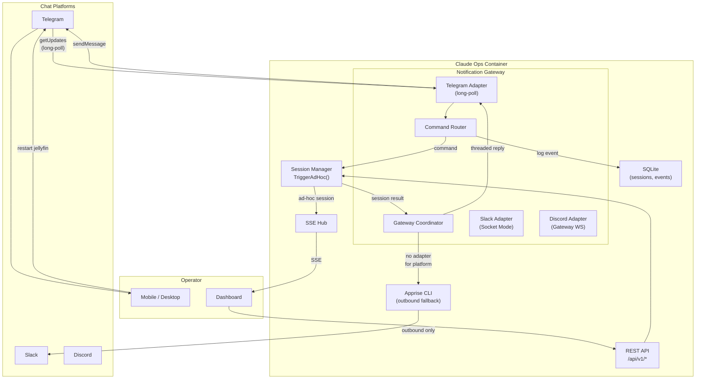

# ADR-0020: Bidirectional Notification Gateway

## Context and Problem Statement

Claude Ops currently uses Apprise (ADR-0004) for one-way outbound notifications: sending daily digests, auto-remediation reports, and human-attention alerts to 80+ notification services via a single CLI tool and environment variable. This works well for "fire and forget" alerting, but operators have no way to respond to these notifications from within their chat platform of choice.

When an operator receives an alert that "Jellyfin is down," the current workflow requires them to open the Claude Ops dashboard in a browser, navigate to the session trigger form (ADR-0013), and type a prompt. This context switch is friction-heavy, especially on mobile or during off-hours when a quick "restart jellyfin" reply in Telegram would suffice.

The user wants **bidirectional chat**: Claude Ops sends alerts out to Telegram (or Slack, Discord, etc.), and the operator can reply directly in that same chat thread to issue commands ("restart jellyfin"), acknowledge alerts ("ack"), snooze notifications ("snooze 2h"), or ask questions ("what's the status of postgres?"). Different operators may prefer different chat platforms, so the system must be pluggable across providers.

This creates several design tensions:

1. **Outbound vs. inbound asymmetry.** Apprise excels at outbound delivery to 80+ services, but provides no inbound message reception. Any bidirectional solution must either replace Apprise or layer an inbound mechanism alongside it.
2. **Platform diversity for inbound.** Each chat platform has a different mechanism for receiving messages: Telegram uses a Bot API with long polling or webhooks, Slack uses the Events API or Socket Mode, Discord uses Gateway WebSocket connections. A unified inbound abstraction must handle these fundamentally different transport models.
3. **Command routing and security.** Inbound messages from chat platforms must be authenticated (is this message really from an authorized operator?), parsed (what action is being requested?), and routed to the correct Claude Ops subsystem (trigger a session, acknowledge an alert, query status). Accepting arbitrary commands from a chat platform is a meaningful expansion of the attack surface.
4. **Deployment model.** Claude Ops runs as a single Docker container with an optional Chrome sidecar. Adding inbound chat receivers may require publicly accessible webhook endpoints (for Telegram/Slack) or persistent WebSocket connections (for Discord), both of which have networking and infrastructure implications for home-lab deployments behind NAT.
5. **Relationship to the existing ad-hoc session API.** The dashboard already supports triggering ad-hoc sessions via `POST /api/v1/sessions/trigger` (ADR-0013, ADR-0017). Inbound chat commands should route through this same mechanism rather than creating a parallel execution path.

## Decision Drivers

* **Bidirectional communication is the core requirement** -- operators must be able to both receive alerts and respond with commands from the same chat interface, without switching to a browser.
* **Multi-platform support** -- Telegram is the immediate need, but Slack, Discord, and other platforms must be supportable through a pluggable adapter architecture. Different operators (or the same operator in different contexts) may use different platforms.
* **Leverage existing infrastructure** -- Claude Ops already has Apprise for outbound, a REST API for session triggering, and a session manager with an ad-hoc trigger channel. The gateway should compose with these, not replace them.
* **Security by default** -- inbound commands from chat platforms expand the attack surface significantly. Only authorized users should be able to issue commands, and the set of allowed commands should be explicitly defined and bounded.
* **Home-lab friendly deployment** -- the solution must work behind NAT without requiring port forwarding, dynamic DNS, or cloud-hosted relay infrastructure. Many operators run Claude Ops on local networks without public-facing endpoints.
* **Operational simplicity** -- configuration should be environment-variable-based, consistent with the existing Apprise and Docker Compose configuration model. Adding a new chat platform adapter should not require rebuilding the image.
* **Graceful degradation** -- if no chat adapters are configured, the system falls back to Apprise-only outbound notifications. The gateway is opt-in, not mandatory.

## Considered Options

1. **Apprise for outbound + webhook receiver for inbound** -- keep Apprise for sending notifications, add a generic webhook endpoint to the existing web server for receiving inbound messages from chat platforms.
2. **Dedicated notification gateway package** -- new Go package (`internal/notify`) with a `ChatAdapter` interface, platform-specific implementations (Telegram, Slack, Discord), integrated into the existing web server and session manager.
3. **MCP-based notification tools** -- expose send/receive as MCP tools that the Claude agent calls directly during sessions, with the MCP server managing platform connections.
4. **Matrix as a universal bridge protocol** -- run a Matrix homeserver (or connect to one), use Matrix bridges to connect to Telegram, Slack, Discord, etc. Claude Ops speaks only the Matrix protocol.

## Decision Outcome

Chosen option: **"Dedicated notification gateway package"**, because it provides a clean adapter interface for both inbound and outbound messaging, integrates naturally with the existing Go codebase and session manager, supports the polling-based transport model that works behind NAT, and keeps the entire system in a single deployable container.

### Adapter Interface

The notification gateway defines a `ChatAdapter` interface that each platform must implement:

```go
// ChatAdapter abstracts bidirectional communication with a chat platform.
type ChatAdapter interface {
    // Name returns the adapter identifier (e.g., "telegram", "slack").
    Name() string

    // Send delivers an outbound message to the configured channel/chat.
    // The context parameter carries the conversation context (e.g., reply-to
    // message ID) so responses can be threaded.
    Send(ctx context.Context, msg OutboundMessage) error

    // Start begins listening for inbound messages. It calls the handler
    // function for each received message. Start blocks until ctx is cancelled.
    // Adapters that use polling (Telegram long-poll) run the poll loop here.
    // Adapters that use webhooks register their HTTP handlers before Start
    // is called and use Start only to block until shutdown.
    Start(ctx context.Context, handler InboundHandler) error
}

type OutboundMessage struct {
    Text     string            // message body (markdown supported where platform allows)
    ThreadID string            // optional: reply to this thread/message
    Priority string            // "normal", "urgent"
    Metadata map[string]string // adapter-specific options
}

type InboundMessage struct {
    Platform  string // "telegram", "slack", etc.
    UserID    string // platform-specific user identifier
    UserName  string // human-readable display name
    Text      string // raw message text
    ThreadID  string // conversation thread ID for reply threading
    Timestamp time.Time
}

type InboundHandler func(ctx context.Context, msg InboundMessage) *OutboundMessage
```

### Command Router

Inbound messages are parsed by a command router that maps text commands to Claude Ops actions:

| Command | Action | Maps to |
|---------|--------|---------|
| `restart <service>` | Trigger ad-hoc session with restart prompt | `POST /api/v1/sessions/trigger` |
| `status` | Return current health summary | `GET /api/v1/health` + recent events |
| `status <service>` | Return specific service status | Query cooldown state + recent events |
| `ack <alert-id>` | Acknowledge an alert, suppress re-notification | Update cooldown state |
| `snooze <duration>` | Suppress all notifications for duration | Update gateway state |
| `sessions` | List recent sessions | `GET /api/v1/sessions` |
| `help` | List available commands | Static response |
| Free-form text | Trigger ad-hoc session with the text as prompt | `POST /api/v1/sessions/trigger` |

The command router is a Go function, not an LLM call. Commands are pattern-matched with explicit prefixes. Free-form text (anything that doesn't match a known command) is forwarded as an ad-hoc session prompt, letting the operator conversationally interact with the agent.

### Authentication and Authorization

Each adapter implements platform-specific authentication:

- **Telegram:** Bot token authenticates the bot itself. Authorized user IDs are configured via `CLAUDEOPS_TELEGRAM_ALLOWED_USERS` (comma-separated Telegram user IDs). Messages from unrecognized users are silently ignored.
- **Slack:** Bot token + signing secret for webhook verification. Authorized via Slack workspace membership (app is installed in a specific workspace). Optionally restrict to specific user IDs via `CLAUDEOPS_SLACK_ALLOWED_USERS`.
- **Discord:** Bot token authenticates. Authorized user IDs or role IDs via `CLAUDEOPS_DISCORD_ALLOWED_USERS`.

The gateway logs all inbound commands (user, platform, command text, timestamp) as events in the existing events table for audit purposes.

### Outbound: Apprise Coexistence

The gateway does **not** replace Apprise. Instead, it layers alongside it:

1. **Apprise** remains the default outbound mechanism for operators who only need one-way notifications. No changes to existing Apprise configuration or usage.
2. **Gateway adapters** provide an additional outbound path that supports threading and rich responses. When a gateway adapter is configured, the agent's Apprise notification is augmented with a gateway message to the same adapter's configured channel.
3. **Configuration precedence:** If both Apprise and a gateway adapter target the same platform (e.g., Apprise has a Telegram URL and a Telegram adapter is configured), the gateway adapter takes precedence for that platform to avoid duplicate messages.

### Transport: Polling over Webhooks

For home-lab deployments behind NAT, **polling-based transports are preferred**:

- **Telegram:** Uses `getUpdates` long polling (not webhooks). The bot polls the Telegram API for new messages. No inbound port required.
- **Slack:** Uses Socket Mode (WebSocket connection from client to Slack). No inbound port required.
- **Discord:** Uses Gateway WebSocket. No inbound port required.

All three major platforms support client-initiated connections that work behind NAT without port forwarding. Webhook mode can be offered as an optional alternative for operators with public-facing infrastructure, but it is not the default.

### Integration Points

The gateway integrates with existing Claude Ops subsystems:

1. **Session Manager** (`internal/session`): Inbound commands that trigger sessions use `Manager.TriggerAdHoc(prompt)`, the same method the dashboard API calls (ADR-0013).
2. **Web Server** (`internal/web`): The gateway registers webhook HTTP handlers on the existing mux (for platforms that require webhooks). Status/query commands use the same DB queries as the API handlers.
3. **Config** (`internal/config`): New config fields for adapter credentials and allowed users, following the existing `CLAUDEOPS_` env var prefix pattern.
4. **Events** (`internal/db`): Inbound commands are logged as events with level "info" and source "gateway".
5. **Apprise**: Outbound notifications continue to use Apprise for platforms without a dedicated adapter. The gateway coordinator checks whether a gateway adapter covers the platform before falling back to Apprise.

### Configuration

```yaml
# docker-compose.yaml additions
environment:
  # Telegram adapter
  - CLAUDEOPS_TELEGRAM_BOT_TOKEN=${CLAUDEOPS_TELEGRAM_BOT_TOKEN:-}
  - CLAUDEOPS_TELEGRAM_CHAT_ID=${CLAUDEOPS_TELEGRAM_CHAT_ID:-}
  - CLAUDEOPS_TELEGRAM_ALLOWED_USERS=${CLAUDEOPS_TELEGRAM_ALLOWED_USERS:-}
  # Slack adapter (Socket Mode)
  - CLAUDEOPS_SLACK_BOT_TOKEN=${CLAUDEOPS_SLACK_BOT_TOKEN:-}
  - CLAUDEOPS_SLACK_APP_TOKEN=${CLAUDEOPS_SLACK_APP_TOKEN:-}
  - CLAUDEOPS_SLACK_CHANNEL=${CLAUDEOPS_SLACK_CHANNEL:-}
  - CLAUDEOPS_SLACK_ALLOWED_USERS=${CLAUDEOPS_SLACK_ALLOWED_USERS:-}
```

If no adapter tokens are configured, the gateway is disabled and Apprise continues to work as before.

### Consequences

**Positive:**

* Operators can respond to alerts directly from their preferred chat platform without opening a browser, significantly reducing response time for incidents.
* The adapter interface is narrow (three methods) and well-defined, making it straightforward to add new platform support.
* Polling-based transports (Telegram long-poll, Slack Socket Mode, Discord Gateway) work behind NAT without port forwarding, matching the home-lab deployment model.
* Free-form text forwarding to ad-hoc sessions means operators get the full power of Claude Ops conversationally, not just a fixed command set.
* The gateway reuses the existing session trigger mechanism (ADR-0013) and REST API (ADR-0017), avoiding parallel execution paths.
* Apprise coexistence means existing notification setups continue to work unchanged. The gateway is purely additive.
* All inbound commands are logged as events, maintaining the audit trail that the existing system provides.

**Negative:**

* Accepting commands from chat platforms is a meaningful security surface expansion. A compromised chat account or a misconfigured allowed-users list could allow unauthorized session triggers. Mitigation: explicit user allowlists, all commands logged as events, and the session manager's existing permission tiers still apply (a chat command triggers the same tiered escalation as a dashboard-initiated session).
* Each platform adapter adds a third-party API dependency (Telegram Bot API, Slack API, Discord Gateway). API changes or outages affect the gateway. Mitigation: the adapter interface isolates platform-specific code, and Apprise remains as a fallback for outbound.
* The gateway maintains persistent connections (long-poll loops, WebSocket connections) that must handle reconnection, rate limiting, and backoff. This adds operational complexity compared to the current stateless Apprise CLI calls. Mitigation: each adapter manages its own connection lifecycle within the `Start` method, and the gateway coordinator handles adapter restarts.
* Free-form text forwarding means any message in the chat channel triggers a session. In a busy channel, this could cause excessive session creation. Mitigation: configure the bot to only respond to direct messages or mentions (@claude-ops), not all channel traffic.
* Platform-specific bot registration is required (create a Telegram bot via BotFather, create a Slack app, create a Discord bot). This is a one-time setup burden per platform but adds initial configuration complexity.
* Adding Go dependencies for platform SDKs (or implementing raw API clients) increases binary size and dependency surface. Mitigation: use lightweight HTTP-based API clients rather than heavy SDK libraries where possible.

### Confirmation

* An operator can send "restart jellyfin" in Telegram and see a session start within the Claude Ops dashboard.
* The bot replies in the same Telegram thread with the session outcome.
* An unauthorized Telegram user's messages are silently ignored.
* When no adapter tokens are configured, the system behaves identically to the current Apprise-only setup.
* Inbound commands appear in the events table with source attribution.

## Pros and Cons of the Options

### Apprise for Outbound + Webhook Receiver for Inbound

Keep Apprise as-is for sending notifications. Add a generic `/api/v1/webhooks/{platform}` endpoint to the existing web server. Each chat platform sends inbound messages to this webhook via their native webhook mechanisms (Telegram webhook, Slack Events API, Discord webhook).

* Good, because it maximizes reuse of the existing Apprise outbound infrastructure -- no changes to notification sending.
* Good, because it uses the existing HTTP server and mux -- no new long-lived connections or goroutines.
* Good, because webhook handling is a well-understood pattern with clear request/response semantics.
* Bad, because webhook endpoints require a publicly accessible URL. Home-lab deployments behind NAT would need a tunnel service (ngrok, Cloudflare Tunnel) or port forwarding, adding infrastructure complexity.
* Bad, because Apprise and the webhook receiver are separate systems with no shared state. Threading a chat conversation (alert goes out via Apprise, reply comes in via webhook) requires correlating messages across two unrelated systems.
* Bad, because each platform's webhook has different verification requirements (Telegram IP allowlists, Slack signing secrets, Discord Ed25519 signatures), adding per-platform security logic to the web server.
* Bad, because there is no unified adapter interface -- outbound (Apprise CLI) and inbound (HTTP webhook handlers) use completely different code paths and configuration models.
* Bad, because Apprise's outbound message format doesn't include metadata needed for threading (message IDs, channel references), making bidirectional conversation tracking difficult.

### Dedicated Notification Gateway Package

A new Go package (`internal/notify`) with a `ChatAdapter` interface providing both `Send` and `Start` (receive) methods. Platform-specific implementations for Telegram, Slack, Discord, etc. Integrated into the existing web server, session manager, and config system.

* Good, because a single adapter interface handles both outbound and inbound, enabling natural conversation threading (send alert, receive reply, send result -- all in the same thread).
* Good, because polling-based transports (Telegram long-poll, Slack Socket Mode) work behind NAT without public endpoints.
* Good, because it integrates directly with the Go codebase, reusing the session manager's `TriggerAdHoc` method and the existing events/DB infrastructure.
* Good, because adapter configuration follows the existing `CLAUDEOPS_` environment variable pattern, consistent with the rest of the system.
* Good, because Apprise coexistence is explicit -- the gateway supplements Apprise rather than replacing it, so existing setups are unaffected.
* Good, because the command router is deterministic (pattern matching, not LLM), keeping inbound processing fast and predictable.
* Bad, because it duplicates some of Apprise's outbound functionality for platforms that have a dedicated adapter. The system must coordinate between Apprise and gateway adapters to avoid duplicate messages.
* Bad, because each adapter requires implementing platform-specific API clients in Go, adding code and dependencies that Apprise's Python ecosystem already provides.
* Bad, because persistent connections (long-poll, WebSocket) require careful lifecycle management (reconnection, backoff, graceful shutdown) that the current stateless architecture doesn't need.
* Bad, because the Go binary grows with each adapter's dependencies, even for platforms the operator doesn't use.

### MCP-Based Notification Tools

Expose notification send/receive as MCP tools that the Claude agent calls during sessions. The existing MCP server (`internal/mcpserver`) is extended with tools like `notify_send`, `notify_receive`, and `notify_poll`. The agent is responsible for checking inbound messages and deciding how to respond.

* Good, because it leverages the existing MCP infrastructure and JSON-RPC transport.
* Good, because the agent makes contextual decisions about how to respond to inbound messages, using its full reasoning capability rather than a fixed command router.
* Good, because no changes to the web server, session manager, or config system are needed -- MCP tools are self-contained.
* Bad, because inbound message polling only happens during active sessions. Between sessions (during the sleep interval), no one is listening for inbound messages. An operator sending "restart jellyfin" would wait up to an hour for a response.
* Bad, because each agent session would need to poll for messages as part of its execution, consuming turns and tokens on message checking even when there are no inbound messages.
* Bad, because the agent is not designed to be a long-running chat responder -- it runs discrete sessions with a start and end. Bidirectional chat requires continuous presence that the session model doesn't support.
* Bad, because MCP tools are only available to the agent during sessions, but inbound messages arrive at any time. The fundamental mismatch between session-based execution and continuous chat presence makes this approach architecturally unsound.

### Matrix as a Universal Bridge Protocol

Run a Matrix homeserver (or connect to an existing one like matrix.org). Use Matrix bridges (mautrix-telegram, mautrix-slack, mautrix-discord) to connect to each chat platform. Claude Ops speaks only the Matrix client-server API, and bridges handle the platform translation.

* Good, because Claude Ops only needs one protocol implementation (Matrix CS API), and bridges provide access to dozens of platforms.
* Good, because Matrix is an open standard with excellent bridging support for Telegram, Slack, Discord, WhatsApp, Signal, IRC, and more.
* Good, because Matrix handles message threading, presence, read receipts, and other chat features that would need per-platform implementation otherwise.
* Good, because the Matrix ecosystem is self-hostable, aligning with the home-lab deployment model.
* Bad, because running Matrix bridges requires deploying and maintaining additional services (homeserver + one bridge per platform), dramatically increasing operational complexity.
* Bad, because Matrix bridges have their own configuration, authentication, and lifecycle management requirements that are orthogonal to Claude Ops' operational model.
* Bad, because bridge reliability varies by platform -- some bridges are mature (Telegram), others are experimental or frequently breaking.
* Bad, because the Matrix homeserver itself requires a database (PostgreSQL or SQLite), persistent storage, and federation configuration, adding significant infrastructure overhead.
* Bad, because the indirection (Claude Ops -> Matrix -> Bridge -> Telegram) adds latency and failure points to every message in both directions.
* Bad, because troubleshooting message delivery issues now spans three systems (Claude Ops, Matrix, bridge) instead of one.

## Architecture Diagram



## More Information

* **ADR-0004** (Apprise Notification Abstraction): The gateway coexists with Apprise. Apprise remains the default for one-way outbound notifications. The gateway supplements it with bidirectional chat for platforms that have a dedicated adapter.
* **ADR-0013** (Manual Ad-Hoc Session Runs): Inbound chat commands route through `Manager.TriggerAdHoc()`, the same mechanism the dashboard uses. This ensures ad-hoc sessions from chat and from the dashboard follow identical execution paths.
* **ADR-0017** (REST API with OpenAPI and Swagger UI): Status and query commands in the command router use the same data sources as the API handlers. The gateway effectively provides a chat-based interface to the same API.
* **ADR-0018** (PR-Based Config Changes): The gateway could eventually support PR approval/rejection from chat ("approve PR #42"), but this is out of scope for the initial implementation.
* **ADR-0003** (Prompt-Based Permission Enforcement): Chat-triggered sessions run through the same tiered escalation as scheduled and dashboard-triggered sessions. The gateway does not bypass permission tiers.
* **Package location:** `internal/notify/` for the gateway coordinator, adapter interface, and command router. Platform adapters in `internal/notify/telegram/`, `internal/notify/slack/`, etc.
* **Environment variables:** Follow the `CLAUDEOPS_` prefix pattern. Each adapter requires a bot token and a target channel/chat ID at minimum, plus an allowed-users list for authorization.
* **Phase 1 (Telegram):** Implement the adapter interface, command router, Telegram adapter (long-poll), and Apprise coexistence. This covers the immediate user need.
* **Phase 2 (Slack/Discord):** Add Socket Mode and Gateway WebSocket adapters. Refine the command set based on Phase 1 usage.
* **Phase 3 (Rich interactions):** Add inline buttons (Telegram inline keyboard, Slack Block Kit) for structured command input instead of free-text parsing.
