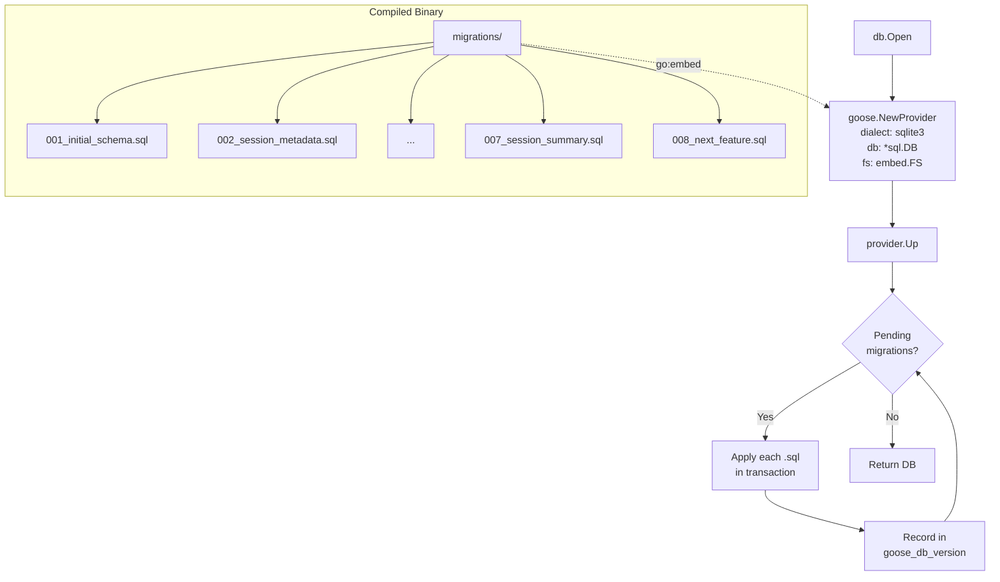

# ADR-0021: Adopt pressly/goose for SQLite Schema Migrations

## Context and Problem Statement

Claude Ops uses a hand-rolled migration framework in `internal/db/db.go` that defines migrations as inline Go functions (`migrate001` through `migrate007`). While functional, this approach lacks rollback support, embeds SQL schema definitions inside Go code (making them harder to review and maintain), and requires writing boilerplate for every new migration. As the schema grows, a dedicated migration library would provide better developer ergonomics, down-migration support, and standard tooling.

## Decision Drivers

* Must support SQLite via `modernc.org/sqlite` (pure-Go, no CGo)
* Simple and lightweight -- not over-engineered for a single-database project
* Well-maintained with active commits and responsive maintainers
* Supports SQL file-based migrations (separate `.sql` files, not inline Go code)
* Supports both up and down migrations for safe rollbacks
* Embeddable in a Go binary (migrations compiled in via `//go:embed`)
* Compatible with running migrations on application startup (current `db.Open()` pattern)

## Considered Options

* **Option 1: pressly/goose v3** -- Go migration library and CLI with SQL and Go migration support
* **Option 2: golang-migrate/migrate v4** -- Popular file-based migration library and CLI
* **Option 3: amacneil/dbmate** -- Lightweight, language-agnostic CLI migration tool
* **Option 4: rubenv/sql-migrate** -- Embeddable Go migration library
* **Option 5: Keep the current hand-rolled system**

## Decision Outcome

Chosen option: "pressly/goose v3", because it provides the best balance of simplicity, active maintenance, native Go embedding via its Provider API, and full compatibility with `modernc.org/sqlite` through standard `database/sql` interfaces. It supports both SQL file-based and Go function migrations, has first-class `//go:embed` support, and its `goose.NewProvider()` API is designed for programmatic use on startup -- matching our existing `db.Open()` pattern exactly.

### Consequences

* Good, because migrations move from inline Go code to standalone `.sql` files that are easier to review, diff, and reason about
* Good, because down migrations become possible, enabling safe rollbacks during development
* Good, because `//go:embed` support compiles migrations into the binary with zero runtime file dependencies
* Good, because the Provider API allows running migrations programmatically on startup without a CLI
* Good, because goose uses standard `database/sql` interfaces, so `modernc.org/sqlite` works without any adapter code
* Good, because goose is actively maintained (v3.26.0, 7.3k+ stars, regular releases)
* Bad, because adopting goose adds a new dependency to the project
* Neutral, because existing migrations (001-007) need to be converted to `.sql` files, but since no other users depend on this database, we can start fresh with goose

### Confirmation

Compliance will be confirmed by:

1. All existing tests in `internal/db/` pass after the migration
2. A fresh database created with goose produces the same schema as the current system
3. The `db.Open()` function continues to run migrations automatically on startup
4. The goose CLI can independently verify migration status (`goose status`)

## Pros and Cons of the Options

### pressly/goose v3

[pressly/goose](https://github.com/pressly/goose) is a database migration tool for Go that supports both SQL file-based and Go function-based migrations. It works as both a CLI and an embeddable library. Version 3.26.0 was released in late 2025, and the project has 7.3k+ GitHub stars.

* Good, because it has a modern Provider API (`goose.NewProvider()`) designed for programmatic use
* Good, because it supports `//go:embed` natively via `fs.FS` parameter in the Provider API
* Good, because it uses standard `database/sql` interfaces -- works with any SQLite driver including `modernc.org/sqlite`
* Good, because it supports both SQL and Go migrations, providing flexibility for complex data migrations
* Good, because it has sequential and timestamped versioning options
* Good, because it supports transactional migrations (each migration runs in a transaction)
* Good, because it is actively maintained with regular releases and 7.3k+ stars
* Good, because the CLI is useful for development (creating new migrations, checking status)
* Bad, because it adds a dependency (~3k lines of library code)
* Neutral, because switching from `schema_migrations` to goose's `goose_db_version` table is trivial since the database can be rebuilt from scratch

### golang-migrate/migrate v4

[golang-migrate/migrate](https://github.com/golang-migrate/migrate) is the most popular Go migration library with 18k+ GitHub stars. It supports file-based SQL migrations and has drivers for many databases. Version 4.19.1 was released in November 2025.

* Good, because it is the most popular Go migration library (18k+ stars)
* Good, because it has a dedicated `sqlite` driver that uses `modernc.org/sqlite`
* Good, because it supports `//go:embed` via the `iofs` source package
* Good, because it supports up and down migrations
* Good, because it has a large ecosystem and community
* Bad, because its API is more complex -- requires separate source and database driver instances wired together
* Bad, because the driver model is heavier than needed for a single-database project
* Bad, because it does not support Go function-based migrations (SQL only)
* Bad, because creating a new migration requires manually creating paired up/down files with sequential numbering
* Neutral, because its popularity means more community resources but also a broader surface area

### amacneil/dbmate

[amacneil/dbmate](https://github.com/amacneil/dbmate) is a lightweight, language-agnostic database migration tool primarily designed as a CLI. It supports SQLite, PostgreSQL, MySQL, and ClickHouse. It has 6.7k GitHub stars and version 2.29.3 was released in January 2025.

* Good, because it is simple and lightweight with minimal configuration
* Good, because it supports SQLite and up/down SQL migrations
* Good, because it can be embedded as a Go library
* Good, because it uses timestamp-based versioning to avoid conflicts
* Bad, because it is primarily designed as a CLI tool -- library usage is secondary
* Bad, because the Go library API is less documented and less ergonomic than goose or golang-migrate
* Bad, because it uses URL-based database configuration (`sqlite:///path/to/db`) rather than accepting a `*sql.DB` directly
* Bad, because its SQLite driver uses CGo-based `mattn/go-sqlite3` by default -- `modernc.org/sqlite` compatibility is unclear

### rubenv/sql-migrate

[rubenv/sql-migrate](https://github.com/rubenv/sql-migrate) is an embeddable SQL migration library for Go. It has 3.3k GitHub stars and was last updated in December 2024.

* Good, because it is designed to be embedded in Go applications
* Good, because it supports up and down SQL migrations
* Good, because it has a simple API that works with `*sql.DB`
* Bad, because it has fewer stars and less community activity (3.3k stars)
* Bad, because it depends on `rubenv/sql-migrate`'s custom dialect system which may not align with `modernc.org/sqlite`
* Bad, because it has not had a release since late 2024 -- maintenance may be slowing
* Bad, because it uses `go-gorp` internally for SQL execution, adding an indirect dependency
* Bad, because its embedding approach predates `//go:embed` and relies on `http.FileSystem` adapters

### Keep the current hand-rolled system

Continue using the custom migration framework in `internal/db/db.go` with inline Go function migrations.

* Good, because it has zero additional dependencies
* Good, because it is already working and well-understood
* Good, because it runs on startup exactly as needed
* Bad, because it lacks down/rollback migration support
* Bad, because migrations are inline Go code, making SQL schema changes harder to review
* Bad, because every new migration requires boilerplate (new function, add to slice, match version number)
* Bad, because there is no CLI tooling for creating new migrations or checking status
* Bad, because it is a custom system that new contributors must learn

## Architecture Diagram

## More Information

* [pressly/goose GitHub repository](https://github.com/pressly/goose)
* [goose Provider API documentation](https://pressly.github.io/goose/documentation/provider/)
* [goose embedded migrations blog post](https://pressly.github.io/goose/blog/2021/embed-sql-migrations/)
* [modernc.org/sqlite -- pure-Go SQLite driver](https://pkg.go.dev/modernc.org/sqlite)
* Related: ADR-0008 (Go + HTMX Web Dashboard) established the Go + SQLite stack
