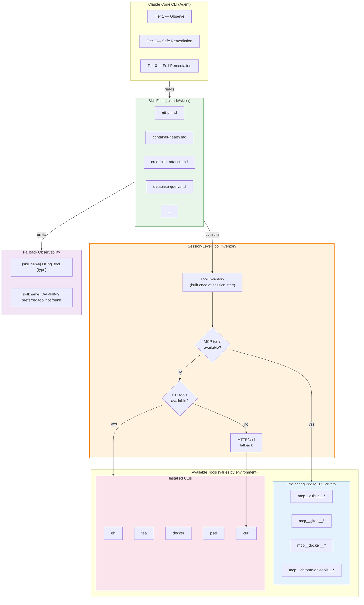
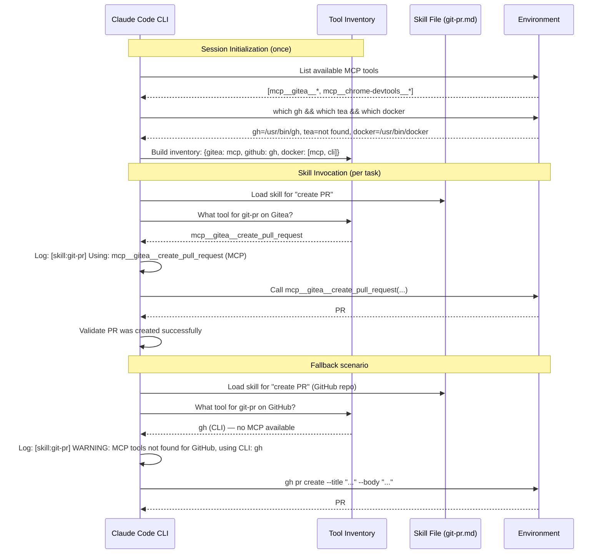

# ADR-0022: Skills-Based Tool Orchestration

## Context and Problem Statement

Claude Ops currently uses two mechanisms to give the AI agent access to infrastructure tools:

1. **Baseline npx-based MCP servers** (ADR-0006): Docker MCP, PostgreSQL MCP, Chrome DevTools MCP, and Fetch MCP are configured in `.claude/mcp.json` and spawned as stdio subprocesses via `npx -y`. These provide typed tool schemas for container management, database queries, browser automation, and HTTP requests.

2. **Custom `claudeops mcp-server` Go subcommand** (ADR-0019): A JSON-RPC stdio server built into the `claudeops` binary that wraps the `internal/gitprovider` package, exposing `create_pr`, `list_prs`, and `get_pr_status` as MCP tools with server-side tier enforcement and scope validation.

This architecture has served the project, but it has accumulated significant costs:

**Custom MCP code is expensive to build and maintain.** The `claudeops mcp-server` subcommand required implementing JSON-RPC protocol handling, MCP tool discovery, parameter schema definitions, and tool dispatch — all to wrap three functions that `gh pr create`, `gh pr list`, and `gh pr view` already provide. Every new infrastructure integration requires writing Go code, adding tests, updating the binary, and rebuilding the Docker image.

**The npx-based MCP servers create runtime fragility.** They depend on npm registry availability at startup. If the registry is slow, unreachable, or a package version is yanked, the agent cannot function. Version pinning helps but adds manual update management. The Chrome DevTools MCP additionally requires a browser sidecar container.

**The environment already has tools.** The Docker container and host systems already have CLIs installed: `docker`, `psql`, `curl`, `gh` (GitHub CLI), `tea` (Gitea CLI), and others. Users may also pre-configure MCP servers in their Claude Code settings (e.g., `mcp__github__*`, `mcp__gitea__*`, `mcp__docker__*`). The current architecture ignores these existing tools and instead builds parallel access paths through custom code.

**Claude is capable of adaptive tool discovery.** Given well-crafted instructions, Claude can determine what tools are available in its environment (by checking for CLIs, listing available MCP tools, or testing capabilities) and use whatever it finds. A markdown skill file that says "to create a PR, first check if `mcp__gitea__create_pull_request` is available, then try `gh pr create`, then try `tea pr create`" achieves the same outcome as a custom MCP server — without any Go code.

The question is: **Should Claude Ops continue building custom MCP servers and maintaining npx-based MCP configurations, or should it replace them with skill files that adaptively discover and use whatever tools are available in the environment?**

## Decision Drivers

* **Elimination of custom infrastructure code** — Claude Ops is designed as a "no application code" system (markdown runbooks executed by the CLI). Custom MCP servers contradict this principle by introducing Go code that must be compiled, tested, and maintained.
* **Runtime resilience** — The agent should not depend on npm registry availability, specific package versions, or sidecar containers to access infrastructure. Tools that are already installed in the environment are more reliable than tools that must be fetched at runtime.
* **Adaptive tool discovery** — The agent operates in diverse environments where different tools may be available. Rather than requiring specific MCPs or CLIs, the agent should discover what's available and adapt.
* **Reduced maintenance surface** — Every MCP server is code that must be kept in sync with upstream APIs, tested, and updated. Skill files are markdown documents that describe procedures — they are trivially reviewable, versionable, and modifiable without compilation.
* **Alignment with Claude's strengths** — Claude excels at reading instructions, reasoning about available tools, and executing multi-step procedures. Skill files leverage this capability directly rather than constraining it behind rigid MCP tool schemas.
* **Honest security posture** — The approach must acknowledge what enforcement guarantees are lost and what mitigations exist, rather than claiming equivalent safety through different means.

## Considered Options

1. **Skills-based adaptive tool orchestration** — Replace MCP server configurations and custom Go code with markdown skill files that discover available tools at runtime and use them adaptively.
2. **Maintain current MCP server architecture** — Continue with npx-based baseline MCPs (ADR-0006) and custom `claudeops mcp-server` (ADR-0019).
3. **Skills with mandatory tool prerequisites** — Use skill files but require specific CLIs or MCPs to be present (fail if a required tool is missing, rather than adapting).
4. **Direct CLI-only orchestration** — Remove all MCP configurations and have the agent use only CLI tools (docker, gh, psql, curl) via the Bash tool, without adaptive fallback to MCPs.

## Decision Outcome

Chosen option: **"Skills-based adaptive tool orchestration"**, because it eliminates custom MCP code while making the agent more resilient through adaptive tool discovery, aligns with Claude Ops' "no application code" architecture, and leverages Claude's inherent ability to reason about available tools and execute multi-step procedures from natural language instructions.

This decision accepts specific trade-offs in enforcement guarantees (detailed below) in exchange for architectural simplicity and operational resilience.

### How It Works

Each skill is a markdown file in `.claude/skills/` (or `.claude-ops/skills/` in mounted repos) that describes:

1. **What the skill does** — The capability it provides (e.g., "create a pull request", "check container health", "rotate credentials").
2. **Tool discovery procedure** — How to determine what tools are available. This follows a priority order:
   - Check for MCP tools first (e.g., `mcp__gitea__create_pull_request`) — these provide the richest, most structured interface
   - Fall back to CLIs (e.g., `gh pr create`, `tea pr create`) — widely available, well-documented
   - Fall back to raw HTTP/curl as a last resort — universally available but requires constructing requests manually
3. **Execution procedure** — Step-by-step instructions for accomplishing the task using whichever tool was discovered.
4. **Validation** — How to verify the action succeeded.

#### Session-Level Tool Inventory

To avoid the cost of re-discovering tools on every skill invocation, the agent MUST perform tool discovery once at session start and build a **tool inventory** — a mapping of capabilities to available tools. Skills then reference this inventory rather than probing the environment each time.

The tool inventory is built during session initialization:
- Enumerate available MCP tools (these are known from the Claude Code tool listing)
- Check for installed CLIs (`which gh`, `which tea`, `which docker`, etc.)
- Record the results for the session's lifetime

This amortizes the discovery cost across all skill invocations in a session rather than paying it on every call. On Tier 1 (Haiku), where cost and speed are priorities, this is essential.

#### Fallback Observability

When a skill falls through from a preferred tool to a fallback, the agent MUST report this. Specifically:
- **Log which tool path was selected**: e.g., "[skill:git-pr] Using: gh (CLI)"
- **Warn on fallback**: e.g., "[skill:git-pr] WARNING: MCP tools not found, falling back to CLI: gh"
- **Error on total failure**: e.g., "[skill:git-pr] ERROR: No suitable tool found for PR creation"

This prevents silent degradation — the scenario where an operator configures `mcp__gitea__*` but a misconfiguration causes the skill to silently fall through to `tea` with different authentication context. Operators must be able to detect unintentional tool path changes.

### Enforcement Guarantees Lost

This decision explicitly trades server-side code enforcement for prompt-based instruction enforcement. The following guarantees change from "programmatically enforced" to "instructed via skill markdown":

| Guarantee | Before (MCP server) | After (Skill) | Risk Level |
|-----------|---------------------|----------------|------------|
| **Tier validation** | `gitprovider.ValidateTier()` in Go — Tier 1 agents are programmatically rejected from `create_pr` | Skill instructions say "only Tier 2+ agents should create PRs" — model compliance is probabilistic | **High** — safety-critical |
| **Scope validation** | `gitprovider.ValidateScope()` in Go — PRs modifying denied paths (inventory files, network configs) are rejected regardless of agent intent | Skill instructions say "do not modify ie.yaml or network configs" — agent may reason around this under pressure | **High** — safety-critical |
| **Duplicate PR detection** | Go code checks existing PRs before creating new ones | Skill instructs agent to list PRs first and check for duplicates — agent may skip this step | **Medium** — operational |
| **Branch naming conventions** | Go code enforces `claude-ops/<type>/<name>` pattern | Skill documents the convention and instructs compliance | **Low** — cosmetic |
| **Token isolation** | Tokens passed to MCP server subprocess env, not the agent's env | Tokens available in the agent's Bash environment for CLI use | **Low** — ADR-0019 acknowledged isolation was never absolute |

**This is a security regression for tier and scope enforcement.** ADR-0003 itself states that prompt-based enforcement is "not a security boundary" and "relies on model compliance for semantic restrictions." The `--allowedTools` CLI flag remains as a hard technical boundary at the tool level (e.g., Tier 1 cannot invoke `Write` or `Edit`), but within the `Bash` tool, the distinction between "allowed docker restart" and "disallowed Ansible playbook" is prompt-enforced, not code-enforced.

**Compensating controls** (future work, not part of this ADR):
- Wrapper scripts that gate CLI access based on `CLAUDEOPS_TIER` (e.g., a `gh` wrapper that refuses PR creation for Tier 1)
- Shell-level restrictions via `rbash` or custom PATH manipulation per tier
- Post-hoc audit tooling that flags when an agent takes actions outside its tier's skill permissions

A follow-up ADR should be created to evaluate and select compensating controls before the MCP server code is removed, to ensure the security regression is addressed concurrently rather than deferred indefinitely.

### Testing Strategy

Skills introduce a fallback matrix that must be tested. For a single skill like `create-pr`, there may be 4-6 tool paths (MCP Gitea, MCP GitHub, `gh` CLI, `tea` CLI, curl-to-GitHub, curl-to-Gitea). The testing approach:

1. **Representative environment matrix**: Each skill must be tested in at least three environment configurations:
   - MCP-only (relevant MCP servers configured, CLIs absent)
   - CLI-only (CLIs installed, no MCP servers)
   - Mixed (both available — verifies the preference order works correctly)

2. **Skill-specific acceptance tests**: Each tool path in a skill gets an acceptance test that validates:
   - Tool discovery correctly identifies the available tool
   - The skill executes the correct commands/calls for that tool path
   - The validation step confirms success

3. **Dry-run mode**: Skills must respect `CLAUDEOPS_DRY_RUN`. When dry-run is true, skills log what they would do without executing. This enables testing the discovery and selection logic without side effects.

4. **Fallback path testing**: Specifically test the degradation path by artificially removing preferred tools and verifying the skill falls through correctly with appropriate warnings.

This replaces the Go unit tests that verified MCP tool schemas and parameter validation. The trade-off is that skill testing is integration-level (slower, more expensive) rather than unit-level (fast, cheap).

### Consequences

**Positive:**

* **Eliminates all custom MCP Go code.** The `claudeops mcp-server` subcommand, its JSON-RPC implementation, MCP tool schemas, and tool handlers are no longer needed. The `internal/gitprovider` package can be removed.
* **Removes npm registry dependency.** The agent no longer needs to fetch MCP server packages at startup via `npx -y`. If CLIs are installed in the container, they are available immediately with no network dependency.
* **Adapts to the user's environment.** If a user has `mcp__github__*` tools configured, the skill uses those. If they only have `gh` installed, it uses that. The agent works in more environments without configuration changes.
* **Trivially maintainable.** Skills are markdown files. Any operator can read, review, and modify them without understanding Go, JSON-RPC, or MCP protocol internals.
* **Aligns with "no application code" architecture.** Claude Ops is designed as markdown runbooks executed by the CLI. Skills are markdown. Custom MCP servers are compiled Go.
* **Mounted repos benefit identically.** Repos can provide `.claude-ops/skills/` directories with custom skills, following the same pattern as checks and playbooks.
* **Ecosystem-proof.** When upstream CLIs or MCP servers improve, skills automatically benefit because they discover and use whatever is available.

**Negative:**

* **Security regression for tier and scope enforcement.** Server-side validation (`ValidateTier`, `ValidateScope`) is replaced by prompt-level instructions. ADR-0003 acknowledges prompt enforcement is not a security boundary. This is the most significant trade-off of this decision. See the "Enforcement Guarantees Lost" table for specifics.
* **Silent degradation risk.** Without the fallback observability requirement, a skill could silently fall through from a preferred tool to a worse fallback. The observability requirement mitigates but does not eliminate this risk — it depends on the skill being correctly written.
* **Loss of typed tool schemas for custom operations.** MCP tools expose JSON Schema-defined parameters; skills use natural language instructions. Third-party MCP schemas remain available when configured.
* **Nondeterministic tool selection across environments.** The same skill may execute via different code paths in different environments, complicating debugging. Session-level tool inventory logging mitigates this by making the selected path visible.
* **Integration-level testing replaces unit-level testing.** Skill testing requires representative environments rather than fast unit tests. The feedback cycle is slower and testing infrastructure is more complex.
* **Discovery cost.** Even with session-level caching, the initial tool inventory build adds latency and token cost to session startup. This is paid once per session rather than per skill invocation.

## Pros and Cons of the Options

### Skills-Based Adaptive Tool Orchestration

Replace MCP configurations and custom Go code with markdown skill files. Skills discover available tools (MCPs, CLIs, HTTP) at runtime and use them adaptively, preferring richer interfaces when available.

* Good, because it eliminates hundreds of lines of custom Go code (JSON-RPC, MCP protocol, tool handlers) and replaces them with reviewable markdown.
* Good, because it removes the runtime dependency on npm registry availability for npx-based MCP server installation.
* Good, because it adapts to whatever tools the user has configured — MCP tools, CLIs, or both — without requiring a specific setup.
* Good, because it aligns with Claude Ops' "no application code" architecture where everything is markdown runbooks.
* Good, because adding a new capability is writing a markdown file rather than implementing a Go server, writing tests, and rebuilding the Docker image.
* Good, because mounted repos can provide custom skills in `.claude-ops/skills/` following the same pattern as checks and playbooks.
* Good, because it automatically benefits from upstream improvements to CLIs and MCP servers without code changes.
* Bad, because it is a security regression: tier and scope enforcement move from programmatic code to prompt instructions, which ADR-0003 acknowledges are "not a security boundary."
* Bad, because silent degradation is possible when skills fall through from preferred tools to fallbacks without operator awareness.
* Bad, because different tool paths in different environments introduce nondeterminism that complicates debugging.
* Bad, because testing the full fallback matrix requires integration-level tests in representative environments, which are slower and more expensive than unit tests.
* Bad, because skill quality depends on careful markdown authoring with no automated validation (no compiler, no schema validator).

### Maintain Current MCP Server Architecture

Continue with npx-based baseline MCPs (ADR-0006) and extend the custom `claudeops mcp-server` for new integrations (ADR-0019).

* Good, because MCP tool schemas provide formal type definitions that Claude can reason about with high reliability.
* Good, because server-side tier enforcement (`ValidateTier`) and scope validation (`ValidateScope`) provide programmatic safety guarantees beyond prompt-level controls.
* Good, because the architecture is already implemented and working.
* Good, because MCP is an Anthropic-backed standard with growing ecosystem support.
* Good, because token isolation (defense-in-depth) keeps tokens out of the agent's normal workflow.
* Bad, because custom MCP code contradicts Claude Ops' "no application code" design principle.
* Bad, because npx-based MCPs depend on npm registry availability at startup, creating fragility for the infrastructure monitoring tool itself.
* Bad, because every new integration requires Go code, tests, binary rebuilds, and Docker image updates.
* Bad, because two access paths (MCP + REST) must be maintained for the same functionality.
* Bad, because the custom MCP server duplicates capabilities already available via installed CLIs (`gh`, `tea`, `docker`).

### Skills with Mandatory Tool Prerequisites

Use skill files but require specific tools to be present. Each skill declares its required CLIs/MCPs and fails with a clear error if they are missing, rather than adapting.

* Good, because each skill has a deterministic execution path — if `gh` is required, it always uses `gh`.
* Good, because debugging is simpler — there is one code path per skill, not a discovery-based fallback chain.
* Good, because it still eliminates custom MCP code and aligns with the markdown-first architecture.
* Good, because skill prerequisites can be validated at startup rather than discovered at runtime.
* Bad, because it reduces portability — a skill that requires `gh` fails in a Gitea-only environment, even though `tea` could accomplish the same task.
* Bad, because it couples skills to specific tool implementations rather than capabilities, reintroducing the rigidity that skills are meant to eliminate.
* Bad, because tool availability varies across environments (dev machines, CI containers, production Docker images), making prerequisite satisfaction unpredictable.
* Bad, because it requires maintaining multiple variant skill files for the same capability or accepting that some environments cannot use certain skills.

### Direct CLI-Only Orchestration

Remove all MCP configurations. The agent uses only CLI tools (docker, gh, psql, curl) via the Bash tool for all infrastructure interactions.

* Good, because CLI commands are universally understood, transparent, and easy to debug.
* Good, because it eliminates all MCP-related complexity: no npx installs, no MCP protocol, no JSON-RPC, no tool schemas.
* Good, because CLIs are stable, well-documented, and maintained by their respective projects.
* Good, because there is zero abstraction layer between the agent and the infrastructure.
* Bad, because it discards the benefits of MCP tools that users may have already configured.
* Bad, because the agent must construct correct CLI commands from memory, including flags, quoting, escaping, and output parsing.
* Bad, because some operations are better suited to MCP tools (e.g., browser automation via Chrome DevTools MCP has no good CLI equivalent).
* Bad, because it is not adaptive — it ignores available MCP tools even when they would provide a better experience.

## Architecture Diagram

## More Information

* **Supersedes ADR-0006** (Use MCP Servers as Primary Infrastructure Access Layer): ADR-0006 chose npx-based MCP servers as the primary way Claude Ops accesses infrastructure. This ADR replaces that approach with adaptive skill files that can use MCP servers *when available* but do not depend on them.
* **Supersedes ADR-0019** (MCP Server for Git Provider Interface): ADR-0019 chose a custom `claudeops mcp-server` Go subcommand for PR operations. This ADR replaces that custom code with a skill file that adaptively uses `mcp__gitea__*`, `gh`, `tea`, or `curl` — whichever is available.
* **ADR-0003** (Prompt-Based Permission Enforcement): Establishes that prompt-based enforcement is "not a security boundary" and "relies on model compliance for semantic restrictions." This ADR extends that posture to tier and scope enforcement for skills, which were previously code-enforced in the MCP server. The `--allowedTools` hard boundary remains unchanged.
* **ADR-0010** (Claude Code CLI Subprocess): Establishes the CLI subprocess as the invocation mechanism. The CLI's native support for `.claude/skills/` directories and mounted repo extension (`.claude-ops/`) provides the runtime mechanism through which skills are loaded and executed.
* **ADR-0018** (PR-Based Config Changes): The scope validation and tier enforcement previously implemented in `internal/gitprovider` move from code to skill instructions. The denied paths list from `ValidateScope` (inventory files, network configs, secrets) MUST be documented in the git-pr skill file itself, so the agent has the denied paths available in context when executing the skill. A shared "scope-rules" skill or configuration file may be extracted if multiple skills need the same denied paths.
* **Environment variables**: `GITHUB_TOKEN`, `GITEA_URL`, `GITEA_TOKEN` are available in the agent's environment for CLI tools that need them. `CLAUDEOPS_TIER` remains set by the session manager. `CLAUDEOPS_DRY_RUN` is enforced by skill instructions rather than server-side code.
