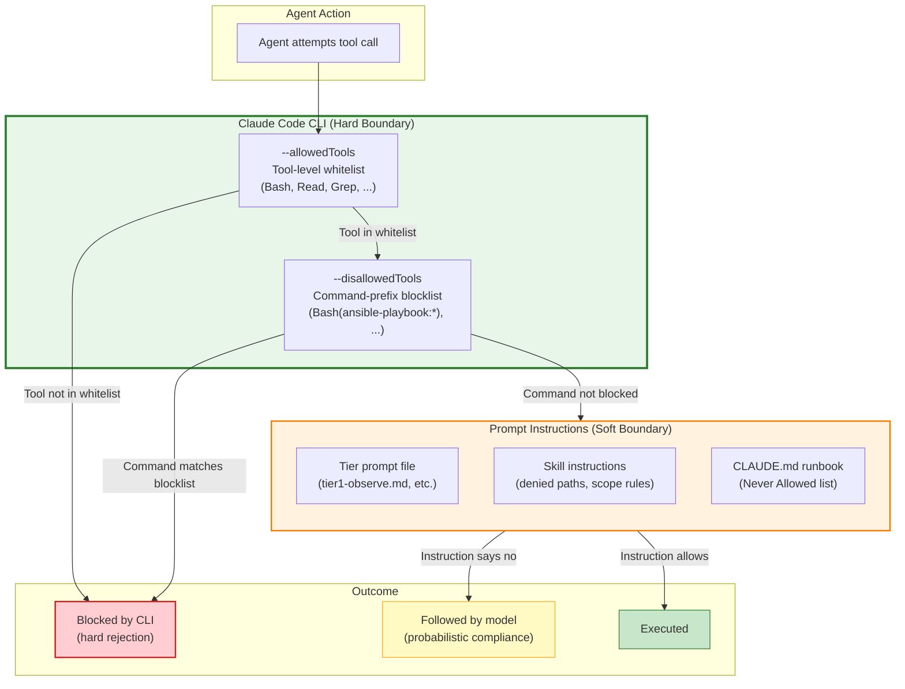

# ADR-0023: AllowedTools-Based Tier Enforcement

## Context and Problem Statement

ADR-0022 (Skills-Based Tool Orchestration) decided to replace custom MCP server code and npx-based MCP configurations with markdown skill files that adaptively discover and use available tools. This decision explicitly acknowledged a security regression: tier enforcement moved from programmatic Go code (`gitprovider.ValidateTier()`, `gitprovider.ValidateScope()`) to prompt-level instructions in skill files.

ADR-0022's "Enforcement Guarantees Lost" table identified two **high-risk** regressions:

| Guarantee | Before (MCP server) | After (Skill) |
|-----------|---------------------|----------------|
| **Tier validation** | `ValidateTier()` in Go — programmatic rejection | Skill instructions — model compliance is probabilistic |
| **Scope validation** | `ValidateScope()` in Go — path-based rejection | Skill instructions — agent may reason around restrictions |

ADR-0022 required a follow-up ADR to "evaluate and select compensating controls before the MCP server code is removed." This is that ADR.

The Claude Code CLI already provides two mechanisms for tool-level enforcement:

1. **`--allowedTools`** — a whitelist of tools the agent may invoke (already used in `entrypoint.sh` for Tier 1: `Bash,Read,Grep,Glob,Task,WebFetch`)
2. **`--disallowedTools`** — a blocklist of tool invocation patterns the agent is forbidden from using, supporting prefix-based matching with glob patterns (e.g., `Bash(docker rm:*)` blocks any Bash invocation starting with `docker rm`)

The question is: **How should Claude Ops use these CLI-level controls to restore tier enforcement guarantees lost in ADR-0022's move to skills-based orchestration?**

## Decision Drivers

* **Restore enforcement at the CLI boundary** — The `--allowedTools`/`--disallowedTools` flags are enforced by the Claude Code CLI binary before tool execution, not by prompt instructions. This is a hard technical boundary that the model cannot bypass through reasoning or prompt injection.
* **Minimize architectural change** — The entrypoint already passes `--allowedTools`. Extending it with `--disallowedTools` patterns requires changing one shell variable per tier, not rebuilding infrastructure.
* **Honest about limitations** — `--disallowedTools` matches command prefixes, not arguments. It can block `gh pr create` but cannot distinguish between `gh pr create` with safe files vs. `gh pr create` modifying `ie.yaml`. Scope validation (which files are modified) remains prompt-enforced.
* **Composable with existing layers** — This adds a third enforcement layer (CLI tool blocking) alongside the existing two (tool-level allowlisting and prompt instructions) without replacing either.
* **Compatibility with skill fallback chains** — When a skill's preferred tool is blocked by `--disallowedTools`, the skill should fall through to the next available tool in its discovery order. If all paths for a capability are blocked, the skill correctly reports "no suitable tool found" — which is the desired behavior for a tier that shouldn't have that capability.

## Considered Options

1. **`--allowedTools`/`--disallowedTools` Bash command patterns per tier** — Extend the entrypoint to pass tier-specific `--disallowedTools` patterns that block dangerous CLI commands at the CLI boundary.
2. **Wrapper scripts that gate CLI access based on `CLAUDEOPS_TIER`** — Replace direct CLI invocations with wrapper scripts (e.g., a `gh` wrapper that checks `$CLAUDEOPS_TIER` and refuses PR creation for Tier 1).
3. **Post-hoc audit tooling** — Run a post-execution audit that scans agent logs for tier violations and alerts/reverts.
4. **No compensating controls** — Accept prompt-only enforcement and rely on model compliance for all tier restrictions.

## Decision Outcome

Chosen option: **"`--allowedTools`/`--disallowedTools` Bash command patterns per tier"**, because it restores enforcement at the CLI boundary for the highest-risk tier violations (Tier 1 creating PRs, Tier 1/2 running Ansible) without introducing new infrastructure components, wrapper scripts, or post-hoc tooling. It leverages a mechanism the project already depends on (`--allowedTools`) and extends it with the complementary `--disallowedTools` flag.

### Concrete Patterns Per Tier

The entrypoint already sets `ALLOWED_TOOLS` per tier. This ADR adds a `DISALLOWED_TOOLS` variable with tier-specific patterns:

#### Tier 1 — Observe Only

**Allowed tools** (unchanged): `Bash,Read,Grep,Glob,Task,WebFetch`

**Disallowed tool patterns** (new):
```
Bash(docker restart:*)
Bash(docker stop:*)
Bash(docker start:*)
Bash(docker rm:*)
Bash(docker compose:*)
Bash(ansible:*)
Bash(ansible-playbook:*)
Bash(helm:*)
Bash(gh pr create:*)
Bash(gh pr merge:*)
Bash(tea pr create:*)
Bash(git push:*)
Bash(git commit:*)
Bash(systemctl restart:*)
Bash(systemctl stop:*)
Bash(systemctl start:*)
Bash(apprise:*)
```

**Rationale**: Tier 1 is observe-only. It should read files, run health checks (`curl`, `dig`, `ssh <host> docker ps`), and write handoff files. It must not restart containers, create PRs, run playbooks, send notifications, or modify any infrastructure. SSH read commands (`ssh <host> docker logs`, `ssh <host> docker stats`) are permitted because they don't match these patterns — the patterns match the local command prefix, not the remote command inside an SSH session. Notifications are sent by Tier 2+ agents after remediation, not by Tier 1 during observation.

> **Note on SSH**: `Bash(ssh:*)` is intentionally NOT blocked for Tier 1. Tier 1 needs SSH to check container state on remote hosts. The `--disallowedTools` pattern `Bash(docker restart:*)` blocks *local* `docker restart` commands. A command like `ssh root@ie01 docker restart jellyfin` matches `Bash(ssh:*)`, not `Bash(docker restart:*)`. Remote command restriction within SSH sessions remains prompt-enforced. This is an accepted limitation — see "What Remains Prompt-Enforced" below.

#### Tier 2 — Safe Remediation

**Allowed tools** (unchanged): `Bash,Read,Grep,Glob,Task,WebFetch,Write,Edit`

**Disallowed tool patterns** (new):
```
Bash(ansible:*)
Bash(ansible-playbook:*)
Bash(helm:*)
Bash(docker compose down:*)
```

**Rationale**: Tier 2 may restart containers, create PRs, send notifications, and perform safe remediations. It must not run Ansible playbooks, Helm upgrades, or tear down containers with `docker compose down` (which destroys and recreates, unlike `docker compose up -d` which just starts). The `docker restart`, `docker compose up -d`, `gh pr create`, and `apprise` commands are permitted at this tier.

#### Tier 3 — Full Remediation

**Allowed tools**: `Bash,Read,Grep,Glob,Task,WebFetch,Write,Edit`

**Disallowed tool patterns** (new):
```
Bash(rm -rf /:*)
Bash(docker system prune:*)
Bash(git push --force:*)
```

**Rationale**: Tier 3 has full remediation capabilities including Ansible and Helm. The only blocked patterns are catastrophic operations from the "Never Allowed" list. Most "Never Allowed" items (delete volumes, modify secrets, etc.) cannot be expressed as command prefixes and remain prompt-enforced.

### Entrypoint Changes

The `entrypoint.sh` invocation changes from:

```bash
claude \
    --model "${MODEL}" \
    -p "$(cat "${PROMPT_FILE}")" \
    --allowedTools "${ALLOWED_TOOLS}" \
    --append-system-prompt "Environment: ${ENV_CONTEXT}" \
    2>&1 | tee -a "${LOG_FILE}" || true
```

To:

```bash
claude \
    --model "${MODEL}" \
    -p "$(cat "${PROMPT_FILE}")" \
    --allowedTools "${ALLOWED_TOOLS}" \
    --disallowedTools "${DISALLOWED_TOOLS}" \
    --append-system-prompt "Environment: ${ENV_CONTEXT}" \
    2>&1 | tee -a "${LOG_FILE}" || true
```

Where `DISALLOWED_TOOLS` is set from `CLAUDEOPS_DISALLOWED_TOOLS` (with tier-specific defaults).

### Two-Layer Enforcement Model



### What Remains Prompt-Enforced

This ADR explicitly does NOT solve the following — they remain prompt-enforced and are candidates for future ADRs:

1. **Scope validation (which files)** — `--disallowedTools` matches command prefixes, not arguments. `Bash(gh pr create:*)` blocks all PR creation, not just PRs that modify `ie.yaml`. A Tier 2 agent creating a PR is allowed; whether that PR touches forbidden files is prompt-enforced. A future ADR may address this via git server-side hooks (branch protection rules, path-based CODEOWNERS) that reject PRs modifying protected files regardless of who creates them.

2. **Remote command restriction via SSH** — `Bash(ssh:*)` cannot be blocked for any tier because SSH is the primary remote access mechanism. A command like `ssh root@ie01 ansible-playbook ...` is not caught by `Bash(ansible-playbook:*)` because the local command is `ssh`, not `ansible-playbook`. Remote command enforcement within SSH sessions remains prompt-enforced.

3. **"Never Allowed" operations that lack distinct command prefixes** — "Delete persistent data volumes" could be `rm -rf /volumes/`, `docker volume rm`, or many other forms. "Modify passwords" has no single command prefix. These remain prompt-enforced and are additionally mitigated by Docker-level controls (read-only mounts, dropped capabilities).

4. **MCP tool tier restrictions** — If MCP tools are configured (e.g., `mcp__gitea__create_pull_request`), they can be blocked via `--disallowedTools "mcp__gitea__create_pull_request"` at the CLI level. This ADR recommends doing so for Tier 1 but does not mandate a complete MCP tool blocklist, as the available MCP tools vary by environment. Skill files should document which MCP tools are tier-restricted.

5. **Shell indirection evasion** — Commands constructed via `bash -c "ansible-playbook ..."` or `eval "ansible-playbook ..."` evade the `Bash(ansible-playbook:*)` pattern because the local command prefix is `bash -c` or `eval`, not `ansible-playbook`. If this becomes a concern in practice, `Bash(bash -c:*)` and `Bash(eval:*)` can be added to `--disallowedTools` as a future tightening measure, with the trade-off of blocking legitimate uses of those constructs.

### Interaction with Skill Fallback Chains

When `--disallowedTools` blocks a tool that a skill would otherwise use, the skill's adaptive fallback chain handles it naturally:

1. Skill attempts to use `mcp__gitea__create_pull_request` -> blocked by `--disallowedTools` -> tool call rejected
2. Skill falls through to `gh pr create` -> blocked by `--disallowedTools` -> tool call rejected
3. Skill falls through to `tea pr create` -> blocked by `--disallowedTools` -> tool call rejected
4. Skill reports: "[skill:git-pr] ERROR: No suitable tool found for PR creation"

This is the correct behavior for a Tier 1 agent that should not create PRs. The skill does not need to know about tiers — the CLI enforces the restriction, and the skill's fallback chain exhausts all paths before reporting failure.

For Tier 2, where PR creation IS allowed, the same skill successfully uses whichever tool is available — the `--disallowedTools` list for Tier 2 does not include PR creation commands.

### Consequences

**Positive:**

* Restores a hard technical boundary for the highest-risk tier violations: Tier 1 creating PRs, restarting containers, running playbooks, and sending notifications are now blocked at the CLI level, not just instructed against.
* Requires minimal change — one new environment variable and one additional CLI flag in `entrypoint.sh`.
* Composes cleanly with the existing `--allowedTools` whitelist and prompt instructions, adding a third enforcement layer without replacing either.
* Works naturally with ADR-0022's skill fallback chains — blocked tools cause skills to fall through and eventually report "no suitable tool," which is correct behavior.
* The `DISALLOWED_TOOLS` variable can be overridden per deployment via environment variables, allowing operators to customize tier restrictions.
* Does not require any new infrastructure (no wrapper scripts, no proxy services, no audit tooling).

**Negative:**

* `--disallowedTools` patterns match command prefixes, not full commands or arguments. This limits enforcement to "can/cannot use this tool at all" rather than "can use this tool only for certain operations." Scope validation remains prompt-enforced.
* SSH tunneling bypasses all `--disallowedTools` patterns for remote commands. `ssh root@host ansible-playbook` is a `Bash(ssh:*)` call, not `Bash(ansible-playbook:*)`. This is the most significant gap.
* The disallowed patterns are string-based and must be maintained as new CLIs or MCP tools are added. A new tool that provides PR creation capability would need to be added to the Tier 1 blocklist.
* Pattern matching is prefix-based, which can lead to over-blocking. `Bash(docker compose:*)` blocks both `docker compose down` (destructive) and `docker compose ps` (read-only). Tier 1's blocklist accepts this trade-off; Tier 2 only blocks `docker compose down` specifically.
* Model-constructed commands could evade prefix matching through shell indirection (e.g., `bash -c "ansible-playbook ..."`). This is mitigated by the fact that Claude generally constructs straightforward commands, but it is not a guarantee.

## Pros and Cons of the Options

### `--allowedTools`/`--disallowedTools` Bash Command Patterns Per Tier

Extend the entrypoint to pass tier-specific `--disallowedTools` patterns that block dangerous CLI commands at the CLI boundary.

* Good, because it uses an existing CLI mechanism (`--disallowedTools`) that is already enforced at the binary level before tool execution.
* Good, because the entrypoint change is minimal: one new variable, one new flag.
* Good, because it restores a hard boundary for the most critical tier violations (Tier 1 creating PRs, running playbooks, restarting containers).
* Good, because it composes with skill fallback chains — blocked tools cause natural fallback exhaustion.
* Good, because it is operator-configurable via environment variables, allowing deployment-specific customization.
* Good, because it requires no new infrastructure, build steps, or runtime dependencies.
* Bad, because prefix-based matching cannot enforce scope restrictions (which files a PR modifies).
* Bad, because SSH tunneling bypasses all remote command restrictions — `ssh host ansible-playbook` is not caught.
* Bad, because shell indirection (`bash -c "..."`, `eval`, `sh -c`) could theoretically evade prefix matching.
* Bad, because the pattern list must be manually maintained as new tools are introduced.
* Bad, because over-blocking is possible when a single prefix covers both safe and unsafe operations.

### Wrapper Scripts That Gate CLI Access Based on `CLAUDEOPS_TIER`

Replace direct CLI invocations (e.g., `gh`, `ansible-playbook`) with wrapper scripts in the container PATH that check `$CLAUDEOPS_TIER` before executing the real binary.

* Good, because enforcement happens at the shell level — the wrapper can inspect all arguments, not just the command prefix.
* Good, because it can enforce scope restrictions (e.g., a `gh` wrapper that refuses PRs modifying certain files).
* Good, because it catches SSH-tunneled commands if the wrapper is installed on the remote host (though this requires modifying remote hosts).
* Bad, because every gated CLI needs its own wrapper script, increasing maintenance surface.
* Bad, because `$CLAUDEOPS_TIER` must be propagated into every execution context (subshells, SSH sessions, Task subagents), which is fragile.
* Bad, because the agent can bypass wrappers by invoking the underlying binary directly (e.g., `/usr/bin/gh` instead of the wrapper `gh`).
* Bad, because it requires building and testing wrapper scripts, which contradicts the "no application code" principle.
* Bad, because wrapper scripts themselves become a failure surface — a bug in a wrapper could block legitimate operations or allow forbidden ones.

### Post-Hoc Audit Tooling

Run a log analysis tool after each agent cycle that scans for tier violations and sends alerts.

* Good, because it can detect any violation regardless of how the command was constructed (no prefix-matching limitations).
* Good, because it provides a complete audit trail with forensic detail.
* Good, because it does not interfere with agent execution — no risk of over-blocking.
* Bad, because it is reactive, not preventive. By the time the audit runs, the forbidden action has already been executed.
* Bad, because it requires building audit tooling (log parsing, pattern matching, alerting), which is application code.
* Bad, because log parsing is fragile — the agent's output format is not structured, and tool calls may not appear in logs in a parseable format.
* Bad, because it provides no enforcement whatsoever — it only reports violations after the fact.
* Neutral, because it could complement `--disallowedTools` as a secondary detection layer, but does not substitute for preventive controls.

### No Compensating Controls (Accept Prompt-Only Enforcement)

Rely entirely on prompt instructions for tier enforcement. Trust that Claude follows instructions with high reliability and accept the residual risk.

* Good, because it requires zero implementation effort.
* Good, because there is no risk of over-blocking — the model has full flexibility to use any tool appropriately.
* Good, because ADR-0003 already documented this posture and the project has operated with prompt-only enforcement for tool-level semantics since inception.
* Bad, because ADR-0022 explicitly identified this as a security regression that should be addressed before removing MCP code.
* Bad, because it leaves the highest-risk tier violations (Tier 1 creating PRs, running playbooks) entirely dependent on model compliance.
* Bad, because model compliance is probabilistic and varies across model versions, context window sizes, and prompt complexity.
* Bad, because it contradicts the "defense in depth" principle established in ADR-0003, which values multiple enforcement layers.
* Bad, because it means the security posture degrades with each enforcement layer removed (MCP server code) without replacement.

## More Information

* **Resolves ADR-0022 compensating controls requirement**: ADR-0022 required "a follow-up ADR to evaluate and select compensating controls before the MCP server code is removed." This ADR fulfills that requirement by selecting `--disallowedTools` patterns as the compensating control.
* **Additive to ADR-0003**: ADR-0003 established the two-layer model (tool allowlisting + prompt instructions). This ADR adds a third layer (command-prefix blocklisting) within the existing CLI enforcement boundary. ADR-0003's assessment that prompt enforcement is "not a security boundary" remains accurate — `--disallowedTools` moves specific restrictions from prompt to CLI enforcement, but cannot cover all restrictions.
* **Additive to ADR-0022**: ADR-0022's skill files and fallback chains are unchanged. `--disallowedTools` patterns interact with skills by blocking specific tool paths, causing the skill's fallback chain to exhaust and report failure — which is correct behavior for restricted tiers.
* **ADR-0010**: The Claude Code CLI subprocess invocation mechanism (ADR-0010) is where `--disallowedTools` is passed. The entrypoint change is a one-line addition to the existing `claude` invocation.
* **Future work — scope validation**: This ADR explicitly defers scope validation (which files a PR modifies) to a future ADR. Git server-side hooks (branch protection rules, CODEOWNERS with required reviews, pre-receive hooks that reject modifications to protected paths) are the recommended direction, as they provide server-enforced scope restrictions that no client-side control can match.
* **Future work — SSH command restriction**: Remote command enforcement via SSH is the largest gap in this ADR. A future ADR could explore SSH forced commands, restricted shells on remote hosts, or a bastion host with command filtering. These require changes to the monitored infrastructure, not just the Claude Ops container.
