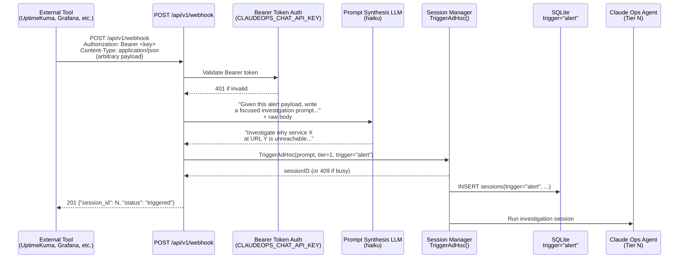

# ADR-0024: Inbound Webhook Alert Ingestion via LLM-Mediated Prompt Synthesis

## Context and Problem Statement

Claude Ops currently only initiates monitoring sessions on a fixed schedule or through a manual web/API trigger. External monitoring tools (UptimeKuma, Grafana Alertmanager, PagerDuty, Healthchecks.io, generic CI pipelines) have no way to push alerts into Claude Ops and invoke a targeted investigation. How should Claude Ops receive arbitrary external alert payloads and translate them into actionable investigation sessions?

## Decision Drivers

* Alert payloads differ radically across tools — UptimeKuma sends `heartbeat`/`monitor` objects, Grafana sends `alerts[]`, PagerDuty sends `messages[]`, others send completely custom JSON. A schema-per-tool approach would require constant maintenance.
* The investigation prompt sent to the agent must be purposeful and focused — not a raw JSON dump. A human writing a manual trigger would describe the problem in plain language; the webhook path should produce the same quality of prompt.
* The existing `TriggerAdHoc(prompt, tier, trigger)` interface is already correct — the problem is only translating an opaque payload into a prompt, not changing how sessions start.
* Audit trail: alert-triggered sessions must be distinguishable from scheduled and manual sessions in the DB and dashboard.
* The endpoint must be safe to expose behind a reverse proxy with only bearer token auth — no complex webhook-source-specific HMAC schemes that vary per integration.

## Considered Options

* **Option A — LLM intermediary (payload → LLM → prompt → session)**: Accept any JSON body, call a small LLM (haiku) with the raw payload and a synthesis prompt, receive a plain-language investigation prompt in return, then call `TriggerAdHoc` with that prompt and `trigger="alert"`.
* **Option B — Pass-through (require caller to provide the prompt)**: Webhook body must include a `prompt` field. The endpoint simply extracts it and calls `TriggerAdHoc`. All prompt crafting is the caller's responsibility.
* **Option C — Per-source template mapping**: Define named schemas per tool (UptimeKuma, Grafana, etc.); route by a `source` query param; extract fields with known paths. New tools require adding a new template.

## Decision Outcome

Chosen option: **Option A — LLM intermediary**, because it handles any payload without per-tool maintenance, produces the same quality of plain-language prompt a human would write, and aligns with Claude Ops' core principle that LLMs should do the interpretation work rather than brittle code.

### Consequences

* Good, because any tool that can POST JSON to an HTTP endpoint works out of the box — no schema registration or source mapping required.
* Good, because the synthesized prompt is idiomatic for Claude Ops investigation sessions — focused, specific, and actionable.
* Good, because adding a new monitoring tool requires zero code changes.
* Good, because the `trigger="alert"` label flows into existing DB, dashboard, and API audit surfaces unchanged.
* Bad, because every webhook incurs a small LLM API call (haiku) before the session starts — adds ~1–2 seconds of latency.
* Bad, because if the LLM synthesis step fails (API error, empty payload), the session cannot be started — the endpoint must return a clear error rather than silently discarding the alert.
* Neutral, because the synthesized prompt quality depends on haiku's interpretation; for highly unusual payloads the prompt may be generic.

### Confirmation

Implementation is confirmed when:
- `POST /api/v1/webhook` exists and is registered in `server.go`
- Requests without a valid `CLAUDEOPS_CHAT_API_KEY` Bearer token return 401
- A UptimeKuma down-alert payload produces a session with a meaningful prompt (verified by integration test or manual curl)
- Sessions triggered via webhook appear in `/sessions` with `trigger = "alert"`
- A 409 is returned (with a descriptive message) when a session is already running

## Pros and Cons of the Options

### Option A — LLM intermediary

The endpoint accepts raw `application/json`, `application/x-www-form-urlencoded`, or plain text bodies. It calls a small, fast LLM (haiku) with a synthesis system prompt instructing it to produce a one-paragraph investigation brief. The result is passed directly to `TriggerAdHoc`. The LLM model is configurable via `CLAUDEOPS_WEBHOOK_MODEL` (defaulting to the same model used for session summaries).

* Good, because zero per-tool configuration — UptimeKuma, Grafana, PagerDuty, custom scripts all work without code changes.
* Good, because prompt quality matches a human-authored manual trigger — the LLM understands "monitor X is down at URL Y" and writes "Investigate why service X at Y is unreachable. Check DNS, HTTP response, and upstream dependencies."
* Good, because the synthesis step is already a solved pattern in the codebase (`summarize.go`, `busy.go`).
* Neutral, because adds ~1–2s latency vs. direct trigger.
* Bad, because synthesis failure (API timeout, empty payload) blocks session start — needs clear error handling and logging.

### Option B — Pass-through (caller provides prompt)

Webhook body is `{"prompt": "...", "tier": 2}`. The endpoint is identical to `POST /api/v1/sessions/trigger` with a different auth check or path.

* Good, because zero latency — no LLM intermediary.
* Good, because deterministic — the caller controls exactly what the agent sees.
* Bad, because every integration must be configured to craft a Claude Ops prompt, which is impractical for tools like UptimeKuma that have fixed webhook formats.
* Bad, because duplicates the existing `POST /api/v1/sessions/trigger` endpoint with only superficial differences.

### Option C — Per-source template mapping

A `source` query param (e.g., `?source=uptimekuma`) selects a Go template that maps known fields to prompt text. New sources require a new template in the codebase.

* Good, because deterministic and fast — no LLM call.
* Good, because easily unit-testable per source.
* Bad, because every new monitoring tool requires a code change and release.
* Bad, because webhook schemas change between tool versions, breaking existing templates.
* Bad, because the maintenance burden grows with every integration, defeating the purpose of a general-purpose agent.

## Architecture Diagram

## More Information

- Relates to ADR-0013 (Manual Ad-Hoc Session Runs) — this adds a third trigger path alongside scheduled and manual.
- Relates to ADR-0020 (OpenAI-Compatible Chat Endpoint) — reuses the same `CLAUDEOPS_CHAT_API_KEY` Bearer token auth pattern.
- The `trigger` column in the `sessions` table already accepts arbitrary strings; adding `"alert"` requires no schema migration.
- The `CLAUDEOPS_WEBHOOK_MODEL` env var should default to `claude-haiku-4-5-20251001` (same default as `CLAUDEOPS_SUMMARY_MODEL`) to keep costs minimal.
- A future enhancement could add an optional `tier` field in the webhook body to allow callers to specify a starting tier (e.g., UptimeKuma sends tier 2 for critical alerts). The LLM synthesis step can also infer severity and suggest a tier if not provided.
- UptimeKuma configuration: Notification type → Webhook, URL → `https://<host>/api/v1/webhook`, Method → POST, Content Type → `application/json`, Headers → `Authorization: Bearer <key>`.
