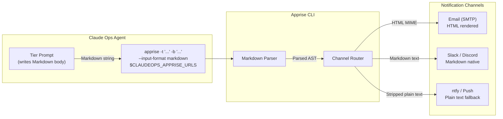

# ADR-0025: Use Markdown Input Format for Apprise Notifications

## Context and Problem Statement

ADR-0004 established Apprise CLI as the universal notification abstraction for Claude Ops. Apprise is invoked directly from shell commands embedded in tier prompts, passing `-t` (title) and `-b` (body) flags. The body is currently plain text, which is readable but loses all structure — tables, headings, bold service names, and status summaries all render as undifferentiated paragraphs in email clients.

The tier prompts already instruct the agent to write structured Markdown output (status tables, `##` section headings, bullet lists, bold/italic emphasis). How should that content be delivered to email recipients?

## Decision Drivers

* **Rich content already exists.** The agent writes Markdown health reports, investigation summaries, and remediation reports. Discarding that structure for delivery is wasteful.
* **Zero application code constraint.** Claude Ops has no compiled application logic. Any formatting solution must work from a CLI flag change in a prompt, not from code.
* **Let tools do the work.** Apprise natively converts Markdown to HTML for email delivery. There is no reason to re-implement this in the agent or in custom tooling.
* **Portability across channels.** Apprise routes the same notification to multiple targets (email, Slack, Discord, ntfy, etc.). The input format must degrade gracefully on channels that do not support rich text.
* **No additional dependencies.** The Docker image already has Apprise installed. The solution should add no new packages or build steps.

## Considered Options

* **Option A: Plain text (status quo)** — Pass `-b` with no `--input-format` flag; Apprise defaults to plain text.
* **Option B: Markdown input, Apprise renders to HTML** — Add `--input-format markdown` (or `-i markdown`) to every Apprise invocation; Apprise converts to HTML for email and plain text for channels that do not support HTML.
* **Option C: Pre-rendered HTML** — The agent generates raw HTML strings and passes `--input-format html`.

## Decision Outcome

Chosen option: **Option B — Markdown input, Apprise renders to HTML**, because it requires a one-flag change to the prompts, adds no dependencies, keeps the agent writing natural Markdown (which it already does), and delegates format conversion entirely to Apprise.

### Consequences

* Good, because email recipients see formatted tables, headings, and status badges instead of wall-of-text.
* Good, because the agent continues to write ordinary Markdown; no prompt logic changes beyond adding `-i markdown` to Apprise calls.
* Good, because Apprise automatically falls back to plain text for channels that do not support HTML (ntfy, SMS, push), so multi-target `CLAUDEOPS_APPRISE_URLS` setups work correctly with a single invocation.
* Good, because no new dependencies, packages, or image rebuild are needed.
* Bad, because Markdown-to-HTML rendering quality depends on Apprise's internal converter; complex Markdown (nested lists, code blocks) may not render perfectly in all email clients.
* Bad, because agents must remember to include `-i markdown` on every Apprise call; omitting it causes HTML tags to be escaped and appear as raw text in email.

### Confirmation

Prompt files (`tier1-observe.md`, `tier2-investigate.md`, `tier3-remediate.md`) are updated so all `apprise` invocations include `--input-format markdown`. Email notifications received during the next monitoring cycle should show rendered tables and headings.

## Pros and Cons of the Options

### Option A: Plain text (status quo)

All content is delivered as a flat string. Markdown syntax (asterisks, pipes, hashes) appears literally in the notification body.

* Good, because it requires no changes to prompts or Apprise invocations.
* Good, because every notification channel handles plain text correctly without any format-negotiation.
* Bad, because health check tables, service status summaries, and investigation reports lose all visual structure.
* Bad, because long plain-text emails are hard to scan quickly, reducing operator response speed.

### Option B: Markdown input, Apprise renders to HTML

`apprise ... --input-format markdown` tells Apprise to treat the body as Markdown. For email targets, Apprise converts it to HTML before sending. For channels that do not support HTML (ntfy, push services), Apprise strips or falls back to plain text automatically.

* Good, because the agent writes Markdown naturally — no new syntax to learn or generate.
* Good, because Apprise handles the Markdown → HTML conversion internally; zero code added to Claude Ops.
* Good, because multi-target URL strings work correctly: the same invocation sends HTML to email and plain text to ntfy.
* Good, because `--input-format markdown` is a single flag addition to existing `apprise` shell commands in the prompts.
* Neutral, because rendering fidelity depends on Apprise's Markdown parser, which covers common GFM (tables, bold, lists) but may not support advanced features.
* Bad, because omitting the flag causes HTML tags to be escaped, which would be a regression. Prompt discipline is required.

### Option C: Pre-rendered HTML

The agent constructs raw HTML strings (`<h2>`, `<table>`, `<strong>`, etc.) and passes `--input-format html`.

* Good, because full HTML control allows pixel-perfect email layout.
* Good, because Apprise passes HTML through directly with no intermediate conversion step.
* Bad, because the agent must generate correct HTML markup, which is significantly harder to produce reliably than Markdown.
* Bad, because HTML string generation in a shell `heredoc` is error-prone: unclosed tags, unescaped characters, and quoting issues are common.
* Bad, because HTML is unreadable in the agent's own stdout log and terminal output, making debugging harder.
* Bad, because channels that do not support HTML (ntfy, push) would receive raw HTML tags rather than a clean fallback.

## Architecture Diagram

## More Information

- **Relates to:** ADR-0004 (Apprise as universal notification abstraction — this ADR extends it with the message format decision)
- **Apprise `--input-format` docs:** [CLI_Usage wiki](https://github.com/caronc/apprise/wiki/CLI_Usage)
- **Issue confirming HTML-escape bug without the flag:** [caronc/apprise#1309](https://github.com/caronc/apprise/issues/1309)
- **Implementation:** Add `-i markdown` to all `apprise` CLI calls in `prompts/tier1-observe.md`, `prompts/tier2-investigate.md`, and `prompts/tier3-remediate.md`.
