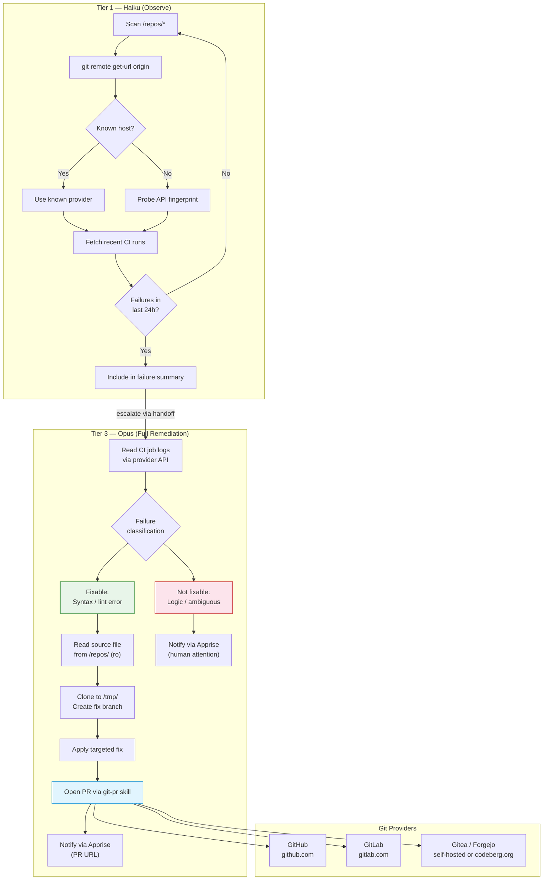
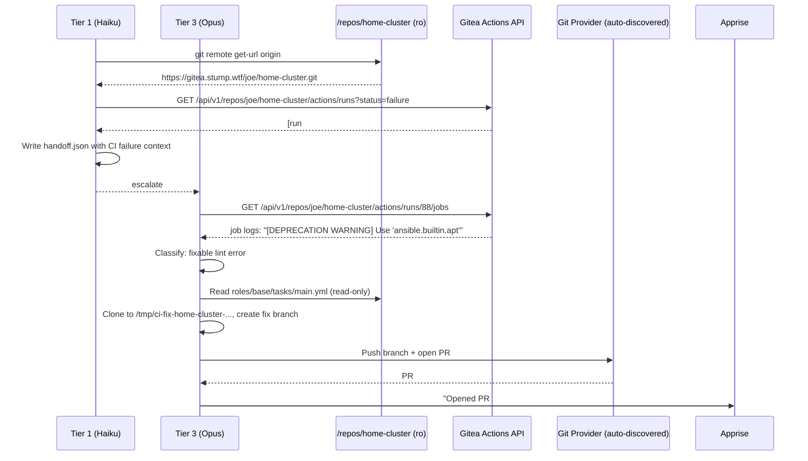

# ADR-0026: CI Pipeline Failure Detection and Self-Correction via Auto-Discovered Git Provider

## Context and Problem Statement

Claude Ops monitors infrastructure services but has no awareness of CI/CD pipeline health on mounted repos. When a Gitea Actions workflow (or equivalent) fails due to an Ansible playbook syntax error, a deprecated task module, or broken YAML, no automated mechanism exists to detect the failure, diagnose its cause, or propose a fix. The agent must be told explicitly.

Compounding this, the current "Never Allowed" list in the agent runbook explicitly prohibits modifying "inventory files, playbooks, Helm charts, or Dockerfiles" — a rule written to prevent direct file edits on running hosts. That rule is too broad: it also blocks the agent from opening a PR that *proposes* a fix to a broken playbook, which is the safe, human-reviewed path for such changes.

A third challenge is provider diversity: the git remote for a mounted repo may be hosted on GitHub, GitLab, Gitea, Forgejo, or Codeberg. Hard-coding any single provider into the agent's instructions would make the capability brittle. The agent must auto-discover the provider from the repo's remote URL at runtime.

**How should Claude Ops detect CI pipeline failures on mounted repos, diagnose fixable IaC errors, and propose corrections via pull request — without hard-coding a git provider?**

## Decision Drivers

* **Close the CI blind spot** — Service health checks are thorough, but CI/CD failures on infrastructure repos are invisible to the agent today. A failing Ansible playbook means the next redeployment attempt will also fail; detecting this proactively reduces MTTR.
* **Provider-agnostic operation** — Mounted repos may live on GitHub, GitLab, Gitea, Forgejo, or Codeberg. The detection and PR mechanism must work across all of these from a single set of prompt instructions.
* **Narrow fix scope to high-confidence cases only** — The agent must not attempt to fix logic errors or refactor playbooks. Only clear, non-ambiguous failures (lint errors, YAML syntax errors, deprecated module names with known replacements) are in scope.
* **PR-first, never direct** — Every proposed code change must go through a pull request. No branch may be pushed to `main`. Human review is mandatory before any fix takes effect.
* **Tier 3 only** — Diagnosing and fixing IaC code requires the highest-tier model (Opus). This capability must not be attempted at Tier 1 or Tier 2.
* **Clarify the Never Allowed boundary** — The existing prohibition on modifying playbooks was written to prevent direct edits on running infrastructure. It must be refined to distinguish that case from PR-based proposals, which are safe and already used for config-drift fixes.

## Considered Options

1. **CI-aware self-correction with provider auto-discovery** — Tier 1 checks CI run status across mounted repos as part of its observation sweep. Failures escalate to Tier 3, which reads job logs, diagnoses the root cause, and opens a correction PR using a provider detected from the remote URL.
2. **Notification-only CI monitoring** — The agent detects and reports CI failures but never attempts to fix them. All remediation is left to humans.
3. **Inbound webhook-only** — Rely on ADR-0024 (inbound webhook ingestion) to deliver CI failures to the agent. No proactive polling.
4. **Human-triggered investigation** — No autonomous CI monitoring. Operators paste failure context into an ad-hoc session to ask the agent for help.

## Decision Outcome

Chosen option: **"CI-aware self-correction with provider auto-discovery"**, because it closes the CI blind spot proactively, narrows the fix scope to mechanically verifiable errors, preserves the PR-as-gate safety model already established in ADR-0018, and extends the existing skill-based tool architecture (ADR-0022) without requiring new application code.

### Provider Auto-Discovery Algorithm

The agent MUST auto-discover the git provider for each mounted repo at the start of any CI-related operation. The algorithm runs once per repo per session and is recorded in the tool inventory.

**Step 1: Read the remote URL**
```bash
git -C /repos/<name> remote get-url origin
```

**Step 2: Extract the hostname** from the URL (handles both HTTPS and SSH formats).

**Step 3: Match against known providers**

| Hostname | Provider | API Base | Token Env Var | MCP Tools |
|----------|----------|----------|---------------|-----------|
| `github.com` | GitHub | `https://api.github.com` | `GITHUB_TOKEN` | `mcp__github__*` / `gh` CLI |
| `gitlab.com` | GitLab | `https://gitlab.com/api/v4` | `GITLAB_TOKEN` | `glab` CLI / curl |
| `codeberg.org` | Forgejo | `https://codeberg.org/api/v1` | `CODEBERG_TOKEN` | Gitea MCP (compatible) / `tea` CLI |

**Step 4: Fingerprint unknown hostnames** (self-hosted instances)

For hostnames not in the table above, probe in order:
1. `GET https://<host>/api/v1/version` — if response is JSON with a `version` field, classify as **Gitea/Forgejo**; use `GITEA_URL=https://<host>` and `GITEA_TOKEN`
2. `GET https://<host>/api/v4/version` — if response is JSON, classify as **GitLab**; use `GITLAB_TOKEN`
3. `GET https://<host>/api/v3/version` — if response is JSON, classify as **GitHub Enterprise**; use `GITHUB_TOKEN` with a custom base URL
4. If no probe succeeds: classify as **unknown**, fall back to `git clone` + branch push + `curl` with whichever token is set, and log a warning

**Step 5: Record in tool inventory** as `ci-provider: <name> (<host>)` for use throughout the session.

### CI Failure Detection (Tier 1)

Tier 1 MUST include a CI status sweep as part of its observation pass for each mounted repo that has a detectable CI provider:

1. Read the remote URL and detect the provider (Step 1–4 above)
2. Fetch recent runs (last 10) filtered to failed status:
   - **GitHub**: `GET /repos/<owner>/<repo>/actions/runs?status=failure&per_page=10`
   - **Gitea/Forgejo**: `GET /api/v1/repos/<owner>/<repo>/actions/runs?status=failure&limit=10`
   - **GitLab**: `GET /api/v4/projects/<id>/pipelines?status=failed&per_page=10`
3. If any runs failed within the last 24 hours, record them in the failure summary
4. CI failures are treated as health failures and escalate normally through the tier system

If the provider cannot be detected or the token for that provider is not set, skip CI checks for that repo and log: `[ci-check] Skipped: <repo> — provider not detected or token not configured`.

### Diagnostic and Fix Procedure (Tier 3)

When Tier 3 receives a handoff containing CI failures:

**Step 1: Read the job logs**
- Fetch the log output for each failed job via the provider API
- GitHub: `GET /repos/<owner>/<repo>/actions/runs/<run_id>/jobs`, then download logs
- Gitea/Forgejo: `GET /api/v1/repos/<owner>/<repo>/actions/runs/<run_id>/jobs`
- GitLab: `GET /api/v4/projects/<id>/jobs/<job_id>/trace`

**Step 2: Classify the failure**

| Failure Type | Fixable? | Example |
|--------------|----------|---------|
| YAML syntax error | ✅ Yes | `mapping values are not allowed here` |
| Ansible lint error with clear fix | ✅ Yes | `[deprecated] Use 'ansible.builtin.apt'` |
| Missing file included by playbook | ✅ Yes | `could not find role 'roles/foo'` |
| Undefined variable with obvious source | ✅ Yes | `'item' is undefined` in a loop missing `loop:` |
| Test/assertion failure | ❌ No — notify human | Logic error, not syntax |
| Authentication/network failure | ❌ No — notify human | Transient or credential issue |
| Ambiguous logic error | ❌ No — notify human | Requires understanding intent |

If the failure is not in the fixable category, skip to Step 5 (notify human).

**Step 3: Identify the file(s) to fix**

Read the source file(s) from the mounted repo (read-only at `/repos/<name>/`). Understand the error in context. If the fix is clear and non-ambiguous, proceed. If multiple interpretations exist, notify human.

**Step 4: Propose the fix via PR**

Use the `git-pr` skill with the auto-discovered provider to open a PR:
- Clone the repo to `/tmp/ci-fix-<repo>-<timestamp>`
- Create a branch: `claude-ops/fix/<short-description>`
- Apply the targeted fix (only the files needed; no reformatting, no refactoring)
- Commit message: `fix(<file>): <what was wrong and what was changed>`
- PR body MUST include: the CI run URL, the exact error from logs, the change made, and the rationale
- Send an Apprise notification with the PR URL
- Clean up: `rm -rf /tmp/ci-fix-*`

Scope rules from `git-pr.md` apply, with one update from this ADR: **PR-based changes to `checks/*.md` and `playbooks/*.md` in mounted repos are allowed at Tier 3**. The prohibition in the Never Allowed list is clarified to mean *direct file edits on running hosts*, not *PR proposals against mounted repo code*.

**Step 5: Notify human**

If the failure is not fixable (ambiguous, logic error, transient), send an Apprise notification containing:
- The repo and CI run URL
- The exact failure message from logs
- Why no automated fix was attempted
- Recommended first steps for human investigation

### Consequences

**Positive:**
* Infrastructure CI failures become visible to the agent without operator intervention
* High-confidence syntax/lint fixes are proposed automatically, reducing friction on common failure classes
* Provider auto-discovery makes the capability portable across all git hosting providers without per-repo configuration
* The PR-as-gate model means no automated fix can take effect without human review — the safety model is unchanged
* The Never Allowed list is clarified rather than weakened: the distinction between direct file edits and PR proposals was always implied but never stated

**Negative:**
* Tier 1 CI polling adds API calls per repo per cycle; repos with many failures will produce noise until addressed
* Provider fingerprinting adds latency on first contact with unknown hosts; results should be cached per session
* The fix scope is intentionally narrow — many real-world CI failures will result in "notify human" rather than auto-fix, which may feel underwhelming
* PRs accumulate if CI remains broken and the agent runs on a short interval; the agent MUST check for existing open PRs before creating a duplicate
* `GITLAB_TOKEN`, `CODEBERG_TOKEN`, and `FORGEJO_TOKEN` are new env vars that operators must configure for non-GitHub/Gitea providers

### Confirmation

This decision is correctly implemented when:
1. Tier 1 reports CI failure status alongside HTTP/DNS check results in its observation output
2. A failing Ansible playbook with a lint error on a Gitea-hosted mounted repo results in a Tier 3 PR with the correct fix
3. The same scenario on a GitHub-hosted repo produces an equivalent PR using GitHub tooling
4. An ambiguous logic error produces an Apprise notification with no PR
5. The agent skips CI checks gracefully when no token is configured for the detected provider
6. No duplicate PRs are created when the same failure persists across monitoring cycles

## Pros and Cons of the Options

### CI-Aware Self-Correction with Provider Auto-Discovery

Tier 1 polls CI status; Tier 3 diagnoses and proposes fixes via auto-discovered provider. Narrow fix scope limited to mechanically verifiable errors.

* Good, because CI failures are detected proactively, not just when a service goes down after a bad deploy
* Good, because provider auto-discovery means no per-repo configuration is needed beyond the relevant token env var
* Good, because fix scope is narrow and conservative — only clear, non-ambiguous errors qualify
* Good, because it reuses the existing PR-as-gate safety model and the `git-pr` skill
* Good, because the Never Allowed clarification resolves a long-standing ambiguity without weakening safety
* Bad, because polling adds API calls per monitoring cycle; busy repos may trigger frequent escalations
* Bad, because the narrow fix scope means many CI failures will still require human attention
* Bad, because provider fingerprinting requires network probes for unknown hosts, adding latency on first detection
* Bad, because maintaining correct behavior across five provider APIs (GitHub, GitLab, Gitea, Forgejo, Codeberg) increases the surface area of the runbook instructions

### Notification-Only CI Monitoring

Detect CI failures and notify humans; never attempt fixes.

* Good, because it adds CI visibility with zero risk of the agent introducing incorrect changes
* Good, because it's simpler — no provider fingerprinting, no fix logic, no expanded Never Allowed rules
* Good, because it works immediately with the existing Apprise notification infrastructure
* Bad, because it provides no automation value beyond what a human watching the CI dashboard already sees
* Bad, because common, trivially fixable errors (YAML indentation, deprecated module names) still require manual intervention
* Bad, because it doesn't address the real problem: the agent is blind to a whole class of infrastructure failures

### Inbound Webhook-Only (ADR-0024)

Rely on CI systems to push failure events to Claude Ops via the inbound webhook endpoint.

* Good, because it eliminates polling — the agent only acts when notified, reducing idle API calls
* Good, because ADR-0024 is already proposed and handles arbitrary alert payloads
* Bad, because it requires each CI system to be configured to POST to Claude Ops, which is an external dependency not currently in place
* Bad, because it solves the *delivery* problem but not the *diagnosis and fix* problem — ADR-0024 routes alerts to investigation sessions but has no concept of provider auto-discovery or PR-based correction
* Bad, because it is reactive only; a CI failure that never produces a webhook alert (misconfigured hook, network partition) remains invisible
* Neutral, because this option and the chosen option are complementary: webhooks could *also* trigger CI investigations in addition to proactive polling

### Human-Triggered Investigation

No autonomous CI monitoring; operators paste failure context into an ad-hoc session.

* Good, because it requires no new agent capabilities at all
* Good, because human judgment filters every investigation before the agent acts
* Bad, because it requires an operator to notice the failure, copy the context, and manually invoke the agent — eliminating the value of automated monitoring
* Bad, because it doesn't close the CI blind spot; it just moves the detection burden to a human
* Bad, because it scales poorly: a busy repo with frequent CI failures requires frequent manual intervention

## Architecture Diagram





## More Information

* **ADR-0001** (Tiered Model Escalation): CI failure diagnosis requires Tier 3 reasoning; CI status observation is Tier 1.
* **ADR-0005** (Mounted Repo Extension Model): The CI check applies to all mounted repos under `/repos/`, using the same discovery scan that builds the repo map.
* **ADR-0018** (PR-Based Config Changes): This ADR extends the PR workflow to cover code fixes in addition to config drift. The safety model (PR-as-gate, no merging) is unchanged.
* **ADR-0019** (MCP Server for Git Provider Interface): The `claudeops mcp-server` wraps GitHub and Gitea. GitLab, Forgejo, and Codeberg currently fall through to CLI/curl. Future work may extend the MCP server to cover these providers.
* **ADR-0022** (Skills-Based Tool Orchestration): The `git-pr` skill handles tool selection for PR creation; this ADR adds a provider auto-discovery pre-step that feeds into that skill.
* **ADR-0023** (AllowedTools Tier Enforcement): CI polling (read-only API calls) is permitted at Tier 1. PR creation remains Tier 2+ with `create_pr` gated at Tier 3 for code fixes.
* **ADR-0024** (Inbound Webhook Alert Ingestion): Webhooks and CI polling are complementary. A CI system could push failures via the inbound webhook *in addition to* the proactive polling defined here.
* **New env vars required**: `GITLAB_TOKEN`, `CODEBERG_TOKEN` (or reuse `GITEA_TOKEN` for Forgejo-compatible instances). Operators must set the appropriate token for each provider their repos use. Missing tokens cause graceful skip, not failure.
* **Scope rule update**: `git-pr.md` MUST be updated to remove `checks/*.md` and `playbooks/*.md` from the denied paths list. The Never Allowed rule in tier prompts MUST be updated to read "Directly modify inventory files, playbooks, Helm charts, or Dockerfiles on running hosts" — making explicit that this applies to in-place edits, not PR proposals.
