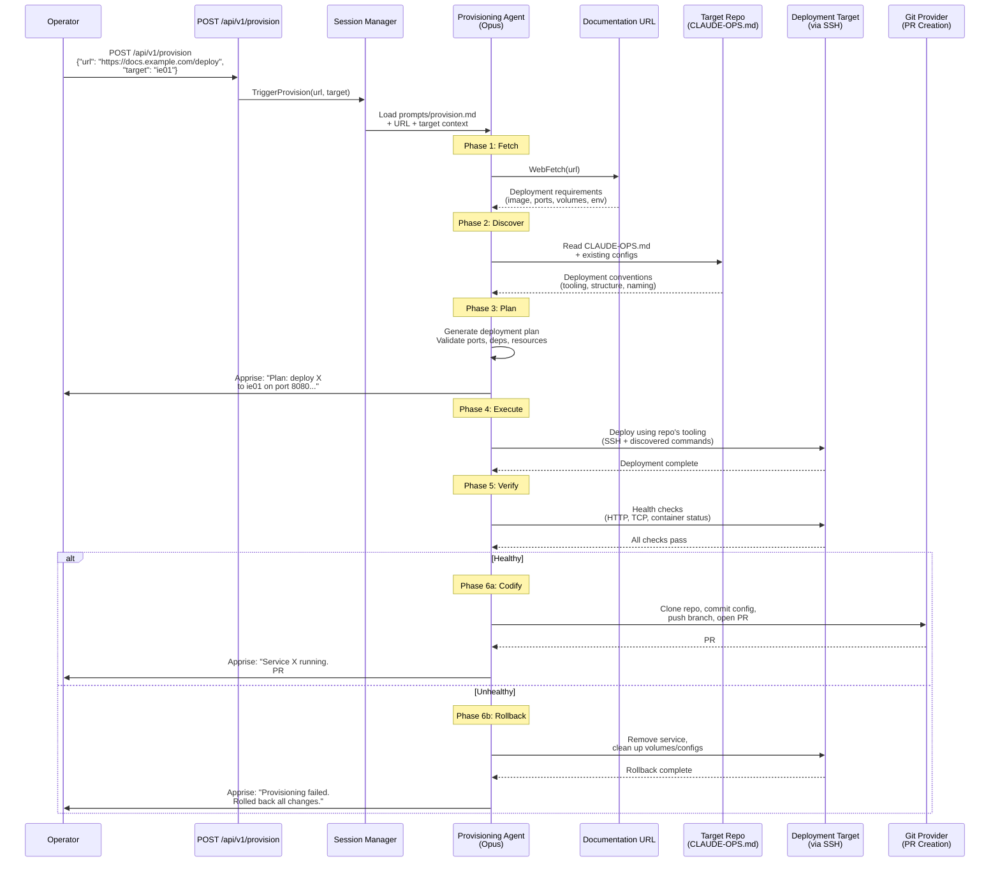

# ADR-0027: URL-Driven Service Provisioning via Provisioning Mode

## Context and Problem Statement

Claude Ops currently operates in a reactive posture: it monitors existing services, detects failures, and remediates them within the constraints of its tiered permission model. The "Never Allowed" list (SPEC-0003 REQ-5) explicitly prohibits the agent from modifying inventory files, playbooks, Helm charts, Dockerfiles, and pushing to protected branches. These restrictions exist because the agent was designed to maintain infrastructure, not create it.

However, a common homelab workflow is: "I found a new service I want to run. Here's the documentation URL. Deploy it to my cluster." Today, this requires the operator to manually read the documentation, write the deployment configuration (Ansible playbook, Docker Compose entry, Helm chart — whatever the repo uses), commit it, and run the deployment. The agent has all the capabilities to do this work — it can read documentation via WebFetch, understand repo conventions via CLAUDE-OPS.md manifests, generate configuration files, execute deployments, and verify health — but the current permission model forbids it.

The challenge is designing a provisioning workflow that:

1. **Is explicitly user-initiated** — provisioning must never happen autonomously during a scheduled monitoring cycle.
2. **Is framework-agnostic** — the agent must discover how to deploy by reading the target repo's own conventions, manifests, and documentation, not by hardcoding knowledge of Ansible, Docker Compose, Helm, or any specific tool.
3. **Handles failure gracefully** — partial deployments must be fully cleaned up if the service fails health checks after deployment.
4. **Codifies successful deployments** — once a service is verified healthy, the changes must be committed to the repo via PR so they persist and become part of the declarative infrastructure.
5. **Respects the existing safety model** — provisioning introduces new, dangerous capabilities that must be isolated from the normal monitoring loop.

This creates a fundamental tension with the current architecture. The "Never Allowed" list exists precisely to prevent the agent from making infrastructure changes that could cause outages. But provisioning *is* an infrastructure change — and the operator is explicitly requesting it. The design must reconcile the agent's default-safe posture with the operator's explicit intent to create something new.

A secondary tension exists with ADR-0018's PR-based workflow. ADR-0018 establishes that all persistent changes go through PRs that humans review and merge. But for provisioning, waiting for a human to merge a PR before anything runs defeats the purpose — the operator wants the service running now. The deployment must happen first, and the PR codifies what worked. This "deploy first, PR later" model inverts the safety model, which is acceptable because: (a) the operator explicitly triggered the provisioning, (b) rollback is built into the workflow, and (c) the PR still captures the final state for review.

## Decision Drivers

* **Explicit user intent** — Provisioning must only happen when the operator explicitly requests it with a URL and a target. The agent must never autonomously decide to provision a new service during a monitoring cycle.
* **Framework agnosticism** — The agent must discover how the target repo deploys services by reading its CLAUDE-OPS.md manifest, directory structure, existing configurations, and conventions. The provisioning workflow must not assume Ansible, Docker Compose, Helm, Kubernetes, or any specific tooling.
* **Rollback safety** — If a newly provisioned service fails health checks, the agent must be able to fully undo the deployment and leave no remnants (dangling containers, orphaned configs, consumed ports). A partial deployment is worse than no deployment.
* **Codification via PR** — Successful deployments must be codified in the repo's declarative configuration and submitted as a PR for human review. The service should survive redeployments from the repo's existing tooling after the PR is merged.
* **Isolation from monitoring** — Provisioning permissions must not leak into normal monitoring cycles. A bug or prompt injection in a scheduled run must not be able to trigger provisioning actions.
* **Auditability** — Every step of the provisioning workflow (URL fetch, requirement extraction, plan generation, deployment, verification, PR creation) must be logged for post-hoc review.
* **Homelab pragmatism** — This is a homelab tool, not an enterprise platform. The design should optimize for a single operator who trusts the agent to act on their behalf when explicitly asked, not for multi-tenant approval chains.

## Considered Options

1. **New "Provisioning Mode"** — A separate execution mode with elevated permissions, triggered explicitly by the user via the dashboard or API, that runs outside the normal monitoring loop with its own prompt and permission set.
2. **PR-first with auto-deploy** — Maintain the ADR-0018 PR-first model: the agent generates the configuration, opens a PR, and after the human merges it, the agent automatically detects the merge and deploys the service.
3. **Extend Tier 3 permissions** — Add provisioning capabilities to the existing Tier 3 permission set, gated by whether the session was manually triggered with a provisioning intent.

## Decision Outcome

Chosen option: **"New Provisioning Mode"**, because it cleanly isolates dangerous provisioning permissions from the normal monitoring loop, makes the operator's intent unambiguous through an explicit trigger mechanism, and provides a clear boundary for rollback and PR codification without contaminating the existing tier model.

### How Provisioning Mode Works

Provisioning Mode is a distinct execution mode, separate from the three monitoring tiers. It is not a "Tier 4" — it exists outside the monitoring escalation chain entirely. It cannot be reached by tier escalation, and it cannot escalate to or from monitoring tiers.

#### Trigger Mechanism

Provisioning is triggered exclusively through explicit user action:

- **Dashboard**: A dedicated "Provision Service" form that accepts a URL and a deployment target name (as defined in the repo's manifest or inventory).
- **API**: `POST /api/v1/provision` with `{"url": "<documentation-url>", "target": "<deployment-target>"}` and Bearer token authentication (same `CLAUDEOPS_CHAT_API_KEY` as other API endpoints).
- **Ad-hoc prompt**: Via the existing `TriggerAdHoc` mechanism with a prompt like "Provision <url> to <target>" — the session manager detects provisioning intent and routes to the provisioning prompt instead of a monitoring prompt.

Provisioning sessions are recorded in the database with `trigger = "provision"` and appear in the dashboard with a distinct visual indicator. They use a dedicated prompt file (`prompts/provision.md`) that defines the provisioning workflow and permissions.

The model used for provisioning is configurable via `CLAUDEOPS_PROVISION_MODEL` (default: the Tier 3 model, typically Opus, since provisioning requires the strongest reasoning capabilities for understanding arbitrary documentation and generating correct configurations).

#### Provisioning Lifecycle

```
1. FETCH    — Retrieve and parse the documentation URL
2. DISCOVER — Read the target repo's manifest and conventions
3. PLAN     — Generate a deployment plan with validation checks
4. EXECUTE  — Deploy the service using the repo's tooling
5. VERIFY   — Run health checks against the new service
6. CODIFY   — On success: open PR(s) to persist the configuration
7. ROLLBACK — On failure: remove all traces of the attempt
```

**Phase 1: Fetch**

The agent uses WebFetch to retrieve the documentation URL provided by the operator. It extracts deployment requirements:

- Container image (registry, name, tag)
- Required ports (and protocols)
- Required volumes/persistent storage
- Environment variables (with identification of which are secrets vs. configuration)
- Dependencies (databases, other services, external APIs)
- Resource requirements (memory, CPU, if documented)
- Health check endpoints (HTTP paths, TCP ports)

The agent MAY use WebSearch to supplement the documentation with additional context (e.g., finding the correct Docker image name if the documentation only references a GitHub repo).

**Phase 2: Discover**

The agent reads the target repo's deployment conventions by examining:

- `CLAUDE-OPS.md` manifest — capabilities, rules, deployment targets, and tooling declarations
- **Provisioning-specific extensions** — `.claude-ops/playbooks/provision.md` or `.claude-ops/skills/provision.md` if the repo provides them. These are repo-authored instructions that describe the repo's specific provisioning procedure, conventions, and idioms. If present, they take precedence over inferred conventions.
- Existing service configurations — how other services are defined (file format, directory structure, naming conventions). The agent reads multiple existing services to identify patterns: how ports are allocated, how volumes are structured, how services are named, how DNS/reverse-proxy/ingress is handled (e.g., Docker labels, annotations, config entries), how databases are provisioned, etc.
- Deployment tooling — what commands or playbooks are used to deploy services (Ansible, Docker Compose, Helm, shell scripts, Makefiles, etc.)
- Inventory/host structure — where the target maps to in the repo's infrastructure model
- **Infrastructure idioms** — how the repo handles cross-cutting concerns like reverse proxying, DNS, TLS, logging, and database provisioning. Many repos encode these as conventions (e.g., Docker labels that a reverse proxy auto-discovers, inventory fields that trigger DNS record creation, database entries that provision schemas during deployment). The agent MUST discover and follow these idioms so that provisioning a new service gets the same infrastructure wiring as existing services.

The agent MUST NOT assume any specific framework. It discovers the deployment method by reading the repo, not by defaulting to a hardcoded tool. If the repo uses Ansible, the agent generates Ansible-compatible configuration. If it uses Docker Compose, the agent generates a Compose entry. If it uses Helm, the agent generates a values file. The repo's conventions are the source of truth.

**Phase 3: Plan**

Before executing anything, the agent generates a deployment plan. Planning has two sub-phases: **mapping** external requirements to internal patterns, then **validating** the mapped plan.

**3a: Map to Internal Patterns**

The agent translates the external deployment requirements (from Phase 1) into the repo's internal conventions (from Phase 2). This is the critical translation step — the agent is not deploying "how the upstream docs say to"; it is deploying "how this repo deploys things, using the upstream's requirements as input."

For each external requirement, the agent maps it to the repo's idiom:

- **Container image** → the repo's image declaration format (inventory field, compose service, helm values, etc.)
- **Ports** → the repo's port allocation convention (port range, assignment scheme, etc.)
- **Volumes** → the repo's volume path convention (e.g., `/volumes/<service>/`, host-specific paths, NFS mounts)
- **Environment variables** → the repo's env var convention (inline, env files, secrets manager references, etc.)
- **Dependencies (databases)** → the repo's database provisioning pattern. If the repo provisions databases as part of service deployment (e.g., a `db` field in inventory that triggers schema creation), the agent uses that convention rather than deploying a sidecar database.
- **Reverse proxy / ingress** → the repo's reverse proxy convention. If the repo uses Docker labels, Caddy config generation, Traefik annotations, or any other pattern for exposing services, the agent follows that pattern. This is NOT "out of scope" — if the repo's conventions handle it, the agent MUST use them.
- **DNS** → the repo's DNS convention. If deploying a service with the repo's tooling automatically creates DNS records (e.g., via Ansible tasks triggered by inventory fields), the agent includes the appropriate fields. DNS is only a manual post-provisioning step if the repo has no automation for it.
- **Health checks** → the repo's health check convention (Docker HEALTHCHECK, monitoring endpoint registration, etc.)

The mapped plan should look like "another service in this repo" — not like a foreign deployment bolted on.

**3b: Validate**

- **Port conflict check**: Verify the required ports are not already in use by existing services (by reading the repo's inventory/configuration, not by probing the network).
- **Dependency satisfaction**: Verify that all dependencies (databases, services) either exist and are healthy, or will be provisioned as part of the deployment (per the repo's conventions). Flag any dependencies that require operator action.
- **Volume path planning**: Confirm volume paths follow the repo's conventions and don't conflict with existing mounts.
- **Secret identification**: Identify which environment variables are secrets. The agent MUST NOT use the LLM to generate secret values (model outputs are deterministic and logged, making them unsuitable as cryptographic material). However, the agent MAY use standard system tools (e.g., `openssl rand`, `head /dev/urandom | base64`) to generate cryptographically sound seeds, salts, tokens, or passwords where the upstream documentation specifies a generated value is needed. The agent MAY also provision credentials using tooling available in mounted repos (e.g., Terraform to create and store secrets in AWS SSM Parameter Store, Ansible to provision OIDC client/secret from an identity provider, CLI tools to register API keys with external services). Secrets are only deferred to the operator when no available tooling can provision them.
- **Resource estimation**: If the repo tracks resource allocation, verify the target has sufficient capacity.
- **Naming**: Generate a service name following the repo's conventions.

The plan is presented to the operator via notification (Apprise) and logged. For the initial implementation, the agent proceeds after generating the plan. A future enhancement MAY add an interactive approval gate where the operator reviews and approves the plan before execution.

**Phase 4: Execute**

The agent deploys the service using whatever tooling the repo provides. The agent follows whatever deployment procedure the repo's conventions describe, which may differ entirely from these illustrative examples of common toolchains:

- For Ansible-based repos: Generate the necessary host vars, role, or playbook entries, then run the playbook with appropriate flags.
- For Docker Compose-based repos: Generate the service definition, then run `docker compose up -d`.
- For Helm-based repos: Generate the values file, then run `helm install` or `helm upgrade`.

These are examples, not an exhaustive list. The repo's conventions — discovered in Phase 2 — are the sole authority on how deployment is performed. A repo using Nix, shell scripts, Makefiles, Terraform, or any other tooling would be handled by following that repo's own procedures.

The execution happens on the deployment target, accessed via the same SSH/remote access methods used by the monitoring tiers (as documented in the SSH access map). The agent follows the repo's conventions for how deployments are performed.

**Important**: During execution, the agent works with temporary/ephemeral changes. It does NOT modify the repo's committed files directly (repos are read-only mounts per ADR-0005). Instead, it:

- Clones the repo to `/tmp/provision-<service>-<timestamp>/` (same pattern as ADR-0018's PR workflow)
- Makes configuration changes in the clone
- Deploys from the clone or applies changes to the remote host directly
- Uses the clone later for the PR if deployment succeeds

**Phase 5: Verify**

After deployment, the agent runs health checks:

- HTTP health endpoint (if the service exposes one)
- TCP port reachability
- Container status (running, healthy)
- Log inspection for startup errors
- Dependency connectivity (can the service reach its database, etc.)

Verification uses a configurable timeout (default: 120 seconds) with retries. The service must pass all applicable health checks before the deployment is considered successful.

**Phase 6a: Codify (Success Path)**

If verification passes, the agent:

1. Commits the configuration changes in the cloned repo
2. Pushes to a feature branch: `claude-ops/provision/<service-name>`
3. Opens a PR with a detailed description:
   - What service was deployed
   - Source documentation URL
   - Configuration generated (ports, volumes, env vars)
   - Health check results
   - The operator who requested the provisioning
   - A note that the service is already running and the PR codifies the existing state
4. Sends an Apprise notification: "Service `<name>` provisioned successfully. PR #N opened to codify the configuration. Human review required before merging."

The PR follows all ADR-0018 conventions (branch naming, labels, human-review footer). The only difference is that the service is already running — the PR codifies working state rather than proposing future state.

**Phase 6b: Rollback (Failure Path)**

If verification fails, the agent:

1. Removes the deployed service from the target (stop container, remove container, etc.)
2. Cleans up any volumes created during the attempt (but NEVER deletes pre-existing volumes)
3. Removes any configuration files placed on the target
4. Cleans up the specific temporary clone directory: `rm -rf /tmp/provision-<service>-<timestamp>/` (scoped to this session's directory, not a wildcard that could match other concurrent provisioning sessions)
5. Sends an Apprise notification: "Provisioning of `<name>` failed. Rolled back all changes. Details: <failure reason>"
6. Logs the full rollback sequence for auditability

Rollback must be thorough — no dangling containers, no orphaned port allocations, no leftover config fragments. The target should be in the same state it was before provisioning began.

### Concurrent Session Handling

Provisioning sessions are subject to the same single-session constraint as monitoring sessions: only one session (of any type) may run at a time. If a provisioning request arrives while a monitoring session or another provisioning session is active, the API returns `409 Conflict` with a descriptive message, consistent with the existing `TriggerAdHoc` behavior (ADR-0013). The operator can retry after the active session completes.

This means:
- Two simultaneous provisioning requests for the same or different hosts are not possible — the second is rejected.
- A provisioning request during an active Tier 3 monitoring session is rejected.
- A scheduled monitoring cycle cannot start while provisioning is in progress.

This single-session model is sufficient for the homelab context (single operator). If future requirements demand parallel provisioning (e.g., provisioning services on multiple independent hosts simultaneously), a per-host session model could be introduced, but that is out of scope for this ADR.

### Permission Model

Provisioning Mode has its own permission set that is distinct from the three monitoring tiers:

**Provisioning Mode MAY:**
- Everything Tier 3 can do (read, health check, restart, deploy, etc.)
- Create new service definitions in cloned repos (new files, new entries in existing config files)
- Deploy new services to hosts listed in the repo's inventory
- Create new persistent volume directories (following the repo's conventions)
- Generate and apply new configuration (playbook entries, compose services, helm values)
- Write temporary files to `/tmp/` for the clone and deployment workspace

**Provisioning Mode MAY (basic operational edits):**
- Perform minor modifications to existing services when explicitly requested by the operator — version bumps, resource limit adjustments (memory, CPU), replica count changes, environment variable updates
- These are low-risk, operationally routine changes that the monitoring tiers could also perform if they had the scope
- The same deploy-verify-rollback lifecycle applies: make the change, verify the service is still healthy, PR the change. If verification fails, revert to the previous configuration.

**Provisioning Mode MUST NOT:**
- Remove existing services or delete their data
- Restructure existing inventory, configuration layouts, or deployment patterns
- Use the LLM to generate secret values (model outputs are deterministic, logged, and unsuitable as cryptographic material). System tools (`openssl rand`, `/dev/urandom`) and repo-provided tooling (Terraform, Ansible, identity provider CLIs) are fine.
- Deploy to hosts not listed in the repo's inventory
- Run during a scheduled monitoring cycle (provisioning is user-triggered only)
- Modify the runbook, prompts, or Claude Ops' own configuration
- Make changes that affect other services' operation (e.g., changing a shared database's config, modifying shared network rules)

**Key difference from monitoring tiers**: Provisioning Mode can create new configuration files, add entries to existing configurations, and perform basic operational edits to existing services (in a clone, submitted via PR). The monitoring tiers can only propose changes to existing operational procedures (checks, playbooks, manifests) via PR. Provisioning Mode's write scope is broader because the operator has explicitly requested a change and the deploy-verify-rollback lifecycle provides a safety net.

### Interaction with Existing ADRs

**ADR-0003 (Permission Enforcement)**: Provisioning Mode is enforced via the same two-layer model — `--allowedTools` at the CLI level and prompt instructions for semantic boundaries. The provisioning prompt (`prompts/provision.md`) defines the permissions listed above. The same honest security posture applies: prompt-level restrictions within `Bash` rely on model compliance, not technical enforcement.

**ADR-0005 (Mounted Repo Extensions)**: The agent discovers deployment conventions by reading the repo's CLAUDE-OPS.md manifest and `.claude-ops/` extensions. A repo MAY provide provisioning-specific extensions — `.claude-ops/playbooks/provision.md` (step-by-step provisioning procedure) or `.claude-ops/skills/provision.md` (tool orchestration for provisioning). These extensions can document the repo's internal idioms: how DNS is wired, how reverse proxying works, how databases are provisioned, how secrets are managed. If present, they take precedence over inferred conventions. If absent, the agent infers the procedure from existing service configurations.

**ADR-0013 (Ad-Hoc Sessions)**: Provisioning can be triggered via the existing `TriggerAdHoc` interface with appropriate routing to the provisioning prompt. The session manager detects provisioning requests and loads `prompts/provision.md` instead of a monitoring prompt.

**ADR-0018 (PR-Based Changes)**: Provisioning inverts the PR-first model — the service is deployed first, and the PR codifies what worked. This is justified because: (a) the operator explicitly requested immediate deployment, (b) rollback handles failure, and (c) the PR still goes through human review for the persistent configuration. The PR follows all existing conventions (branch naming, labels, provider interface).

**ADR-0022 (Skills-Based Tool Orchestration)**: Provisioning uses the same skills-based tool discovery. The agent consults the session-level tool inventory to determine how to deploy (MCP tools, CLIs, or HTTP fallback). A new `provision` skill file describes the provisioning workflow and tool preferences.

**ADR-0024 (Webhook Ingestion)**: External tools could trigger provisioning via webhook with appropriate payload (URL + target). The LLM intermediary would recognize provisioning intent and route accordingly.

### Consequences

**Positive:**

* The operator can provision a new service by providing just a URL and a target — the agent handles documentation parsing, convention discovery, configuration generation, deployment, verification, and codification.
* Framework agnosticism means the same workflow works regardless of whether the repo uses Ansible, Docker Compose, Helm, shell scripts, or any other deployment tooling. The agent learns the conventions from the repo itself.
* Rollback safety ensures that failed provisioning attempts leave no remnants. The target returns to its pre-provisioning state if anything goes wrong.
* PR codification means successful deployments become part of the repo's declarative infrastructure. The service survives future redeployments from the repo's tooling after the PR is merged.
* Isolation from the monitoring loop means provisioning permissions cannot be accidentally (or maliciously) invoked during a scheduled cycle. The trigger mechanism is explicit and user-initiated.
* The "deploy first, PR later" model is practical for a homelab context where the operator wants the service running immediately and will review the PR afterward.

**Negative:**

* **The "deploy first, PR later" model inverts the safety guarantee of ADR-0018.** A service runs before any human reviews the configuration. Mitigation: the operator explicitly triggered the provisioning, rollback handles failures, and the PR still captures the final state. For a homelab with a single trusted operator, this is an acceptable trade-off. For multi-operator environments, this model may need an approval gate.
* **Rollback may not be perfectly clean.** Some deployment side effects (e.g., database schema migrations, external API registrations) cannot be trivially undone. Mitigation: the agent should identify irreversible actions during planning and flag them to the operator before proceeding.
* **Documentation quality varies.** The agent's ability to extract deployment requirements depends on how well the service's documentation describes them. Poorly documented services may result in incomplete configurations. Mitigation: the agent can supplement with WebSearch and should flag uncertainties to the operator rather than guessing.
* **Some secrets may require operator intervention.** The agent can generate cryptographic material using system tools (`openssl rand`) and can provision credentials using repo-available tooling (Terraform, Ansible, CLI tools for identity providers, etc.). However, secrets that require manual registration with a third party (e.g., a vendor-issued API key, a manually created OAuth app) must be provided by the operator. Mitigation: the plan phase identifies which secrets can be auto-provisioned vs. which need operator action, and the notification includes instructions for any manual steps.
* **Network configuration coverage depends on repo conventions.** If the repo's deployment conventions handle DNS and reverse proxy automatically (e.g., via Docker labels, Ansible tasks triggered by inventory fields), the agent follows those conventions and the service gets full network wiring. If the repo has no automation for these concerns, they become manual post-provisioning steps. Mitigation: during the Discover phase, the agent identifies whether the repo handles these automatically and reports any manual steps needed in the plan notification.
* **Prompt-level permission enforcement applies.** As with all Claude Ops permissions, provisioning restrictions within `Bash` rely on model compliance (ADR-0003). The provisioning prompt is carefully scoped, but a sufficiently creative model could exceed its boundaries. Mitigation: same as ADR-0003 — Docker-level restrictions, read-only mounts for non-provisioning paths, and post-hoc audit.

### Confirmation

Implementation is confirmed when:

- `POST /api/v1/provision` endpoint exists and accepts `{"url": "...", "target": "..."}` with Bearer token auth
- A provisioning session appears in the dashboard with `trigger = "provision"` and a distinct visual indicator
- The agent can fetch a documentation URL, discover a repo's deployment conventions, generate a valid configuration, deploy the service, verify health, and open a PR — end to end
- Failed provisioning results in complete rollback with no remnants on the target
- Provisioning cannot be triggered from a scheduled monitoring cycle (only user-initiated)
- The provisioning prompt (`prompts/provision.md`) is loaded only for provisioning sessions, not monitoring sessions

## Pros and Cons of the Options

### New "Provisioning Mode"

A separate execution mode with its own prompt, permissions, and trigger mechanism. Runs outside the monitoring loop entirely. Deploys first, codifies via PR after verification.

* Good, because provisioning permissions are completely isolated from the monitoring loop — a bug or prompt injection in a scheduled run cannot trigger provisioning.
* Good, because the trigger mechanism (explicit URL + target from the operator) makes intent unambiguous — there is no way to accidentally provision a service.
* Good, because the dedicated prompt file (`prompts/provision.md`) can be tailored to the provisioning workflow without cluttering the monitoring tier prompts.
* Good, because the "deploy first, PR later" model is practical and fast — the operator gets a running service immediately.
* Good, because rollback is a first-class concept — the workflow is designed around the assumption that deployment might fail.
* Good, because framework agnosticism is natural — the provisioning prompt instructs the agent to discover conventions, not assume a specific tool.
* Bad, because it introduces a new execution mode with its own permission set, adding complexity to the overall system model.
* Bad, because the "deploy first, PR later" model inverts the safety guarantee of ADR-0018 — a service runs before human review.
* Bad, because the provisioning prompt must be carefully written to prevent scope creep (e.g., the agent deciding to "helpfully" modify existing services during provisioning).
* Bad, because it requires a new API endpoint, a new trigger type, and a new prompt file — non-trivial implementation work.

### PR-First with Auto-Deploy

Maintain ADR-0018's PR-first model. The agent generates the configuration, opens a PR, and after the human merges it, a webhook or polling mechanism triggers the actual deployment.

* Good, because every configuration change goes through human review before anything is deployed — maximum safety.
* Good, because it aligns perfectly with ADR-0018's existing PR workflow — no inversion of the safety model.
* Good, because the merge event provides a clear, auditable point where the human approved the deployment.
* Good, because rollback is simpler — if the deployment fails after merge, the PR can be reverted.
* Bad, because it introduces significant latency — the operator must wait for the PR, review it, merge it, and then wait for the deployment. For a homelab where the operator just wants to try a new service, this friction is disproportionate.
* Bad, because it requires a new mechanism to detect PR merges and trigger deployments — either webhooks (which require infrastructure changes) or polling (which adds latency and complexity).
* Bad, because the operator ends up reviewing agent-generated configuration they may not fully understand. The review gate provides a false sense of safety if the operator rubber-stamps it to get the service running faster.
* Bad, because if the deployment fails after merge, the repo now contains configuration for a non-working service. The agent or operator must create another PR to revert.
* Bad, because it conflates two actions (approve configuration + deploy service) into one (merge PR), which reduces the operator's control over timing.

### Extend Tier 3 Permissions

Add provisioning capabilities directly to Tier 3, gated by whether the session was manually triggered with provisioning intent (detected via prompt analysis or a flag in the trigger).

* Good, because it requires no new execution mode — provisioning is just a set of additional Tier 3 capabilities.
* Good, because it reuses the existing Tier 3 prompt, permissions, and escalation model.
* Good, because implementation is simpler — add provisioning instructions to `prompts/tier3-remediate.md` and gate them with "only if the session was triggered for provisioning."
* Bad, because it mixes provisioning and monitoring permissions in the same prompt, increasing the risk that a monitoring session accidentally or maliciously uses provisioning capabilities.
* Bad, because Tier 3 can be reached via automatic escalation from Tier 1 and Tier 2 — a failing health check could theoretically escalate to Tier 3 and trigger provisioning logic if the prompt boundaries are not perfectly enforced.
* Bad, because the Tier 3 prompt is already long and complex — adding provisioning workflow doubles its size and increases the chance of instruction-following errors.
* Bad, because it violates the principle that monitoring tiers are about maintaining existing infrastructure, not creating new infrastructure. Provisioning is a fundamentally different operation.
* Bad, because prompt-based gating ("only provision if the operator asked for it") is exactly the kind of semantic restriction that ADR-0003 warns is "not a security boundary."

## Architecture Diagram



## More Information

* **ADR-0003** (Prompt-Based Permission Enforcement): Provisioning Mode follows the same two-layer enforcement model. The provisioning prompt defines permissions, and `--allowedTools` restricts tool access at the CLI level. The honest security posture from ADR-0003 applies equally here.
* **ADR-0005** (Mounted Repo Extensions): The agent discovers deployment conventions from the repo's CLAUDE-OPS.md manifest and existing configurations. Repos MAY provide provisioning-specific extensions (`.claude-ops/playbooks/provision.md` or `.claude-ops/skills/provision.md`) that describe the repo's provisioning procedure, internal idioms for DNS/proxy/database wiring, and any repo-specific conventions. These extensions take precedence over inferred conventions.
* **ADR-0013** (Ad-Hoc Sessions): Provisioning leverages the same `TriggerAdHoc` infrastructure with a `trigger = "provision"` type, reusing the session lifecycle (DB record, SSE streaming, log capture).
* **ADR-0018** (PR-Based Config Changes): Provisioning inverts the PR-first model — deploy first, PR later. The PR still goes through human review and follows all existing conventions (branch naming, labels, provider interface).
* **ADR-0022** (Skills-Based Tool Orchestration): The provisioning workflow uses the same adaptive tool discovery. A `provision` skill file describes tool preferences for the provisioning lifecycle.
* **ADR-0024** (Webhook Ingestion): A future extension could allow external tools to trigger provisioning via the webhook endpoint with a URL and target in the payload.
* **Environment variables**: `CLAUDEOPS_PROVISION_MODEL` (default: Tier 3 model) controls which model runs provisioning sessions. `CLAUDEOPS_PROVISION_TIMEOUT` (default: 300s) controls the maximum verification wait time.
* **Infrastructure wiring**: DNS records, reverse proxy configuration, and database provisioning are handled via the repo's internal conventions when those conventions exist. They are only flagged as manual post-provisioning steps when the repo has no automation for them. The agent MUST discover and follow the repo's idioms for these cross-cutting concerns.
* **Future enhancements**: Interactive plan approval (operator reviews plan before execution), batch provisioning (multiple services from a single URL), and provisioning templates (repo-provided templates for common service patterns).
