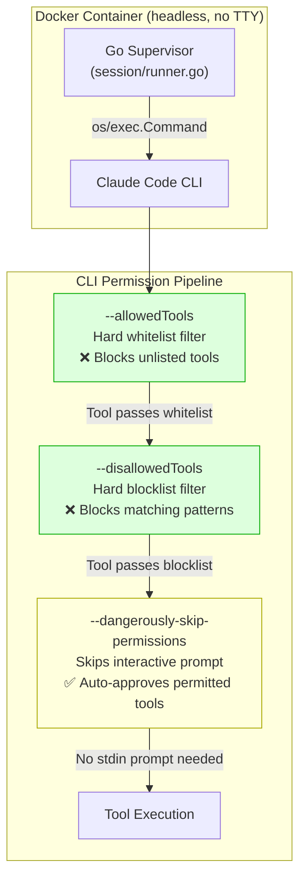

# ADR-0028: Use --dangerously-skip-permissions for Headless Non-Interactive CLI Execution

## Context and Problem Statement

Claude Ops runs the Claude Code CLI as a subprocess inside a headless Docker container on a scheduled loop (ADR-0010). The Claude Code CLI is designed primarily for interactive developer use — when an agent attempts to invoke a tool (Bash, Write, etc.), the CLI normally pauses and prompts the user for interactive approval via stdin. In Claude Ops' deployment context, there is no human operator at the terminal. The container runs autonomously, and stdin is never connected to a TTY.

**How should Claude Ops handle the CLI's interactive permission approval requirement when running in a headless, non-interactive Docker container?**

## Decision Drivers

* **Non-interactive execution is mandatory** — Claude Ops runs as an autonomous monitoring agent inside Docker. There is no human to approve tool calls interactively. Without a solution, the CLI hangs indefinitely on the first tool invocation, waiting for stdin input that will never arrive.
* **Tool restrictions must still be enforced** — Bypassing interactive prompts must not bypass the tool-level security boundary. The tiered permission model (ADR-0001, ADR-0003, ADR-0023) depends on `--allowedTools` and `--disallowedTools` being enforced regardless of interactive approval settings.
* **Minimize architectural deviation** — The solution should use a built-in CLI mechanism, not a workaround (auto-piping "yes", wrapper scripts, or patching the CLI).
* **Flag name should not mislead** — The `--dangerously-skip-permissions` flag sounds alarming, but its actual behavior is narrowly scoped: it skips interactive approval prompts, not tool-level restrictions. The architectural justification must be clear so future maintainers understand why this is safe in Claude Ops' context.

## Considered Options

1. **`--dangerously-skip-permissions` flag** — Use the CLI's built-in flag to skip interactive approval prompts, relying on `--allowedTools` and `--disallowedTools` for security enforcement.
2. **Pipe synthetic approval via stdin** — Pipe "yes" or similar input into the CLI process to auto-approve all permission prompts.
3. **Custom wrapper binary** — Build a wrapper that intercepts permission prompts and auto-responds, logging each approval.
4. **Claude Agent SDK (programmatic)** — Replace the CLI with the Agent SDK, which does not have interactive prompts (tool execution is controlled programmatically).

## Decision Outcome

Chosen option: **"`--dangerously-skip-permissions` flag"**, because it is the CLI's officially supported mechanism for non-interactive execution. It cleanly separates two distinct concerns:

1. **Interactive approval** (skip it — no human is present)
2. **Tool-level restrictions** (enforce them — `--allowedTools` and `--disallowedTools` are unaffected)

The flag does NOT disable `--allowedTools` or `--disallowedTools`. These are separate enforcement mechanisms in the CLI binary. When `--dangerously-skip-permissions` is set:

- Tools not listed in `--allowedTools` are still **hard-rejected** by the CLI
- Tools matching `--disallowedTools` patterns are still **hard-rejected** by the CLI
- The only change is that tools which pass both filters execute immediately instead of prompting for user confirmation

This means the three-layer security model remains intact:

| Layer | Mechanism | Affected by flag? |
|-------|-----------|-------------------|
| Tool whitelist | `--allowedTools` | No — still enforced |
| Command-prefix blocklist | `--disallowedTools` | No — still enforced |
| Interactive approval | stdin prompt | Yes — skipped |
| Prompt instructions | Tier prompt files | No — still followed |

### Consequences

* Good, because the CLI executes autonomously without hanging on stdin, enabling fully headless operation in Docker.
* Good, because `--allowedTools` and `--disallowedTools` remain enforced at the CLI binary level, maintaining the hard security boundary that the tiered permission model depends on (ADR-0023).
* Good, because this is a single CLI flag — no wrapper scripts, no stdin hacks, no custom binaries.
* Bad, because the flag name ("dangerously") may alarm future maintainers who don't understand the separation between interactive approval and tool-level restrictions. This ADR serves as the permanent justification.
* Bad, because if a future CLI version changes the flag's semantics to also bypass `--allowedTools`/`--disallowedTools`, the security model would silently degrade. The confirmation section below addresses this risk.

### Confirmation

* The `internal/session/runner.go` file MUST include a governing comment referencing this ADR on the `--dangerously-skip-permissions` line, explaining why it is safe.
* Any CLI upgrade MUST be verified to confirm that `--dangerously-skip-permissions` does not affect `--allowedTools` or `--disallowedTools` enforcement. This can be tested by running a session with a blocked tool pattern and confirming it is still rejected.

## Pros and Cons of the Options

### `--dangerously-skip-permissions` flag

Use the CLI's built-in non-interactive mode flag alongside the existing tool restriction flags.

* Good, because it is officially supported by the CLI and semantically correct for the use case.
* Good, because it requires zero additional code — one flag added to the CLI invocation.
* Good, because tool-level restrictions (`--allowedTools`, `--disallowedTools`) remain independently enforced.
* Neutral, because the flag name is intentionally scary to discourage casual use, which is appropriate for interactive developer contexts but misleading for headless automation.
* Bad, because the flag name may cause audit concerns without this ADR as context.

### Pipe synthetic approval via stdin

Pipe "yes" or auto-approval input into the CLI's stdin to automatically approve all permission prompts.

* Good, because it doesn't require any special CLI flags.
* Bad, because the CLI's interactive prompt format may change between versions, breaking the synthetic input.
* Bad, because it introduces a fragile coupling to the CLI's prompt text and timing.
* Bad, because it provides no selective approval — all tool calls are blindly approved regardless of `--allowedTools` configuration.

### Custom wrapper binary

Build a Go binary that wraps the CLI process, intercepts permission prompts on stderr/stdout, and auto-responds.

* Good, because it could log each approval decision for audit purposes.
* Bad, because it requires maintaining a custom binary that must track CLI output format changes.
* Bad, because it adds significant complexity for a problem the CLI already solves with a flag.
* Bad, because it violates the principle of minimal architectural deviation.

### Claude Agent SDK (programmatic)

Replace the CLI subprocess with the Agent SDK, which provides programmatic control over tool execution without interactive prompts.

* Good, because tool execution is fully controlled in code with no permission prompt bypass needed.
* Good, because it enables richer programmatic integration (callbacks, streaming, tool result inspection).
* Bad, because it requires rewriting the invocation layer in TypeScript, violating the subprocess architecture (ADR-0010).
* Bad, because it introduces a new runtime dependency and agent loop that must be maintained.
* Bad, because it is a disproportionate solution to a problem that a single CLI flag solves.

## Architecture Diagram

## More Information

* **ADR-0010** — Decided to invoke Claude via CLI as subprocess (the reason `--dangerously-skip-permissions` is needed)
* **ADR-0023** — Established `--allowedTools`/`--disallowedTools` as the hard security boundary (the reason the flag is safe)
* **ADR-0001** — Tiered model escalation with permission scopes (the security model this flag must not undermine)
* **SPEC-0010** — Claude Code CLI Subprocess Invocation specification
* **Implementation**: `internal/session/runner.go:38` — the flag is passed with a governing comment referencing this ADR
