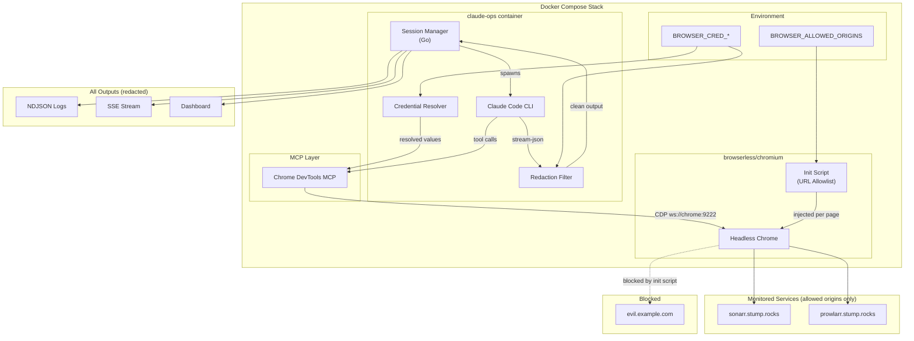
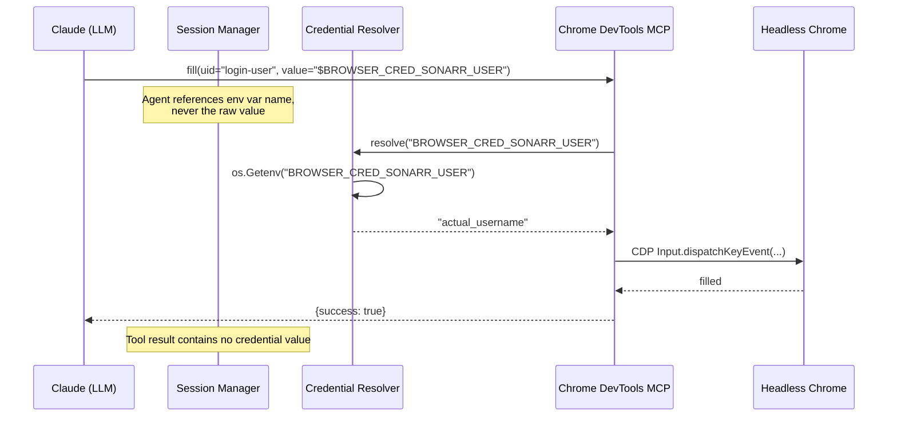

# Design: Browser Automation for Authenticated Web UIs

## Context

Claude Ops monitors infrastructure services, many of which expose web-based admin UIs as their only management interface. Operations like API key rotation, configuration changes, and user management require logging into these UIs because the services lack REST APIs for those functions. ADR-0012 decided on a four-layer approach: credential injection via environment variables, URL allowlist enforcement, log redaction, and isolated browser contexts.

This design describes how each layer is implemented within the existing Docker Compose, MCP, and prompt-based architecture.

## Goals / Non-Goals

### Goals
- Inject credentials into browser form fields without exposing values to the LLM's reasoning chain
- Restrict browser navigation to pre-approved origins via an init script
- Redact credential values from all output channels (logs, SSE, responses)
- Isolate each browser automation task in a fresh incognito context
- Gate authenticated browser actions behind Tier 2+ permissions
- Provide audit trail of all browser actions with redacted credentials

### Non-Goals
- Network-level URL enforcement (proxy or Docker network policies) -- deferred pending security review
- Credential rotation for the agent's own browser credentials
- Human-in-the-loop approval for each browser session (deferred)
- Support for non-Chromium browsers
- MFA/2FA automation (requires hardware tokens or TOTP seed management)

## Architecture

### System Overview



### Credential Injection Flow



## Decisions

### Decision 1: Credential Resolver as Middleware in the MCP Bridge

**Choice**: Implement credential resolution as a middleware layer between the Claude CLI's tool calls and the Chrome DevTools MCP server. When a `fill` or `fill_form` tool call contains a value matching the pattern `$BROWSER_CRED_*`, the middleware resolves it from the environment before forwarding to the MCP server.

**Rationale**: This keeps credential values out of the LLM's token stream entirely. The agent writes `$BROWSER_CRED_SONARR_PASS` as the fill value; the middleware swaps it for the real value before the MCP server receives it. The tool result returned to the LLM confirms success/failure without echoing the value.

**Implementation**: The credential resolver is a Go function in the session manager that intercepts outgoing MCP tool calls. It scans `fill` and `fill_form` arguments for the `$BROWSER_CRED_` prefix pattern and performs environment variable substitution. Non-matching values pass through unchanged.

```go
// Pseudocode for credential resolution
func resolveCredentials(toolCall MCPToolCall) MCPToolCall {
    if toolCall.Name == "fill" || toolCall.Name == "fill_form" {
        for i, element := range toolCall.Args.Elements {
            if strings.HasPrefix(element.Value, "$BROWSER_CRED_") {
                envKey := strings.TrimPrefix(element.Value, "$")
                resolved := os.Getenv(envKey)
                if resolved == "" {
                    return errorResult("credential not set: " + envKey)
                }
                toolCall.Args.Elements[i].Value = resolved
            }
        }
    }
    return toolCall
}
```

### Decision 2: Init Script for URL Allowlist Enforcement

**Choice**: Use the Chrome DevTools MCP `navigate_page` tool's `initScript` parameter to inject a JavaScript guard that checks `window.location.origin` against the allowlist on every navigation.

**Rationale**: The init script runs before any page JavaScript executes, providing early interception. It does not require a proxy sidecar or Docker network configuration changes. The enforcement is per-navigation, so redirects are also caught when the new page loads.

**Implementation**: The session manager generates the init script from `BROWSER_ALLOWED_ORIGINS` at session start and passes it on every `navigate_page` call.

```javascript
// Generated init script (injected per navigation)
(function() {
  const allowed = ['https://sonarr.stump.rocks', 'https://prowlarr.stump.rocks'];
  const origin = window.location.origin;
  if (!allowed.includes(origin)) {
    document.documentElement.innerHTML =
      '<h1>Navigation Blocked</h1>' +
      '<p>Origin not in BROWSER_ALLOWED_ORIGINS: ' + origin + '</p>';
    window.stop();
  }
})();
```

**Limitation**: This is JavaScript-level enforcement, not network-level. The `evaluate_script` MCP tool could theoretically bypass it. ADR-0012 acknowledges this trade-off and defers network-level enforcement to a future iteration.

### Decision 3: Redaction Filter in the Output Pipeline

**Choice**: Implement a streaming redaction filter that sits between the Claude CLI's stream-json output and the session manager's log/SSE/response writers. The filter builds a dictionary from all `BROWSER_CRED_*` environment variable values at session start and performs substring replacement on every output chunk.

**Rationale**: Pattern-based redaction is imperfect (ADR-0012 acknowledges this) but provides a meaningful defense-in-depth layer. By operating on the raw stream before any output is persisted, it catches credential leaks regardless of where they appear (tool results, assistant text, system messages).

**Implementation**:

```go
type RedactionFilter struct {
    replacements map[string]string // value -> "[REDACTED:VAR_NAME]"
}

func NewRedactionFilter() *RedactionFilter {
    rf := &RedactionFilter{replacements: make(map[string]string)}
    for _, env := range os.Environ() {
        parts := strings.SplitN(env, "=", 2)
        if strings.HasPrefix(parts[0], "BROWSER_CRED_") && len(parts) == 2 && parts[1] != "" {
            rf.replacements[parts[1]] = "[REDACTED:" + parts[0] + "]"
            // Also add URL-encoded variant
            encoded := url.QueryEscape(parts[1])
            if encoded != parts[1] {
                rf.replacements[encoded] = "[REDACTED:" + parts[0] + ":urlencoded]"
            }
        }
    }
    return rf
}

func (rf *RedactionFilter) Redact(input string) string {
    result := input
    for value, placeholder := range rf.replacements {
        result = strings.ReplaceAll(result, value, placeholder)
    }
    return result
}
```

The filter is applied to:
1. Each line of stream-json output before parsing
2. The final session response markdown
3. SSE event payloads before transmission
4. Apprise notification bodies

### Decision 4: Incognito Context via new_page

**Choice**: Each browser automation task opens a fresh page via the Chrome DevTools MCP `new_page` tool. After the task completes, the page is closed via `close_page`. The browserless/chromium container runs with `--incognito` flag so all pages are inherently incognito.

**Rationale**: The Chrome DevTools MCP does not expose a direct "create incognito context" API, but the browserless container can be configured to run entirely in incognito mode. Combined with page closure after each task, this ensures no session state persists between service authentications.

**Implementation**: Add `--incognito` to the browserless container's Chrome flags via the `CHROME_FLAGS` environment variable in docker-compose.yaml:

```yaml
chrome:
  image: browserless/chromium
  environment:
    - CONNECTION_TIMEOUT=120000
    - CHROME_FLAGS=--incognito
```

The session manager's browser automation wrapper follows this pattern:
1. Call `new_page` with the target URL and the URL allowlist init script
2. Perform authentication and task actions
3. Call `close_page` when the task completes

### Decision 5: Tier Gating via Prompt and Session Manager

**Choice**: Enforce the Tier 2+ requirement for authenticated browser automation at two levels: (1) the tier-1 observe prompt explicitly states browser authentication is not permitted, and (2) the session manager's credential resolver only activates when the session's tier is >= 2.

**Rationale**: Defense in depth -- the prompt prevents the Tier 1 agent from attempting browser auth, and the credential resolver refuses to resolve credentials even if the agent somehow invokes fill with a credential reference.

**Implementation**: The credential resolver checks the session's tier before resolving:

```go
func (cr *CredentialResolver) Resolve(tier int, envKey string) (string, error) {
    if tier < 2 {
        return "", fmt.Errorf("browser credential injection requires Tier 2+, current tier: %d", tier)
    }
    value := os.Getenv(envKey)
    if value == "" {
        return "", fmt.Errorf("credential not set: %s", envKey)
    }
    return value, nil
}
```

## Docker Compose Changes

The `chrome` service in docker-compose.yaml gains the incognito flag and the watchdog service gains credential and allowlist environment variable placeholders:

```yaml
services:
  watchdog:
    environment:
      # Browser automation credentials (add per-service as needed)
      # - BROWSER_CRED_SONARR_USER=${BROWSER_CRED_SONARR_USER:-}
      # - BROWSER_CRED_SONARR_PASS=${BROWSER_CRED_SONARR_PASS:-}
      # Comma-separated allowed origins for browser navigation
      - BROWSER_ALLOWED_ORIGINS=${BROWSER_ALLOWED_ORIGINS:-}

  chrome:
    image: browserless/chromium
    environment:
      - CONNECTION_TIMEOUT=120000
      - CHROME_FLAGS=--incognito
```

## Playbook Integration

The existing `playbooks/rotate-api-key.md` already describes browser-based login flows. After this spec is implemented, the playbook's "Via Browser Automation" section gains concrete mechanisms:

1. **Navigate**: `navigate_page` with `initScript` (URL allowlist guard)
2. **Authenticate**: `fill` with `$BROWSER_CRED_{SERVICE}_USER` and `$BROWSER_CRED_{SERVICE}_PASS`
3. **Extract/rotate**: `take_snapshot`, `click`, `fill` as needed
4. **Close**: `close_page` to discard the context

The playbook itself is not modified (per the "never modify playbooks" rule), but the tier-2 and tier-3 prompts reference the credential injection pattern.

## Risks / Trade-offs

- **Environment variables are not secure storage.** Credential values are visible in `docker inspect`, `/proc/*/environ`, and the compose file. This mirrors the existing `ANTHROPIC_API_KEY` pattern and is acknowledged as a known limitation.
- **JavaScript-level URL enforcement is bypassable.** The `evaluate_script` tool could navigate programmatically without triggering the init script. Network-level enforcement (a forward proxy like Squid or mitmproxy) would be stronger but adds operational complexity.
- **Redaction is heuristic.** Base64-encoded, split, or otherwise transformed credential values may evade the substring filter. The filter covers raw and URL-encoded forms only.
- **No human approval per session.** Once credentials are configured, the agent authenticates autonomously. A future enhancement could add an approval step via the dashboard before each browser auth task.
- **Prompt injection from page content.** Even with URL allowlisting, trusted service UIs may display user-generated content that could influence the agent. The prompt warning is a soft mitigation, not a technical control.

## Open Questions

- Should the URL allowlist enforcement be upgraded to network-level (Docker network policy or forward proxy) before v1 ships?
- Should credential values be encrypted at rest in a dotenv file rather than plain-text environment variables?
- Should there be a maximum number of browser authentication attempts per service per cooldown window (analogous to restart cooldowns)?
- Should `evaluate_script` calls be blocked or restricted during browser automation tasks to prevent init script bypass?
