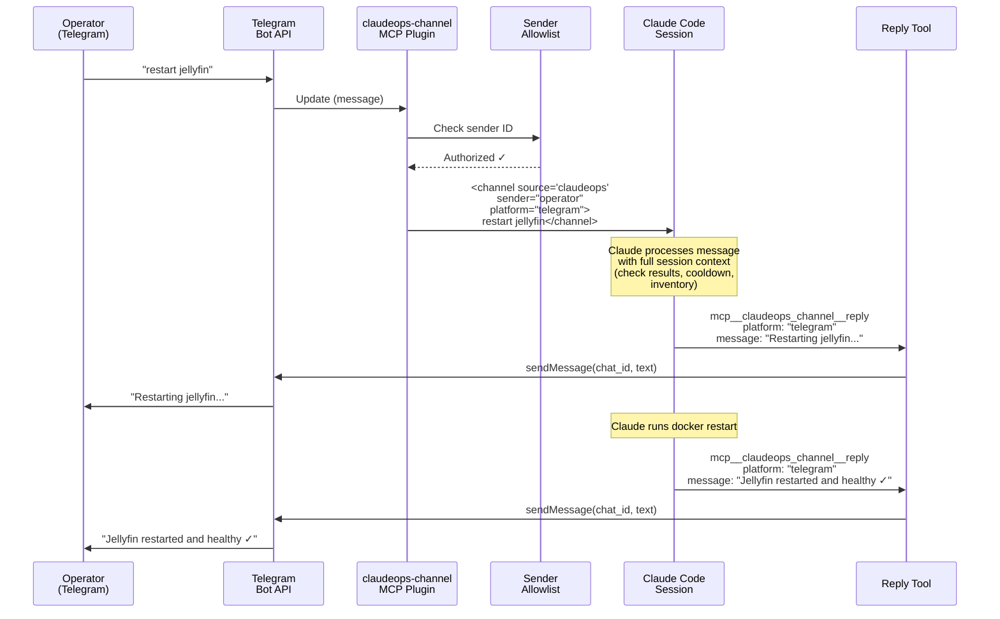
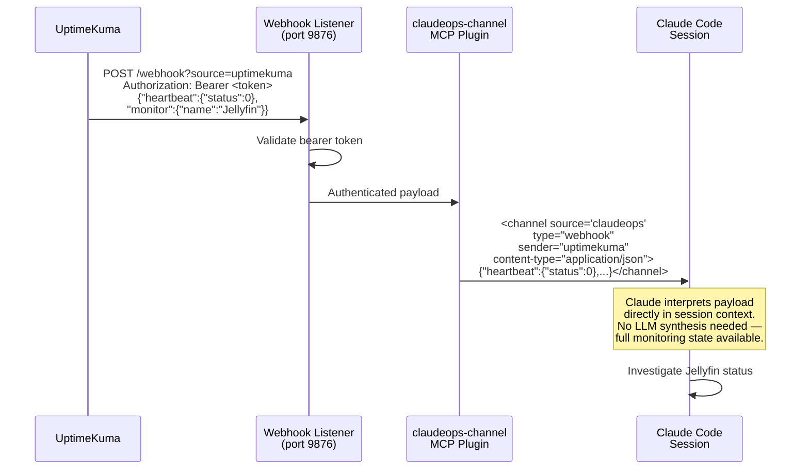

# Design: Channel-Based Operator Interface

## Overview

This design describes how Claude Ops unifies its three external communication mechanisms — Apprise outbound notifications (ADR-0004), OpenAI-compatible chat inbound (ADR-0020), and webhook alert ingestion (ADR-0024) — into a single channel plugin that leverages Claude Code's native channel protocol for bidirectional operator communication.

See [SPEC-0033](./spec.md) and [ADR-0032](../../adrs/ADR-0032-channel-operator-interface.md).

## Architecture

### Communication Architecture: Before and After

```
BEFORE (Current — Three Separate Mechanisms)
┌─────────────────────────────────────────────────────────────────────┐
│                                                                     │
│  Outbound (one-way):                                                │
│  ┌─────────┐    apprise CLI    ┌─────────────────────────────────┐ │
│  │ Claude   │ ───────────────> │ Telegram, Discord, Email, Slack │ │
│  │ Agent    │                  │ PagerDuty, ntfy, 80+ services   │ │
│  └─────────┘                  └─────────────────────────────────┘ │
│                                                                     │
│  Inbound (stateless):                                               │
│  ┌─────────────┐  POST /v1/chat/completions  ┌─────────┐          │
│  │ OpenAI App  │ ──────────────────────────> │ Go HTTP  │          │
│  │ (Opencat)   │  SSE stream back            │ Handler  │──>Agent  │
│  └─────────────┘ <────────────────────────── └─────────┘          │
│                                                                     │
│  Inbound (webhook):                                                 │
│  ┌─────────────┐  POST /api/v1/webhook  ┌──────┐  ┌─────┐        │
│  │ UptimeKuma  │ ────────────────────> │ Go   │─>│ LLM │──>Agent │
│  │ Grafana     │                       │ HTTP │  │synth│         │
│  └─────────────┘                       └──────┘  └─────┘        │
│                                                                     │
└─────────────────────────────────────────────────────────────────────┘

AFTER (Channel Plugin — Unified)
┌─────────────────────────────────────────────────────────────────────┐
│                                                                     │
│  Bidirectional (Telegram/Discord):                                  │
│  ┌──────────┐   Bot API   ┌───────────────────┐  <channel>        │
│  │ Operator │ <────────> │ claudeops-channel  │ <──────────>      │
│  │ (Tg/Dc)  │            │ MCP Plugin         │   reply tool      │
│  └──────────┘            │                    │                   │
│                          │  Webhook Listener   │  <channel>        │
│  ┌──────────┐  HTTP POST │  (port 9876)       │ ──────────>       │
│  │UptimeKuma│ ─────────> │                    │               ┌───┐│
│  │Grafana   │            └───────────────────┘               │ C ││
│  └──────────┘                                                │ l ││
│                                                              │ a ││
│  Outbound (non-channel targets):                             │ u ││
│  ┌─────────┐    apprise CLI    ┌──────────────────────┐     │ d ││
│  │ Claude  │ ───────────────> │ Email, Slack,        │     │ e ││
│  │ Agent   │                  │ PagerDuty, ntfy, ... │     │   ││
│  └─────────┘                  └──────────────────────┘     └───┘│
│                                                                     │
└─────────────────────────────────────────────────────────────────────┘
```

### Plugin Internal Architecture

```
┌──────────────────────────────────────────────────────────────┐
│                  claudeops-channel MCP Server                 │
│                  (TypeScript / Bun)                            │
│                                                               │
│  ┌─────────────────────┐  ┌─────────────────────┐           │
│  │  Telegram Bridge     │  │  Discord Bridge      │           │
│  │                      │  │                      │           │
│  │  Bot API long-poll   │  │  Gateway WebSocket   │           │
│  │  Message → event     │  │  Message → event     │           │
│  │  Reply → sendMessage │  │  Reply → createMsg   │           │
│  └──────────┬───────────┘  └──────────┬───────────┘           │
│             │                          │                       │
│             ▼                          ▼                       │
│  ┌──────────────────────────────────────────────┐             │
│  │              Event Router                     │             │
│  │                                               │             │
│  │  1. Check sender allowlist (access.json)      │             │
│  │  2. Format as <channel> event                 │             │
│  │  3. Push to Claude Code session               │             │
│  └──────────────────────────────────────────────┘             │
│             ▲                                                  │
│             │                                                  │
│  ┌──────────┴───────────┐  ┌──────────────────────┐          │
│  │  Webhook Listener     │  │  Reply Tool           │          │
│  │                       │  │  (MCP tool)           │          │
│  │  HTTP server on       │  │                       │          │
│  │  WEBHOOK_PORT         │  │  Params:              │          │
│  │  Bearer token auth    │  │    platform: string   │          │
│  │  Any Content-Type     │  │    message: string    │          │
│  │  Payload → event      │  │                       │          │
│  └───────────────────────┘  │  Routes to Telegram   │          │
│                              │  or Discord bridge    │          │
│                              └──────────────────────┘          │
│                                                               │
│  ┌──────────────────────────────────────────────┐             │
│  │  Sender Allowlist Manager                     │             │
│  │                                               │             │
│  │  File: ~/.claude/channels/claudeops/access.json│            │
│  │  Pairing flow: code → verify → add to list    │             │
│  │  Webhook auth: bearer token (separate)        │             │
│  └──────────────────────────────────────────────┘             │
└──────────────────────────────────────────────────────────────┘
```

### Message Flow: Operator Chat



### Message Flow: Webhook Ingestion



### Notification Decision Flow

When Claude needs to notify the operator, the decision of whether to use the channel reply tool or Apprise depends on two factors: whether a channel session is active, and what the notification target is.

```
Notification needed
│
├── Target is Telegram or Discord?
│   │
│   ├── YES → Channel session active?
│   │         │
│   │         ├── YES → Use reply tool (bidirectional)
│   │         │
│   │         └── NO → Use Apprise (one-way, fallback)
│   │
│   └── NO (email, Slack, PagerDuty, ntfy, ...) → Use Apprise (always)
```

This means Apprise configuration for Telegram/Discord URLs should be maintained even when channel mode is active, as a fallback for headless sessions.

## Configuration

### Environment Variables

| Variable | Purpose | Default | Required |
|----------|---------|---------|----------|
| `CLAUDEOPS_CHANNEL_TELEGRAM_TOKEN` | Telegram Bot API token | (none) | If Telegram bridge enabled |
| `CLAUDEOPS_CHANNEL_DISCORD_TOKEN` | Discord Bot API token | (none) | If Discord bridge enabled |
| `CLAUDEOPS_CHANNEL_WEBHOOK_PORT` | HTTP port for webhook listener | (none — disabled if not set) | If webhook receiver enabled |
| `CLAUDEOPS_CHANNEL_WEBHOOK_TOKEN` | Bearer token for webhook auth | (none) | If webhook receiver enabled |
| `CLAUDEOPS_CHANNEL_PAIRING_CODE` | One-time pairing code for allowlist bootstrap | (none) | For initial operator setup |
| `CLAUDEOPS_CHANNEL_PAIRING_TIMEOUT` | Pairing code expiry in seconds | `300` (5 min) | No |

### Sender Allowlist File

Location: `~/.claude/channels/claudeops/access.json`

```json
{
  "telegram": ["123456", "789012"],
  "discord": ["987654321"]
}
```

The file is read at startup and watched for changes. Adding a new user ID (either via pairing flow or manual edit) takes effect without plugin restart.

### Claude Code Plugin Registration

The plugin is registered in `.claude/plugins.json` (or equivalent):

```json
{
  "claudeops-channel": {
    "type": "channel",
    "command": "bun run /app/plugins/claudeops-channel/index.ts"
  }
}
```

### Session Manager Invocation

When channel mode is enabled:

```bash
claude \
    --model "${MODEL}" \
    --channels claudeops-channel \
    --allowedTools "${ALLOWED_TOOLS}" \
    --disallowedTools "${DISALLOWED_TOOLS}" \
    --append-system-prompt "Environment: ${ENV_CONTEXT}" \
    2>&1 | tee -a "${LOG_FILE}"
```

Note the absence of `-p` — channel sessions are persistent (interactive), not single-shot. This is a fundamental difference from the current monitoring invocation model.

## Key Design Decisions

### Channel plugin vs. official plugins

A custom `claudeops-channel` plugin is chosen over the official Telegram/Discord plugins because:

1. **Unified configuration** — One plugin, one set of environment variables, one access.json. Official plugins each have their own configuration model.
2. **Webhook integration** — Official plugins do not include webhook ingestion. A custom plugin combines chat bridge and webhook receiver in one process.
3. **Apprise coexistence logic** — The custom plugin can coordinate with the agent's notification decision logic (use reply tool when active, fall back to Apprise otherwise). Official plugins have no awareness of Apprise.
4. **Consistent sender allowlist** — One allowlist file for all platforms, managed by one pairing flow.

### Direct payload interpretation vs. LLM synthesis

ADR-0024's webhook endpoint uses an LLM intermediary (haiku) to synthesize a plain-language investigation prompt from the raw payload. The channel approach eliminates this step:

- **Channel advantage**: The webhook payload arrives as a channel event in a running session where Claude already has full context — check results, cooldown state, inventory, recent actions. Claude interprets the payload directly with this context, producing a richer understanding than a synthesized one-paragraph prompt.
- **LLM synthesis limitation**: The synthesis step runs in isolation, without session context. It can only summarize what the payload says, not correlate it with the monitoring state.
- **Latency**: Eliminating the synthesis step removes ~1-2 seconds of latency per webhook.
- **Failure mode**: The synthesis step can fail (API timeout, empty payload), blocking session start. Direct channel delivery has no intermediary failure mode.

### Persistent session vs. single-shot invocations

The current architecture uses single-shot `-p` invocations (ADR-0010): the entrypoint loop invokes `claude -p "..." `, the session completes, the loop sleeps, and repeats. Channels require a persistent, long-running session.

This design supports both modes concurrently:

1. **Scheduled monitoring**: Continues using single-shot `-p` invocations with API key auth. No change.
2. **Channel session**: A separate persistent session runs with `--channels` and claude.ai auth. It handles operator chat and webhook events.

The session manager's existing mutex prevents concurrent sessions from interfering. The channel session is long-lived but yields when a scheduled monitoring session needs to run (or runs in a separate process).

This hybrid approach is architecturally complex but avoids forcing a complete migration from single-shot to persistent sessions. A future ADR may simplify this by moving entirely to a persistent session model once channels support API key auth.

### Sender allowlist vs. open access

The sender allowlist is a hard requirement, not optional. Without it, any Telegram/Discord user who discovers the bot could push messages into the monitoring session. The pairing flow provides a user-friendly bootstrap:

1. Operator sets `CLAUDEOPS_CHANNEL_PAIRING_CODE=abc123` in `.env`
2. Operator sends `abc123` to the bot in Telegram
3. Plugin verifies code, adds operator's user ID to `access.json`
4. Code is invalidated (single-use)

For webhook endpoints, bearer token authentication is used instead of the sender allowlist, consistent with the existing `CLAUDEOPS_CHAT_API_KEY` pattern.

## Authentication Constraint and Fallback

The channel system has a critical prerequisite: `claude.ai` authentication. The current fallback behavior:

```
Startup
│
├── claude.ai auth available?
│   │
│   ├── YES → Start channel session with --channels
│   │         AND start scheduled monitoring with -p (API key)
│   │
│   └── NO → Log warning: "Channels require claude.ai auth"
│            Use existing architecture:
│            ├── Apprise for outbound notifications
│            ├── OpenAI chat endpoint for inbound (if CLAUDEOPS_CHAT_API_KEY set)
│            └── Webhook endpoint for alerts (if CLAUDEOPS_CHAT_API_KEY set)
```

The fallback is fully transparent — no operator action required. The system detects the auth method and enables or disables channels accordingly. All existing functionality (Apprise, OpenAI chat, webhook) continues working when channels are unavailable.

Resolution paths for the auth constraint:

1. **Channels add API key support** — Most likely. Channels are in research preview; API key support may be added before GA.
2. **Claude-Ops adds OAuth flow** — The Go HTTP server could implement an OAuth callback to obtain and refresh claude.ai tokens. This is a significant implementation effort.
3. **Hybrid auth** — API key for monitoring sessions, claude.ai token for channel sessions. Requires managing two auth contexts.

## Plugin Packaging and Installation

The plugin is a TypeScript/Bun project living in the Claude-Ops repository:

```
plugins/
└── claudeops-channel/
    ├── index.ts          # MCP server entry point
    ├── telegram.ts       # Telegram Bot API bridge
    ├── discord.ts        # Discord Bot API bridge
    ├── webhook.ts        # HTTP webhook listener
    ├── allowlist.ts      # Sender allowlist + pairing flow
    ├── package.json      # Dependencies (grammy, discord.js)
    └── tsconfig.json
```

The Dockerfile installs Bun and the plugin's dependencies during image build. The plugin binary is available at `/app/plugins/claudeops-channel/index.ts` in the container.

Dependencies:
- `grammy` — Telegram Bot API framework (lightweight, TypeScript-native)
- `discord.js` — Discord Bot API library
- Bun standard library for HTTP server (webhook listener)

## Coexistence Matrix

| Communication Path | Channel Active | Channel Inactive |
|-------------------|----------------|------------------|
| **Operator → Agent (Telegram/Discord)** | Channel event (bidirectional) | Not available (use OpenAI chat endpoint) |
| **Operator → Agent (OpenAI app)** | OpenAI endpoint (retained) | OpenAI endpoint |
| **Webhook → Agent** | Channel event (direct interpretation) | Webhook endpoint (LLM synthesis) |
| **Agent → Operator (Telegram/Discord)** | Reply tool (bidirectional) | Apprise (one-way) |
| **Agent → Operator (email/Slack/PagerDuty)** | Apprise | Apprise |

## References

- [ADR-0032: Channel-Based Operator Interface](../../adrs/ADR-0032-channel-operator-interface.md)
- [ADR-0004: Apprise Notification Abstraction](../../adrs/ADR-0004-apprise-notification-abstraction.md)
- [ADR-0020: OpenAI-Compatible Chat Endpoint](../../adrs/ADR-0020-openai-compatible-chat-endpoint.md)
- [ADR-0024: Inbound Webhook Alert Ingestion](../../adrs/ADR-0024-inbound-webhook-alert-ingestion.md)
- [ADR-0013: Manual Ad-Hoc Session Runs](../../adrs/ADR-0013-manual-ad-hoc-session-runs.md)
- [ADR-0010: Claude Code CLI Subprocess](../../adrs/ADR-0010-claude-code-cli-subprocess.md)
- [SPEC-0033: Channel-Based Operator Interface](./spec.md)
