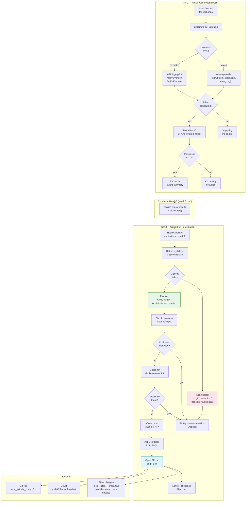
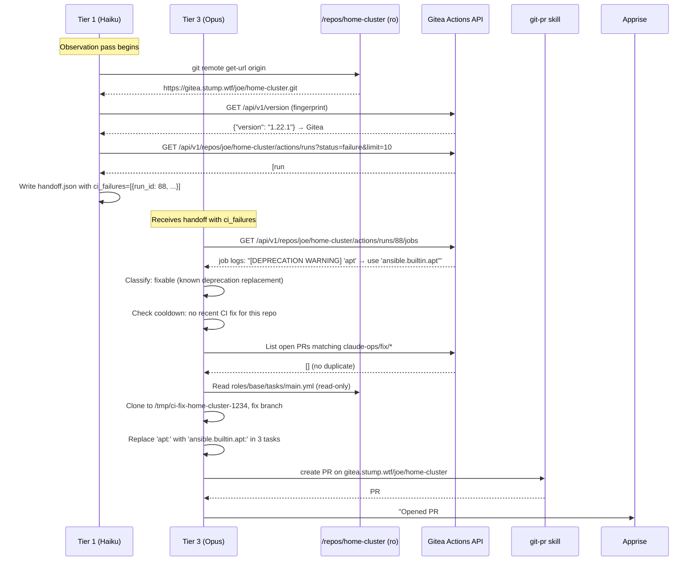

# Design: CI Pipeline Failure Detection and Self-Correction

## Context

Claude Ops runs a tiered health-check loop over mounted infrastructure repos. Until now, health checks have been limited to runtime signals: HTTP response codes, DNS resolution, container state. CI pipeline status — whether the repo's own automation is healthy — has been invisible.

The gap matters because CI failures on infrastructure repos have direct operational consequences. A failing Ansible playbook means the next `redeploy-service` Tier 3 action will also fail. A broken workflow that manages Docker image builds means images will go stale. Detecting these failures proactively, rather than discovering them when an emergency redeployment fails, reduces mean time to recovery.

This design extends two existing systems:

1. **PR-based workflow (SPEC-0018, ADR-0018)**: The agent already creates PRs for config drift (renamed images, deprecated options). This capability adds code-fix PRs as a second use case, with a narrower scope.
2. **Skills-based tool orchestration (SPEC-0023, ADR-0022)**: Provider detection and CI API calls follow the same MCP → CLI → HTTP preference chain already used by container-ops, git-pr, and other skills.

**References**: ADR-0026, SPEC-0018 (PR-Based Config Changes), SPEC-0023 (Skills-Based Tool Orchestration), ADR-0018, ADR-0022

## Goals / Non-Goals

### Goals
- Detect CI pipeline failures on mounted repos as part of the standard Tier 1 observation pass
- Auto-discover the git provider from the repo's remote URL without operator configuration
- Classify failures into fixable (syntax/lint) and non-fixable (logic/transient) categories
- Propose fixes for fixable failures via PR at Tier 3 only
- Notify humans for non-fixable failures with actionable context
- Clarify the Never Allowed boundary so PR-based playbook fixes are explicitly permitted

### Non-Goals
- Fixing logic errors, race conditions, or failures that require understanding playbook intent
- Modifying inventory files, secrets, or network configuration under any circumstances
- Merging PRs — every proposed fix requires human review and approval
- Monitoring CI for repos not mounted under `/repos/`
- Providing CI status in the dashboard UI (a separate future capability)
- Replacing Tier 3 Ansible redeployment — CI fix PRs are upstream of redeployment, not a substitute

## Decisions

### Provider Detection: Static Table + API Fingerprinting

**Choice**: Use a static hostname table for well-known providers, then probe API version endpoints for self-hosted instances.

**Rationale**: Well-known providers (github.com, gitlab.com, codeberg.org) can be identified instantly with zero network cost. Self-hosted Gitea, Forgejo, and GitLab instances vary too widely in hostname to enumerate statically, but they all expose a predictable `/api/v1/version` or `/api/v4/version` endpoint. This two-step approach handles ~95% of real-world cases efficiently while remaining extensible.

**Alternatives considered**:
- *Require operator to configure provider in CLAUDE-OPS.md*: Rejected. Adds per-repo configuration burden and defeats the goal of zero-config operation.
- *Probe only, no static table*: Rejected. Adds unnecessary latency for common cases.
- *Infer from token env vars*: Rejected. An operator might have both `GITHUB_TOKEN` and `GITEA_TOKEN` set, making inference ambiguous.

### Fix Scope: Syntax and Lint Only

**Choice**: Limit automated fixes to YAML syntax errors and Ansible-lint deprecations with known, unambiguous replacements. Refuse all other fix attempts.

**Rationale**: The value of automated fixes comes from high confidence and low risk. YAML indentation errors and deprecated module names have deterministic fixes that can be verified by re-reading the file. Logic errors, by contrast, require understanding the author's intent — a quality only a human can provide. A false-positive fix that introduces a new bug would be worse than no fix at all.

**Alternatives considered**:
- *Fix all errors where the agent is >80% confident*: Rejected. Confidence thresholds are hard to calibrate and introduce unpredictable behavior.
- *Let Tier 3 decide case-by-case*: Rejected. Without a classification step, Opus might attempt fixes it shouldn't; having an explicit allow-list is more auditable.

### Tier Assignment: Detection in Tier 1, Fix in Tier 3

**Choice**: Tier 1 (Haiku) detects CI failures and includes them in the handoff. Tier 3 (Opus) reads logs, classifies, and proposes fixes.

**Rationale**: CI status checks are read-only observations — appropriate for Tier 1. Diagnosing log output, understanding Ansible module semantics, and writing correct playbook patches require the reasoning capability of Opus. Tier 2 (Sonnet) sits between and does not add value in this path: the failure is either simple enough for a targeted code fix (Tier 3) or needs human attention (notification). Passing through Tier 2 would add latency without benefit for this specific capability.

**Alternatives considered**:
- *Tier 2 handles simple fixes, Tier 3 handles complex*: Rejected. The boundary between simple and complex is exactly what requires Opus to evaluate. Tier 2 lacks the judgment to make this call reliably.
- *Tier 1 reads logs and classifies*: Rejected. Log parsing and error classification require model reasoning beyond Haiku's cost-optimized use case.

### Handoff Enrichment: CI Context in Structured Handoff

**Choice**: Tier 1 writes CI failure context (run IDs, workflow names, repo names, provider) into `handoff.json` alongside existing health check results.

**Rationale**: The handoff file already carries structured context from Tier 1 to Tier 2/3. Extending it with CI failure fields costs nothing architecturally and ensures Tier 3 does not need to re-query for basic metadata.

### Never Allowed Boundary: Clarify, Don't Weaken

**Choice**: Update the Never Allowed wording from "Modify inventory files, playbooks..." to "Directly modify inventory files, playbooks... on running hosts." The filesystem-level read-only mount on `/repos/` provides the actual enforcement; the prompt-level rule is clarified to match the real intent.

**Rationale**: The original rule was written to prevent the agent from editing files in-place on running infrastructure. It was never intended to block PR proposals, which already existed for config drift. Making the distinction explicit resolves the ambiguity without changing the actual safety boundary.

## Architecture

## Provider Token and Tool Mapping

| Provider | Hostname | Token Env Var | MCP Tools | CLI Fallback | HTTP Fallback |
|----------|----------|---------------|-----------|--------------|---------------|
| GitHub | `github.com` | `GITHUB_TOKEN` | `mcp__github__*` | `gh` | `https://api.github.com` |
| GitLab | `gitlab.com` | `GITLAB_TOKEN` | `mcp__gitlab__*` | `glab` | `https://gitlab.com/api/v4` |
| Forgejo | `codeberg.org` | `CODEBERG_TOKEN` | `mcp__gitea__*` (compatible) | `tea` | `https://codeberg.org/api/v1` |
| Gitea (self-hosted) | any (fingerprinted) | `GITEA_TOKEN` | `mcp__gitea__*` | `tea` | `https://<host>/api/v1` |
| GitLab (self-hosted) | any (fingerprinted) | `GITLAB_TOKEN` | `mcp__gitlab__*` | `glab` | `https://<host>/api/v4` |

## Fixable Failure Pattern Reference

The following patterns are explicitly recognized by the classification step. This list is the authoritative scope of automated fixes:

| Pattern | Example Log Excerpt | Fix Strategy |
|---------|--------------------|----|
| YAML indentation error | `mapping values are not allowed here` at file:line | Fix indentation at referenced line |
| YAML tab character | `found character '\t' that cannot start any token` | Replace tab with spaces |
| Ansible-lint deprecated bare module | `[DEPRECATION WARNING] Use 'ansible.builtin.apt'` | Replace bare module with FQCN |
| Missing `loop:` for `item` reference | `'item' is undefined` in task without loop | Add `loop: [...]` or fix variable reference |
| Role not found (existing role renamed) | `could not find role 'roles/old-name'` | Update role reference to current name (if resolvable from repo structure) |

Any error not in this table is classified as non-fixable.

## Risks / Trade-offs

- **PR accumulation on persistent failures** → The per-repo 24-hour cooldown prevents duplicate PRs. After one PR is opened, subsequent cycles generate notifications pointing to the existing PR until it is merged or closed.
- **Fingerprinting latency for self-hosted providers** → Probing two API endpoints adds ~200–500ms per unknown host. This cost is paid once per session; the result is cached in the tool inventory for all subsequent operations.
- **Forgejo/Gitea API compatibility drift** → Forgejo maintains API compatibility with Gitea, but may diverge over time. If the `/api/v1/` path stops working, the fingerprint will fail and fall through to unknown. Mitigation: the fallback (HTTP curl) will still work for well-configured instances.
- **Wrong fix due to partial log parsing** → If the agent misclassifies a complex error as a simple lint fix, it may create a PR with an incorrect change. Mitigation: the PR requires human review before merging; the worst case is a PR that doesn't fix the problem, not one that makes things worse.
- **Five-provider surface area in runbook instructions** → Maintaining correct API paths, token names, and tool preferences for five providers increases the instruction surface area. Mitigation: the provider table and pattern reference in this design doc serve as the authoritative reference; the skill and prompts reference it.

## Changes Required to Existing Files

The following existing files MUST be updated to implement this spec:

### `prompts/agent.md`
- Update "Never Allowed" list: change "Modify inventory files, playbooks, Helm charts, or Dockerfiles" to "Directly modify inventory files, playbooks, Helm charts, or Dockerfiles on running hosts"
- Add CI failure detection to the Tier 1 observation steps
- Add CI failure fields to the Tier 1→Tier 2/3 handoff schema

### `prompts/tier2-investigate.md` and `prompts/tier3-remediate.md`
- Update "Never Allowed" list with same clarification as agent.md
- Tier 3: add CI self-correction section between repo extension discovery and playbook remediation

### `.claude/skills/git-pr.md`
- Remove `checks/*.md` and `playbooks/*.md` from the denied paths in the Scope Rules section
- Add note: "PR-based code fixes to checks and playbooks in mounted repos are permitted at Tier 3 per SPEC-0026"

### New skill: `.claude/skills/ci-monitor.md`
- Provider auto-discovery algorithm (steps 1–5)
- CI API query patterns per provider
- Job log retrieval patterns per provider
- Failure classification table (fixable patterns)
- Cooldown integration for CI fix attempts

## Open Questions

- Should Tier 1 report CI failures for repos where *all* recent runs are failing (vs. only the most recent)? Current design uses "last 24 hours" which could produce noise for repos with known persistent failures awaiting human fix. A "new failure since last check" model may be less noisy.
- Should the agent comment on an existing PR if it re-encounters the same CI failure after a fix PR was already opened? This would provide status updates without creating duplicates.
- GitLab self-hosted fingerprinting uses `/api/v4/version` which requires authentication on some instances. If the probe returns 401, should this count as "detected GitLab" or "unknown"?
