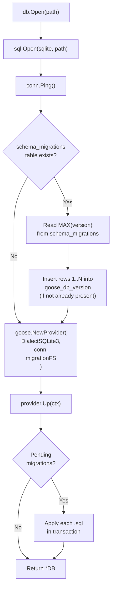
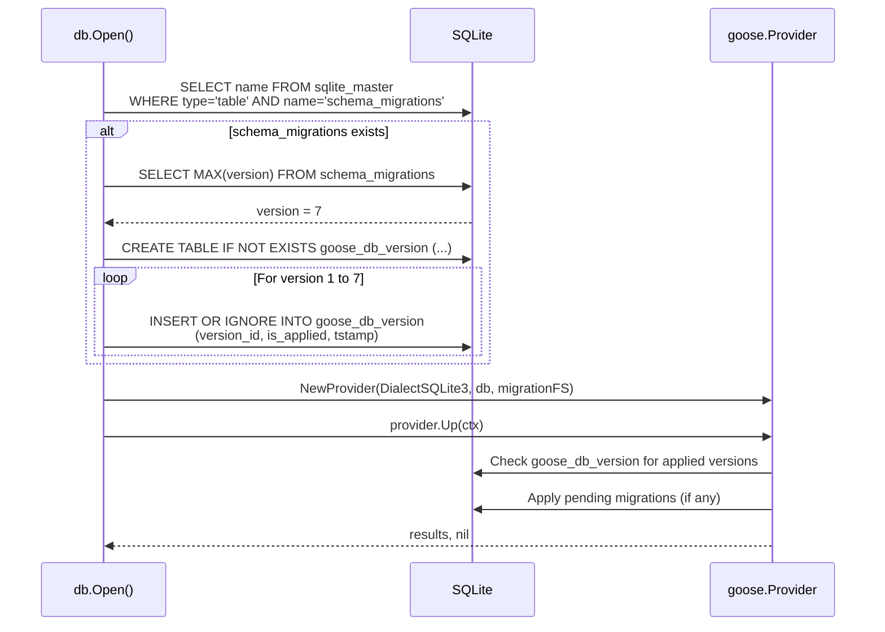

# Design: Goose Migration Framework Adoption

## Context

Claude Ops manages its SQLite schema through a hand-rolled migration framework in `internal/db/db.go`. This framework defines migrations as inline Go functions (`migrate001` through `migrate007`) registered in a `[]migration` slice, tracks applied versions in a `schema_migrations` table, and runs pending migrations inside transactions on startup via `db.Open()`. While functional, it lacks rollback support, embeds SQL in Go code, and requires boilerplate for each new migration.

ADR-0021 accepted `pressly/goose v3` as the replacement. This design describes how to execute the migration: converting existing migrations to SQL files, embedding them in the binary, bootstrapping existing databases, and integrating goose's Provider API into `db.Open()`.

## Goals / Non-Goals

### Goals

- Convert all 7 inline Go migrations to standalone `.sql` files with up and down sections
- Embed migration files into the binary via `//go:embed` (zero runtime file dependencies)
- Bootstrap existing databases from `schema_migrations` to `goose_db_version` without data loss
- Integrate goose's `NewProvider()` API into `db.Open()` for programmatic startup migration
- Remove all hand-rolled migration code after cutover
- Maintain full backward compatibility: all existing tests pass, `db.Open()` API unchanged

### Non-Goals

- Adding a goose CLI binary to the project (programmatic-only usage via Provider API)
- Supporting Go-based migrations (SQL-only for this project's complexity level)
- Migrating production databases in-place during a rolling deployment (single-binary, single-instance)
- Adding migration generation tooling (manual file creation is sufficient)

## Decisions

### Decision 1: Use the Provider API, Not Global Functions

**Choice**: Use `goose.NewProvider(goose.DialectSQLite3, db, fsys)` instead of `goose.SetDialect()` + `goose.Up()`.

**Rationale**: The Provider API is goose v3's recommended approach for programmatic use. It is stateless (no global variables), supports `embed.FS` natively via the `fs.FS` interface, and returns structured results from `provider.Up()`. The global functions are legacy and thread-unsafe.

### Decision 2: Migrations Directory Inside internal/db/

**Choice**: Place SQL files at `internal/db/migrations/*.sql` and embed them from the `db` package.

**Rationale**: Co-locating migrations with the database code keeps the dependency graph simple. The `db` package already owns schema management. The `internal/` prefix prevents external packages from importing the embed FS. Alternative locations (top-level `migrations/`, `sql/`) would require cross-package embedding or a separate package.

### Decision 3: Bootstrap via Direct goose_db_version INSERT

**Choice**: Before calling `provider.Up()`, check for the legacy `schema_migrations` table and, if it contains rows, insert corresponding entries into `goose_db_version` to mark those migrations as already applied.

**Rationale**: Goose tracks applied migrations in its own `goose_db_version` table with a specific schema (id, version_id, is_applied, tstamp). The simplest bootstrap is to create this table (if it doesn't exist) and insert rows for each version found in `schema_migrations`. This is a one-time operation that makes goose believe those migrations were already applied, so `provider.Up()` only runs new ones. The approach is simpler and more reliable than trying to use goose's own APIs to "mark" migrations, since the Provider API doesn't expose a `goose.SetVersion()` equivalent.

### Decision 4: Five-Digit Version Numbers

**Choice**: Use `00001` through `00007` for converted migrations, continuing with `00008+` for new ones.

**Rationale**: Five-digit padding matches goose's default `goose create` output and provides room for 99,999 migrations. The version numbers match the existing `schema_migrations` versions (1-7), which simplifies the bootstrap mapping.

### Decision 5: Leave schema_migrations Table In Place

**Choice**: After bootstrap, do NOT drop the legacy `schema_migrations` table.

**Rationale**: Dropping it adds risk (irreversible) for no benefit. The table is small (7 rows) and inert once goose takes over. If a rollback to the hand-rolled system were ever needed (unlikely but possible during the transition), the table would still be valid. It can be cleaned up in a future migration if desired.

### Decision 6: SQLite DROP COLUMN for Down Migrations

**Choice**: Use `ALTER TABLE ... DROP COLUMN` in down migrations for column additions, with a comment noting the SQLite version requirement.

**Rationale**: `modernc.org/sqlite` bundles SQLite 3.46+ which supports `DROP COLUMN` (added in SQLite 3.35.0). This avoids the complex table-rebuild pattern. The down migrations are primarily for development use; production rollbacks would use database backups.

## Architecture

### File Layout After Migration

```
internal/db/
  db.go                    # DB type, Open(), Close(), all query methods
  db_test.go               # Existing tests (unchanged)
  migrations/
    00001_initial_schema.sql
    00002_session_metadata.sql
    00003_session_trigger.sql
    00004_events.sql
    00005_escalation_chain.sql
    00006_memories.sql
    00007_session_summary.sql
```

### db.Open() Flow



### Bootstrap Sequence Detail



### Migration File Format

Each SQL file follows goose's annotation format:

```sql
-- +goose Up
CREATE TABLE sessions (
    id INTEGER PRIMARY KEY AUTOINCREMENT,
    ...
);

CREATE INDEX idx_sessions_status ON sessions(status, started_at);

-- +goose Down
DROP INDEX IF EXISTS idx_sessions_status;
DROP TABLE IF EXISTS sessions;
```

### Embed Declaration

```go
package db

import "embed"

//go:embed migrations/*.sql
var migrationFS embed.FS
```

### Revised db.Open()

```go
func Open(path string) (*DB, error) {
    conn, err := sql.Open("sqlite", path+"?_pragma=journal_mode(wal)&_pragma=busy_timeout(5000)")
    if err != nil {
        return nil, fmt.Errorf("open sqlite: %w", err)
    }
    conn.SetMaxOpenConns(1)

    if err := conn.Ping(); err != nil {
        _ = conn.Close()
        return nil, fmt.Errorf("ping sqlite: %w", err)
    }

    // Bootstrap: migrate legacy schema_migrations -> goose_db_version
    if err := bootstrapFromLegacy(conn); err != nil {
        _ = conn.Close()
        return nil, fmt.Errorf("bootstrap legacy migrations: %w", err)
    }

    // Create goose provider with embedded migrations
    provider, err := goose.NewProvider(
        goose.DialectSQLite3,
        conn,
        migrationFS,
    )
    if err != nil {
        _ = conn.Close()
        return nil, fmt.Errorf("create migration provider: %w", err)
    }

    // Apply all pending migrations
    if _, err := provider.Up(context.Background()); err != nil {
        _ = conn.Close()
        return nil, fmt.Errorf("apply migrations: %w", err)
    }

    return &DB{conn: conn}, nil
}
```

### Bootstrap Function

```go
func bootstrapFromLegacy(conn *sql.DB) error {
    // Check if legacy table exists
    var count int
    err := conn.QueryRow(
        `SELECT COUNT(*) FROM sqlite_master WHERE type='table' AND name='schema_migrations'`,
    ).Scan(&count)
    if err != nil {
        return fmt.Errorf("check legacy table: %w", err)
    }
    if count == 0 {
        return nil // Fresh database, no bootstrap needed
    }

    // Check if goose table already exists (already bootstrapped)
    err = conn.QueryRow(
        `SELECT COUNT(*) FROM sqlite_master WHERE type='table' AND name='goose_db_version'`,
    ).Scan(&count)
    if err != nil {
        return fmt.Errorf("check goose table: %w", err)
    }
    if count > 0 {
        return nil // Already bootstrapped
    }

    // Read max version from legacy table
    var maxVersion int
    err = conn.QueryRow(`SELECT COALESCE(MAX(version), 0) FROM schema_migrations`).Scan(&maxVersion)
    if err != nil {
        return fmt.Errorf("read legacy version: %w", err)
    }
    if maxVersion == 0 {
        return nil // No migrations applied in legacy system
    }

    // Create goose tracking table
    _, err = conn.Exec(`CREATE TABLE goose_db_version (
        id INTEGER PRIMARY KEY AUTOINCREMENT,
        version_id INTEGER NOT NULL,
        is_applied INTEGER NOT NULL,
        tstamp TEXT NOT NULL DEFAULT (datetime('now'))
    )`)
    if err != nil {
        return fmt.Errorf("create goose_db_version: %w", err)
    }

    // Insert a row for each applied legacy version
    for v := 1; v <= maxVersion; v++ {
        _, err = conn.Exec(
            `INSERT INTO goose_db_version (version_id, is_applied, tstamp) VALUES (?, 1, datetime('now'))`,
            v,
        )
        if err != nil {
            return fmt.Errorf("insert goose version %d: %w", v, err)
        }
    }

    return nil
}
```

### Migration File Contents

**00001_initial_schema.sql** -- Creates `sessions`, `health_checks`, `cooldown_actions`, `service_health_streak`, `config` tables and their indexes.

**00002_session_metadata.sql** -- Adds `response`, `cost_usd`, `num_turns`, `duration_ms` columns to `sessions`.

**00003_session_trigger.sql** -- Adds `trigger` (with DEFAULT 'scheduled') and `prompt_text` columns to `sessions`.

**00004_events.sql** -- Creates `events` table with indexes.

**00005_escalation_chain.sql** -- Adds `parent_session_id` column and index to `sessions`.

**00006_memories.sql** -- Creates `memories` table with indexes.

**00007_session_summary.sql** -- Adds `summary` column to `sessions`.

Each file's `-- +goose Up` section contains the exact DDL from the corresponding `migrateNNN()` function. Each file's `-- +goose Down` section reverses those changes.

### Code Removed

After the goose integration, the following will be deleted from `internal/db/db.go`:

- The `migration` struct type (line 121-124)
- The `migrations` variable (lines 126-134)
- The `migrate()` method (lines 136-178)
- Functions `migrate001` through `migrate007` (lines 180-241, 243-256, 258-269, 271-291, 293-304, 708-732, 897-903)

### New Imports

```go
import (
    "context"
    "embed"

    "github.com/pressly/goose/v3"
)
```

The `fmt` and `database/sql` imports remain. The unused `time` import in `db.go` (if only used by migration code) would also be removed -- but `time` is used by `CheckCooldown` and other methods, so it stays.

## Risks / Trade-offs

- **Bootstrap correctness**: The bootstrap function manually creates goose's tracking table and inserts rows. If goose's internal schema changes in a future version, this could break. Mitigation: pin the goose dependency version; the `goose_db_version` table schema has been stable since goose v2.
- **One-time bootstrap on every Open()**: The bootstrap check runs on every `db.Open()` call, adding two `SELECT COUNT(*)` queries. These are trivially fast on SQLite's `sqlite_master` table. After the first successful bootstrap, both checks short-circuit immediately.
- **Down migration limitations**: SQLite's `ALTER TABLE` is limited. While `modernc.org/sqlite` (v3.46+) supports `DROP COLUMN`, complex down migrations (renaming columns, changing types) would require table rebuilds. For this project's simple schema, `DROP COLUMN` and `DROP TABLE` cover all cases.
- **New dependency**: Adding `pressly/goose/v3` brings in goose and its transitive dependencies. The library is ~3k lines and its dependency tree is small (primarily `database/sql` interfaces). This is acceptable for the migration tooling benefits.
- **Test isolation**: Goose's Provider creates and manages the `goose_db_version` table. Tests using `openTestDB()` will now also have this table present. No existing test queries this table, so there is no impact.

## Migration Plan

### Step 1: Add goose dependency

```bash
go get github.com/pressly/goose/v3
```

### Step 2: Create SQL migration files

Create `internal/db/migrations/` and write all seven `.sql` files by extracting DDL from the existing Go functions.

### Step 3: Add embed directive

Add `//go:embed migrations/*.sql` and `var migrationFS embed.FS` to `internal/db/db.go` (or a dedicated `embed.go` file in the same package).

### Step 4: Implement bootstrap function

Add `bootstrapFromLegacy()` to handle the one-time cutover from `schema_migrations` to `goose_db_version`.

### Step 5: Replace db.Open() migration logic

Replace the `d.migrate()` call with the goose Provider creation and `provider.Up()` call.

### Step 6: Remove legacy migration code

Delete the `migration` struct, `migrations` slice, `migrate()` method, and all `migrateNNN()` functions.

### Step 7: Verify

```bash
go vet ./...
golangci-lint run
go test ./internal/db/ -count=1 -race -v
go test ./... -count=1 -race
```

All existing tests must pass. A fresh database and a "legacy" database (with `schema_migrations`) must both work correctly through `db.Open()`.

## Open Questions

- Should the bootstrap function be extracted to a separate file (e.g., `internal/db/bootstrap.go`) for clarity, or kept in `db.go`?
- Should a new test be added that specifically verifies the bootstrap path (creating a database with the old system, then opening it with goose)?
- Should the `schema_migrations` table be dropped in a future migration (e.g., `00008_drop_legacy_tracking.sql`) after a grace period?
- Should goose's `provider.Status()` be exposed through the dashboard for migration version visibility?
