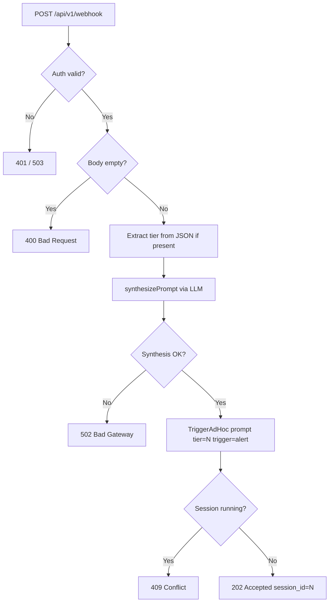

# Design: Inbound Webhook Alert Ingestion

## Context

Claude Ops currently starts sessions in three ways: on a fixed schedule (`trigger = "scheduled"`), via the web UI trigger form (`trigger = "manual"`), and via the REST API or OpenAI-compatible chat endpoint (`trigger = "api"`). External monitoring tools — UptimeKuma, Grafana Alertmanager, PagerDuty, Healthchecks.io, generic CI pipelines — have no push path. Operators must either wait for the next scheduled run or manually trigger an investigation after being paged. This spec adds a fourth path with `trigger = "alert"`.

The core challenge is payload heterogeneity: each tool emits a different JSON schema, and maintaining a per-tool schema mapping in code is brittle. The chosen solution delegates schema interpretation to an LLM, which reads the payload and produces the same quality of prompt a human operator would write when triggering manually. See ADR-0024 for the decision rationale.

Related specs:
- SPEC-0012: Ad-Hoc Session Triggering
- SPEC-0024: OpenAI-Compatible Chat Endpoint (reuses auth pattern)

## Goals / Non-Goals

### Goals
- Accept webhook POSTs from any tool without per-tool configuration
- Produce an investigation prompt equivalent in quality to a human-authored manual trigger
- Store `trigger = "alert"` so alert-driven sessions are distinguishable in the audit trail
- Reuse existing `TriggerAdHoc` — the session lifecycle is unchanged
- Reuse `CLAUDEOPS_CHAT_API_KEY` — no new secrets to manage

### Non-Goals
- HMAC/signature verification per tool (GitHub webhooks, Slack signing, etc.) — bearer token is sufficient for a self-hosted deployment
- Webhook routing rules or per-source filtering — all valid payloads are accepted and synthesized
- Deduplication / idempotency keys — if a monitoring tool fires the same alert twice, two investigation requests will arrive; the second gets a 409 if the first is still running
- Persistent webhook event log — the synthesized prompt and session record are the durable artifact
- Async queue / backlog — no queue; one session at a time, same as all other trigger paths

## Decisions

### LLM for payload interpretation

**Choice**: Call `claude-haiku-4-5-20251001` (configurable) with a system prompt that instructs it to produce a one-paragraph investigation brief from the raw payload body.

**Rationale**: Haiku is fast (~1s) and cheap. The prompt synthesis pattern is already used in `summarize.go` (session TL;DR) and `busy.go` (busy response generation). Maintaining per-tool schema extractors in code would require a release for every new monitoring tool integration.

**Alternatives considered**:
- Per-tool template mapping with `?source=uptimekuma`: rejected — requires code change per tool, breaks when tool schemas change.
- Require caller to provide `{"prompt": "..."}`: rejected — tools like UptimeKuma emit a fixed payload; this would require a middleware shim the operator must run.

### Reuse `CLAUDEOPS_CHAT_API_KEY` for auth

**Choice**: Bearer token from the existing `CLAUDEOPS_CHAT_API_KEY` env var, constant-time comparison.

**Rationale**: Operators already have this key configured for the OpenAI-compatible chat endpoint (ADR-0020). Adding a second key for webhooks creates unnecessary secret management overhead for self-hosted deployments.

**Alternatives considered**:
- Separate `CLAUDEOPS_WEBHOOK_API_KEY`: rejected — two keys for functionally identical authorization creates confusion.
- No auth (IP allowlist only): rejected — Claude Ops is often exposed behind a reverse proxy; bearer token provides defense-in-depth.

### `tier` extraction from JSON before LLM synthesis

**Choice**: If the body parses as JSON and contains a top-level `tier` integer, extract it before passing the payload to the LLM. The `tier` field is stripped from the payload string the LLM sees.

**Rationale**: Avoids the LLM needing to extract operational metadata from the payload. Keeps the synthesized prompt focused on the alert content. Most tools won't send `tier`, so the default (Tier 1) is used in practice; the override exists for operators using Claude Ops' own API or custom alerting scripts.

### New `trigger = "alert"` value

**Choice**: Store the string `"alert"` in the `trigger` column. No schema migration required — the column is `TEXT` with no constraint.

**Rationale**: Distinguishes webhook-triggered sessions from scheduled, manual, API, and escalation sessions in the audit trail, dashboard filter, and REST API. The dashboard `tierLabel`-style helper pattern can be extended to map `"alert"` to a display label (e.g., "Alert").

### `202 Accepted` response status

**Choice**: Return `202 Accepted` rather than `201 Created`.

**Rationale**: The session is triggered asynchronously — the response arrives before the agent has done any work. `202` correctly signals "request received and enqueued" while `201` implies a resource was created synchronously. The body includes `session_id` so the caller can poll `/api/v1/sessions/{id}` for results.

## Architecture

```mermaid
sequenceDiagram
    participant Tool as External Tool<br/>(UptimeKuma / Grafana / etc.)
    participant EP as POST /api/v1/webhook<br/>webhook_handler.go
    participant Auth as Bearer Auth<br/>(CLAUDEOPS_CHAT_API_KEY)
    participant Synth as synthesizePrompt()<br/>webhook_handler.go
    participant API as Anthropic Messages API<br/>(CLAUDEOPS_WEBHOOK_MODEL)
    participant Mgr as Manager.TriggerAdHoc()<br/>session/manager.go
    participant DB as SQLite sessions<br/>trigger="alert"

    Tool->>EP: POST /api/v1/webhook<br/>Authorization: Bearer <key><br/>{arbitrary body}
    EP->>Auth: constant-time compare token
    Auth-->>EP: 401 if invalid / 503 if unconfigured
    EP->>EP: Read body; extract tier if JSON
    EP->>Synth: synthesizePrompt(ctx, body, model)
    Synth->>API: Messages.New(system=synthesis_prompt, user=body)
    API-->>Synth: "Investigate why Gitea at<br/>gitea.stump.wtf is unreachable..."
    Synth-->>EP: synthesized prompt string
    EP->>Mgr: TriggerAdHoc(prompt, tier, "alert")
    Mgr-->>EP: sessionID (or error if busy)
    EP-->>Tool: 202 {"session_id": N, "status": "triggered", "tier": 1}<br/>or 409 if busy / 502 if synthesis failed
    Mgr->>DB: INSERT sessions(trigger="alert", prompt_text=synthesized)
```



## Implementation Sketch

### New files
- `internal/web/webhook_handler.go` — `handleWebhook`, `synthesizePrompt`

### Changes to existing files
- `internal/web/server.go` — register `POST /api/v1/webhook`
- `cmd/claudeops/main.go` — add `--webhook-model` flag (default `claude-haiku-4-5-20251001`), bind `CLAUDEOPS_WEBHOOK_MODEL`
- `internal/config/config.go` — add `WebhookModel string` field
- `internal/web/templates/session.html` (or equivalent) — map `trigger = "alert"` to a display label

### `synthesizePrompt` signature

```go
func synthesizePrompt(ctx context.Context, payload string, model string) (string, error)
```

System prompt for synthesis:
```
You are an alert triage assistant for an infrastructure monitoring system called Claude Ops.
Given the raw body of an inbound webhook alert, write a single focused investigation brief
(2–4 sentences) that a Claude Ops agent can act on immediately. Identify: what service or
system is affected, what the problem appears to be, and what the agent should investigate
first. Output only the investigation brief — no preamble, no JSON, no markdown.
```

### `handleWebhook` logic (pseudocode)

```
1. Read CLAUDEOPS_CHAT_API_KEY; if empty → 503
2. Validate Bearer token (constant-time); if invalid → 401
3. Read body; if empty → 400
4. If JSON: attempt to extract "tier" field; remove it from body string for synthesis
5. synthesizePrompt(ctx, bodyStr, webhookModel) → prompt; if err → 502
6. TriggerAdHoc(prompt, tier, "alert") → sessionID; if busy → 409
7. Write 202 {"session_id": sessionID, "status": "triggered", "tier": tier}
```

## Risks / Trade-offs

- **LLM synthesis latency** (~1–2s added to webhook response time) → Acceptable for alert ingestion; tools typically don't wait on webhook responses for downstream action.
- **Synthesis quality on unusual payloads** (highly custom or binary-adjacent JSON) → The synthesis system prompt is tuned for generic alert content; edge cases produce a generic brief rather than failing. Operators can inspect the `prompt_text` column in the session record to see what was synthesized.
- **Single session concurrency limit** → A burst of alerts while a session is running will receive 409. This is intentional — Claude Ops is a single-agent system. Callers should treat 409 as "already investigating" and not retry immediately.
- **Bearer token reuse** → Same key for chat and webhook endpoints. If an operator wants to revoke webhook access specifically, they must rotate the key (which affects the chat endpoint too). This is acceptable for v1; a multi-key model can be added later.

## Open Questions

- Should the synthesized prompt be truncated to a max length before passing to `TriggerAdHoc`? (Haiku's output is naturally brief given the system prompt, but very large payloads could produce longer briefs.)
- Should `tier` extraction be limited to JSON bodies, or should form-encoded bodies also support a `tier` field?
