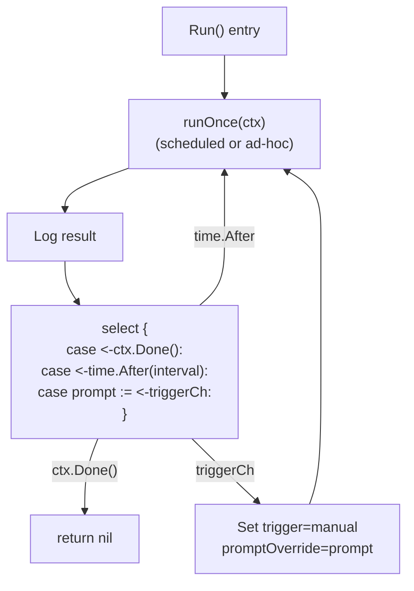
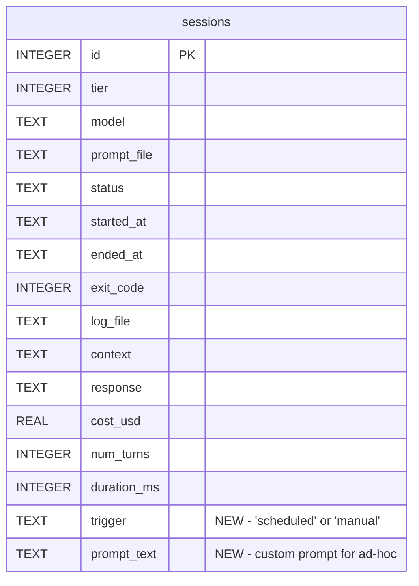

# Design: Manual Ad-Hoc Session Runs from the Dashboard

## Context

Claude Ops runs Claude Code CLI sessions on a recurring interval via `Manager.Run()` (ADR-0010, SPEC-0010/0011). The session manager uses a `select` loop: it runs `runOnce()`, then sleeps on `time.After(interval)` until the next run or context cancellation. The web dashboard (ADR-0008, SPEC-0008) displays session history, service health, and cooldown state but provides no way to trigger a session.

Operators need to kick off an immediate session with a custom prompt -- e.g., "Jellyfin is down, can you take a look?" -- without waiting for the next scheduled run or restarting the container.

ADR-0013 chose a channel-based trigger mechanism over direct handler invocation (concurrency issues) and a queue table (over-engineered for single-user). This design details how the channel integrates with the existing `Run()` loop, the API contract, data model changes, and UI additions.

## Goals / Non-Goals

### Goals
- Allow operators to trigger an immediate session from the dashboard with a custom prompt
- Reuse the entire `runOnce()` lifecycle for ad-hoc sessions (DB record, log file, SSE, result capture)
- Prevent concurrent sessions with clear feedback to the operator
- Record trigger type and prompt text in the database for auditability
- Show trigger metadata in session list and detail views

### Non-Goals
- Queueing multiple ad-hoc requests (only one can be pending; extras are rejected)
- Selecting the tier/model for ad-hoc runs (always uses Tier 1; future enhancement noted in ADR-0013)
- Cancelling a running ad-hoc session from the UI (same as scheduled -- wait for completion or container restart)
- Persisting pending triggers across process restarts (in-memory channel is acceptable per ADR-0013)
- WebSocket-based real-time form feedback (HTMX response swapping is sufficient)

## Decisions

### Use a Buffered Channel of Size 1

**Choice**: The trigger channel is `chan string` with buffer size 1.

**Rationale**: A buffer of 1 allows `TriggerAdHoc()` to return immediately without blocking the HTTP handler, even if the `Run()` loop is mid-execution (the trigger queues for the next iteration). A buffer of 0 (unbuffered) would require the handler to block until the `Run()` loop reads the channel, which could take minutes if a session is running. A buffer > 1 would allow queuing multiple triggers, which adds complexity (queue ordering, stale prompts) for no practical benefit -- operators submit one ad-hoc request at a time.

**Alternatives considered**:
- Unbuffered channel: Handler blocks during active sessions, risking HTTP timeout.
- Channel of size N > 1: Over-engineered. Operators won't queue 5 triggers in advance.
- Mutex-guarded struct instead of channel: More code, same semantics. The channel already provides goroutine-safe signaling.

### Non-Blocking Send with TrySelect

**Choice**: `TriggerAdHoc()` uses a `select` with `default` case to attempt a non-blocking channel send. If the channel is full (session running or trigger already pending), it returns an error immediately.

**Rationale**: The HTTP handler must never block. A non-blocking send maps cleanly to the HTTP response: success (202-ish) or busy (409). There is no need for timeout-based sends or retry logic.

### Pass Prompt as String, Not Struct

**Choice**: The trigger channel carries `string` (the prompt text), not a struct with additional metadata.

**Rationale**: The only operator-provided data is the prompt text. Trigger type (`"manual"`) is inferred by the code path. If future enhancements add fields (e.g., model selection), the channel type can be changed to a struct then. YAGNI for now.

### SessionTrigger Interface for Web Server

**Choice**: The web server receives a `SessionTrigger` interface (with a single `TriggerAdHoc(string) error` method) rather than a concrete `*session.Manager` reference.

**Rationale**: The web server already uses an `SSEHub` interface for the hub dependency. Following the same pattern keeps the web package decoupled from the session package and makes testing straightforward (mock the interface).

### Modify runOnce to Accept Optional Prompt Override

**Choice**: `runOnce()` gains an optional prompt parameter. When non-empty, it is used as the `-p` argument instead of reading from the prompt file. The trigger type and prompt text are passed through to the session DB record.

**Rationale**: This is the minimal change to `runOnce()` that enables ad-hoc sessions. All other lifecycle code (log file, SSE hub, result capture, finalization) remains untouched. The alternative -- a separate `runOnceAdHoc()` method -- would duplicate the entire function body.

### ALTER TABLE with DEFAULT for Trigger Column

**Choice**: Add `trigger TEXT NOT NULL DEFAULT 'scheduled'` so existing rows are backfilled automatically by SQLite.

**Rationale**: All existing sessions were scheduled. The DEFAULT clause handles backfill without a data migration step. `prompt_text TEXT` (nullable, no default) is correct because scheduled sessions have no custom prompt.

## Architecture

### Trigger Flow: Operator to Session

```mermaid
sequenceDiagram
    participant Op as Operator (Browser)
    participant Form as HTMX Form
    participant Web as POST /sessions/trigger
    participant Mgr as Manager.TriggerAdHoc()
    participant Ch as triggerCh (buffered 1)
    participant Loop as Manager.Run() select
    participant Once as runOnce(prompt)
    participant CLI as Claude CLI

    Op->>Form: Types prompt, clicks "Run Now"
    Form->>Web: POST /sessions/trigger {prompt}
    Web->>Mgr: TriggerAdHoc(prompt)

    alt channel has space
        Mgr->>Ch: ch <- prompt (non-blocking)
        Mgr-->>Web: nil (success)
        Web-->>Form: 200 + confirmation HTML
    else channel full (busy)
        Mgr-->>Web: error (busy)
        Web-->>Form: 409 + error HTML
    end

    Note over Loop: Run() is sleeping on time.After
    Ch->>Loop: select receives from triggerCh
    Loop->>Once: runOnce(ctx) with trigger="manual", prompt=prompt
    Once->>Once: Insert session (trigger=manual, prompt_text=prompt)
    Once->>CLI: claude --model haiku -p "operator prompt..."
    CLI-->>Once: stream-json events
    Once-->>Op: SSE /sessions/{id}/stream
    Once->>Once: Finalize session in DB
```

### Channel Integration with Run() Loop



### Data Model Changes



### API Contract: POST /sessions/trigger

**Request**:
```
POST /sessions/trigger
Content-Type: application/x-www-form-urlencoded

prompt=Jellyfin+is+down.+Can+you+take+a+look%3F
```

**Success Response (200)**:
```html
<div class="trigger-result trigger-success">
  Session triggered. Redirecting...
</div>
```
The response is an HTMX swap target. The form uses `hx-post="/sessions/trigger"` with `hx-target` pointing to a result container and `hx-swap="innerHTML"`.

**Busy Response (409)**:
```html
<div class="trigger-result trigger-error">
  A session is already running or queued. Please wait.
</div>
```

**Validation Error (400)**:
```html
<div class="trigger-result trigger-error">
  A prompt is required.
</div>
```

### HTMX Form on Dashboard Index

The form is placed on the dashboard index page below the service status grid and above the latest session summary. It consists of:

1. A `<textarea>` for the prompt (placeholder: "Describe what you want Claude to check or fix...")
2. A submit button labeled "Run Now"
3. A `<div>` target for HTMX response swapping

The form uses these HTMX attributes:
- `hx-post="/sessions/trigger"` on the form element
- `hx-target="#trigger-result"` to swap the response into the result container
- `hx-swap="innerHTML"` for the swap strategy
- `hx-disabled-elt="find button"` to disable the submit button during the request

### Session View Model Changes

The `SessionView` struct gains two fields:
- `Trigger string` -- `"scheduled"` or `"manual"`
- `PromptText string` -- the custom prompt (empty for scheduled)

The `db.Session` struct gains matching fields:
- `Trigger string`
- `PromptText *string`

`InsertSession` is updated to include `trigger` and `prompt_text` in the INSERT statement.

The `scanSession` helper and `sessionColumns` constant are updated to include the new columns.

### Template Changes

**sessions.html** (list): Add a trigger badge column showing "scheduled" or "manual" with distinct styling.

**session.html** (detail): Add trigger type to the metadata card. For manual sessions, show the custom prompt text in a highlighted block below the metadata.

**index.html** (dashboard): Add the HTMX trigger form.

## Files Affected

| File | Change |
|------|--------|
| `internal/session/manager.go` | Add `triggerCh chan string` field. Add `TriggerAdHoc(prompt string) error` method. Modify `Run()` to add `triggerCh` select case. Modify `runOnce()` to accept optional prompt override and set trigger/prompt_text on the session record. |
| `internal/db/db.go` | Add migration 003 (ALTER TABLE for `trigger` and `prompt_text`). Add `Trigger`, `PromptText` fields to `Session` struct. Update `sessionColumns`, `scanSession`, `InsertSession`. |
| `internal/web/server.go` | Add `SessionTrigger` interface. Accept trigger in `New()`. Register `POST /sessions/trigger` route. |
| `internal/web/handlers.go` | Add `handleTriggerSession()` handler. |
| `internal/web/viewmodel.go` | Add `Trigger`, `PromptText` to `SessionView`. Update `ToSessionView()`. |
| `internal/web/templates/index.html` | Add HTMX trigger form with textarea and submit button. |
| `internal/web/templates/sessions.html` | Add trigger badge column to session list table. |
| `internal/web/templates/session.html` | Add trigger type to metadata card. Add prompt text display for manual sessions. |
| `internal/web/static/style.css` | Add styles for `.trigger-form`, `.trigger-result`, `.trigger-badge-scheduled`, `.trigger-badge-manual`. |

## Risks / Trade-offs

- **In-memory channel loses pending triggers on crash** -- If the process crashes between `TriggerAdHoc()` accepting the prompt and `runOnce()` executing it, the trigger is lost. This is acceptable per ADR-0013: the operator can simply re-submit from the dashboard.
- **Single pending trigger limit** -- Only one ad-hoc trigger can be pending at a time. If the channel is full (session running + trigger pending), additional triggers are rejected with 409. This is intentional: queuing multiple prompts adds complexity for no practical benefit.
- **No model selection for ad-hoc runs** -- Ad-hoc sessions always use the Tier 1 model. ADR-0013 notes model selection as a future enhancement. When added, the channel type changes from `string` to a struct.
- **Race between timer and trigger** -- If `time.After` fires at the same instant a trigger arrives, Go's `select` picks one at random. This is harmless: either a scheduled or ad-hoc session runs, and the other happens on the next iteration.

## Migration Plan

1. Migration 003 adds `trigger TEXT NOT NULL DEFAULT 'scheduled'` and `prompt_text TEXT` -- existing rows get `trigger = 'scheduled'` and `prompt_text = NULL` automatically.
2. `InsertSession` is updated to include the new fields. Scheduled sessions pass `trigger = "scheduled"` and `prompt_text = nil`. Ad-hoc sessions pass `trigger = "manual"` and the operator's prompt.
3. `sessionColumns` and `scanSession` are updated to include the new columns. This is backward compatible because migration runs before any queries.
4. The web server receives the `SessionTrigger` interface at construction time. If the session manager is not yet initialized (startup ordering), the trigger form can be hidden or the handler can return 503.

## Open Questions

- Should ad-hoc sessions support selecting the tier/model? (Deferred per ADR-0013; always Tier 1 for now.)
- Should the trigger form auto-redirect to the new session's detail page after submission? (Currently shows a confirmation message; redirect would require knowing the session ID, which is created asynchronously in the Run loop.)
- Should there be a rate limit on ad-hoc triggers beyond the buffer-of-1 mechanism? (Not needed for single-operator use; revisit if multi-user access is added.)
