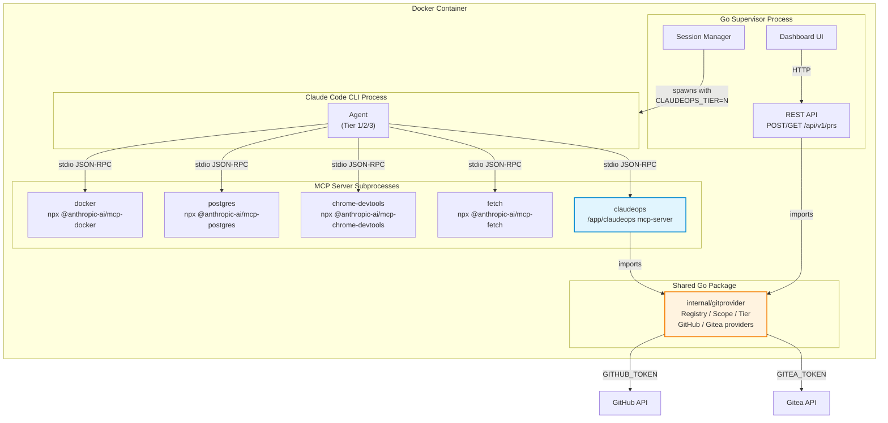
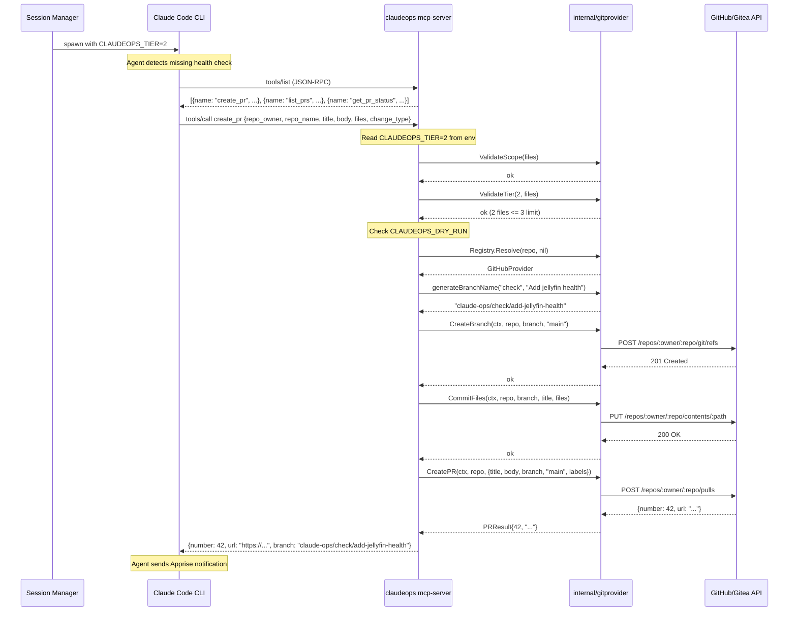

# Design: MCP Server for Git Provider Interface

## Context

Claude Ops agents can propose changes to operational procedures via pull requests (ADR-0018, SPEC-0018). The `internal/gitprovider` package implements a pluggable provider interface with GitHub and Gitea implementations, scope validation, tier gating, and a provider registry. The REST API (`POST /api/v1/prs`, `GET /api/v1/prs`) exposes this functionality to HTTP clients, primarily the dashboard.

However, the Claude Code CLI agent — the primary consumer of PR operations — must currently construct curl commands to call the REST API. This contradicts the MCP-first architecture (ADR-0006, SPEC-0006) where infrastructure operations go through typed MCP tools. ADR-0019 decides to add an MCP server as a `claudeops mcp-server` subcommand, providing typed tools that wrap the existing gitprovider package.

This design document describes how to implement SPEC-0019.

## Goals / Non-Goals

### Goals
- Expose `create_pr`, `list_prs`, and `get_pr_status` as MCP tools over stdio JSON-RPC
- Reuse `internal/gitprovider` package (Registry, ValidateScope, ValidateTier, providers) without duplication
- Enforce tier restrictions server-side via `CLAUDEOPS_TIER` environment variable
- Keep API tokens (`GITHUB_TOKEN`, `GITEA_TOKEN`) in the MCP server process, out of the agent's tool-calling workflow
- Maintain the REST API as a parallel, unmodified access path
- Register the MCP server in `.claude/mcp.json` alongside existing servers

### Non-Goals
- Replacing the REST API — it stays for the dashboard and external integrations
- Absolute token isolation — the agent has Bash access and can find tokens through side channels
- Exposing additional git operations beyond PR create/list/status (e.g., no merge, no branch deletion)
- Supporting MCP transport modes other than stdio (no HTTP/SSE/WebSocket transport)
- Adding authentication/authorization to the MCP protocol itself — trust is based on process isolation

## Decisions

### Subcommand vs. Separate Binary

**Choice**: `claudeops mcp-server` Cobra subcommand in the existing binary
**Rationale**: The binary is already in the container at `/app/claudeops`. A subcommand shares the same `internal/gitprovider` package via direct import. No additional build artifact, Docker layer, or deployment step is needed.
**Alternatives considered**:
- Separate binary (`claudeops-mcp-gitprovider`): Rejected because it requires a separate build target, Docker COPY, and version coordination. The gitprovider package would need to be a shared library or duplicated.
- npx-based MCP server (Node.js): Rejected because it would need to re-implement the gitprovider logic in JavaScript, losing the Go type safety and validation already built.

### MCP Protocol Implementation

**Choice**: Use the `github.com/mark3labs/mcp-go` library for JSON-RPC stdio server implementation
**Rationale**: This is the standard Go MCP SDK. It handles JSON-RPC framing, tool discovery (`tools/list`), tool invocation (`tools/call`), and stdio I/O. Writing a custom JSON-RPC implementation would be unnecessary.
**Alternatives considered**:
- Raw JSON-RPC over stdin/stdout: Rejected because it requires implementing the full MCP protocol from scratch, including message framing, error codes, and schema generation.
- HTTP-based MCP transport: Rejected because `.claude/mcp.json` uses `"type": "stdio"` for all current servers, and the Claude CLI expects stdio communication.

### Tier Enforcement Mechanism

**Choice**: Read `CLAUDEOPS_TIER` from the MCP server's process environment at startup
**Rationale**: The session manager already sets environment variables when spawning the Claude CLI process. The MCP server subprocess inherits these (or receives them via the `.claude/mcp.json` `env` block). This means the tier is set by the trusted supervisor, not self-reported by the agent.
**Alternatives considered**:
- Tier as a tool parameter: Rejected because the agent could pass any tier value, defeating the purpose of server-side enforcement.
- Tier from a shared state file: Rejected because it adds filesystem coordination and the environment variable is simpler and already available.

### Scope of MCP Tools

**Choice**: Three tools — `create_pr`, `list_prs`, `get_pr_status` — mirroring the REST API surface
**Rationale**: These are the three operations the agent needs. `create_pr` is the orchestrating tool (branch + commit + PR in one call). `list_prs` supports duplicate detection. `get_pr_status` supports tracking previously created PRs. The REST API uses the same granularity.
**Alternatives considered**:
- Fine-grained tools (separate `create_branch`, `commit_files`, `open_pr`): Rejected because the agent would need to orchestrate 3 tool calls for every PR, increasing complexity and failure modes. The REST API already combines these into a single endpoint.
- Single `manage_pr` tool with action parameter: Rejected because it collapses distinct operations into one tool with complex conditional parameters, making the schema harder to reason about.

## Architecture

### Component Diagram



### Sequence Diagram: create_pr Flow



### Package Structure

```
cmd/claudeops/
  main.go              # existing — add mcp-server subcommand registration
internal/
  mcpserver/
    server.go          # MCP server initialization, tool registration
    tools.go           # create_pr, list_prs, get_pr_status tool handlers
    tools_test.go      # unit tests for tool handlers
  gitprovider/
    provider.go        # existing — GitProvider interface (unchanged)
    registry.go        # existing — Registry (unchanged)
    scope.go           # existing — ValidateScope (unchanged)
    tier.go            # existing — ValidateTier (unchanged)
    github.go          # existing — GitHub provider (unchanged)
    gitea.go           # existing — Gitea provider (unchanged)
```

### `.claude/mcp.json` Configuration

```json
{
  "mcpServers": {
    "docker": { "...existing..." },
    "postgres": { "...existing..." },
    "chrome-devtools": { "...existing..." },
    "fetch": { "...existing..." },
    "claudeops": {
      "type": "stdio",
      "command": "/app/claudeops",
      "args": ["mcp-server"],
      "env": {
        "GITHUB_TOKEN": "${GITHUB_TOKEN}",
        "GITEA_URL": "${GITEA_URL}",
        "GITEA_TOKEN": "${GITEA_TOKEN}",
        "CLAUDEOPS_TIER": "${CLAUDEOPS_TIER}",
        "CLAUDEOPS_DRY_RUN": "${CLAUDEOPS_DRY_RUN}"
      }
    }
  }
}
```

## Risks / Trade-offs

- **Two access paths to same functionality** → Both MCP and REST call the same `internal/gitprovider` functions. Logic changes propagate automatically. Divergence risk is limited to the thin handler layers, which should have independent test coverage.

- **Token isolation is not absolute** → The agent has Bash access and can read environment variables from `/proc` or run `env`. MCP token gating is defense-in-depth, not a security boundary. Document this explicitly so operators set correct expectations.

- **MCP protocol dependency** → The `mcp-go` library must be maintained as a dependency. If the MCP protocol evolves, the server must be updated. Mitigation: MCP is actively maintained by Anthropic; the tool surface is small (3 tools).

- **`CLAUDEOPS_TIER` missing or malformed** → Default to Tier 1 (most restrictive). This is safe: the agent cannot create PRs if the tier variable is misconfigured. The session manager must ensure the variable is set correctly.

- **Binary size increase** → Adding the MCP server and `mcp-go` dependency increases the binary size. This is minimal compared to the existing binary (which already includes cobra, viper, goldmark, sqlite, etc.).

## Migration Plan

1. **Add `mcp-go` dependency**: `go get github.com/mark3labs/mcp-go`
2. **Create `internal/mcpserver/` package**: Server initialization and tool handlers
3. **Add `mcp-server` Cobra subcommand**: In `cmd/claudeops/main.go`, register a new subcommand that initializes and runs the MCP server
4. **Move `generateBranchName` to shared location**: Currently in `internal/web/api_handlers.go`, needs to be accessible from `internal/mcpserver/`. Move to `internal/gitprovider/` or a shared utility package.
5. **Update `.claude/mcp.json`**: Add the `claudeops` entry to the baseline config
6. **Update Dockerfile**: No changes needed — binary is already built and copied to `/app/claudeops`
7. **Update tier prompts**: Mention MCP tools (`create_pr`, `list_prs`, `get_pr_status`) in the Tier 2 and Tier 3 prompt files so the agent knows they exist
8. **Test**: Unit tests for tool handlers using mock providers, integration test with the real binary

**Rollback**: Remove the `claudeops` entry from `.claude/mcp.json`. The REST API continues to function. No other components are affected.

## Open Questions

- Should the MCP server expose a `health` tool for self-diagnostics (e.g., which providers are enabled, current tier)?
- Should `list_prs` and `get_pr_status` also enforce tier restrictions, or should they be available to all tiers including Tier 1 for informational purposes?
- Should the `create_pr` tool support batch operations (multiple PRs in one call), or should the agent make separate calls per PR?
- Should the entrypoint's MCP config merge support the `claudeops` server entry being overridden by repo-provided configs, or should it be protected as a system server?
