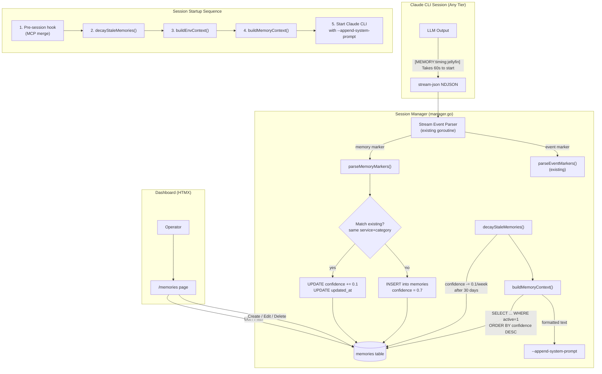
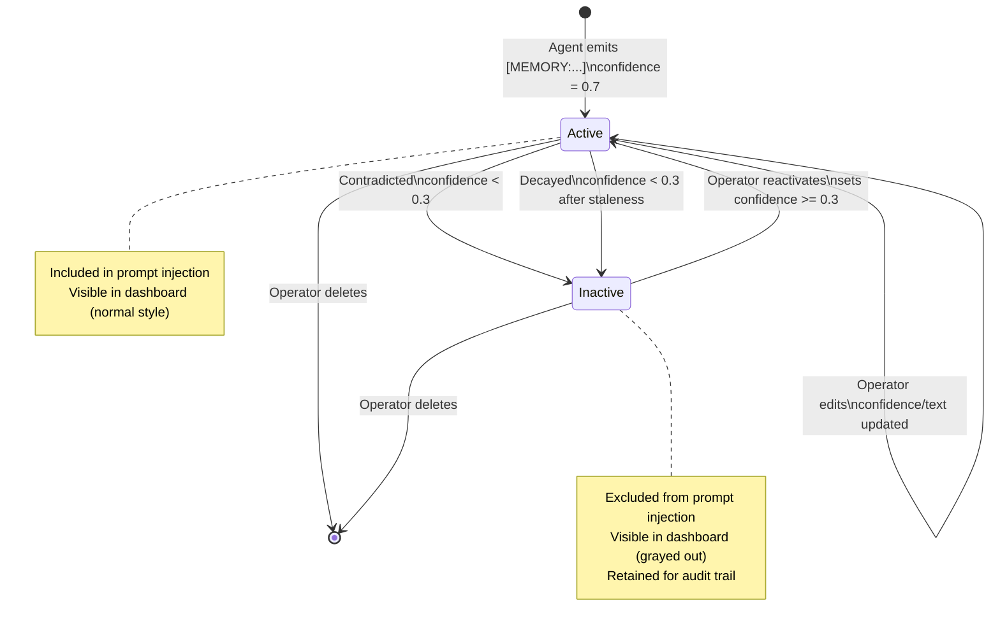

# Design: Persistent Agent Memory System

## Context

Claude Ops runs stateless sessions on a schedule. Each session starts fresh with no knowledge of what previous sessions discovered. The cooldown state tracks remediation limits, but operational knowledge -- timing quirks, dependency orderings, known workarounds -- is lost. This design adds a SQLite-backed memory system that lets the agent persist and recall operational knowledge across sessions, following the architecture established in ADR-0015.

The memory system extends two existing patterns:
1. **Marker parsing** from ADR-0014 (`[EVENT:...]` markers parsed from assistant text in stream-json output)
2. **System prompt injection** from the session manager (`buildEnvContext()` appended via `--append-system-prompt`)

## Goals / Non-Goals

### Goals
- Store operational memories in SQLite with structured metadata (service, category, confidence)
- Parse `[MEMORY:...]` markers from LLM output using the same stream-json pipeline as events
- Inject relevant memories into the system prompt at session start within a token budget
- Provide dashboard CRUD for operator review and curation of agent knowledge
- Support memory lifecycle: creation, reinforcement, contradiction, staleness decay

### Non-Goals
- Semantic similarity search (v1 uses exact service+category matching for reinforcement)
- Embedding-based memory retrieval (simple confidence-ordered query is sufficient)
- Cross-repo memory scoping (all memories are global to the Claude Ops instance)
- Memory import/export (future enhancement)
- Agent self-deletion of memories (agent can only create; operator manages lifecycle)

## Decisions

### Decision 1: Extend the Event Marker Pattern

**Choice**: Use `[MEMORY:category:service] observation` markers, parsed identically to `[EVENT:level:service] message` markers from the stream-json pipeline.

**Rationale**: The event marker system (ADR-0014, SPEC-0013) already demonstrates this pattern end-to-end: regex match on assistant text blocks, extract structured fields, insert into a DB table. Memory markers follow the same code path with a different regex and target table. This means the parsing infrastructure is proven and the LLM already understands the marker convention from the event prompt instructions.

**Alternatives considered**:
- Dedicated MCP tool for memory creation: Higher latency, requires MCP server running, adds tool call overhead
- Write to a flat file: No structured queries, no dashboard integration, concurrent write risk

### Decision 2: Confidence-Ordered Budget Enforcement

**Choice**: Query memories ordered by `confidence DESC`, accumulate estimated token usage (characters / 4), stop when the 2,000-token budget is reached.

**Rationale**: High-confidence memories are the most operationally valuable -- they represent reinforced knowledge that has been confirmed multiple times. By ordering by confidence, the agent always sees its most trusted knowledge first. The character/4 token estimate is rough but sufficient for budgeting; exact tokenization would require a tokenizer dependency.

**Alternatives considered**:
- Recency-ordered: Would prioritize new, unverified observations over well-established knowledge
- Random sampling: Non-deterministic, makes debugging difficult
- All memories with hard character limit: Doesn't prioritize quality

### Decision 3: Soft Matching for Reinforcement

**Choice**: Reinforcement triggers when a new memory has the same service + category as an existing active memory. Exact text matching is not required -- the combination of service and category narrows the scope enough that duplicate detection is practical without NLP.

**Rationale**: The agent may phrase the same observation differently across sessions ("Takes 60s to start" vs "Startup takes about a minute"). Requiring exact text match would cause duplicate accumulation. Service+category matching is simple, deterministic, and covers the most common case: the agent re-observing the same behavioral pattern.

**Trade-off**: This means only one active memory per (service, category) pair is effectively maintained. If the agent has two distinct observations for the same service+category, the second will reinforce rather than create. This is acceptable for v1 since categories are specific enough (`timing` vs `behavior` vs `dependency`) that distinct observations typically fall into different categories.

### Decision 4: Staleness Decay at Session Start

**Choice**: Run the staleness decay check once per session, before `buildMemoryContext()`, as part of the session startup sequence.

**Rationale**: Decay only needs to run periodically, not in real-time. Running it at session start ensures memories are always current before injection. This avoids a separate cron job or background goroutine.

## Architecture

### Data Flow



### Database Schema

```sql
-- Migration 005: Add memories table
CREATE TABLE memories (
    id INTEGER PRIMARY KEY AUTOINCREMENT,
    service TEXT,                          -- nullable, NULL = general memory
    category TEXT NOT NULL,                -- timing, dependency, behavior, remediation, maintenance
    observation TEXT NOT NULL,             -- the actual knowledge
    confidence REAL NOT NULL DEFAULT 0.7,  -- 0.0 to 1.0
    active INTEGER NOT NULL DEFAULT 1,     -- 0 = soft-deleted / below threshold
    created_at TEXT NOT NULL,
    updated_at TEXT NOT NULL,
    session_id INTEGER REFERENCES sessions(id),
    tier INTEGER NOT NULL DEFAULT 1
);

CREATE INDEX idx_memories_service ON memories(service, active);
CREATE INDEX idx_memories_confidence ON memories(confidence, active);
CREATE INDEX idx_memories_category ON memories(category);
```

This follows the existing migration pattern in `internal/db/db.go` where each migration is a numbered function (`migrate001` through `migrate004`). Memory adds `migrate005`.

### Memory Marker Regex

```go
var memoryMarkerRe = regexp.MustCompile(
    `\[MEMORY:(timing|dependency|behavior|remediation|maintenance)` +
    `(?::([a-zA-Z0-9_-]+))?\]\s*(.+)`)
```

Groups: (1) category, (2) optional service, (3) observation text.

This mirrors the `eventMarkerRe` pattern already in `internal/session/manager.go:677`.

### Session Manager Integration

The memory system hooks into the session manager at two points:

**1. Session startup** (in `runOnce()`, before building CLI args):

```
decayStaleMemories()     // run staleness decay
memCtx := buildMemoryContext()  // query + format memories
args = append(args, "--append-system-prompt", "Environment: " + envCtx + "\n\n" + memCtx)
```

**2. Stream parsing** (in the existing scanner goroutine, alongside event parsing):

```
// Inside the assistant text block loop (after parseEventMarkers)
for _, pm := range parseMemoryMarkers(block.Text) {
    upsertMemory(pm, sessionID, tierLevel)
}
```

### Memory Lifecycle State Machine



### API Routes

**New routes:**

| Method | Path | Description |
|--------|------|-------------|
| GET | `/memories` | Memories list page with filters (HTMX polling) |
| POST | `/memories` | Create a new memory (operator-initiated) |
| PUT | `/memories/{id}` | Update memory fields (observation, confidence, active) |
| DELETE | `/memories/{id}` | Permanently delete a memory |
| DELETE | `/memories/bulk` | Bulk delete selected memories |

**Modified routes:**

| Method | Path | Change |
|--------|------|--------|
| GET | `/{$}` | Overview page includes memory count summary card |

### Dashboard Template

The `/memories` page follows the same HTMX patterns as the existing events and sessions pages:

- Table with columns: Service, Category, Observation, Confidence, Status, Updated, Session
- `hx-trigger="every 5s"` on the table body for auto-refresh
- Filter dropdowns for service and category using `hx-get` with query params
- Inline edit via `hx-put` on table cells
- Delete confirmation via `hx-delete` with `hx-confirm`
- Bulk selection with checkboxes and a bulk action bar

### Prompt Injection Format

The `buildMemoryContext()` function produces output like:

```
## Operational Memory (12 of 18 memories, ~1,847 tokens)

### jellyfin
- [timing] Takes 60s to start after restart -- wait before checking health (confidence: 0.9)
- [behavior] First restart attempt always fails due to DB lock; second attempt succeeds (confidence: 0.8)

### postgres
- [maintenance] Needs manual VACUUM FULL weekly or performance degrades (confidence: 0.7)

### caddy
- [dependency] Must be started after WireGuard -- fails with "no route to host" otherwise (confidence: 0.95)

### general
- [remediation] DNS checks sometimes fail transiently during WireGuard reconnects -- retry once before escalating (confidence: 0.6)
```

General memories (service=NULL) are grouped under a `### general` heading at the end.

### Token Budget Algorithm

```
func buildMemoryContext() string:
    budget = config.MemoryBudget  // default 2000 tokens
    memories = SELECT * FROM memories WHERE active=1 AND confidence >= 0.3
               ORDER BY confidence DESC

    // Group by service
    groups = groupByService(memories)

    // Accumulate lines within budget
    lines = []
    tokenCount = 0
    includedCount = 0
    for each group in groups:
        header = "### " + group.service
        headerTokens = len(header) / 4
        if tokenCount + headerTokens > budget:
            break
        lines.append(header)
        tokenCount += headerTokens

        for each memory in group.memories:
            line = "- [" + memory.category + "] " + memory.observation +
                   " (confidence: " + memory.confidence + ")"
            lineTokens = len(line) / 4
            if tokenCount + lineTokens > budget:
                break outer
            lines.append(line)
            tokenCount += lineTokens
            includedCount++

    if includedCount == 0:
        return ""

    header = "## Operational Memory (" + includedCount + " of " +
             totalCount + " memories, ~" + tokenCount + " tokens)"
    return header + "\n\n" + join(lines, "\n")
```

### Staleness Decay Algorithm

```
func decayStaleMemories():
    gracePeriod = 30 days
    decayRate = 0.1 per week
    threshold = 0.3

    staleMemories = SELECT * FROM memories
                    WHERE active = 1
                    AND updated_at < (now - gracePeriod)

    for each memory in staleMemories:
        weeksPastGrace = (now - memory.updated_at - gracePeriod) / 7 days
        decay = weeksPastGrace * decayRate
        newConfidence = max(0.0, memory.confidence - decay)

        if newConfidence < threshold:
            UPDATE memories SET confidence = newConfidence, active = 0
                WHERE id = memory.id
        else:
            UPDATE memories SET confidence = newConfidence
                WHERE id = memory.id
```

### Reinforcement Matching

When a new memory marker is parsed, before inserting:

1. Query: `SELECT * FROM memories WHERE active=1 AND service=? AND category=? LIMIT 1`
2. If a match exists: `UPDATE memories SET confidence = MIN(1.0, confidence + 0.1), updated_at = ? WHERE id = ?`
3. If no match: `INSERT INTO memories (...) VALUES (...)`

This means at most one active memory exists per (service, category) pair. The simplicity is intentional for v1 -- it avoids the complexity of fuzzy text matching while covering the primary use case of the agent re-observing the same pattern.

### Navigation Sidebar Update

The sidebar navigation order becomes:

1. Overview (`/`)
2. Sessions (`/sessions`)
3. Events (`/events`)
4. **Memories** (`/memories`) -- new
5. Cooldowns (`/cooldowns`)

### DB Layer Methods

New methods added to `internal/db/db.go`:

| Method | Signature | Purpose |
|--------|-----------|---------|
| `InsertMemory` | `(m *Memory) (int64, error)` | Insert a new memory |
| `UpdateMemory` | `(id int64, obs string, conf float64, active bool) error` | Update memory fields |
| `DeleteMemory` | `(id int64) error` | Hard-delete a memory |
| `DeleteMemories` | `(ids []int64) error` | Bulk hard-delete |
| `GetMemory` | `(id int64) (*Memory, error)` | Get by ID |
| `ListMemories` | `(filter MemoryFilter) ([]Memory, error)` | List with optional service/category/active filters |
| `FindMatchingMemory` | `(service *string, category string) (*Memory, error)` | Find active memory for reinforcement check |
| `DecayStaleMemories` | `(graceDays int, decayPerWeek float64, threshold float64) (int, error)` | Batch staleness decay, returns count affected |
| `ActiveMemoriesForInjection` | `() ([]Memory, error)` | All active memories with confidence >= 0.3, ordered by confidence DESC |

### Memory Model Type

```go
type Memory struct {
    ID          int64
    Service     *string  // nil = general
    Category    string
    Observation string
    Confidence  float64
    Active      bool
    CreatedAt   string
    UpdatedAt   string
    SessionID   *int64   // nil = operator-created
    Tier        int
}
```

## Risks / Trade-offs

- **Single memory per service+category**: The reinforcement design means only one active memory per (service, category) pair. If the agent has two genuinely distinct observations in the same category for the same service, the second will overwrite the first via reinforcement. Mitigation: categories are specific enough that this is rare. Future: allow multiple memories per pair with deduplication.
- **No semantic similarity**: Reinforcement matching is purely structural (service+category), not semantic. The agent could emit a completely different observation for the same service+category and it would reinforce rather than create. Mitigation: the agent is prompted to use consistent phrasing; operator can curate via dashboard.
- **Token estimate inaccuracy**: Characters/4 is a rough approximation. Real tokenization varies. Mitigation: the budget is conservative (2,000 tokens out of a ~100K+ context window), so overestimation is harmless.
- **Staleness decay is blunt**: A uniformly decaying confidence doesn't distinguish between "this knowledge is evergreen" and "this was a transient observation." Mitigation: operator can manually boost confidence on evergreen memories to counteract decay. Future: allow memories to be marked as "persistent" to skip decay.
- **No memory deduplication across categories**: The agent could record overlapping information under different categories (e.g., `[MEMORY:timing:X] slow to start` and `[MEMORY:behavior:X] takes a long time to boot`). Mitigation: prompt instructions guide the agent on category selection. Dashboard lets operator merge or delete duplicates.

## Open Questions

- Should the memory budget scale with the tier model's context window? (Tier 3/Opus has a larger context than Tier 1/Haiku)
- Should critical memories (confidence >= 0.9) be exempt from staleness decay?
- Should the dashboard show a "memory timeline" view showing how confidence evolved over time?
- Should memory creation emit an `[EVENT:info]` marker so it appears in the events feed? (e.g., "New memory recorded: [timing:jellyfin] Takes 60s to start")
