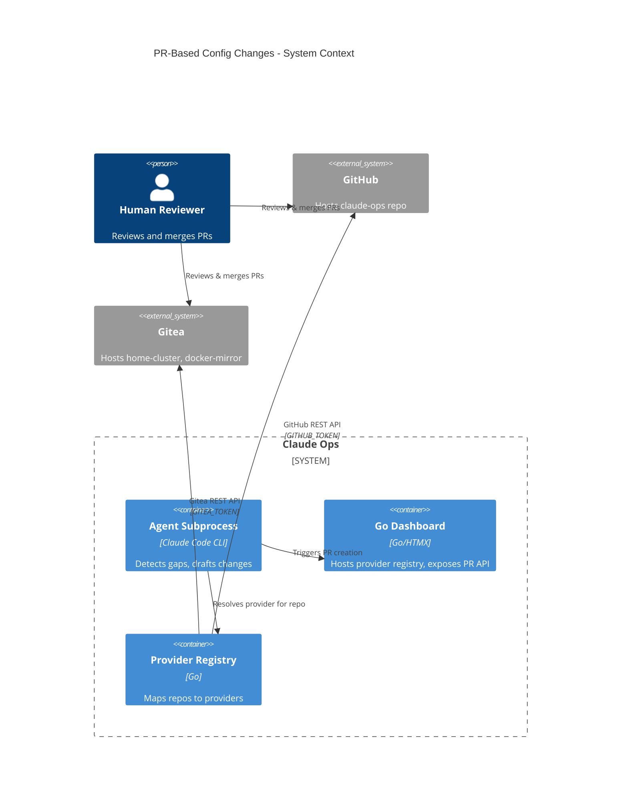
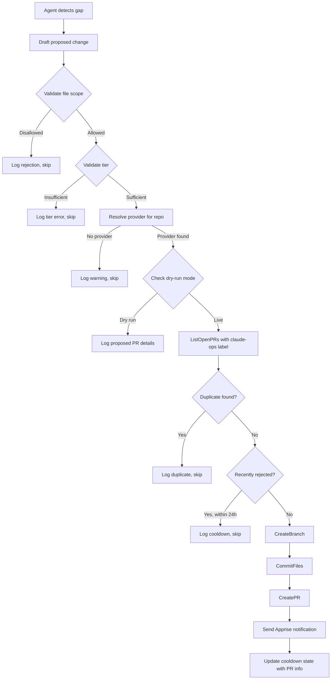
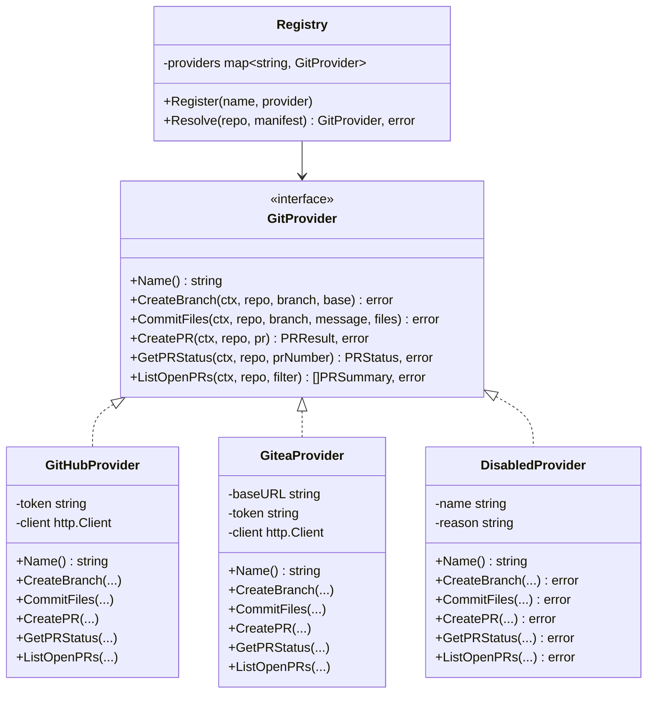

# Design: PR-Based Configuration Changes with Pluggable Git Provider

## Context

This design implements [SPEC-0018](/docs/openspec/specs/pr-based-config-changes/spec.md) and [ADR-0018](/docs/adrs/ADR-0018-pr-based-config-changes.md). Claude Ops currently treats all mounted repos and its own configuration files as read-only. The agent can observe problems and remediate running infrastructure but cannot improve the operational procedures that govern its behavior. This creates a feedback gap: the agent has operational knowledge (patterns it observes across hundreds of monitoring cycles) that it cannot act on.

The PR-based workflow closes this gap by letting the agent propose changes through pull requests -- the same review mechanism teams already use. The pluggable provider interface ensures the workflow works across GitHub (used for the claude-ops repo) and Gitea (used for home-cluster and docker-mirror at `gitea.stump.wtf`), and can be extended to other providers without modifying core logic.

The Go web dashboard (SPEC-0008, ADR-0008) already provides the application layer where the provider registry and interface will live. The agent itself (running as a Claude Code subprocess per SPEC-0010) interacts with the provider through the dashboard's session trigger or directly through the Go API when the agent requests PR creation during a monitoring cycle.

## Goals

- Define a narrow, stable `GitProvider` interface that abstracts git hosting differences into five methods.
- Implement GitHub and Gitea providers that use each platform's REST API for branch, commit, and PR operations.
- Enforce allowed/disallowed file scopes at the provider layer, before any git operation executes.
- Integrate PR creation with the existing permission tier model so Tier 1 cannot create PRs and Tier 2/3 have scoped access.
- Ensure the agent never merges its own PRs -- the interface intentionally omits merge operations.
- Support dry-run mode for safe testing without side effects.

## Non-Goals

- **PR review automation.** The agent does not review, approve, or comment on PRs. That is exclusively the human reviewer's role.
- **Merge conflict resolution.** If a branch has conflicts with the base branch, the agent does not attempt to resolve them. The PR will show conflicts in the hosting UI for human resolution.
- **Webhook-based feedback.** The agent learns about PR status by polling `GetPRStatus` on subsequent cycles, not through webhooks. Adding webhook support is deferred.
- **Batch PR creation across repos.** Tier 3 can create PRs in multiple repos, but each PR is independent. Atomic cross-repo changes are not supported.
- **Git history management.** The agent creates one commit per PR. Squashing, rebasing, and interactive history editing are not in scope.

## Decisions

### Package Structure: `internal/gitprovider/`

**Choice:** The `GitProvider` interface, supporting types (`RepoRef`, `FileChange`, `PRRequest`, `PRResult`, `PRStatus`, `PRFilter`, `PRSummary`, `Review`), and provider implementations live in `internal/gitprovider/`.

**Rationale:** This follows the existing package layout (`internal/web/`, `internal/db/`). A dedicated package keeps the provider interface importable from both the web handlers (for dashboard-triggered PRs) and the agent subprocess (for monitoring-cycle PRs) without circular imports. Each provider gets its own file: `github.go`, `gitea.go`.

**Alternatives considered:**
- `internal/web/gitprovider.go` (single file in web package): Rejected because it couples the provider interface to the web server, and the interface needs to be usable by the agent subprocess too.
- `pkg/gitprovider/` (exported package): Rejected because the providers are an internal concern -- no external consumers need this interface.

### HTTP Client Usage: Standard `net/http`

**Choice:** Provider implementations use Go's standard `net/http` client for all API calls. No third-party HTTP client or GitHub/Gitea SDK libraries.

**Rationale:** Both GitHub and Gitea have simple REST APIs where each provider method maps to 1-2 HTTP calls. A full SDK (e.g., `google/go-github`, `code.gitea.io/sdk`) would add significant dependency weight for operations that are simple `POST`/`GET`/`PUT` with JSON bodies. The standard library's `http.Client` with `json.Marshal`/`json.Unmarshal` is sufficient.

**Alternatives considered:**
- `google/go-github` SDK: Rejected due to large dependency tree. The SDK covers hundreds of GitHub API endpoints; we use three.
- `code.gitea.io/sdk/gitea`: Rejected for the same reason. Also, the Gitea SDK versioning is tightly coupled to Gitea server versions, adding a maintenance burden.

### Provider Registration: Init-Time Registry Map

**Choice:** Providers are registered in a global `map[string]GitProvider` populated at application startup in `main.go` or an init function. Provider instantiation reads environment variables and creates configured (or disabled) providers.

```go
// internal/gitprovider/registry.go
type Registry struct {
    providers map[string]GitProvider
}

func NewRegistry() *Registry {
    r := &Registry{providers: make(map[string]GitProvider)}

    if token := os.Getenv("GITHUB_TOKEN"); token != "" {
        r.Register("github", NewGitHubProvider(token))
    } else {
        r.Register("github", NewDisabledProvider("github", "GITHUB_TOKEN not set"))
    }

    if url, token := os.Getenv("GITEA_URL"), os.Getenv("GITEA_TOKEN"); url != "" && token != "" {
        r.Register("gitea", NewGiteaProvider(url, token))
    } else {
        r.Register("gitea", NewDisabledProvider("gitea", "GITEA_URL or GITEA_TOKEN not set"))
    }

    return r
}

func (r *Registry) Resolve(repo RepoRef, manifest *Manifest) (GitProvider, error) {
    // 1. Check manifest for explicit provider declaration
    if manifest != nil && manifest.GitProvider != "" {
        if p, ok := r.providers[manifest.GitProvider]; ok {
            return p, nil
        }
        return nil, fmt.Errorf("manifest declares provider %q but it is not registered", manifest.GitProvider)
    }

    // 2. Infer from clone URL
    if strings.Contains(repo.CloneURL, "github.com") {
        return r.providers["github"], nil
    }
    // Check all registered Gitea-like providers
    if p, ok := r.providers["gitea"]; ok {
        if gp, ok := p.(*GiteaProvider); ok && strings.Contains(repo.CloneURL, gp.baseURL) {
            return p, nil
        }
    }

    return nil, fmt.Errorf("no provider found for repo %s/%s (remote: %s)", repo.Owner, repo.Name, repo.CloneURL)
}
```

**Rationale:** A simple map is sufficient for 2-3 providers. A plugin-based discovery mechanism (e.g., Go plugins, config-file-driven loading) would be over-engineering for the current scale. New providers are added by adding a constructor call in `NewRegistry()`.

**Alternatives considered:**
- Go plugin system (`plugin.Open`): Rejected due to well-known fragility, platform limitations, and build complexity.
- Config-file-driven provider loading: Rejected because providers require compiled code (HTTP client logic, response parsing), so configuration alone cannot define a new provider.

### Scope Enforcement: Pre-Flight Validation

**Choice:** File scope validation happens in a `ValidateScope(files []FileChange) error` function called before any provider method is invoked. The function checks each file path against allowlists and denylists.

```go
// internal/gitprovider/scope.go

var allowedPatterns = []string{
    "checks/*.md",
    "playbooks/*.md",
    ".claude-ops/checks/*.md",
    ".claude-ops/playbooks/*.md",
    ".claude-ops/skills/*.md",
    "CLAUDE-OPS.md",
}

var deniedPatterns = []string{
    "prompts/*.md",
    "CLAUDE.md",
    "entrypoint.sh",
    "*.yaml",           // catches ie.yaml, vms.yaml, docker-compose.yaml
    "*.yml",            // catches ansible YAML variants
    "Dockerfile*",
    "*.go",
    "*.env*",
}

func ValidateScope(files []FileChange) error {
    for _, f := range files {
        if matchesAny(f.Path, deniedPatterns) {
            return fmt.Errorf("file %q is in the disallowed scope", f.Path)
        }
        if !matchesAny(f.Path, allowedPatterns) {
            return fmt.Errorf("file %q is not in the allowed scope", f.Path)
        }
    }
    return nil
}
```

**Rationale:** Pre-flight validation is a hard gate -- no git operation can execute for disallowed files. This is stronger than relying on prompt instructions alone (per ADR-0003's acknowledgment that prompt-based enforcement is not a security boundary). The validation function is testable in isolation.

**Alternatives considered:**
- Prompt-only enforcement: Rejected because the ADR explicitly calls for scope enforcement at the provider layer, not just prompt instructions.
- Post-commit validation (create branch, commit, then check): Rejected because it would leave orphan branches if validation fails.

### Tier Enforcement: Context-Based Gating

**Choice:** The `CreatePR` method accepts a `tier int` parameter (or the calling context carries tier information). A pre-flight check verifies that the current tier is >= 2 before proceeding. Tier 2 is additionally restricted to PRs with 3 or fewer files. Tier 3 has no file-count restriction.

```go
// internal/gitprovider/tier.go

func ValidateTier(tier int, files []FileChange) error {
    if tier < 2 {
        return fmt.Errorf("PR creation requires Tier 2 or higher (current: Tier %d)", tier)
    }
    if tier == 2 && len(files) > 3 {
        return fmt.Errorf("Tier 2 agents may modify at most 3 files per PR (got %d); escalate to Tier 3", len(files))
    }
    return nil
}
```

**Rationale:** The tier is known at the time of the API call (it is part of the session context). Enforcing it in code provides a hard boundary rather than relying on prompt compliance. The 3-file limit for Tier 2 is a heuristic that separates "tweak a check" from "restructure playbooks."

**Alternatives considered:**
- Prompt-only tier enforcement: Rejected for the same reason as scope -- code enforcement is stronger.
- Separate interfaces per tier (e.g., `Tier2Provider` with limited methods): Rejected as over-engineering. A simple integer check achieves the same result.

### Duplicate Detection: File-Path Comparison

**Choice:** Before creating a PR, the system calls `ListOpenPRs` with the `claude-ops` label filter, then compares the file paths in the proposed change against the file paths modified in each open PR (fetched via the PR's diff or file list endpoint). Duplicate detection is based on file paths, not PR titles or descriptions.

**Rationale:** Two PRs modifying the same file are likely duplicates even if they have different titles. Title-based comparison is fragile (the agent might phrase the same change differently). File-path comparison is deterministic and meaningful.

**Alternatives considered:**
- Title-based comparison: Rejected as fragile -- natural language titles may vary for the same change.
- Content hash comparison: Rejected as unnecessary complexity. File-path overlap is sufficient to prevent duplicates at the granularity needed.

### Rejection Cooldown: 24-Hour Window

**Choice:** When a PR is closed without merging, the system records the closure in the cooldown state file (`$CLAUDEOPS_STATE_DIR/cooldown.json`) along with the file paths and timestamp. For 24 hours after closure, the agent will not re-propose changes to the same files.

**Rationale:** A closed-without-merge PR is likely a human rejection. The agent should not immediately re-submit the same proposal. The 24-hour window gives operators time to address the underlying issue or communicate with the team about why the change was rejected. The cooldown reuses the existing cooldown state mechanism (SPEC-0007).

**Alternatives considered:**
- Permanent suppression until manually cleared: Rejected as too restrictive -- the agent may have a valid proposal after conditions change.
- No cooldown (re-submit every cycle): Rejected as it would flood the repo with duplicate proposals that have already been rejected.

## Architecture



### Component Layout

```
internal/gitprovider/
├── provider.go       # GitProvider interface and supporting types
├── registry.go       # Provider registry with Resolve()
├── scope.go          # Allowed/disallowed file scope validation
├── tier.go           # Permission tier validation
├── github.go         # GitHub provider implementation
├── gitea.go          # Gitea provider implementation
├── disabled.go       # DisabledProvider for unconfigured providers
├── github_test.go    # GitHub provider tests (with HTTP mock)
├── gitea_test.go     # Gitea provider tests (with HTTP mock)
├── scope_test.go     # Scope validation tests
└── tier_test.go      # Tier validation tests
```

### PR Creation Flow



### Provider Interface Detail



## Risks / Trade-offs

- **Git write access expands attack surface** → Mitigation: Branch protection rules on main/production branches. Agent can only push to `claude-ops/*` branches. The `GitProvider` interface has no merge method. Scope validation blocks changes to sensitive files before any git operation.

- **Provider API breakage** → Mitigation: Both GitHub and Gitea have stable, versioned APIs. The interface is narrow (5 methods mapping to 5-6 API endpoints per provider). Integration tests against test repos can catch breakage in CI.

- **PR flood from aggressive agent** → Mitigation: Duplicate PR prevention via file-path comparison. 24-hour rejection cooldown. Tier 2 limited to 3 files per PR. Operators can set branch protection rules requiring reviews, and repository-level rate limits on PR creation.

- **Scope bypass via path traversal** → Mitigation: `ValidateScope` normalizes paths and checks against both allowlist and denylist. Paths containing `..` are rejected. Provider implementations sanitize file paths before API calls.

- **Stale PRs accumulating** → Mitigation: The agent checks PR status on subsequent cycles via `GetPRStatus`. A future enhancement could auto-close PRs that have been open for more than 7 days without review, but this is out of scope for the initial implementation.

## Migration Plan

1. **Phase 1: Interface and types.** Create `internal/gitprovider/` package with the interface, supporting types, scope validation, and tier validation. No provider implementations yet. Write tests for scope and tier validation.

2. **Phase 2: GitHub provider.** Implement `GitHubProvider` with integration tests against a test repository. Verify branch creation, file commit, and PR creation. Add `GITHUB_TOKEN` to the container environment.

3. **Phase 3: Gitea provider.** Implement `GiteaProvider` with integration tests against the Gitea instance at `gitea.stump.wtf` (or a test instance). Add `GITEA_URL` and `GITEA_TOKEN` to the container environment.

4. **Phase 4: Registry and resolution.** Wire up `NewRegistry()` in the dashboard startup. Add manifest parsing for `## Git Provider` sections. Implement URL-based provider inference.

5. **Phase 5: Agent integration.** Update Tier 2 and Tier 3 prompt files to include PR creation permissions. Update the "Never Allowed" list. Add the PR workflow to the agent's monitoring cycle.

6. **Phase 6: Notification and cooldown.** Integrate Apprise notifications on PR creation. Add PR state tracking to the cooldown state file.

### Rollback

The feature is additive -- no existing behavior is modified. To disable PR creation: remove `GITHUB_TOKEN` and `GITEA_TOKEN` from the container environment. The providers will register in disabled state and all PR attempts will be gracefully skipped.

## Open Questions

- **Should the dashboard expose a UI for viewing agent-created PRs?** A "Proposed Changes" page listing all open agent PRs across repos would help operators track what the agent is suggesting. This is a natural extension but not required for the initial implementation.

- **Should there be a configurable maximum PRs-per-cycle limit?** Currently, the agent could theoretically create many PRs in a single cycle if it finds many gaps. A per-cycle limit (e.g., max 3 PRs) would prevent overwhelming reviewers.

- **How should the agent handle authentication token rotation?** If a `GITHUB_TOKEN` or `GITEA_TOKEN` expires mid-cycle, the provider will return auth errors. Should the agent retry, skip PR creation for that cycle, or escalate?

- **Should agent PRs be auto-closeable after N days without review?** Stale PRs clutter the repo. An auto-close mechanism (e.g., close after 14 days) could keep things tidy but might also close PRs that just need more time.
