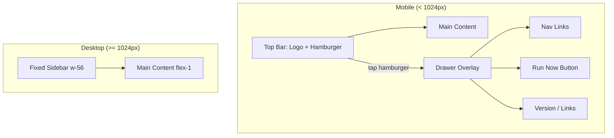
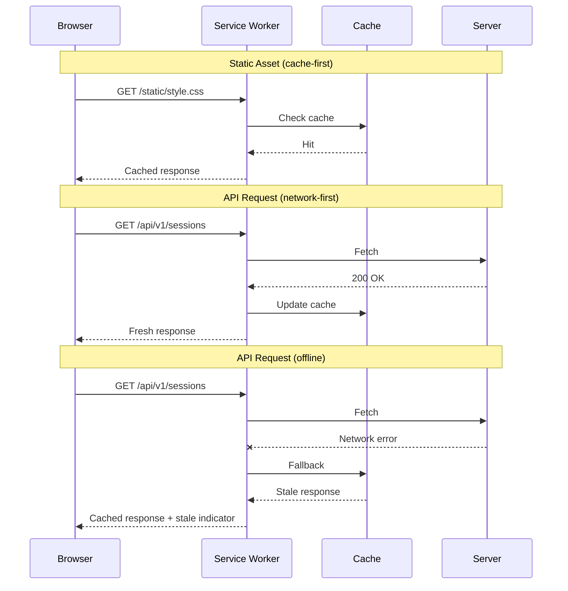

# Design: Progressive Web App and Mobile Responsive Dashboard

## Context

The Claude Ops dashboard (SPEC-0008) is a Go/HTMX/DaisyUI web application that serves as the primary operational interface. It currently renders exclusively for desktop viewports: a fixed 224px sidebar, hardcoded 4-column grids, 10-column tables, and zero CSS media queries in the 787-line stylesheet. The main user (infrastructure operator) frequently needs to check session status, trigger ad-hoc runs, and review alerts from a phone — particularly when on-call or away from a desk.

The existing architecture is well-suited for PWA conversion: HTMX + SSE requires no JavaScript framework, the static asset footprint is tiny (~35KB), and a full REST API (`/api/v1/`) already exists for service worker caching.

## Goals / Non-Goals

### Goals
- Make the dashboard usable on phone-sized viewports (375px–430px)
- Enable "Add to Home Screen" installation on iOS and Android
- Cache the app shell for offline loading
- Maintain the existing desktop layout and Dieter Rams aesthetic
- Keep the zero-build-toolchain philosophy (CDN-loaded Tailwind/DaisyUI, no webpack/vite)

### Non-Goals
- Native app or React Native wrapper
- Push notifications (deferred to a future spec)
- Offline write operations (triggering sessions, editing memories while offline)
- Full offline data sync or IndexedDB storage
- Dark mode redesign (orthogonal concern)

## Decisions

### Hamburger Menu with Drawer Overlay

**Choice**: Hide the sidebar below `lg:` (1024px) and show a hamburger button in a sticky top bar. Tapping the hamburger slides the sidebar in as a drawer overlay.

**Rationale**: The sidebar's `w-56` (224px) consumes 60% of a 375px phone screen. A collapsible drawer is the standard mobile pattern and preserves the full navigation hierarchy without redesigning the sidebar itself. The drawer reuses the existing `<nav>` markup — it just toggles visibility.

**Alternatives considered**:
- Bottom tab bar: Would require restructuring navigation and limits to 5 items. Claude Ops has 6 nav items + Run Now.
- Responsive sidebar that shrinks to icons: Still consumes horizontal space and requires icon-only design work.

### Tailwind Responsive Classes (No Custom Media Queries)

**Choice**: Use Tailwind's built-in responsive prefixes (`sm:`, `md:`, `lg:`) for all breakpoints rather than writing custom `@media` queries in `style.css`.

**Rationale**: The project already loads Tailwind via CDN. Using its responsive utilities keeps the mobile changes in the HTML templates (where they're visible alongside the elements they affect) and avoids maintaining a separate responsive stylesheet. This matches the existing pattern where most styling uses Tailwind classes with `style.css` providing only the custom theme.

**Alternatives considered**:
- Custom media queries in style.css: Separates responsive rules from markup, harder to maintain, and would duplicate Tailwind breakpoints.

### Service Worker with Cache-First Static / Network-First API

**Choice**: A simple service worker (`sw.js`) that caches static assets (HTML shell, CSS, logo, icons) using cache-first, and API responses using network-first with cache fallback.

**Rationale**: The static assets change only on deployment (they're embedded via `go:embed`), so cache-first is optimal. API data should be fresh when possible but stale data is better than nothing when offline. SSE streams and POST requests are excluded since they can't be meaningfully cached.

**Alternatives considered**:
- Stale-while-revalidate for everything: Over-caches API responses that change frequently (session status).
- No service worker (manifest-only PWA): Would allow installation but no offline capability.

### Go Static File Serving for PWA Assets

**Choice**: Serve `manifest.json`, `sw.js`, icon PNGs, and `favicon.ico` from the existing Go `go:embed` static file server alongside `style.css` and `logo.svg`.

**Rationale**: The project already embeds and serves static files from `internal/web/static/`. Adding PWA assets to the same directory requires zero infrastructure changes. The service worker must be served from the root path (`/sw.js`) for scope reasons, so one additional route is needed.

**Alternatives considered**:
- CDN-hosted PWA assets: Adds external dependency, complicates cache invalidation.

## Architecture

### Mobile Layout Structure

### Service Worker Cache Strategy

### File Changes

| File | Change |
|------|--------|
| `internal/web/static/manifest.json` | New: PWA manifest |
| `internal/web/static/sw.js` | New: Service worker |
| `internal/web/static/icon-192.png` | New: PWA icon |
| `internal/web/static/icon-512.png` | New: PWA icon |
| `internal/web/static/favicon.ico` | New: Favicon |
| `internal/web/templates/layout.html` | Add top bar, hamburger, drawer, meta tags, SW registration |
| `internal/web/templates/index.html` | Responsive stats grid classes |
| `internal/web/templates/sessions.html` | Hide columns on mobile, touch-friendly rows |
| `internal/web/templates/session.html` | Responsive metadata grid, mobile controls |
| `internal/web/templates/memories.html` | Hide columns on mobile |
| `internal/web/templates/cooldowns.html` | Hide columns on mobile |
| `internal/web/templates/events.html` | Responsive event card layout |
| `internal/web/templates/config.html` | Responsive form padding |
| `internal/web/static/style.css` | Touch targets, mobile top bar, drawer styles |
| `internal/web/handlers.go` | Route for `/sw.js` (root scope), `/favicon.ico` |

### Responsive Breakpoints

| Breakpoint | Tailwind Prefix | Sidebar | Stats Grid | Table Columns |
|-----------|----------------|---------|-----------|--------------|
| < 640px | (default) | Hidden, hamburger | 1 column | Essential only |
| 640px+ | `sm:` | Hidden, hamburger | 2 columns | Essential only |
| 768px+ | `md:` | Hidden, hamburger | 2 columns | All columns visible |
| 1024px+ | `lg:` | Fixed w-56 | 4 columns | All columns visible |

## Risks / Trade-offs

- **Tailwind CDN in production**: The project loads Tailwind via CDN which is larger than a purged build (~300KB). This is an existing architectural choice (SPEC-0008 REQ-4) and not changed by this spec. Mobile users on slow networks will notice. Mitigation: service worker caches the CDN response after first load.
- **Service worker scope**: `sw.js` must be served from `/` (not `/static/`) to control the full app scope. This requires one new route in the Go handler.
- **iOS PWA limitations**: iOS does not support Web Push notifications and has limited service worker background sync. Offline cache works but push alerts require a future native solution.
- **Drawer state on HTMX navigation**: When HTMX swaps `#main` content via `hx-push-url`, the drawer must close. This requires listening for `htmx:afterSwap` events.

## Migration Plan

1. Add PWA static assets (manifest.json, sw.js, icons, favicon) to `internal/web/static/`
2. Add `/sw.js` and `/favicon.ico` routes to handlers.go
3. Update `layout.html` with meta tags, SW registration, top bar, hamburger, and drawer
4. Update `style.css` with drawer styles, touch target sizes, and mobile top bar
5. Update each template with responsive Tailwind classes
6. Test on iPhone Safari, Android Chrome, and desktop Chrome/Firefox
7. No database migration required. No API changes required. Fully backward-compatible.

## Open Questions

- Should the service worker cache Tailwind/DaisyUI CDN responses, or let the browser's HTTP cache handle them?
- What icon design should be used for the 192/512 PNG? The current `logo.svg` uses pixel art style — should we generate PNG rasters from it or design a dedicated app icon?
