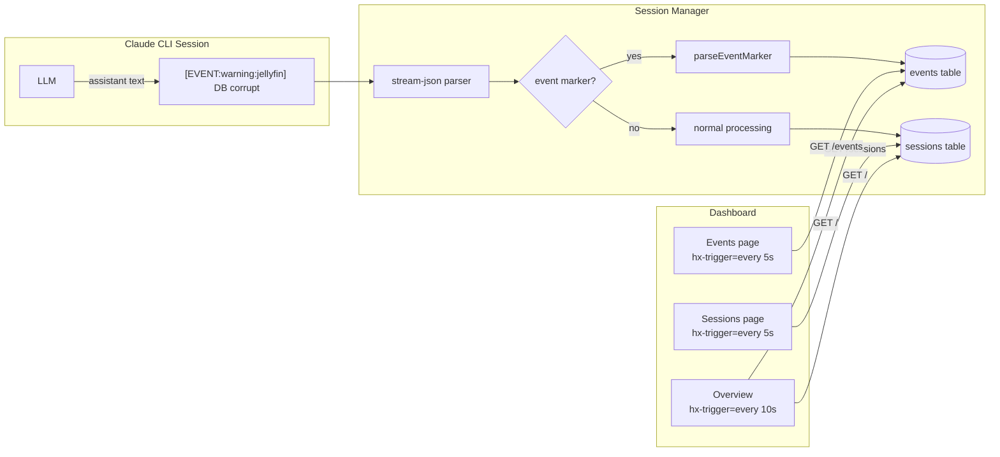

# Design: Real-Time Dashboard and Events System

## Context

The Claude Ops dashboard is currently static — pages render once on load and require manual refresh to see updates. The Services section duplicates external monitoring tools and doesn't reflect the agent's role. The operator needs to see the agent's activity and findings in real-time.

This design implements ADR-0014: HTMX polling for real-time page updates and a parsed event marker system that lets the LLM surface notable findings directly to the operator.

## Goals / Non-Goals

### Goals
- Make sessions list and overview auto-update via HTMX polling
- Replace Services with an Events feed that shows agent observations and actions
- Parse event markers from the LLM's stream-json output during sessions
- Add cost and token columns to sessions list
- Remove Services routes, handlers, templates, and nav link

### Non-Goals
- WebSocket or SSE-based page updates (polling is sufficient for single-user dashboard)
- Event aggregation or deduplication (v1 is append-only)
- Event acknowledgment or dismissal (future enhancement)
- Exposing health_checks data in the UI (kept internally for agent use)

## Decisions

### Decision 1: HTMX Polling for Real-Time Updates

**Choice**: Use `hx-trigger="every 5s"` with `hx-get` targeting table/section containers
**Rationale**: Zero JavaScript, zero new endpoints, two HTML attributes per section. HTMX handles diffing and only swaps when content changes. 5s interval balances freshness with server load for a single-user dashboard.
**Alternatives considered**:
- SSE page updates: Too complex for the benefit — requires new endpoints, subscription management, fragment targeting
- WebSockets: Overkill, introduces a new protocol, no HTMX integration

### Decision 2: Parsed Event Markers from LLM Output

**Choice**: Scan assistant text blocks for `[EVENT:<level>] message` or `[EVENT:<level>:<service>] message` during stream-json processing
**Rationale**: Piggybacks on existing parsing pipeline. The LLM only needs a prompt instruction — no new tools, no MCP, no HTTP calls. Events flow through the same stream-json → parser → DB path as everything else.
**Alternatives considered**:
- MCP tool: Requires running an MCP server, adds latency, complicates local dev
- HTTP POST from LLM: Requires giving the LLM WebFetch + a local endpoint, fragile

### Decision 3: Remove Services, Keep health_checks

**Choice**: Drop all Services UI (routes, handlers, templates, nav) but keep the `health_checks` DB table
**Rationale**: The agent still writes health check results to the DB for its own decision-making (cooldown logic, streak tracking). The UI just doesn't expose them. Events replace the operator-facing role that Services attempted to fill.

## Architecture



### Database Schema Addition

```sql
-- Migration 004
CREATE TABLE events (
    id INTEGER PRIMARY KEY AUTOINCREMENT,
    session_id INTEGER REFERENCES sessions(id),
    level TEXT NOT NULL,          -- info, warning, critical
    service TEXT,                 -- optional service name
    message TEXT NOT NULL,
    created_at TEXT NOT NULL
);

CREATE INDEX idx_events_created ON events(created_at);
CREATE INDEX idx_events_session ON events(session_id);
CREATE INDEX idx_events_level ON events(level, created_at);
```

### Event Marker Regex

```
\[EVENT:(info|warning|critical)(?::([a-zA-Z0-9_-]+))?\]\s*(.+)
```

Groups: (1) level, (2) optional service, (3) message text.

### API Changes

**Removed routes:**
- `GET /services`
- `GET /services/{name}`

**New routes:**
- `GET /events` — renders events page with HTMX polling support

**Modified routes:**
- `GET /sessions` — adds cost and turns columns, adds `hx-trigger="every 5s"` to table
- `GET /{$}` — replaces services grid with recent events feed, adds polling

### Prompt Addition (tier-1 observe)

```markdown
## Event Reporting

When you discover something notable, emit an event marker on its own line:

    [EVENT:info] Routine observation message
    [EVENT:warning] Something degraded but not critical
    [EVENT:critical] Needs human attention immediately

To tag a specific service:

    [EVENT:warning:jellyfin] Container restarted, checking stability
    [EVENT:critical:postgres] Connection refused on port 5432

Events appear in the operator's dashboard in real-time. Use them for:
- Service state changes (up/down/degraded)
- Remediation actions taken and their results
- Cooldown limits reached
- Anything requiring human attention
```

## Risks / Trade-offs

- **Polling load**: 5s polling from a single browser tab is ~12 req/min per section. Negligible for SQLite. If multiple tabs become an issue, increase the interval.
- **False positive events**: If the LLM accidentally outputs `[EVENT:...]` in a different context (unlikely with the strict format). Mitigation: only parse from assistant text blocks, not tool results.
- **Event spam**: A chatty LLM could emit too many events. Mitigation: prompt instructs to reserve events for genuinely notable findings. Future: rate limiting per session.

## Open Questions

- Should events have a "read/unread" state for the operator? (Deferred to v2)
- Should critical events trigger Apprise notifications in addition to dashboard display? (Likely yes, deferred)
- Should the overview page show a count/badge for unacknowledged critical events? (v2)
