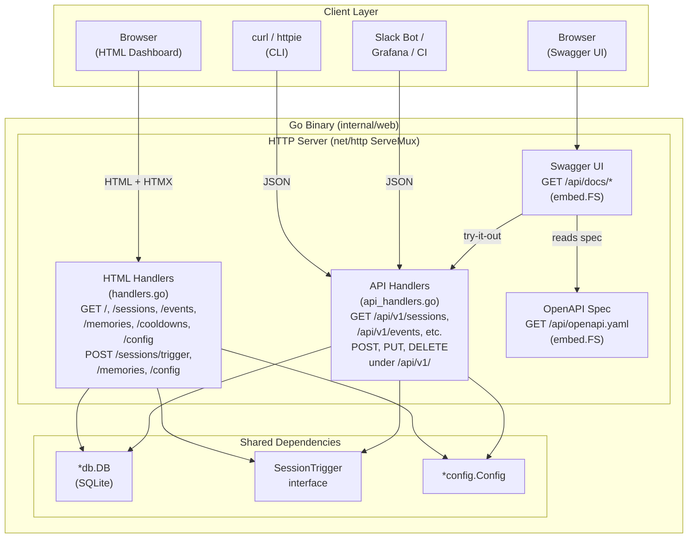
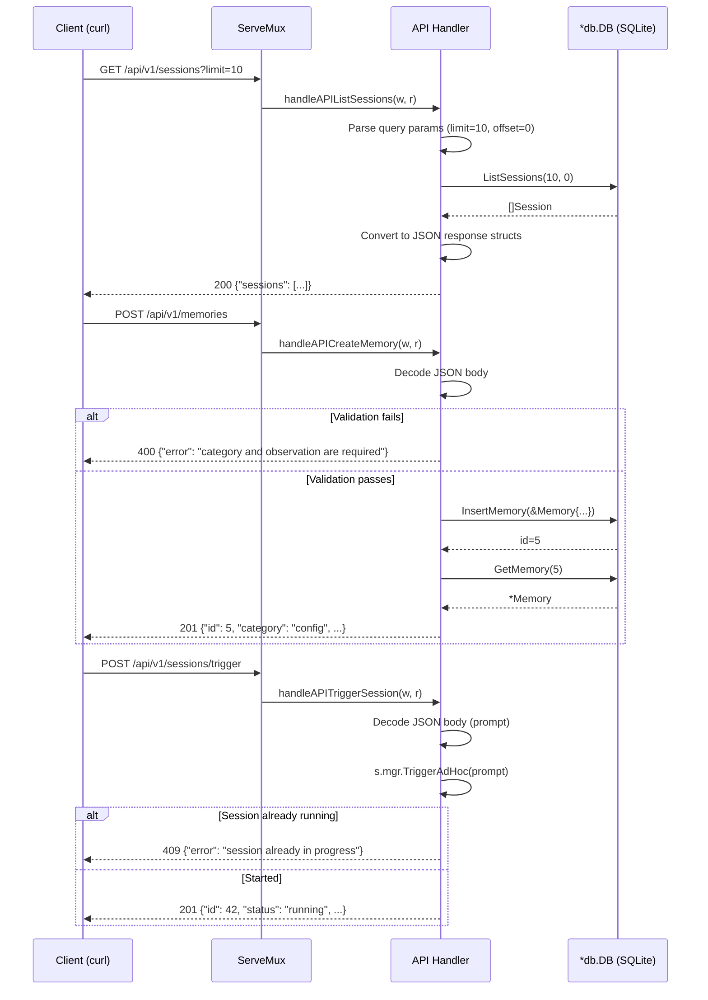

# Design: REST API with OpenAPI Specification and Swagger UI

## Context

This design implements [SPEC-0017](/docs/openspec/specs/rest-api/spec.md) and [ADR-0017](/docs/adrs/ADR-0017-rest-api-with-openapi-and-swagger-ui.md). The Claude Ops Go web dashboard currently exposes only HTML endpoints via HTMX. The REST API adds a parallel set of JSON endpoints under `/api/v1/` that share the same database layer and session trigger interface, enabling programmatic access by external tools, CLI scripts, and generated clients.

## Goals

- Expose all dashboard data (sessions, events, memories, cooldowns, config) via JSON REST endpoints.
- Serve an OpenAPI 3.1 specification file embedded in the binary for client generation and contract testing.
- Embed and serve Swagger UI for interactive API exploration without external dependencies.
- Reuse the existing `*db.DB` and `SessionTrigger` interfaces with minimal extension of the existing data access layer.
- Keep the implementation additive -- no changes to existing HTML handlers, templates, or routes.

## Non-Goals

- **Authentication/authorization.** The API has the same (lack of) access control as the HTML dashboard. Auth is deferred to a future ADR.
- **SSE streaming via the API.** Real-time session output streaming is already available at `/sessions/{id}/stream`. Adding `/api/v1/sessions/{id}/stream` is deferred.
- **WebSocket support.** Not needed for the read-heavy, request-response patterns of this API.
- **Rate limiting.** Should be considered for `POST /api/v1/sessions/trigger` but is out of scope for the initial implementation.
- **GraphQL or gRPC.** REST/JSON covers the requirements with minimal complexity.

## Decisions

### Handler Organization: Separate `api_handlers.go` File

API handlers will live in a new file `internal/web/api_handlers.go` within the existing `web` package. This keeps the API handlers co-located with the HTML handlers (they share the `Server` struct, `*db.DB`, and `SessionTrigger`) while maintaining clear file-level separation.

The `Server` struct gains no new fields -- API handlers use the same `s.db` and `s.mgr` as HTML handlers. Route registration is added to the existing `registerRoutes()` method in `server.go`.

**Rationale:** A separate package (`internal/api/`) was considered but rejected because it would require either duplicating the `Server` struct or introducing an interface for the shared dependencies. The handlers are thin JSON wrappers around the same DB calls -- package-level separation adds indirection without meaningful encapsulation benefit.

### API Response Types: Dedicated JSON Structs

API responses use dedicated struct types with explicit `json` tags, separate from the `viewmodel.go` types used by HTML templates. This is because:

1. JSON field names follow `snake_case` convention (matching the DB columns), while template view models use `PascalCase` Go fields.
2. JSON responses include `null` for absent optional fields (using `*type` with `omitempty`), while template view models convert nulls to zero values for easier template rendering.
3. API list responses wrap arrays in an object (`{"sessions": [...]}`) to allow future metadata (pagination info, total count) without breaking the response shape.

The API response types will be defined in a new file `internal/web/api_types.go`.

### Swagger UI Embedding Approach

Swagger UI static assets (HTML, CSS, JS) are vendored from the official Swagger UI `dist/` directory and embedded via `//go:embed`. This approach:

- Avoids runtime CDN dependencies.
- Avoids code-generation tools like `swaggo/swag` that parse Go comments.
- Keeps the binary self-contained (single-binary deployment model from SPEC-0008).
- Adds approximately 3-5 MB to the binary (acceptable for a server-side binary).

The embedded assets are served at `/api/docs/` using `http.FileServer` with `http.StripPrefix`, following the same pattern as the existing `/static/` route.

A custom `index.html` for Swagger UI sets the `url` parameter to `/api/openapi.yaml` so it automatically loads the embedded spec on page load.

### OpenAPI Spec Maintenance Strategy

The OpenAPI specification is a hand-written YAML file at `api/openapi.yaml` in the repository root, embedded in the binary via `//go:embed api/openapi.yaml`. It is NOT generated from code.

**Rationale:** Go lacks a widely-adopted annotation-based OpenAPI generation tool comparable to Java's Springdoc or Python's FastAPI. The available options (`swaggo/swag`) require Go comment annotations that duplicate the spec information in a less readable format. A hand-written YAML spec is more readable, supports the full OpenAPI 3.1 feature set, and can be validated in CI via `openapi-generator validate`.

**Spec drift mitigation:** CI SHOULD run validation of the spec file and MAY run contract tests that verify the spec matches actual API behavior.

### Error Response Format

All API errors use a consistent JSON envelope:

```json
{
  "error": "human-readable error description"
}
```

This is intentionally simple. A more structured format (error codes, field-level validation errors, trace IDs) can be added in a backward-compatible way by adding fields to the error object. The `error` field as a string is the minimum viable contract.

Internal error details (stack traces, SQL errors) are logged server-side but MUST NOT be returned in the response body. The client receives a generic message for 500 errors.

### Pagination Approach

List endpoints use `limit` and `offset` query parameters:

- `limit`: maximum number of results (default varies by endpoint)
- `offset`: number of results to skip (default 0)

Cursor-based pagination was considered but rejected because:
1. The data is ordered by timestamp, which is not guaranteed unique (multiple events can share a timestamp).
2. The SQLite dataset size is small (thousands of records, not millions), so offset-based pagination performs well.
3. Offset-based pagination is simpler to implement and more familiar to API consumers.

The response does not include total count or next/previous links in the initial implementation. These can be added later as additional fields in the response envelope without breaking existing clients.

## Architecture

### Component Diagram



### API Request Sequence Diagram



### File Organization

```
internal/web/
    server.go          -- Server struct, registerRoutes() (add API routes here)
    handlers.go        -- Existing HTML handlers (unchanged)
    api_handlers.go    -- NEW: JSON API handler methods on *Server
    api_types.go       -- NEW: API request/response struct types with json tags
    viewmodel.go       -- Existing template view models (unchanged)
    templates/         -- Existing HTML templates (unchanged)
    static/            -- Existing static assets (unchanged)

api/
    openapi.yaml       -- NEW: OpenAPI 3.1 specification file (embedded)
    swagger-ui/        -- NEW: Vendored Swagger UI dist/ assets (embedded)
```

### Route Registration

Routes are added to the existing `registerRoutes()` method:

```go
func (s *Server) registerRoutes() {
    // ... existing HTML routes (unchanged) ...

    // API v1 routes
    s.mux.HandleFunc("GET /api/v1/health", s.handleAPIHealth)
    s.mux.HandleFunc("GET /api/v1/sessions", s.handleAPIListSessions)
    s.mux.HandleFunc("GET /api/v1/sessions/{id}", s.handleAPIGetSession)
    s.mux.HandleFunc("POST /api/v1/sessions/trigger", s.handleAPITriggerSession)
    s.mux.HandleFunc("GET /api/v1/events", s.handleAPIListEvents)
    s.mux.HandleFunc("GET /api/v1/memories", s.handleAPIListMemories)
    s.mux.HandleFunc("POST /api/v1/memories", s.handleAPICreateMemory)
    s.mux.HandleFunc("PUT /api/v1/memories/{id}", s.handleAPIUpdateMemory)
    s.mux.HandleFunc("DELETE /api/v1/memories/{id}", s.handleAPIDeleteMemory)
    s.mux.HandleFunc("GET /api/v1/cooldowns", s.handleAPIListCooldowns)
    s.mux.HandleFunc("GET /api/v1/config", s.handleAPIGetConfig)
    s.mux.HandleFunc("PUT /api/v1/config", s.handleAPIUpdateConfig)

    // OpenAPI spec and Swagger UI
    s.mux.HandleFunc("GET /api/openapi.yaml", s.handleOpenAPISpec)
    swaggerFS, _ := fs.Sub(swaggerUIFS, "api/swagger-ui")
    s.mux.Handle("GET /api/docs/", http.StripPrefix("/api/docs/", http.FileServer(http.FS(swaggerFS))))
}
```

### JSON Response Helpers

A small set of helper functions in `api_handlers.go` reduce boilerplate:

```go
// writeJSON writes a JSON response with the given status code.
func writeJSON(w http.ResponseWriter, status int, v any) {
    w.Header().Set("Content-Type", "application/json")
    w.WriteHeader(status)
    json.NewEncoder(w).Encode(v)
}

// writeError writes a JSON error response.
func writeError(w http.ResponseWriter, status int, message string) {
    writeJSON(w, status, map[string]string{"error": message})
}
```

### API Response Structures

```go
// APISession is the JSON representation of a session.
type APISession struct {
    ID              int64        `json:"id"`
    Tier            int          `json:"tier"`
    Model           string       `json:"model"`
    Status          string       `json:"status"`
    StartedAt       string       `json:"started_at"`
    EndedAt         *string      `json:"ended_at"`
    ExitCode        *int         `json:"exit_code"`
    CostUSD         *float64     `json:"cost_usd"`
    NumTurns        *int         `json:"num_turns"`
    DurationMs      *int64       `json:"duration_ms"`
    Trigger         string       `json:"trigger"`
    PromptText      *string      `json:"prompt_text"`
    ParentSessionID *int64       `json:"parent_session_id"`
    // Detail-only fields (included in GET /sessions/{id})
    ParentSession   *APISession  `json:"parent_session,omitempty"`
    ChildSessions   []APISession `json:"child_sessions,omitempty"`
    ChainCost       *float64     `json:"chain_cost,omitempty"`
}

// APIEvent is the JSON representation of an event.
type APIEvent struct {
    ID        int64   `json:"id"`
    SessionID *int64  `json:"session_id"`
    Level     string  `json:"level"`
    Service   *string `json:"service"`
    Message   string  `json:"message"`
    CreatedAt string  `json:"created_at"`
}

// APIMemory is the JSON representation of a memory.
type APIMemory struct {
    ID          int64   `json:"id"`
    Service     *string `json:"service"`
    Category    string  `json:"category"`
    Observation string  `json:"observation"`
    Confidence  float64 `json:"confidence"`
    Active      bool    `json:"active"`
    CreatedAt   string  `json:"created_at"`
    UpdatedAt   string  `json:"updated_at"`
    SessionID   *int64  `json:"session_id"`
    Tier        int     `json:"tier"`
}

// APICooldown is the JSON representation of a cooldown summary.
type APICooldown struct {
    Service    string `json:"service"`
    ActionType string `json:"action_type"`
    Count      int    `json:"count"`
    LastAction string `json:"last_action"`
}

// APIConfig is the JSON representation of runtime configuration.
type APIConfig struct {
    Interval   int    `json:"interval"`
    Tier1Model string `json:"tier1_model"`
    Tier2Model string `json:"tier2_model"`
    Tier3Model string `json:"tier3_model"`
    DryRun     bool   `json:"dry_run"`
    MaxTier    int    `json:"max_tier"`
    StateDir   string `json:"state_dir"`
    ResultsDir string `json:"results_dir"`
    ReposDir   string `json:"repos_dir"`
}
```

## Risks and Trade-offs

### Gained

- **Programmatic access.** External tools (Grafana, Slack bots, CI/CD) can query and mutate Claude Ops data via standard HTTP/JSON without screen-scraping.
- **Self-documenting API.** Swagger UI provides interactive, executable documentation that stays in sync with the spec file.
- **Client generation.** The OpenAPI spec enables `openapi-generator` to produce typed clients for TypeScript, Python, Go, and other languages.
- **`curl` as a first-class client.** Ad-hoc session triggering, memory management, and config changes work naturally from the command line.
- **Zero impact on existing dashboard.** HTML routes, HTMX behavior, SSE streaming, and form submissions are completely unchanged.

### Lost / Accepted

- **Larger code surface.** The web package gains a second set of handlers (~200-300 lines) and response types (~80 lines). This is straightforward code but increases what needs to be maintained.
- **Binary size increase.** Embedding Swagger UI adds 3-5 MB. Acceptable for a server-side binary.
- **Spec drift risk.** The OpenAPI YAML must be updated manually when API behavior changes. Mitigated by CI validation.
- **No authentication.** Consistent with the existing dashboard, but a JSON API is more likely to be consumed by automated tools, increasing the surface for unauthorized access. This is a known gap deferred to a future ADR.
- **No rate limiting on trigger endpoint.** `POST /api/v1/sessions/trigger` could be abused by rapid-fire requests. The `SessionTrigger.IsRunning()` check prevents concurrent sessions but not rapid sequential starts.

## Migration Plan

This change is additive. No database schema migrations are required, but several existing DB method signatures need backward-compatible extensions:

1. **Extend DB method signatures** in `internal/db/db.go`. The following methods need an `offset int` parameter added: `ListSessions(limit, offset int)`, `ListEvents(limit, offset int)`, and `ListMemories(service, category *string, limit, offset int)`. Additionally, `ListEvents` needs optional `level` and `service` filter parameters to support API filtering (REQ-6). Existing HTML handler call sites pass `offset=0` to preserve current behavior. For `DeleteMemory`, the API handler uses `GetMemory(id)` as a pre-check to distinguish 404 (not found) from successful deletion, since the current `DeleteMemory` does not report whether a row was affected.
2. **Add API response types** in `internal/web/api_types.go`.
3. **Add API handlers** in `internal/web/api_handlers.go`. Each handler is a method on `*Server` that reads from `s.db` or calls `s.mgr`, then writes JSON.
4. **Register API routes** by appending to `registerRoutes()` in `server.go`. No existing routes are modified.
5. **Write OpenAPI spec** at `api/openapi.yaml`.
6. **Vendor Swagger UI** assets into `api/swagger-ui/` and embed them.
7. **Serve spec and Swagger UI** with two additional route registrations.

No database schema migrations are required. Existing HTML handlers need trivial updates to pass `offset=0` to the extended DB methods. No existing tests break.

## Open Questions

1. **Should list endpoints include `total` count for pagination?** Adding `SELECT COUNT(*)` queries would enable clients to know the total result set size, but adds a query per request. Deferred to a follow-up if clients need it.
2. **Should the API support filtering events by `session_id`?** The HTML events page does not filter by session, but API consumers (especially the session detail view) might want events scoped to a specific session. The DB `ListEvents` method currently does not support session filtering.
3. **Should the OpenAPI spec be generated or hand-written?** This design chooses hand-written. If spec drift becomes a problem in practice, adopting a generation tool can be reconsidered.
4. **Should Swagger UI be an optional build tag?** Embedding Swagger UI adds 3-5 MB. A `//go:build swagger` tag could make it opt-in for size-constrained deployments, but adds build complexity.
