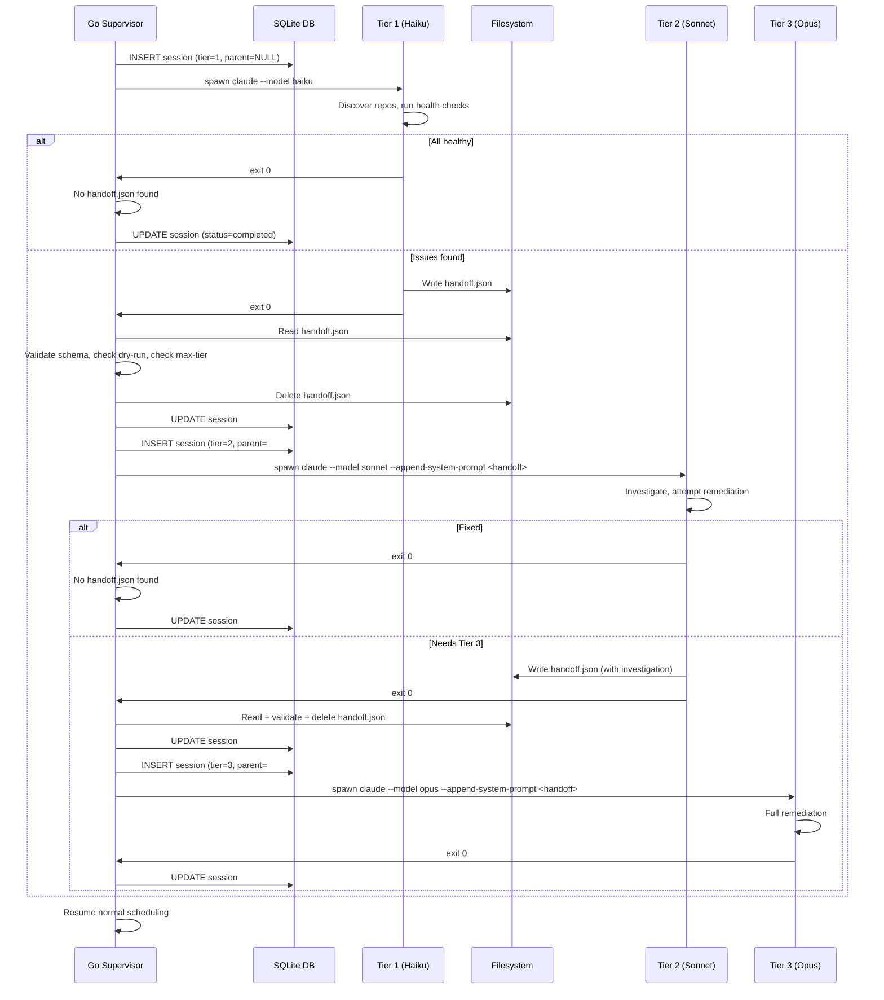
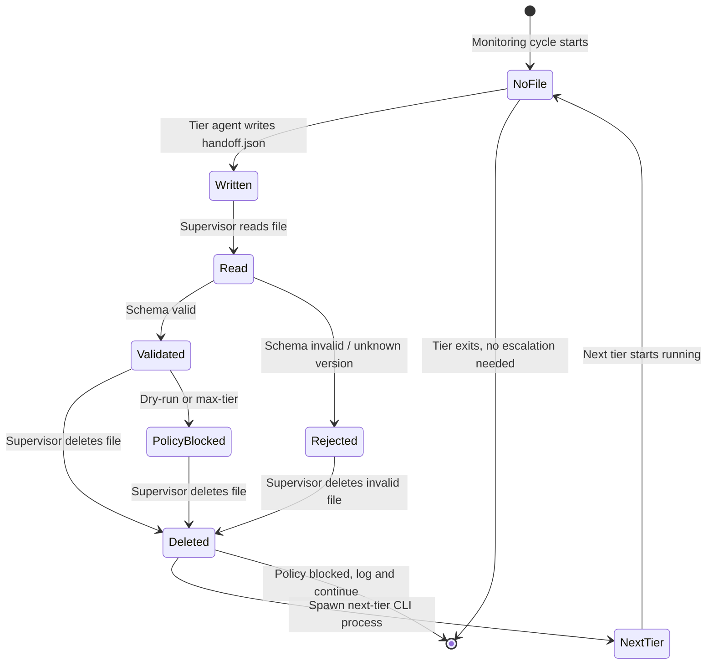

# Design: Session-Based Escalation with Structured Handoff

## Context

Claude Ops uses a tiered escalation model (Haiku -> Sonnet -> Opus) where each tier has increasing permissions. Currently, escalation happens inside a single CLI process via the `Task` tool: Tier 1 spawns Tier 2 as a subagent, which can spawn Tier 3. This means the Go supervisor sees only one session per monitoring cycle, cannot attribute costs per tier, and has no control over whether escalation occurs.

This design implements ADR-0016: each tier runs as a separate CLI process with its own session record. Tiers communicate via a structured JSON handoff file on the filesystem. The Go supervisor reads the handoff file after each tier exits and decides whether to spawn the next tier.

## Goals / Non-Goals

### Goals
- Each tier gets its own session record with accurate cost, duration, and turn count
- The supervisor controls all escalation decisions (policy enforcement, dry-run, max-tier)
- Dashboard displays escalation chains linking parent and child sessions
- Each tier runs in its own process with a fresh context window
- Handoff file is human-readable JSON for debugging

### Non-Goals
- Interactive back-and-forth between tiers (each tier runs independently)
- Resuming a tier's conversation (each gets a fresh context)
- Changes to the Claude Code CLI itself (only filesystem I/O and existing flags)
- Automatic retry of failed tiers (handled by the next monitoring cycle)
- Handoff file encryption or signing (filesystem-level access control is sufficient)

## Decisions

### Decision 1: Filesystem-Based Handoff over IPC

**Choice**: Tiers write a JSON file to `$CLAUDEOPS_STATE_DIR/handoff.json`; the supervisor reads and deletes it.

**Rationale**: The Claude CLI subprocess communicates via stdout (stream-json) and filesystem. There is no IPC channel between the agent's reasoning and the Go supervisor. The agent can write files using the `Write` tool, and the supervisor can read them after the process exits. This requires zero changes to the Claude Code CLI.

**Alternatives considered**:
- stdout-based signaling: The agent could emit a special marker in its stream-json output. But the supervisor parses stream-json for display/logging, not for control flow. Mixing escalation signals into the output stream would complicate parsing and couple the display layer to escalation logic.
- Exit code signaling: Use specific exit codes (e.g., exit 2 = escalate). But exit codes cannot carry the structured context (check results, affected services) needed by the next tier.

### Decision 2: Supervisor-Controlled Escalation over Agent-Controlled

**Choice**: The supervisor reads the handoff file and decides whether to spawn the next tier, rather than letting the agent spawn it directly.

**Rationale**: This enables policy enforcement at the application level:
- Dry-run mode can suppress escalation without relying on prompt compliance
- Maximum tier limits can be enforced programmatically
- Cooldown checks can be performed before spending money on a higher-tier model
- The supervisor can log escalation decisions for audit purposes

### Decision 3: Linked Sessions via parent_session_id

**Choice**: Add a `parent_session_id` foreign key to the `sessions` table rather than a separate `escalation_chains` table.

**Rationale**: A foreign key on the same table is the simplest way to model a linked list of sessions. The chain is always linear (T1 -> T2 -> T3, never branching), so a self-referential FK is sufficient. A separate join table would add complexity without benefit.

### Decision 4: Handoff Context via --append-system-prompt

**Choice**: Serialize the handoff JSON into a markdown-formatted section and inject it via the existing `--append-system-prompt` CLI flag.

**Rationale**: The supervisor already uses `--append-system-prompt` to inject environment context. Adding handoff context to the same mechanism requires no new CLI features. The receiving tier sees the handoff as part of its system prompt and can act on it immediately.

### Decision 5: Schema Versioning for Forward Compatibility

**Choice**: Include a `schema_version` field in the handoff JSON. The supervisor rejects unrecognized versions.

**Rationale**: The handoff file is a contract between the LLM (which writes it based on prompt instructions) and the Go supervisor (which parses it). If the prompt format changes but the supervisor hasn't been updated (or vice versa), the version field prevents silent misinterpretation.

## Architecture

### Escalation Sequence



### Handoff File State Machine



### Database Schema Changes

```sql
-- Migration 005: Add parent_session_id to sessions
ALTER TABLE sessions ADD COLUMN parent_session_id INTEGER REFERENCES sessions(id);

CREATE INDEX idx_sessions_parent ON sessions(parent_session_id);
```

The `Session` struct in `internal/db/db.go` gains a new field:

```go
type Session struct {
    // ... existing fields ...
    ParentSessionID *int64  // NULL for Tier 1 sessions
}
```

The `InsertSession` method must accept and store the `parent_session_id`. The `scanSession` helper must scan the new column. The `sessionColumns` constant must include it.

### Handoff File Schema (v1)

```json
{
  "schema_version": 1,
  "recommended_tier": 2,
  "services_affected": ["jellyfin", "postgres"],
  "check_results": [
    {
      "service": "jellyfin",
      "check_type": "http",
      "status": "down",
      "error": "HTTP 502 Bad Gateway",
      "response_time_ms": 1250
    }
  ],
  "investigation_findings": "",
  "remediation_attempted": "",
  "cooldown_state": {
    "services": {
      "jellyfin": {
        "restart_count_4h": 0,
        "redeployment_count_24h": 0,
        "last_restart": null
      }
    }
  }
}
```

Required fields for all handoffs: `schema_version`, `recommended_tier`, `services_affected`, `check_results`, `cooldown_state`.

Additional required fields for Tier 2 -> Tier 3 handoffs: `investigation_findings`, `remediation_attempted`.

### Supervisor Escalation Flow (Go)

The `runOnce` method in `internal/session/manager.go` currently runs a single Tier 1 session and returns. The new flow wraps this in an escalation loop:

```go
func (m *Manager) runEscalationChain(ctx context.Context, trigger string) {
    // Run Tier 1
    tier1ID := m.runTier(ctx, 1, m.cfg.Tier1Model, m.cfg.Prompt, nil, nil, trigger)

    // Check for handoff
    handoff, err := m.readHandoff()
    if err != nil || handoff == nil {
        return // No escalation needed
    }

    // Policy checks
    if m.cfg.DryRun {
        log("escalation suppressed: dry-run mode")
        return
    }
    if handoff.RecommendedTier > m.cfg.MaxTier {
        log("escalation blocked: max tier exceeded")
        m.notify("needs human attention")
        return
    }

    // Run Tier 2
    tier2ID := m.runTier(ctx, 2, m.cfg.Tier2Model, m.cfg.Tier2Prompt,
        &tier1ID, handoff, "escalation")

    // Check for Tier 2 handoff
    handoff2, err := m.readHandoff()
    if err != nil || handoff2 == nil {
        return
    }

    if handoff2.RecommendedTier > m.cfg.MaxTier {
        log("escalation blocked: max tier exceeded")
        m.notify("needs human attention")
        return
    }

    // Run Tier 3 (terminal — no further escalation)
    m.runTier(ctx, 3, m.cfg.Tier3Model, m.cfg.Tier3Prompt,
        &tier2ID, handoff2, "escalation")

    // Clean up any spurious Tier 3 handoff
    m.deleteHandoff()
}
```

### Handoff Context Injection

The supervisor serializes the handoff JSON into a markdown section injected via `--append-system-prompt`:

```
## Escalation Context (from Tier {N-1})

The following services were identified as unhealthy by the previous tier. Do NOT re-run these health checks — start from this context.

### Affected Services
- jellyfin
- postgres

### Check Results
| Service | Check Type | Status | Error |
|---------|-----------|--------|-------|
| jellyfin | http | down | HTTP 502 Bad Gateway |

### Investigation Findings
{Only present for Tier 3 handoffs}

### Remediation Attempted
{Only present for Tier 3 handoffs}

### Cooldown State
{JSON blob of current cooldown data}
```

This format is human-readable in logs and easily parsed by the LLM agent.

### Prompt Changes

**tier1-observe.md**: Replace Step 6 "Issues found" section. Remove the `Task(model: ...)` instruction. Replace with:

```markdown
### Issues found
- Write a handoff file for Tier 2 escalation:

\`\`\`
Write a JSON file to $CLAUDEOPS_STATE_DIR/handoff.json:
{
  "schema_version": 1,
  "recommended_tier": 2,
  "services_affected": ["<service1>", "<service2>"],
  "check_results": [<your check results>],
  "cooldown_state": {<current cooldown data>}
}
\`\`\`

- After writing the handoff file, exit. The supervisor will handle escalation.
```

**tier2-investigate.md**: Replace Step 5 "Cannot fix (needs Tier 3)" section. Remove the `Task(model: ...)` instruction. Replace with handoff file writing instructions including `investigation_findings` and `remediation_attempted`.

**Allowed tools**: Remove `Task` from `--allowedTools` for Tier 1 and Tier 2. Tier 3 does not escalate, so `Task` is not needed there either. The `Write` tool must remain in the allowed list so agents can write the handoff file.

### Dashboard Changes

**Session detail page** (`/sessions/{id}`):
- If `parent_session_id` is not NULL, render a "Escalated from" link pointing to the parent session
- Query for child sessions (`WHERE parent_session_id = ?`) and render an "Escalated to" link if found
- If this session is part of a chain, display a "Chain cost" summary showing per-tier breakdown

**Sessions list page** (`/sessions`):
- Sessions with `parent_session_id` not NULL should display a small chain indicator
- Consider visual indentation or grouping for sessions in the same escalation chain

**New DB query** — `GetEscalationChain(sessionID)`:
```go
func (d *DB) GetEscalationChain(id int64) ([]Session, error) {
    // Walk up to find the root
    root := id
    for {
        var parent *int64
        err := d.conn.QueryRow(
            "SELECT parent_session_id FROM sessions WHERE id = ?", root,
        ).Scan(&parent)
        if err != nil || parent == nil {
            break
        }
        root = *parent
    }

    // Walk down from root collecting the chain
    var chain []Session
    current := &root
    for current != nil {
        s, _ := d.GetSession(*current)
        if s == nil { break }
        chain = append(chain, *s)
        // Find child
        var child *int64
        d.conn.QueryRow(
            "SELECT id FROM sessions WHERE parent_session_id = ?", *current,
        ).Scan(&child)
        current = child
    }
    return chain, nil
}
```

### Configuration Changes

New config fields in `internal/config/config.go`:

| Field | Env Var | Default | Description |
|-------|---------|---------|-------------|
| `MaxTier` | `CLAUDEOPS_MAX_TIER` | `3` | Maximum tier to escalate to |
| `Tier2Prompt` | `CLAUDEOPS_TIER2_PROMPT` | `prompts/tier2-investigate.md` | Path to Tier 2 prompt file |
| `Tier3Prompt` | `CLAUDEOPS_TIER3_PROMPT` | `prompts/tier3-remediate.md` | Path to Tier 3 prompt file |

The existing `Tier2Model` and `Tier3Model` fields continue to configure which model each tier uses.

## Risks / Trade-offs

- **Context loss**: The handoff file is a lossy compression of the full conversation context. If the LLM omits important details when writing the handoff, the next tier loses that information. Mitigation: the spec defines required fields, and the supervisor validates completeness.
- **Handoff format coupling**: The JSON schema is a contract between prompt instructions (which tell the LLM what to write) and Go code (which parses it). Changes require updating both sides. Mitigation: schema versioning allows the supervisor to reject incompatible handoffs.
- **Startup latency**: Each tier requires a new process start (~2-5 seconds for CLI initialization). For a full T1->T2->T3 chain, this adds ~4-10 seconds of overhead versus in-process subagent spawning. Acceptable for a monitoring agent that runs on 60-minute cycles.
- **Supervisor complexity**: The supervisor gains ~200 lines of handoff parsing, validation, and escalation chain management code. This is concentrated in `manager.go` and covered by the escalation flow tests.
- **LLM compliance**: The agent must correctly write the handoff JSON. If the LLM produces malformed JSON, the supervisor rejects it and no escalation occurs. This is a fail-safe: the worst case is a missed escalation, not a bad one.

## Open Questions

- Should the supervisor support a `CLAUDEOPS_ESCALATION_COOLDOWN` to prevent rapid escalation chains (e.g., no more than 3 full chains per hour)? Deferred to a follow-up.
- Should the handoff file support multiple independent issues, each potentially requiring different tiers? Current design treats all issues as a single escalation. Deferred.
- Should the dashboard show a timeline visualization of escalation chains (horizontal swim lanes per tier)? Deferred to a future dashboard enhancement.
