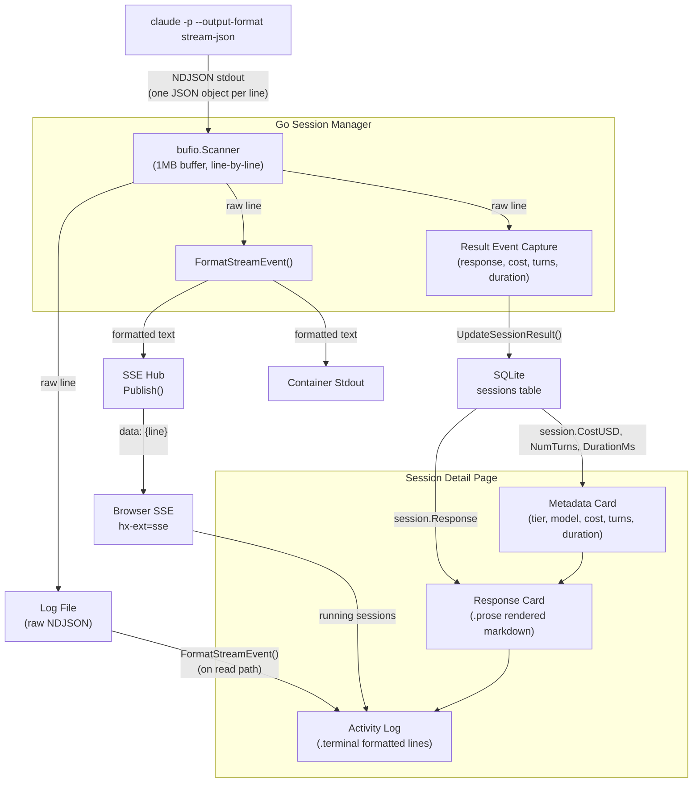
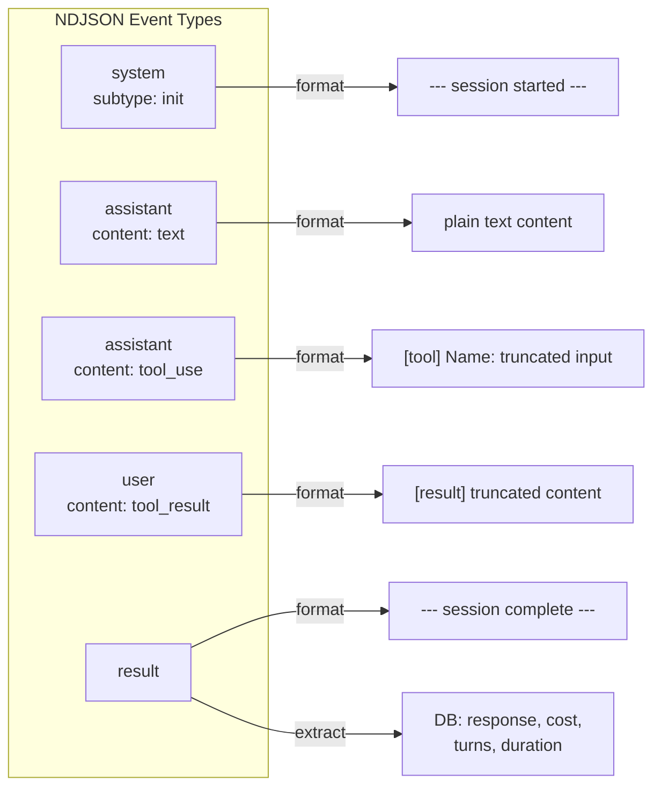
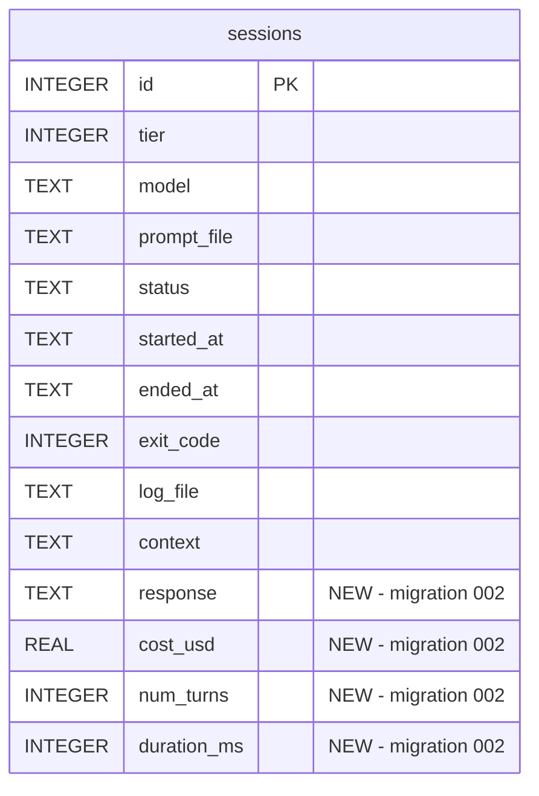

# Design: Session Page CLI Output and Formatted Response

## Context

Claude Ops runs Claude Code CLI sessions as subprocesses (ADR-0010, SPEC-0010) and serves a Go/HTMX dashboard (ADR-0008, SPEC-0008). The session detail page previously showed only the raw final response from `claude -p` -- unformatted markdown with no visibility into tool calls, commands, or reasoning.

Operators need to see what Claude did (the activity trace) and what Claude concluded (the response). These are fundamentally different kinds of output requiring different rendering: the activity trace looks like a terminal log, while the response is a structured document that benefits from markdown formatting.

The Claude CLI's `--output-format stream-json` flag provides the structured data source that makes this separation possible.

## Goals / Non-Goals

### Goals
- Show the full CLI activity trace (tool calls, results, reasoning) in the session page
- Render the final response as formatted markdown, visually separated from the activity log
- Stream activity in real time for running sessions via SSE
- Preserve raw NDJSON in log files for forensic analysis
- Store session metadata (cost, turns, duration) from the result event in the DB

### Non-Goals
- Syntax highlighting for code blocks in the activity log (plain monospace is sufficient)
- Collapsible/expandable tool results (show truncated inline)
- Filtering or searching within the activity log
- Token-level streaming via `--include-partial-messages` (complete events only)
- Client-side markdown rendering (server-side goldmark is used)

## Decisions

### Use `--output-format stream-json` Instead of Text Output

**Choice**: Invoke the Claude CLI with `--output-format stream-json` to get NDJSON events.

**Rationale**: Structured JSON events allow precise formatting, reliable response extraction, and metadata capture. Plain text output from `-p` mixes the response with any verbose output and provides no structured metadata.

**Alternatives considered**:
- `--verbose` text output: Unstructured, can't extract response separately, no metadata.
- Claude Agent SDK wrapper: Over-engineered, contradicts ADR-0010, introduces TypeScript dependency.

### Dual-Write: Raw JSON to Log, Formatted Text to Hub

**Choice**: Write raw NDJSON to the log file and formatted human-readable text to the SSE hub and stdout.

**Rationale**: Raw JSON preserves the complete event stream for forensic analysis and cost tracking. Formatted text is what operators need in the browser and terminal. Trying to serve both needs with one format compromises both.

**Alternatives considered**:
- Raw JSON everywhere, format on read: Adds latency to page loads and SSE delivery. The formatting is cheap enough to do inline.
- Formatted text everywhere, discard JSON: Loses structured metadata (cost, tokens, cache stats) that's valuable for analytics.

### Response at Top, Activity Log Below

**Choice**: Show the rendered markdown response card above the terminal-style activity log.

**Rationale**: The response is the primary deliverable -- the health report or remediation summary. Operators read the response first, then drill into the activity log if they need to verify or debug. This matches how people read reports (summary first, supporting evidence below).

**Alternatives considered**:
- Activity log at top, response at bottom: Buries the most important content below a potentially very long terminal output.
- Tabs (Response | Activity): Hides one view, forces clicking. Both views are useful simultaneously.
- Side-by-side: Doesn't work well on narrow viewports; both panels become too narrow.

### Server-Side Markdown Rendering with Goldmark

**Choice**: Render markdown to HTML on the server using the goldmark library, served as `template.HTML`.

**Rationale**: Server-side rendering means no JavaScript dependency for markdown parsing. Goldmark is the standard Go markdown library -- CommonMark compliant, extensible, well-maintained. The rendered HTML is wrapped in a `.prose` CSS class for styling.

**Alternatives considered**:
- Client-side marked.js: Adds a JS dependency and FOUC (Flash of Unstyled Content). The dashboard's philosophy is server-rendered HTML.
- Raw markdown in `<pre>`: Unreadable for operators. Defeats the purpose of separating response from activity log.

### SQLite Migration for New Columns

**Choice**: Add `response`, `cost_usd`, `num_turns`, `duration_ms` columns via migration 002 with ALTER TABLE.

**Rationale**: The existing migration system (versioned Go functions in transactions) handles this cleanly. ALTER TABLE ADD COLUMN is the simplest approach for nullable columns -- existing rows get NULL values, no data migration needed.

**Alternatives considered**:
- Separate results table: Over-normalized for a 1:1 relationship. Adds a JOIN to every session query.
- Store in the `context` JSON blob: Loses queryability. Can't ORDER BY cost_usd or filter by num_turns.

## Architecture

The data flows from the Claude CLI through three parallel paths: raw JSON to the log file, formatted text to the SSE hub (and browser), and result metadata to the database.

### Stream Event Types and Format Rules

### Database Schema Change

## Files Affected

| File | Change |
|------|--------|
| `internal/session/manager.go` | Add `--output-format stream-json` to CLI args. Replace raw line fanout with NDJSON parser. Add `FormatStreamEvent()`, event types, truncation helpers. Capture result metadata. |
| `internal/db/db.go` | Add migration 002 (ALTER TABLE). Add `Response`, `CostUSD`, `NumTurns`, `DurationMs` to `Session` struct. Add `UpdateSessionResult()`. Update all session scan calls. |
| `internal/web/viewmodel.go` | Add `Response`, `CostUSD`, `NumTurns`, `DurationMs` to `SessionView`. Update `ToSessionView()`. |
| `internal/web/handlers.go` | Update `handleSession()` to format NDJSON log files using `FormatStreamEvent()` instead of raw display. |
| `internal/web/server.go` | Add `renderMarkdown` (goldmark), `fmtCost`, `fmtMs` template functions. |
| `internal/web/templates/session.html` | Add response card with `renderMarkdown`. Add cost/turns/duration to metadata. Rename "Output" to "Activity Log". |
| `internal/web/static/style.css` | Add `.prose` styles for rendered markdown (headings, lists, code blocks, tables). |
| `go.mod` | Add `github.com/yuin/goldmark` dependency. |

## Risks / Trade-offs

- **CLI output format stability** → The `--output-format stream-json` format is part of the Claude Code CLI contract and documented, but could change in major versions. Mitigation: the parser handles unknown event types gracefully (silent skip) and malformed JSON (passthrough).
- **Large tool results** → Some tool results (e.g., reading a large file) can be very large. Mitigation: truncate to 300 chars for display, raw JSON in log file preserves full content.
- **Race condition on result capture** → The scanner goroutine writes `resultResponse` while the main goroutine reads it after `cmd.Wait()`. This is safe because `cmd.Wait()` blocks until the pipe is closed (scanner goroutine finishes), establishing happens-before ordering.
- **Goldmark dependency** → Adds a new dependency. Mitigation: goldmark is the standard Go markdown library, actively maintained, no transitive dependencies.

## Migration Plan

1. Migration 002 adds nullable columns -- no data loss, backward compatible
2. Existing sessions get NULL for new columns, which templates handle with `{{if .Session.Response}}`
3. New sessions populated automatically from result events
4. Log files transition from plain text to NDJSON -- old log files (if any) will show as raw text in the activity log since `FormatStreamEvent` passes through unparseable lines

## Open Questions

- Should the activity log support pagination or virtual scrolling for very long sessions? (Currently loads full formatted log.)
- Should we add `--include-partial-messages` for token-by-token streaming in the activity log? (Currently shows complete events only, which means tool calls appear all at once.)
