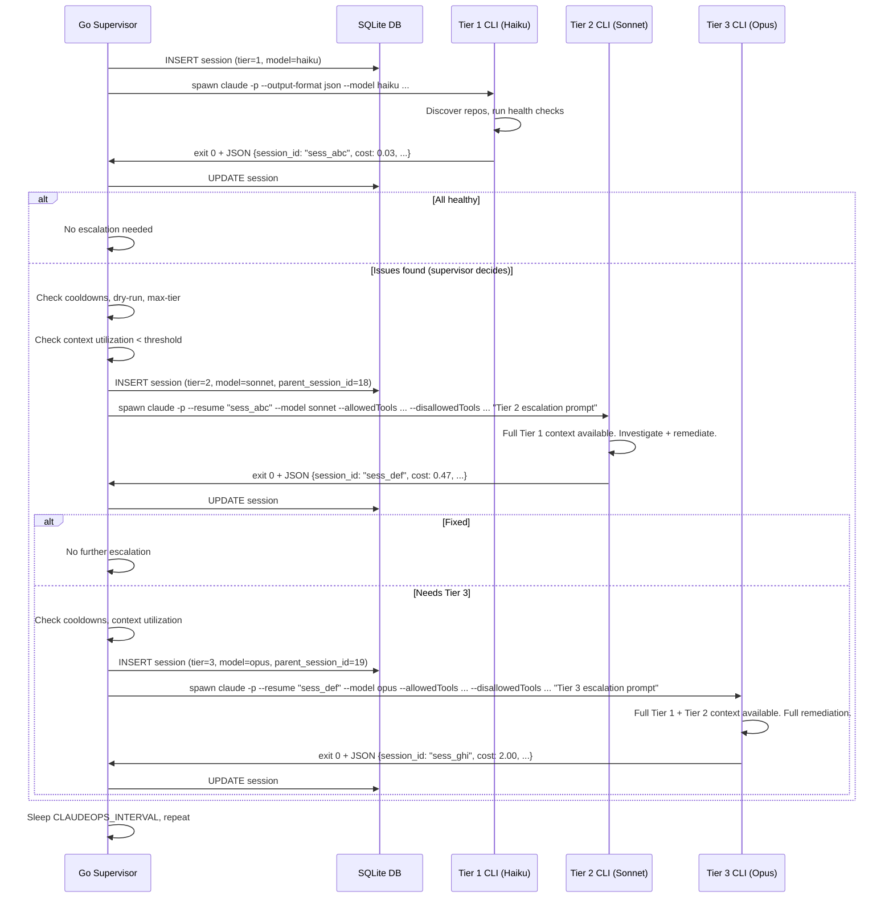

# Design: Session Continuity via Resume

## Overview

This design describes how Claude Ops replaces structured JSON handoff files (ADR-0016) with `--resume <session_id>` for passing context between escalation tiers. The change preserves the session-based architecture (separate CLI processes per tier, supervisor-controlled escalation, per-tier cost tracking) while eliminating lossy context serialization and redundant diagnostic work.

See [SPEC-0032](./spec.md) and [ADR-0031](../../adrs/ADR-0031-session-continuity-resume.md).

## Architecture

### Escalation Flow

```
┌──────────────────────────────────────────────────────────────────────┐
│                         Go Session Manager                           │
│                                                                      │
│  1. Spawn Tier 1                                                     │
│     claude -p --output-format json                                   │
│       --model haiku                                                  │
│       --allowedTools "Bash,Read,Grep,Glob,Task,WebFetch,WebSearch"   │
│       --disallowedTools "<tier1_blocklist>"                          │
│       "$(cat prompts/tier1-observe.md)"                              │
│                                                                      │
│  2. Parse JSON output → capture session_id, cost, status             │
│     Store session record: {id: 18, tier: 1, session_id: "sess_abc"} │
│                                                                      │
│  3. Evaluate escalation decision (cooldowns, dry-run, max-tier)      │
│                                                                      │
│  4. Spawn Tier 2 (if escalation needed)                              │
│     claude -p --resume "sess_abc" --output-format json               │
│       --model sonnet                                                 │
│       --allowedTools "Bash,Read,Write,Edit,Grep,Glob,Task,..."       │
│       --disallowedTools "<tier2_blocklist>"                          │
│       "You are now Tier 2. Prior investigation is in context. ..."   │
│                                                                      │
│  5. Parse JSON output → capture session_id, cost, status             │
│     Store session record: {id: 19, tier: 2, parent_session_id: 18,  │
│                            session_id: "sess_def"}                   │
│                                                                      │
│  6. Spawn Tier 3 (if further escalation needed)                      │
│     claude -p --resume "sess_def" --output-format json               │
│       --model opus                                                   │
│       --allowedTools "Bash,Read,Write,Edit,Grep,Glob,Task,..."       │
│       --disallowedTools "<tier3_blocklist>"                          │
│       "You are now Tier 3. Full remediation permissions. ..."        │
│                                                                      │
│  7. Parse JSON output → store final session record                   │
└──────────────────────────────────────────────────────────────────────┘
```

### Sequence Diagram



## CLI Invocation Changes

### Before (ADR-0016 Handoff Files)

```bash
# Tier 1
claude -p \
    --model haiku \
    --allowedTools "${TIER1_ALLOWED}" \
    --disallowedTools "${TIER1_DISALLOWED}" \
    --append-system-prompt "Environment: ${ENV_CONTEXT}" \
    "$(cat prompts/tier1-observe.md)" \
    2>&1 | tee -a "${LOG_FILE}" || true

# Supervisor reads handoff.json, injects into Tier 2 prompt

# Tier 2
claude -p \
    --model sonnet \
    --allowedTools "${TIER2_ALLOWED}" \
    --disallowedTools "${TIER2_DISALLOWED}" \
    --append-system-prompt "Environment: ${ENV_CONTEXT}\n\nEscalation context: $(cat ${STATE_DIR}/handoff.json)" \
    "$(cat prompts/tier2-investigate.md)" \
    2>&1 | tee -a "${LOG_FILE}" || true
```

### After (Resume-Based Escalation)

```bash
# Tier 1
TIER1_OUTPUT=$(claude -p \
    --output-format json \
    --model haiku \
    --allowedTools "${TIER1_ALLOWED}" \
    --disallowedTools "${TIER1_DISALLOWED}" \
    --append-system-prompt "Environment: ${ENV_CONTEXT}" \
    "$(cat prompts/tier1-observe.md)")

SESSION_ID=$(echo "${TIER1_OUTPUT}" | jq -r '.session_id')

# Tier 2 (resumes Tier 1 session — full context preserved)
TIER2_OUTPUT=$(claude -p \
    --resume "${SESSION_ID}" \
    --output-format json \
    --model sonnet \
    --allowedTools "${TIER2_ALLOWED}" \
    --disallowedTools "${TIER2_DISALLOWED}" \
    "$(cat prompts/tier2-escalation.md)")
```

Note: The `--append-system-prompt "Environment: ${ENV_CONTEXT}"` is NOT repeated on the resume invocation. The environment context from Tier 1's system prompt is already in the conversation. Only the escalation prompt (via `-p`) is new.

## Session Manager Code Changes

### Session ID Capture

The session manager currently parses CLI output for cost and status. This extends to capture `session_id`:

```go
// Existing: parse cost, tokens, status from JSON output
// New: also capture session_id

type CLIOutput struct {
    SessionID    string  `json:"session_id"`
    CostUSD      float64 `json:"cost_usd"`
    InputTokens  int     `json:"input_tokens"`
    OutputTokens int     `json:"output_tokens"`
    NumTurns     int     `json:"num_turns"`
    // ... existing fields
}
```

### Escalation Decision

The supervisor's escalation logic changes from "read handoff file" to "check CLI output for escalation signal":

```
Before:
  1. Tier 1 exits
  2. Check if $STATE_DIR/handoff.json exists
  3. If yes: read file, parse JSON, inject into Tier 2 prompt, delete file
  4. Spawn Tier 2 with --append-system-prompt containing handoff content

After:
  1. Tier 1 exits
  2. Parse Tier 1 JSON output for session_id and escalation signal
  3. Check escalation policies (cooldowns, dry-run, max-tier)
  4. Check context utilization against threshold
  5. Spawn Tier 2 with --resume <session_id> and escalation prompt
```

The escalation signal (whether Tier 1 recommends escalation) can be communicated through:
- The Tier 1 agent's final output text (parsed by the session manager)
- A structured field in the JSON output (if the CLI supports custom metadata)
- Exit code conventions (e.g., exit 0 = no issues, exit 2 = escalation recommended)

The recommended approach is parsing the agent's final output for a structured escalation recommendation, which the Tier 1 prompt already instructs the agent to produce.

### Removed Code

The following handoff file code paths are removed when resume is active:

- `readHandoffFile(stateDir)` -- no longer needed
- `injectHandoffContext(prompt, handoffJSON)` -- replaced by `--resume`
- `deleteHandoffFile(stateDir)` -- no longer needed
- Handoff JSON schema types (`HandoffFile`, `CheckResult`, etc.) -- retained only for fallback

## DB Schema Changes

### Sessions Table

The `sessions` table already has `parent_session_id` (from ADR-0016). This design adds the `session_id` column to store the CLI's session identifier:

```sql
ALTER TABLE sessions ADD COLUMN session_id TEXT;
```

The `session_id` column stores the Claude Code CLI's session identifier (e.g., `"sess_abc123"`), which is needed for the `--resume` flag. This is distinct from the table's primary key `id`, which is the session manager's internal identifier.

Index for session chain queries:

```sql
CREATE INDEX idx_sessions_parent ON sessions(parent_session_id);
CREATE INDEX idx_sessions_session_id ON sessions(session_id);
```

### Chain Query

To retrieve a full escalation chain starting from any session:

```sql
-- Forward: parent to children
WITH RECURSIVE chain AS (
    SELECT * FROM sessions WHERE id = :start_id
    UNION ALL
    SELECT s.* FROM sessions s
    JOIN chain c ON s.parent_session_id = c.id
)
SELECT * FROM chain ORDER BY id;

-- Backward: child to root
WITH RECURSIVE ancestors AS (
    SELECT * FROM sessions WHERE id = :start_id
    UNION ALL
    SELECT s.* FROM sessions s
    JOIN ancestors a ON s.id = a.parent_session_id
)
SELECT * FROM ancestors ORDER BY id;
```

## Escalation Prompt Template

The escalation prompt replaces the handoff file injection. It is concise because the conversation context provides the full investigation details.

### Tier 2 Escalation Prompt

```markdown
# Tier 2 Escalation — Safe Remediation

You are now operating as **Tier 2** with safe remediation permissions. The prior
Tier 1 investigation is fully available in this conversation's history — do not
repeat diagnostic commands that have already been run.

## Your Permissions

- Container restarts: `docker restart <service>`, `docker compose up -d <service>`
- Pull request creation: `gh pr create`, `tea pr create`
- Notifications: `apprise` for alerting on remediation outcomes
- File modifications: `Write` and `Edit` tools are now available
- Git operations: `git commit`, `git push` are now permitted

## Still Restricted

- Ansible playbooks and Helm (Tier 3 only)
- `docker compose down` (destructive — Tier 3 only)

## Your Task

Review the investigation findings from the conversation above. Attempt safe
remediation for the identified issues. If safe remediation is insufficient,
report what was tried and recommend Tier 3 escalation.

Follow cooldown rules: max 2 restarts per service per 4 hours, max 1
redeployment per service per 24 hours. Check $CLAUDEOPS_STATE_DIR/cooldown.json
before acting.
```

### Tier 3 Escalation Prompt

```markdown
# Tier 3 Escalation — Full Remediation

You are now operating as **Tier 3** with full remediation permissions. The prior
Tier 1 investigation and Tier 2 safe remediation attempts are fully available in
this conversation's history — do not repeat commands that have already been run.

## Your Permissions

- Everything Tier 2 can do, plus:
- Ansible playbooks: `ansible-playbook playbooks/<service>.yml`
- Helm operations: `helm upgrade`, `helm rollback`
- `docker compose down` followed by `docker compose up -d`

## Still Restricted (Never Allowed)

- `rm -rf /` or any recursive root deletion
- `docker system prune`
- `git push --force`
- Modifications to ie.yaml, vms.yaml, or infrastructure config files
- Deletion of persistent data volumes under /volumes/

## Your Task

Review all prior investigation and remediation attempts. The safe remediation
at Tier 2 was insufficient — apply full remediation using Ansible playbooks,
Helm, or other infrastructure tools as needed.

Follow cooldown rules and respect dry-run mode ($CLAUDEOPS_DRY_RUN).
```

## Cost Tracking Across Resumed Sessions

Each `claude -p` invocation returns its own cost metrics in the JSON output, regardless of whether it resumed a prior session. The session manager records each invocation's cost against its own session record:

```
Session #18 (Tier 1, Haiku):   input_tokens=3200, output_tokens=1800, cost=$0.03
Session #19 (Tier 2, Sonnet):  input_tokens=8500, output_tokens=4200, cost=$0.47
Session #20 (Tier 3, Opus):    input_tokens=15000, output_tokens=6000, cost=$2.00
                                                                Total: $2.50
```

Note: Tier 2's `input_tokens` includes the Tier 1 conversation history that was loaded via `--resume`. This is expected and correct — the input cost reflects what the model actually processed. The session manager does not need to subtract the prior tier's tokens.

The dashboard chain view displays:

```
Escalation Chain for Cycle #42
├── Session #18  Tier 1  haiku   $0.03  45s   ✓ completed
├── Session #19  Tier 2  sonnet  $0.47  2m    ✓ completed
└── Session #20  Tier 3  opus    $2.00  5m    ✓ completed
                          Total: $2.50  7m45s
```

## Context Window Management Strategy

### The Problem

Resumed sessions accumulate context. A Tier 1 session that consumed 30,000 tokens leaves 170,000 tokens for Tier 2 (on a 200K context model). If Tier 2 consumes another 80,000 tokens, Tier 3 has only 90,000 tokens remaining. For complex multi-service investigations, this could be insufficient.

### The Strategy

The session manager tracks cumulative token usage across the escalation chain:

```
chain_tokens = tier1_input_tokens + tier1_output_tokens
             + tier2_input_tokens + tier2_output_tokens
             ...
```

Before spawning a resumed tier, the session manager checks:

```
if chain_tokens / model_context_window > RESUME_CONTEXT_THRESHOLD:
    fall back to handoff file mechanism
```

The default threshold is 80% (`CLAUDEOPS_RESUME_CONTEXT_THRESHOLD=0.80`). This leaves 20% of the context window for the next tier's work. Operators can adjust via environment variable.

### Model Context Windows

| Model | Context Window | 80% Threshold |
|-------|---------------|---------------|
| Haiku | 200,000 | 160,000 |
| Sonnet | 200,000 | 160,000 |
| Opus | 200,000 | 160,000 |

Note: These are the current context windows as of 2026-03-21. The session manager SHOULD read context window sizes from a configuration file rather than hardcoding them, to accommodate model updates.

### Practical Impact

In practice, most Tier 1 sessions consume 5,000-30,000 tokens (health checks, SSH commands, `curl` outputs). This leaves ample room for Tier 2 and Tier 3. The context threshold is a safety net for edge cases where Tier 1 investigates many services or encounters verbose error output.

## Fallback to Handoff Files

The handoff file mechanism (ADR-0016) is retained as a fallback. The session manager uses it when:

1. **Session ID not captured** — The CLI output did not include `session_id` (older CLI version, output parsing failure).
2. **Resume invocation fails** — The `--resume` flag returns an error (session expired, file corrupted, CLI version mismatch).
3. **Context window pressure** — Cumulative token usage exceeds the configured threshold.

The fallback path mirrors the ADR-0016 flow: the session manager re-invokes the appropriate tier with handoff-file-enabled prompts and `--append-system-prompt` containing the serialized context.

The session manager maintains both code paths during the transition period. The handoff file code can be removed once `--resume` has proven stable in production across multiple CLI versions.

## Key Design Decisions

### Why `--resume` instead of `--continue`

The CLI offers both `--resume <session_id>` (continue a specific session) and `--continue` (continue the most recent session). The session manager uses `--resume` with an explicit session ID because:

- Multiple sessions may run concurrently (different repos, different monitoring cycles)
- `--continue` would resume whichever session ran last, which may not be the correct one
- Explicit session IDs provide an auditable link between session records

### Why the escalation prompt is minimal

The escalation prompt describes the tier change and permissions, not the findings. This is intentional:

- The findings are in the conversation context — repeating them wastes tokens
- A minimal prompt reduces the risk of contradictions between the prompt summary and the actual findings
- The agent can reference specific tool outputs from the conversation history rather than relying on a compressed summary

### Why input token cost increases are acceptable

When Tier 2 resumes Tier 1's session, Tier 2's input includes the full Tier 1 conversation. This increases Tier 2's input token count compared to the handoff file approach. However:

- Input tokens are cheaper than output tokens (typically 3-10x cheaper)
- The saved output tokens from eliminated duplicate tool calls more than offset the increased input
- The overall chain cost is lower because Tier 2 does not re-run 15-30% of Tier 1's diagnostics

### Why handoff files are retained as fallback

Rather than removing handoff files entirely, the fallback is retained because:

- The `--resume` flag is a newer CLI feature and may have edge cases not yet encountered
- Context window pressure is a real constraint for complex investigations
- Graceful degradation is preferred over hard failure when the primary mechanism is unavailable
- The fallback code is low-maintenance (it already exists and works)

## References

- [ADR-0031: Session Continuity via --resume](../../adrs/ADR-0031-session-continuity-resume.md)
- [ADR-0016: Session-Based Escalation with Structured Handoff Files](../../adrs/ADR-0016-session-based-escalation-handoff.md)
- [ADR-0010: Invoke Claude via Claude Code CLI as Subprocess](../../adrs/ADR-0010-claude-code-cli-subprocess.md)
- [ADR-0023: AllowedTools-Based Tier Enforcement](../../adrs/ADR-0023-allowedtools-tier-enforcement.md)
- [SPEC-0032: Session Continuity via Resume](./spec.md)
- [SPEC-0027: AllowedTools-Based Tier Enforcement](../allowedtools-tier-enforcement/spec.md)
- [SPEC-0016: Session-Based Escalation](../session-based-escalation/spec.md)
