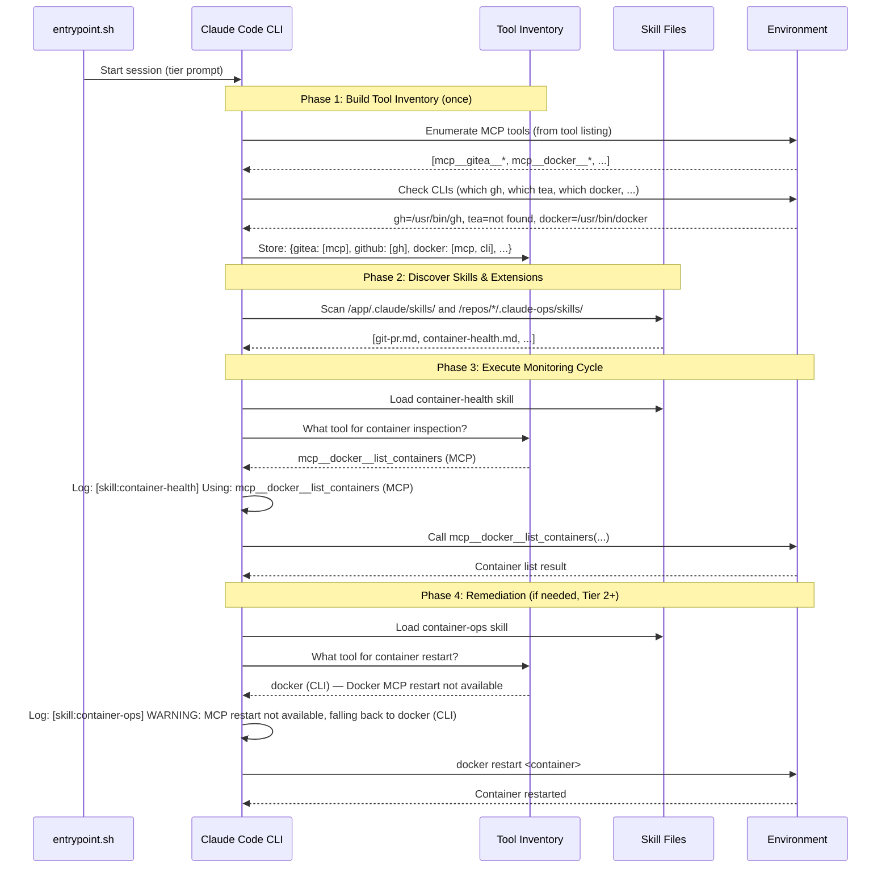

# Design: Skills-Based Tool Orchestration

## Overview

Claude Ops replaces custom MCP server development and mandatory npx-based MCP configurations with skill files — markdown instruction documents that the agent reads at runtime. Skills describe operational capabilities (PR creation, container health checks, database queries) and include adaptive tool discovery procedures that select the best available tool (MCP server, CLI, or raw HTTP) for each invocation.

This design describes the architecture, data flow, and key decisions behind SPEC-0023.

## Architecture

### Component Topology

```
+----------------------------------------------------------------------+
|  Claude Ops Container                                                |
|                                                                      |
|  +------------------+        +------------------------------------+  |
|  |  entrypoint.sh   |        |     Claude Code CLI Process        |  |
|  |                  |        |                                    |  |
|  | - Cycle loop     |------->| 1. Build tool inventory (once)     |  |
|  | - MCP merge      |        | 2. Discover skills                 |  |
|  |   (if user MCPs) |        | 3. Discover repos/checks/playbooks |  |
|  +------------------+        | 4. Execute cycle using skills      |  |
|                              +----+-------+-----------+-----------+  |
|                                   |       |           |              |
|                              +----+--+ +--+------+ +-+----------+   |
|                              | Skills | | Checks  | | Playbooks  |  |
|                              +----+---+ +--+------+ +-+----------+  |
|                                   |        |           |             |
|                              +----+--------+-----------+-------+     |
|                              |     Tool Inventory (session)    |     |
|                              +----+----+-----------+-----------+     |
|                                   |    |           |                 |
|                  +----------------+    |           +---------+       |
|                  |                     |                     |       |
|            +-----+-------+     +------+------+     +--------+--+    |
|            | MCP Tools   |     | CLI Tools   |     | HTTP/curl  |   |
|            | (if config) |     | (if installed)|    | (fallback) |   |
|            +-------------+     +-------------+     +------------+   |
+----------------------------------------------------------------------+
```

### Skill File Layout

```
/app/.claude/skills/                  # Baseline skills (shipped with container)
├── git-pr.md                         # Git PR operations
├── container-health.md               # Container health checking
├── container-ops.md                  # Container lifecycle (restart, start, stop)
├── database-query.md                 # Database connection and query
├── http-request.md                   # HTTP health checks and API interaction
├── issue-tracking.md                 # Issue creation and management
├── browser-automation.md             # Web UI interaction
└── credential-rotation.md            # API key and credential rotation

/repos/<repo>/.claude-ops/skills/     # Repo-provided skills
├── custom-deploy.md                  # Repo-specific deployment skill
└── git-pr.md                         # Repo-specific PR override (e.g., Gitea-only)
```

The baseline path `/app/.claude/skills/` corresponds to `.claude/skills/` relative to the container's working directory (`/app/`). The Claude Code CLI loads skills from this directory natively (ADR-0010).

### Session Lifecycle



## Data Flow

### Tool Inventory Construction

The tool inventory is built once at session start. The process is:

1. **MCP tool enumeration**: The Claude Code CLI provides a listing of available tools. Any tool prefixed with `mcp__` is an MCP tool. The agent records these grouped by domain:
   - `mcp__gitea__*` -> git domain (Gitea)
   - `mcp__github__*` -> git domain (GitHub)
   - `mcp__docker__*` -> container domain
   - `mcp__postgres__*` -> database domain
   - `mcp__chrome-devtools__*` -> browser domain
   - `mcp__fetch__*` -> HTTP domain

2. **CLI availability probing**: The agent checks for installed binaries:
   ```bash
   which gh && which tea && which docker && which psql && which mysql && which curl
   ```
   Each binary is recorded as available or unavailable.

3. **Inventory format** (conceptual — stored in agent memory, not a file):
   ```
   git-github: [mcp__github__create_pull_request, gh]
   git-gitea:  [mcp__gitea__create_pull_request, tea]
   container:  [mcp__docker__list_containers, docker]
   database:   [mcp__postgres__query, psql]
   http:       [WebFetch, curl]
   browser:    [mcp__chrome-devtools__navigate_page]
   ```

### Skill Execution Flow

When a skill is invoked:

1. **Load skill**: Agent reads the skill markdown file.
2. **Check tier**: If the skill specifies a minimum tier, verify `CLAUDEOPS_TIER` meets or exceeds it. If not, refuse and escalate.
3. **Check dry-run**: If `CLAUDEOPS_DRY_RUN=true`, log what would happen and return without executing mutating operations.
4. **Consult inventory**: Look up the skill's domain in the tool inventory.
5. **Select tool**: Walk the skill's fallback chain. Select the first tool that is available in the inventory.
6. **Log selection**: Emit the fallback observability log line.
7. **Execute**: Follow the skill's execution instructions for the selected tool path.
8. **Validate**: Run the skill's validation step to confirm success.
9. **Report**: Include the result in the monitoring cycle output.

### Skill Override Resolution

When both a baseline skill and a repo-provided skill exist with the same filename:

```
Baseline:  /app/.claude/skills/git-pr.md
Repo:      /repos/infra-ansible/.claude-ops/skills/git-pr.md

Resolution:
  - For operations on infra-ansible's files -> use repo's git-pr.md
  - For operations on other repos -> use baseline git-pr.md
  - Repo skills never globally replace baseline skills
```

This ensures repo teams can customize tool selection (e.g., always use `tea` instead of `gh`) without affecting other repos.

## Key Decisions

### Skills as markdown, not code (from ADR-0022, ADR-0002)

Skills are markdown documents, not executable code. This aligns with ADR-0002's core principle that all operational procedures are expressed as prose with embedded command examples. The agent reads skill instructions and executes them using its available tools, just as it reads checks and playbooks.

The alternative — implementing skills as code (Go functions, shell scripts, or MCP tool handlers) — would contradict the "no application code" architecture. Custom MCP servers (ADR-0006, ADR-0019) took the code path; this decision reverses it.

### Adaptive discovery over mandatory prerequisites (from ADR-0022)

Skills discover available tools and adapt, rather than declaring mandatory prerequisites that fail if not met. This was chosen because:

- The agent operates in diverse environments where tool availability varies
- A Gitea-only environment should not fail skills written for GitHub — the skill should adapt
- Users may pre-configure MCP servers in their Claude Code settings, and skills should use them automatically
- The adaptive approach makes skills portable across environments without per-environment variants

The trade-off is nondeterminism: the same skill may execute via different code paths in different environments. Session-level tool inventory logging mitigates this by making the selected path visible.

### MCP preferred over CLI over HTTP

The fallback order (MCP -> CLI -> HTTP) is based on interface richness:

- **MCP tools** provide typed parameter schemas, structured responses, and are integrated into the Claude Code tool-calling workflow. They require the least manual command construction.
- **CLI tools** are well-documented and widely available but require the agent to construct correct commands with flags, quoting, and output parsing.
- **HTTP/curl** is universally available but requires the agent to construct full HTTP requests, handle authentication headers, parse JSON responses, and manage pagination.

This order maximizes reliability: the richer the interface, the fewer opportunities for the agent to construct malformed invocations.

### Session-scoped inventory over per-invocation discovery

Tool discovery happens once per session, not on every skill invocation. This was chosen because:

- On Tier 1 (Haiku), cost and speed are priorities. Probing for CLIs on every skill call wastes tokens and time.
- Tool availability rarely changes during a single monitoring cycle (typically 5-15 minutes).
- The inventory provides a consistent view: all skills in a session use the same tools, making debugging easier.

The trade-off is staleness: if an MCP server becomes unavailable mid-session, the agent will attempt to use it and fail. This is an acceptable failure mode because sessions are short-lived.

### Prompt-based tier and scope enforcement (from ADR-0003, ADR-0022)

Tier restrictions and scope rules are enforced via prompt instructions in skill files, not via programmatic code. This is consistent with ADR-0003's decision that prompt-based enforcement is the project's security model, with `--allowedTools` as the only hard technical boundary.

ADR-0022 acknowledges this is a security regression from the MCP server approach (which had `ValidateTier()` and `ValidateScope()` in Go code). The compensating controls identified in ADR-0022 (wrapper scripts, rbash, post-hoc audit tooling) are out of scope for this spec and will be addressed in a follow-up ADR.

### Entrypoint and MCP config merging

With skills replacing the requirement for custom MCP server configurations, the entrypoint script's MCP config merge step is no longer required for baseline infrastructure access. However, the MCP config merge SHOULD be retained for user-provided MCP servers. Users may pre-configure MCP servers (e.g., `mcp__github__*`, `mcp__gitea__*`) that repos reference in their `.claude-ops/mcp.json`, and the merge step ensures these are available to the agent.

The entrypoint simplification is therefore partial: the baseline `.claude/mcp.json` no longer needs to ship with mandatory MCP server entries (docker, postgres, chrome-devtools, fetch), but the merge infrastructure remains for user and repo-provided MCP configurations.

## Trade-offs

### Gained

- **Zero custom code for new capabilities**: Adding a new infrastructure integration is writing a markdown file, not implementing a Go MCP server with JSON-RPC, tool schemas, and tests.
- **No npm registry dependency**: Skills use tools already installed in the environment. No `npx -y` at startup means no network dependency for tool availability.
- **Environment adaptability**: The same skill works in a Gitea-only environment, a GitHub-only environment, or a mixed environment with MCP servers.
- **Unified extension model**: Skills follow the same convention-based discovery as checks and playbooks (SPEC-0005). Repos extend all three using the same `.claude-ops/` directory structure.
- **Transparent tool selection**: Fallback observability logging makes the tool selection path visible to operators, enabling debugging of unexpected behavior.

### Lost

- **Typed tool schemas for custom operations**: Custom MCP servers exposed JSON Schema-defined parameters. Skills use natural language instructions. (Third-party MCP schemas remain available when users configure them.)
- **Programmatic tier enforcement**: `ValidateTier()` in Go guaranteed Tier 1 agents could not create PRs. Skill-based enforcement relies on model compliance.
- **Programmatic scope enforcement**: `ValidateScope()` in Go guaranteed PRs could not modify denied paths. Skill-based scope rules rely on model compliance.
- **Unit-level testing**: MCP tool handlers had fast Go unit tests. Skills require integration-level testing in representative environments.
- **Deterministic execution paths**: MCP tools always used the same code path. Skills may use different tools in different environments.

## Security Considerations

### Prompt injection via skill files

Skill files are markdown read by the LLM. A malicious repo-provided skill could attempt to override safety constraints. Mitigations are the same as for checks and playbooks (SPEC-0005):

- Repos are mounted read-only by convention
- Only trusted repos should be mounted
- The agent's system prompt and tier model constrain actions regardless of skill content

### Scope enforcement regression

Moving scope enforcement from code to skill instructions means the agent could theoretically reason around scope restrictions under unusual circumstances. The denied paths are now in the skill file's context rather than in a Go function that programmatically rejects the operation. ADR-0022 identifies this as the most significant trade-off and requires a follow-up ADR for compensating controls before MCP code removal.

### Token exposure

With skills using CLIs directly, tokens like `GITHUB_TOKEN` and `GITEA_TOKEN` are available in the agent's environment (for `gh` and `tea` to use). ADR-0019 acknowledged that MCP-based token isolation was "defense-in-depth, not absolute" since the agent always had Bash access. Skills make this explicit rather than maintaining an illusion of isolation.

## Future Considerations

- **Compensating controls ADR**: ADR-0022 requires a follow-up ADR to evaluate wrapper scripts, rbash, and post-hoc audit tooling before MCP code removal.
- **Skill testing framework**: A standardized way to test skills across the environment matrix (MCP-only, CLI-only, mixed) would improve confidence in skill quality.
- **Shared scope rules**: If multiple skills need the same denied paths, a shared "scope-rules" configuration file could be extracted and referenced by skills, avoiding duplication.
- **Skill versioning**: A version field in skill files could help detect format incompatibilities across repos.
- **Tool inventory persistence**: Persisting the tool inventory to a file could enable debugging and auditing of tool selection across sessions.
