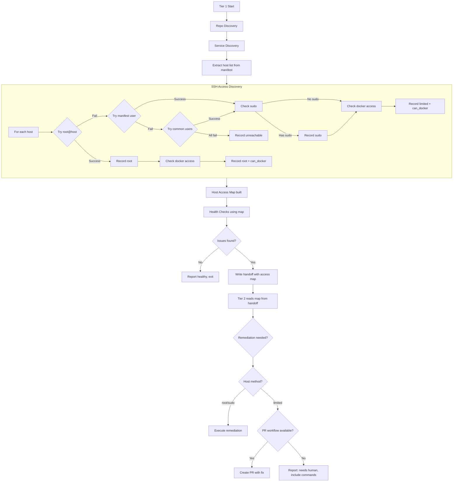
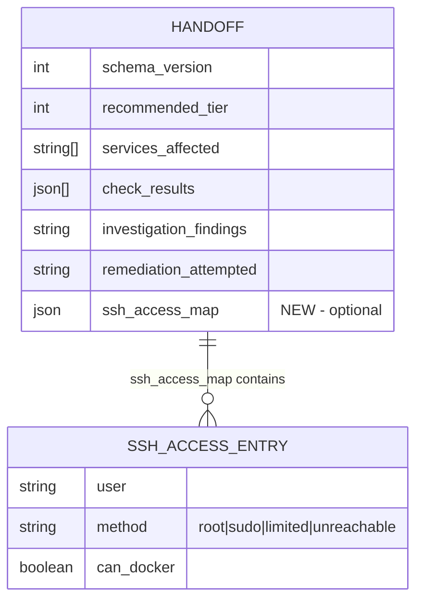

# Design: SSH Access Discovery and Fallback

## Context

This design implements [SPEC-0020](/docs/openspec/specs/ssh-access-discovery/spec.md). Claude Ops currently hardcodes `ssh root@<host>` in all three tier prompts (`tier1-observe.md`, `tier2-investigate.md`, `tier3-remediate.md`). This works when the Ansible deployment playbook has installed the agent's SSH key into root's `authorized_keys`, but fails silently or noisily when:

- A host's `sshd_config` has been updated to disable root login (`PermitRootLogin no`)
- The SSH key was installed under a different user (e.g., `pi` on Raspberry Pi hosts, `ubuntu` on cloud instances)
- The manifest's Hosts table specifies an incorrect user
- A host's SSH setup changes between monitoring cycles

The current failure mode is a hard stop: SSH fails, the agent reports the host as unreachable, and no further investigation happens. This is wasteful because the host may be perfectly reachable under a different user.

The SSH discovery routine runs as the first step of Tier 1, producing a host access map that all subsequent commands reference. This replaces the hardcoded `root@<host>` pattern with a lookup that adapts to each host's actual configuration.

### Current State

From the existing prompts:
- `tier1-observe.md` (line 66): `ssh root@<host> docker ps`
- `tier2-investigate.md` (line 34): `ssh root@<host> <command>`
- `tier3-remediate.md` (line 59): `ssh root@<host> <command>`

The CLAUDE-OPS.md manifest has a Hosts table with IP addresses and roles but does not currently include an SSH user column. The discovery routine makes this column optional/advisory.

## Goals

- Replace hardcoded `root@<host>` with a dynamic lookup from the host access map in all tier prompts.
- Probe each host once per monitoring cycle with aggressive timeouts (5s) to avoid blocking the run.
- Degrade gracefully: limited access still permits read-only inspection; remediation is deferred to PR workflow or human action.
- Pass the access map through tier handoffs so Tier 2/3 don't re-probe.
- Log the discovery clearly so operators can see SSH state at a glance.

## Non-Goals

- **Key management.** SSH key generation, distribution, and rotation are handled by the Ansible deployment playbook, not by Claude Ops.
- **Modifying `authorized_keys`.** The agent never writes to remote host SSH configuration.
- **Interactive or password-based SSH.** All connections use key-based auth with `BatchMode=yes`.
- **Persistent access map.** The map is per-cycle only. It is not persisted to the state directory between cycles because SSH access can change between runs.
- **Parallel probing.** Hosts are probed sequentially. The total probe time for 4-5 hosts at 5s timeout each is 20-25s worst case (all unreachable), which is acceptable for a cycle that runs every few minutes.

## Decisions

### Discovery Placement: Start of Tier 1, Before Health Checks

**Choice:** The SSH discovery routine runs as a new "Step 1.5" in `tier1-observe.md`, after repo discovery (Step 1) and service discovery (Step 2) but before health checks (Step 3). The host list comes from the CLAUDE-OPS.md manifest's Hosts table.

**Rationale:** The host list must be known before probing can begin — it comes from the manifest parsed during repo/service discovery. Health checks depend on SSH access, so probing must complete first. This ordering is the natural insertion point.

**Alternatives considered:**
- Probe lazily on first SSH command per host: Rejected because it scatters discovery across the cycle, makes logging harder to aggregate, and means the host access map isn't complete when the handoff is written.
- Probe at entrypoint.sh level before invoking Claude: Rejected because the entrypoint doesn't know which hosts to probe (that information lives in the mounted repo manifests which only the agent reads).

### Probe Order: Root First, Then Manifest, Then Common Users

**Choice:** The probe order is:
1. `root` — the happy path. The Ansible deployment playbook installs the agent's key here by default.
2. Manifest-declared user — if the operator explicitly set a user in the Hosts table, try it next.
3. Common defaults: `ubuntu`, `debian`, `pi`, `admin` — covers the most common Linux distribution defaults and Raspberry Pi.

Stop on first success.

**Rationale:** Root is the most privileged and most likely to work given the standard deployment. The manifest user is an operator hint. Common defaults catch cases where the key was installed under a distro-default user. The list is short (6 attempts max) and each attempt is bounded to 5 seconds.

**Alternatives considered:**
- Skip root, always use manifest user: Rejected because root is the standard deployment target and skipping it would add latency for the common case.
- Configurable user list via environment variable: Rejected as over-engineering. The common defaults cover known infrastructure. Adding a user to the manifest's Hosts table handles edge cases.

### Access Map: In-Memory JSON, Passed via Handoff

**Choice:** The host access map is a JSON object held in memory during the Tier 1 run and included in the handoff file (`handoff.json`) when escalating. The map uses host FQDN as keys and `{user, method, can_docker}` as values.

```json
{
  "ssh_access_map": {
    "ie01.stump.rocks": {
      "user": "root",
      "method": "root",
      "can_docker": true
    },
    "pie01.stump.rocks": {
      "user": "pi",
      "method": "sudo",
      "can_docker": true
    },
    "pie03.stump.rocks": {
      "user": "pi",
      "method": "limited",
      "can_docker": false
    }
  }
}
```

**Rationale:** The map is small (one entry per host, ~4 fields each). Including it in the handoff file extends the existing SPEC-0016 schema with a new optional field rather than creating a separate file. Tier 2/3 can read it and skip re-probing.

**Alternatives considered:**
- Write to `$CLAUDEOPS_STATE_DIR/ssh-access.json`: Rejected because the map is cycle-scoped, not persistent. Stale maps from a previous cycle could mislead a new cycle.
- Re-probe at each tier: Rejected because it wastes 20-25 seconds per tier and the SSH state is unlikely to change within a single escalation chain (minutes apart).

### Sudo Detection: `sudo -n whoami`

**Choice:** For non-root users, test sudo by running `ssh <user>@<host> 'sudo -n whoami 2>/dev/null'`. If the output is `root`, the user has passwordless sudo.

**Rationale:** `sudo -n` (non-interactive) fails immediately if a password is required, so it won't hang. Redirecting stderr suppresses "sudo: a password is required" messages. Checking the output for `root` confirms that sudo actually elevates to root (not a restricted sudoers config that elevates to a different user).

**Alternatives considered:**
- `sudo -v` (validate without command): Rejected because it doesn't confirm the user can run arbitrary commands — just that some sudo access exists.
- `sudo -l` (list permissions): Rejected as over-complicated for this use case. We need a binary answer: can this user `sudo` to root or not.

### Docker Access Detection: `docker info`

**Choice:** Test Docker access by running `docker info --format '{{.ServerVersion}}'` (with sudo prefix when `method` is `sudo`). This confirms both that Docker is installed and that the user has permission to use it.

**Rationale:** `docker info` is a lightweight read-only command that verifies the Docker socket is accessible. The `--format` flag keeps the output small. If the user is in the `docker` group, it works without sudo. If not, the command fails with a permission error, and we record `can_docker: false`.

**Alternatives considered:**
- `docker ps`: Would also work but returns more output. `docker info` with `--format` is more targeted.
- Check group membership (`id -Gn | grep docker`): Doesn't cover cases where the Docker socket has non-standard permissions.

### Command Prefix: Map-Based Lookup in Prompts

**Choice:** The tier prompts will reference the host access map when constructing SSH commands. Instead of hardcoded `ssh root@<host>`, the prompts will instruct the agent to:
1. Look up the host in the access map
2. Use `ssh <map.user>@<host>` as the base
3. Prefix the remote command with `sudo` if `method` is `sudo` and the command is a write operation
4. Refuse write commands if `method` is `limited`

**Rationale:** This is a prompt-level change, not a code change. The agent reads the access map (which it built or received via handoff) and constructs commands accordingly. This keeps the architecture consistent with the existing design: prompts as executable instructions (SPEC-0002), not compiled code.

**Alternatives considered:**
- Wrapper script on the container that resolves SSH user: Rejected because it adds a binary dependency and breaks the "markdown as instructions" design principle.
- Go code in the dashboard that proxies SSH commands: Rejected because the agent runs SSH commands directly via the Bash tool — adding a proxy layer is unnecessary indirection.

### Limited Access Fallback: PR First, Then Report

**Choice:** When remediation requires elevated privileges on a limited-access host:
1. If a mounted repo manages the host and SPEC-0018's PR workflow is available, generate a fix and create a PR.
2. Otherwise, report the issue with the exact commands needed for manual remediation.

**Rationale:** The PR path leverages existing infrastructure (SPEC-0018) to still make progress even without direct access. Operators get a ready-to-review change. The report path ensures nothing is silently dropped — the agent always tells you what it would have done.

**Alternatives considered:**
- Always escalate to a higher tier: Rejected because a higher tier doesn't grant more SSH access. If root isn't available at Tier 1, it's not available at Tier 3 either.
- Skip the host entirely: Rejected because the host may still be inspectable (read commands work), and reporting the needed remediation is valuable.

## Architecture



### Handoff Schema Extension

The existing `handoff.json` schema (SPEC-0016) gains an optional `ssh_access_map` field:



### Prompt Changes

The three tier prompts need these modifications:

**tier1-observe.md:**
- Add "Step 1.5: SSH Access Discovery" between service discovery and health checks
- Replace `ssh root@<host> docker ps` with "Consult the host access map" instructions
- Include access map in handoff file

**tier2-investigate.md:**
- Add "Read SSH access map from handoff" to Step 1 (Review Context)
- Replace `ssh root@<host> <command>` with map-based lookup instructions
- Add limited-access fallback procedure

**tier3-remediate.md:**
- Same changes as Tier 2
- Add limited-access fallback procedure for Ansible/Helm operations

## Risks / Trade-offs

- **Probe latency adds to cycle time** → Mitigation: 5-second timeout per attempt, max 6 attempts per host, hosts probed sequentially. Worst case for 5 hosts (all unreachable): 5 hosts x 6 users x 5s = 150s. In practice, most hosts will succeed on the first attempt (root), adding ~1-2s per host. For the typical 4-host setup, expect 5-10s total.

- **SSH key not installed for common users** → Mitigation: The probe fails gracefully and moves to the next user. The agent never gets stuck on a failed probe. If no user works, the host is marked unreachable and the run continues.

- **Access map stale within a long cycle** → Mitigation: The map is only valid for one cycle (minutes). If SSH access changes during a cycle (rare), the worst case is a failed command, which the agent handles via its existing error handling. The next cycle will re-probe.

- **Limited access reduces remediation capability** → Mitigation: The PR fallback (SPEC-0018) provides a path forward. The explicit "needs human" report with exact commands ensures nothing is lost silently. Operators can review the access map in the session output to identify hosts that need SSH configuration changes.

- **Sudo detection false negative** → Mitigation: `sudo -n whoami` is the most reliable non-interactive test. If a host has a complex sudoers config that only allows specific commands, the test may pass (`whoami` works) but a specific remediation command may fail. In that case, the command failure is handled by the agent's existing error handling, and the issue is reported.

## Migration Plan

1. **Phase 1: Prompt changes.** Add the SSH discovery section to `tier1-observe.md`. Update SSH command patterns in all three tier prompts to reference the host access map. Add `ssh_access_map` to the handoff file schema.

2. **Phase 2: Manifest extension.** Add an optional `User` column to the Hosts table schema in `CLAUDE-OPS.md`. Document that it's advisory. Update the home-cluster CLAUDE-OPS.md to include known users (if different from root).

3. **Phase 3: Limited-access integration.** Add the limited-access fallback procedure to `tier2-investigate.md` and `tier3-remediate.md`. Connect it to the PR workflow (SPEC-0018) for automated fix proposals.

4. **Phase 4: Dashboard visibility.** Extend the session output rendering to display the SSH access map as a table in the dashboard, so operators can see at a glance which hosts have degraded access.

### Rollback

The discovery routine is purely additive to the prompt files. To rollback: revert the prompt file changes to restore `ssh root@<host>` patterns. The handoff schema addition is backward-compatible (the field is optional). No Go code changes are required for Phase 1-3.

## Open Questions

- **Should the access map be exposed via the REST API?** A `GET /api/hosts/ssh-access` endpoint would let operators and external tools query the current SSH state without reading session output. This is a natural extension but not required initially.

- **Should probe failures trigger notifications?** When a host that previously had root access degrades to limited or unreachable, that's a significant change. A notification via Apprise would alert operators proactively. However, this could be noisy if SSH access is intentionally being rotated.

- **Should the common default user list be configurable?** The hardcoded list (`ubuntu`, `debian`, `pi`, `admin`) covers known infrastructure. An environment variable like `CLAUDEOPS_SSH_USERS=ubuntu,debian,pi,admin,deploy` would add flexibility but also complexity. Given that the manifest's Hosts table already provides a per-host user override, a global config may not be needed.

- **Should there be a "last known good" persistent cache?** If SSH probing is slow (many unreachable hosts), starting from the previous cycle's results could skip straight to the known-good user. But this risks masking changes and adds stale-data complexity.
