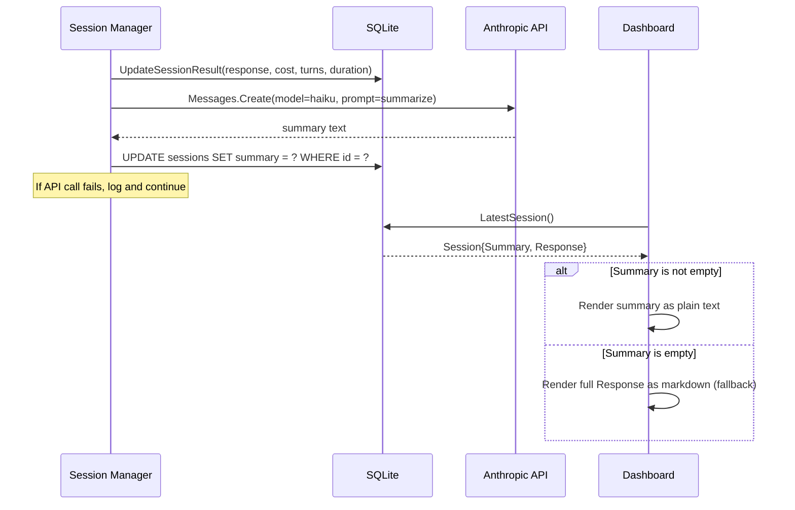

# Design: TL;DR Overview Page with LLM-Generated Summaries

## Context

The dashboard's Overview page currently renders the full markdown response from the latest session. These responses can be very long (hundreds of lines of health check results, container states, remediation logs). Users glancing at the dashboard want a quick "what happened?" — not a wall of markdown. The Overview should behave like a TL;DR: a concise, human-readable summary generated by an LLM from the full response.

Related artifacts:
- SPEC-0021 (this capability)
- ADR-0001 (Go/HTMX Dashboard)
- SPEC-0008 (Go/HTMX/DaisyUI Web Dashboard)

## Goals / Non-Goals

### Goals
- Replace the verbose full response on the overview page with a 2–4 sentence summary
- Generate summaries asynchronously after session completion, with no impact on session flow
- Persist summaries in the database so the page loads instantly
- Keep summarization cost negligible by using Haiku

### Non-Goals
- Streaming the summary generation to the UI in real-time
- Providing user-editable summaries
- Summarizing individual events or memories (only session responses)

## Decisions

### Decision 1: Inline summarization in session manager

**Choice**: Call the Anthropic API from within the session manager's `runSession` flow, after `UpdateSessionResult` succeeds but before the method returns.

**Rationale**: The session manager already has access to the response text and the session ID. Adding the summarization call here keeps the logic co-located with result persistence. The call is fire-and-forget (errors logged, not propagated).

**Alternatives considered**:
- Background goroutine with a channel: Adds concurrency complexity for a fast API call that runs once per session. Rejected as over-engineering.
- Separate summarization worker: Would require a job queue and polling. Overkill for a single API call per session.

### Decision 2: New `summary` column via migration 007

**Choice**: Add a nullable `summary TEXT` column to the `sessions` table in a new migration.

**Rationale**: Follows the existing migration pattern (sequential numbered migrations). Nullable because legacy sessions won't have summaries, and failed summarizations should not block session storage.

### Decision 3: Anthropic SDK direct call

**Choice**: Use the Anthropic Go SDK (`github.com/anthropics/anthropic-sdk-go`) directly for the summarization call.

**Rationale**: The project already depends on the Anthropic API key (`ANTHROPIC_API_KEY`) for Claude CLI sessions. Using the SDK for a single Messages API call is straightforward. The existing session manager already imports the config package which has access to the API key.

**Alternatives considered**:
- Shelling out to `claude` CLI for summarization: Heavy-weight for a single prompt, adds process overhead and parsing complexity. Rejected.
- Using a generic HTTP client: The SDK handles auth, retries, and response parsing. No reason to DIY.

### Decision 4: Fallback to full response when summary is missing

**Choice**: If the summary column is NULL, the template falls back to rendering the full markdown response.

**Rationale**: Graceful degradation for legacy sessions and failed summarizations. Users always see something on the overview page.

## Architecture

## Risks / Trade-offs

- **API cost**: Haiku calls are cheap (~$0.001 per summary), but this adds a small per-session cost. Mitigated by using the cheapest model.
- **Latency**: The summarization call adds ~1-2s to session completion. Mitigated by running after result persistence (session is already recorded as complete).
- **Summary quality**: LLM summaries may occasionally miss key details. Mitigated by the fallback link to the full session detail page.

## Open Questions

- None at this time.
