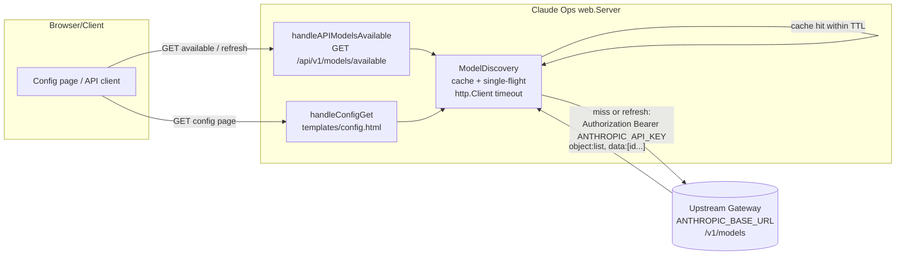
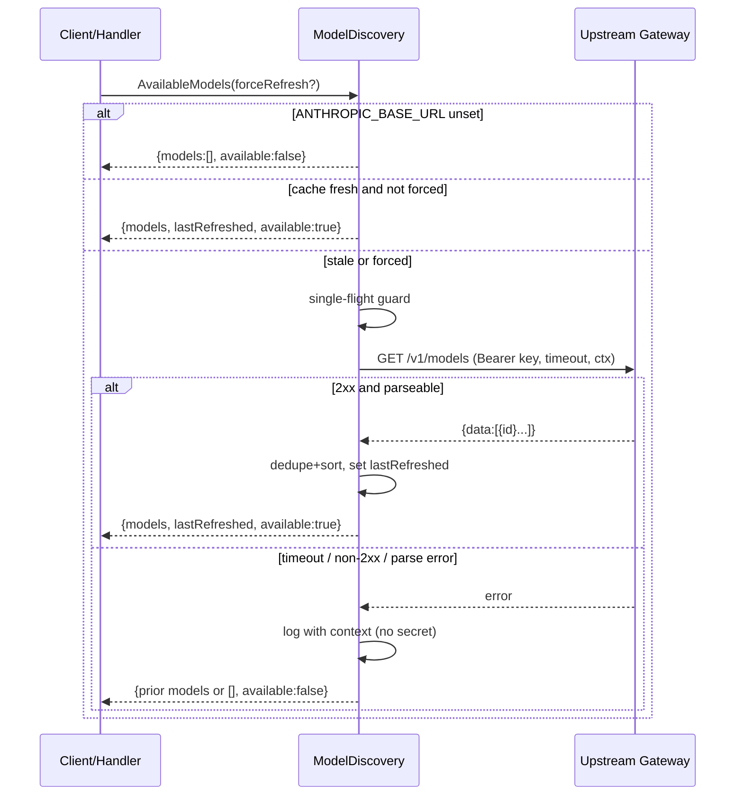

# Design: Upstream Model Auto-Discovery

## Context

Claude Ops invokes the Claude Code CLI as a subprocess for each escalation tier and
passes the per-tier model via `--model` (SPEC-0010, ADR-0010). When the operator points
Claude Ops at an upstream OpenAI/Anthropic-compatible gateway (LiteLLM) by setting the
`ANTHROPIC_BASE_URL` environment variable (see `docker-compose.yaml`, `.env.example`,
and README), the CLI's API traffic is routed through that gateway, which can in turn
route to many backing models.

Currently the tier model fields — `tier1_model`, `tier2_model`, `tier3_model` — are
free-text strings in `internal/config/config.go` (`Config` struct, loaded via viper).
They are read and written through:

- The REST API: `handleAPIGetConfig` / `handleAPIUpdateConfig` in
  `internal/web/api_handlers.go`, with DTOs `APIConfig` / `APIUpdateConfigRequest` in
  `internal/web/api_types.go` (SPEC-0017 REQ-12/REQ-13).
- The HTML config page: `handleConfigGet` / `handleConfigPost` in
  `internal/web/handlers.go`, rendering `templates/config.html` (SPEC-0008 REQ-10).

Operators must know exact model identifiers to type them in. LiteLLM (and any
OpenAI-compatible gateway) exposes `GET /v1/models` listing the routable models, which we
can query to populate a selectable list.

A critical disambiguation: Claude Ops ALSO serves its own OpenAI-compatible
`GET /v1/models` endpoint (`handleModels` in `internal/web/chat_handler.go`, SPEC-0024 /
ADR-0020) advertising the synthetic `claude-ops`, `claude-ops-tier1/2/3` identifiers used
by chat clients. That is a SERVED endpoint for inbound chat clients. This capability adds
a CONSUMED query against the operator's UPSTREAM gateway. They are unrelated and must not
be merged.

This spec depends on SPEC-0008 (configuration) and SPEC-0017 (REST API config endpoints).

## Goals / Non-Goals

### Goals

- Discover the models a configured upstream gateway can route to, via
  `${ANTHROPIC_BASE_URL}/v1/models`.
- Expose the discovered list through the config API and the dashboard config page so
  operators pick from a list instead of typing blind.
- Let operators assign any discovered (or manually typed) model to any tier.
- Cache discovered models with a TTL plus on-demand refresh; keep upstream load low.
- Fail safe: discovery problems never break config rendering, retrieval, or saving.

### Non-Goals

- Validating that a chosen model actually works end-to-end (the gateway/CLI surface that
  at runtime; an invalid model fails at invocation, as it does today).
- Tracking the upstream base URL or credential as new managed config fields — they remain
  process environment variables consumed at request time. (A future spec may promote
  them to managed config.)
- Changing Claude Ops' own served `/v1/models` endpoint (SPEC-0024).
- Per-model metadata beyond the identifier (context window, pricing, capabilities) — out
  of scope for this iteration; only `id` is consumed.

## Decisions

### Discovery source is the upstream gateway, read from the environment

**Choice**: Build the discovery URL from `ANTHROPIC_BASE_URL` (env var), querying
`${ANTHROPIC_BASE_URL}/v1/models`, authenticating with `ANTHROPIC_API_KEY` as
`Authorization: Bearer`.
**Rationale**: This is exactly where the operator already configures the gateway the CLI
routes through; reusing it guarantees the discovered list matches what the tiers will
actually hit. No new configuration surface is required.
**Alternatives considered**:
- Promote base URL / key into the `Config` struct now: rejected — larger change, and the
  env vars are the established source of truth consumed by the CLI subprocess; promoting
  them is a separable decision.
- Query Claude Ops' own `/v1/models`: rejected — that returns synthetic tier IDs, not the
  upstream model inventory; it would be circular and wrong.

### Dedicated discovery component with a cached, single-flight client

**Choice**: Introduce a small discovery component (e.g. `internal/models` or a discovery
type owned by the web `Server`) that owns an `http.Client` with a bounded timeout, a
mutex-guarded cache holding `(modelIDs, lastRefreshed, available)`, and single-flight
refresh.
**Rationale**: Centralizes timeout, auth, parsing, caching, and concurrency safety in one
testable place; both the API handler and the HTML handler consume the same cache. Single
-flight prevents refresh stampedes against the gateway.
**Alternatives considered**:
- Query on every config render: rejected — adds latency and upstream load to every page
  view and API read.
- Background poller only (no lazy refresh): rejected — wastes upstream calls when the
  config page is rarely viewed; lazy-on-access with TTL is simpler and sufficient. A
  background refresh MAY be layered in later without changing the contract.

### New API endpoints rather than folding into GET /api/v1/config

**Choice**: Add `GET /api/v1/models/available` (with `?refresh=true`) and
`POST /api/v1/models/available/refresh`, separate from `GET /api/v1/config`.
**Rationale**: Keeps the config payload stable (SPEC-0017 consumers unaffected), lets the
discovered list and its freshness metadata evolve independently, and gives the UI a clean
endpoint to refresh without re-fetching all config. Discovery latency/failure is isolated
from the config read path. Handlers should follow the existing `handleAPI*` naming
convention in `internal/web/api_handlers.go` (e.g. `handleAPIModelsAvailable`).

Note on auth baseline: `internal/web/server.go` currently registers `/api/v1/*` routes
with no auth/security-header/CSRF middleware, so the new endpoints inherit the same
(currently unauthenticated) baseline as `/api/v1/config`. The spec's security
requirements define the target regime; they do not assume reusable middleware exists
today. Establishing that middleware project-wide is a separable effort.
**Alternatives considered**:
- Embed `available_models` in `APIConfig`: rejected — couples config reads to upstream
  latency and bloats a stable DTO; a failed discovery shouldn't perturb config reads.

### Free-text fallback is always permitted

**Choice**: Tier model fields remain free-text-capable; discovery only augments the UI
with a dropdown and the API with a list. Any value (discovered or not) is accepted and
persisted.
**Rationale**: Preserves existing behavior, supports gateways that under-report models,
private/aliased models, and air-gapped setups with no `ANTHROPIC_BASE_URL`. Discovery is
an aid, never a gate.

### Graceful degradation returns 200 with `discovery_available: false`

**Choice**: When discovery can't run (no base URL, timeout, non-2xx, parse error), the
available-models endpoint returns `200` with an empty list and
`discovery_available: false` instead of an error status; the HTML page falls back to
free-text inputs.
**Rationale**: Discovery is best-effort metadata. Returning an error status would push
failure handling onto every consumer and risk breaking the config page. A clear flag lets
clients decide how to present the fallback.

## Architecture

The web `Server` gains a model-discovery dependency. The API and HTML config handlers
read the cached discovered list through it; the cache lazily refreshes from the upstream
gateway on TTL expiry or explicit refresh.

Refresh / cache decision flow for a single access:

## Risks / Trade-offs

- **Upstream gateway slow or down stalls config UX** → bounded HTTP timeout (default ~5s),
  cache serves prior results, and degradation returns immediately with a fallback flag.
- **Refresh stampede floods the gateway** → single-flight collapses concurrent refreshes
  to one in-flight upstream call; explicit refresh is the only TTL bypass.
- **Leaking the upstream API key** → key is read from the environment only, sent solely in
  the `Authorization` header, and excluded from logs, errors, API payloads, and rendered
  HTML; structured logging avoids interpolating secrets.
- **Discovered list diverges from what the CLI can actually use** → discovery is advisory;
  free-text assignment is always allowed and the runtime CLI invocation is unchanged, so
  an unusable model fails exactly as it does today.
- **Oversized/malicious upstream body** → response read is bounded to a maximum size;
  overflow is treated as a parse failure (discovery unavailable).
- **New endpoints widen attack surface** → both require the same auth as `/api/v1/config`;
  the upstream target is derived only from `ANTHROPIC_BASE_URL`, never from request input.

## Migration Plan

Additive; no data migration. Deployment steps:

1. Ship the discovery component, the two new API endpoints, and the config-page dropdown
   with refresh control. Behavior is unchanged when `ANTHROPIC_BASE_URL` is unset.
2. Operators with a gateway configured see populated dropdowns automatically on next
   config-page load; no action required.
3. Rollback is safe: removing the feature reverts the config page to free-text inputs and
   drops the new endpoints. Persisted tier model values (free-text strings) are unaffected
   since the storage format is unchanged.

## Open Questions

- Should the upstream base URL and key eventually become managed `Config` fields (so they
  can be changed from the dashboard without a restart), rather than env-only? Deferred to
  a follow-up spec.
- Should a background refresh run on the existing run interval to keep the cache warm, or
  is lazy-on-access sufficient? Lazy is the initial choice; revisit if operators report
  staleness.
- Should discovery surface per-model metadata (context window, pricing) when the gateway
  provides it, to aid tier selection? Out of scope for this iteration.
