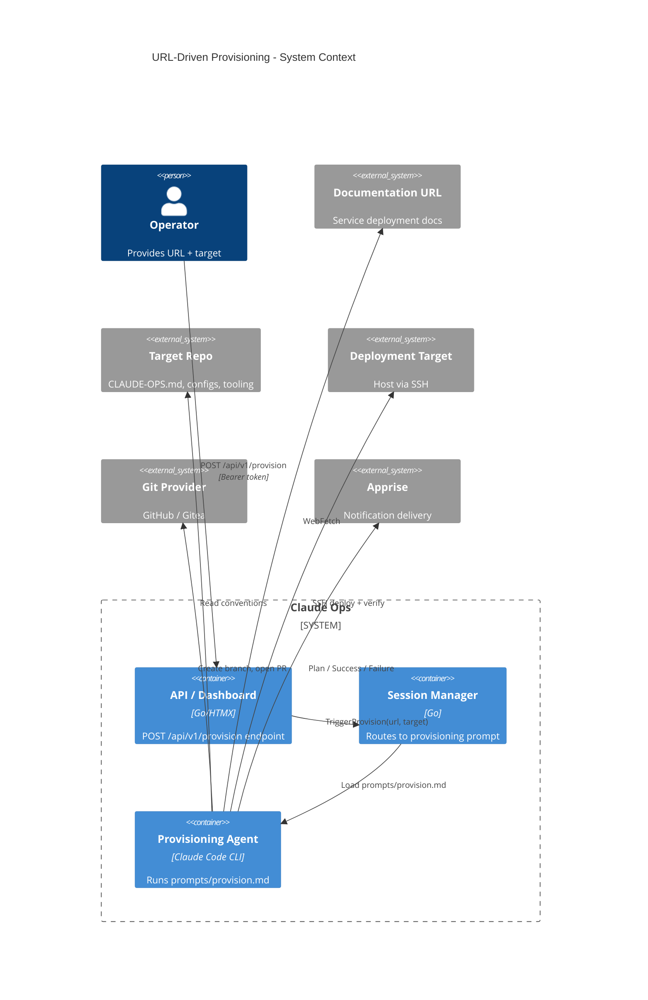
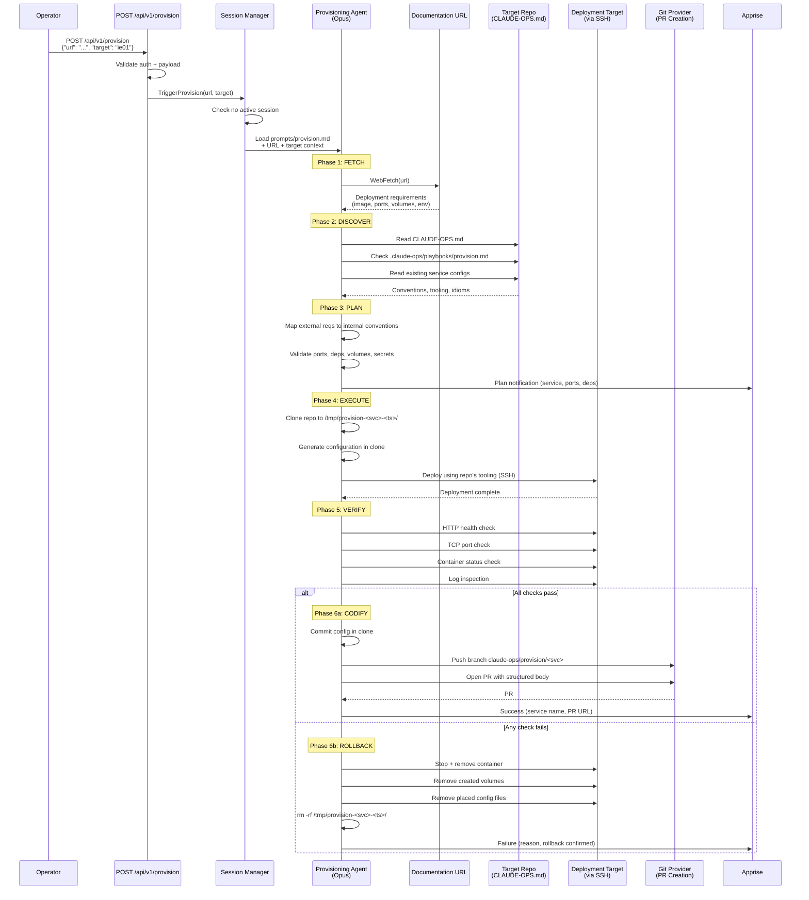
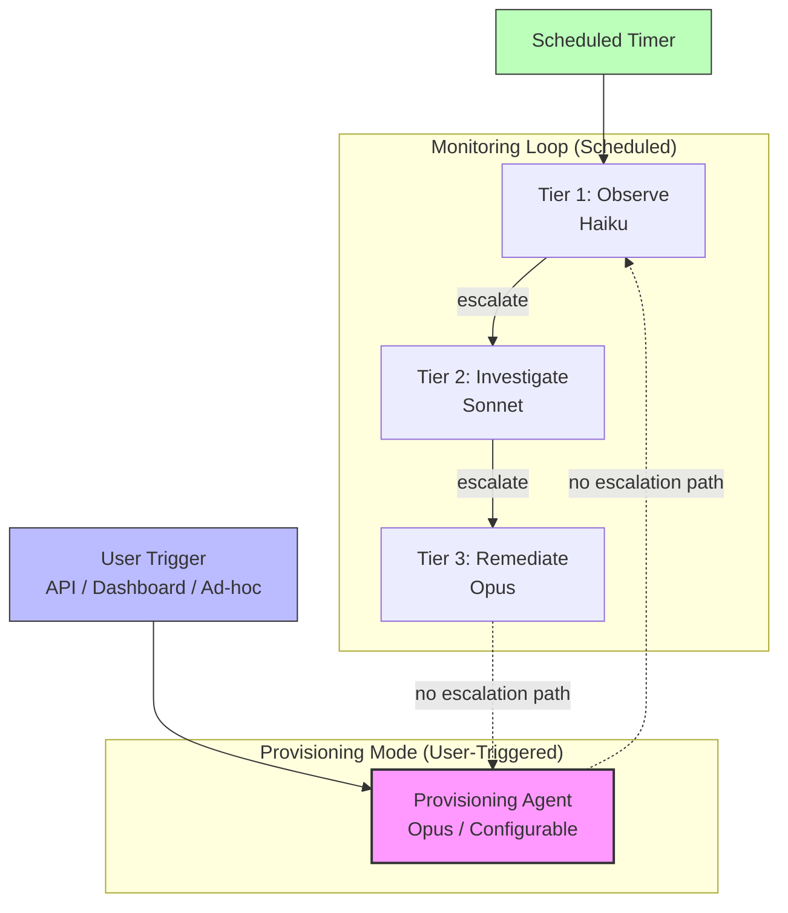

# Design: URL-Driven Service Provisioning

## Context

This design implements [SPEC-0028](/docs/openspec/specs/url-driven-provisioning/spec.md) and [ADR-0027](/docs/adrs/ADR-0027-url-driven-service-provisioning.md). Claude Ops currently operates in a purely reactive posture: it monitors existing services, detects failures, and remediates within the tiered permission model. Operators who want to deploy a new service must manually read documentation, write deployment configuration, commit it, and run the deployment -- even though the agent has all the capabilities to do this work.

Provisioning Mode introduces a new execution mode that allows the agent to deploy new services when explicitly triggered by the operator. The operator provides a documentation URL and a deployment target; the agent handles the full lifecycle from requirement extraction through deployment, verification, and PR codification.

This design is fundamentally different from the monitoring workflow in one critical way: it inverts the PR-first model of ADR-0018. In monitoring, the agent proposes a change via PR and waits for human review before it takes effect. In provisioning, the agent deploys first and codifies via PR afterward. This inversion is justified because: (a) the operator explicitly requested immediate deployment, (b) rollback handles failure, and (c) the PR still captures the final state for review.

## Goals

- Define how Provisioning Mode fits into the existing architecture without contaminating the monitoring loop.
- Specify the API endpoint, session routing, and prompt loading for provisioning triggers.
- Detail the seven-phase lifecycle (Fetch, Discover, Plan, Execute, Verify, Codify, Rollback) with enough precision for implementation.
- Establish the framework-agnostic convention discovery approach that makes provisioning work for any deployment tooling.
- Define the permission boundary that grants provisioning broader write access than monitoring while maintaining safety constraints.
- Specify rollback guarantees that ensure failed provisioning leaves no remnants.

## Non-Goals

- **Interactive plan approval**: The initial implementation proceeds after plan generation without waiting for operator confirmation. A future enhancement MAY add an approval gate.
- **Batch provisioning**: Provisioning multiple services from a single URL or in a single session is out of scope.
- **Provisioning templates**: Repo-provided templates for common service patterns (e.g., "standard web app with database") are a future enhancement.
- **Multi-session parallelism**: The existing single-session constraint applies. Per-host parallel provisioning is deferred.
- **Service removal**: Provisioning Mode can create services but MUST NOT remove them. Service deprovisioning is a separate concern.

## Decisions

### Provisioning Mode Isolation

**Choice:** Provisioning is a distinct execution mode with its own prompt file (`prompts/provision.md`), permissions, and trigger mechanism. It is not "Tier 4" and does not participate in the monitoring escalation chain.

**Rationale:** Mixing provisioning permissions into the existing tier model creates two risks: (1) a monitoring session could accidentally or maliciously invoke provisioning capabilities through tier escalation, and (2) the Tier 3 prompt is already complex -- adding a full provisioning workflow would double its size and increase instruction-following errors. A separate mode provides clean isolation: provisioning can only happen when the operator explicitly triggers it through a dedicated pathway.

**Alternatives considered:**
- Extend Tier 3 with gated provisioning capabilities: Rejected because Tier 3 can be reached via automatic escalation from Tier 1/2, creating a path from scheduled monitoring to provisioning that bypasses explicit user intent.
- New "Tier 4" above Tier 3: Rejected because it implies a relationship with the monitoring escalation chain that doesn't exist. Provisioning is orthogonal to monitoring, not an escalation of it.

### Deploy-First, PR-Later

**Choice:** The agent deploys the service immediately and creates a PR afterward to codify the working configuration. This inverts ADR-0018's PR-first model.

**Rationale:** The PR-first model requires the operator to review and merge a PR before anything runs. For provisioning, this friction is disproportionate to the context: the operator wants the service running now, not after a review cycle. The deploy-first model is acceptable because:

1. The operator explicitly triggered the provisioning -- this is not an autonomous decision.
2. Rollback handles failure -- if the deployment doesn't work, everything is cleaned up.
3. The PR still captures the final state -- human review still happens, just after the service is running.
4. This is a homelab context with a single trusted operator. Multi-tenant environments would need an approval gate.

**Alternatives considered:**
- PR-first with auto-deploy on merge: Rejected due to latency (operator must wait for review), complexity (needs merge detection via webhooks or polling), and false sense of safety (operators may rubber-stamp to get the service running faster).

### Framework Agnosticism via Convention Discovery

**Choice:** The agent discovers how to deploy by reading the target repo's conventions, not by hardcoding knowledge of any deployment framework.

**Rationale:** Repos may use Ansible, Docker Compose, Helm, Nix, shell scripts, Makefiles, Terraform, or any combination. Hardcoding framework-specific provisioning logic would create a maintenance burden, limit applicability, and violate the "runbook, not application" philosophy. Instead, the agent reads the repo like a human would: examine existing services, identify patterns, and follow those patterns for the new service.

The convention discovery approach is viable because:
1. The agent already reads CLAUDE-OPS.md manifests and `.claude-ops/` extensions (ADR-0005, SPEC-0005).
2. LLMs are capable of reading multiple file examples and inferring patterns.
3. Repos that need precise control can provide `.claude-ops/playbooks/provision.md` with explicit instructions.

**Alternatives considered:**
- Framework-specific provisioning modules (Ansible module, Compose module, Helm module): Rejected because it requires Go code for each framework, limits extensibility, and contradicts the markdown-as-executable-instructions approach (ADR-0002).

### Secret Handling Policy

**Choice:** A three-tier approach: (1) LLM MUST NOT generate secrets, (2) system tools (openssl, /dev/urandom) MAY generate cryptographic material, (3) repo-provided tooling MAY provision credentials. Only secrets requiring manual third-party registration are deferred.

**Rationale:** LLM outputs are deterministic given the same context and are logged in session results -- both properties make them unsuitable as cryptographic material. System tools like `openssl rand` produce genuinely random output. Repo-provided tooling (Terraform, Ansible) can integrate with credential stores and identity providers. This layered approach minimizes secrets that require manual operator intervention while maintaining cryptographic safety.

**Alternatives considered:**
- Defer all secrets to the operator: Rejected because it makes provisioning impractical for services that need generated tokens or passwords. Most secrets are random strings that system tools can safely produce.
- Allow LLM-generated secrets with warnings: Rejected because there is no scenario where LLM-generated secrets are the right choice. System tools are universally available and produce better output.

### Rollback Strategy

**Choice:** Rollback is mandatory and comprehensive on verification failure. The agent removes the container, cleans up created volumes, removes placed configuration files, and deletes the scoped temp directory.

**Rationale:** A partial deployment is worse than no deployment -- it consumes ports, leaves dangling containers, and creates confusion about what is running. Rollback must be thorough enough that the target host looks the same as before provisioning started.

The temp directory cleanup is deliberately scoped (`/tmp/provision-<service>-<timestamp>/`) rather than wildcarded (`/tmp/provision-*`) to prevent interference with other provisioning sessions if the single-session constraint is relaxed in the future.

**Risks:**
- Some side effects may be irreversible (database schema migrations, external API registrations). The plan phase should identify irreversible actions and flag them before execution.
- Volume deletion on rollback could destroy data if the agent misidentifies a volume as newly created. Mitigation: the agent must track which volumes it created during this session and only delete those.

## Architecture

### Provisioning Mode in the System Context



### Provisioning Lifecycle Sequence



### Provisioning Mode vs. Monitoring Tiers



### API Endpoint Design

The provisioning API extends the existing web server with a new endpoint:

```
POST /api/v1/provision
Authorization: Bearer <CLAUDEOPS_CHAT_API_KEY>
Content-Type: application/json

{
    "url": "https://docs.example.com/deploy",
    "target": "ie01"
}
```

**Responses:**

| Status | Body | Condition |
|--------|------|-----------|
| 201 Created | `{"session_id": "<uuid>"}` | Provisioning session started |
| 400 Bad Request | `{"error": "url is required"}` | Missing or empty `url` or `target` |
| 401 Unauthorized | `{"error": "unauthorized"}` | Missing or invalid Bearer token |
| 409 Conflict | `{"error": "a session is already running"}` | Active session exists |

The session manager distinguishes provisioning from monitoring by the trigger type. When `TriggerProvision` is called, the manager:

1. Checks for an active session (returns 409 if one exists).
2. Creates a session record with `trigger = "provision"`.
3. Invokes `runOnce()` with the provisioning prompt (`prompts/provision.md`), passing the URL and target as context via `--append-system-prompt`.

### Session Routing

The session manager needs a new method alongside the existing `TriggerAdHoc`:

```
TriggerAdHoc(prompt string) error        // existing
TriggerProvision(url, target string) error  // new
```

`TriggerProvision` follows the same channel-based pattern as `TriggerAdHoc` (SPEC-0012) but loads `prompts/provision.md` instead of using the prompt text directly. The URL and target are injected as system prompt context.

For ad-hoc prompts that contain provisioning intent (e.g., "Provision https://... to ie01"), the session manager detects the pattern and routes to `TriggerProvision` internally. Detection can use simple heuristics (prompt starts with "Provision" or "Deploy" and contains a URL).

### Convention Discovery Flow

The discovery phase is the most critical for framework agnosticism. The agent follows this process:

1. **Read CLAUDE-OPS.md** -- extract capabilities, deployment targets, tooling declarations, and any provisioning-specific notes.
2. **Check for provisioning extensions** -- look for `.claude-ops/playbooks/provision.md` and `.claude-ops/skills/provision.md`. If found, these become the primary authority.
3. **Sample existing services** -- read 3-5 existing service configurations to identify:
   - File format and directory structure (e.g., `host_vars/<host>/<service>.yml` for Ansible, `docker-compose.yml` for Compose)
   - Naming conventions (kebab-case, snake_case, prefixes)
   - Port allocation patterns (sequential, range-based, explicit)
   - Volume path conventions (absolute paths, relative paths, NFS)
   - Environment variable handling (inline, env files, vault references)
   - Reverse proxy configuration (Docker labels, config file entries, annotations)
   - Database provisioning (inventory fields, sidecar containers, shared instances)
   - Health check patterns (Docker HEALTHCHECK, monitoring registrations)
4. **Identify deployment commands** -- determine what command or playbook is used to deploy a service (e.g., `ansible-playbook`, `docker compose up -d`, `helm upgrade --install`).
5. **Map the target** -- locate the deployment target in the repo's infrastructure model (which host, which inventory group, what SSH access).

### Temporary Clone Workflow

```
/tmp/provision-<service>-<timestamp>/
├── <cloned repo contents>
├── <new service configuration files>
└── <modified existing configuration files>
```

The clone is created from the mounted repo's git remote (not by copying the read-only mount). This ensures the clone has full git capabilities (branch, commit, push). The clone is the sole working directory for all configuration changes.

After successful deployment and PR creation, the clone is retained until the session ends (for debugging). On rollback, the clone is deleted immediately as part of cleanup.

### Provisioning Prompt Structure

`prompts/provision.md` defines:

1. **Identity and context** -- "You are a provisioning agent. You have been asked to deploy a new service."
2. **Inputs** -- The documentation URL and deployment target (injected via system prompt).
3. **Lifecycle phases** -- Detailed instructions for each of the seven phases.
4. **Permissions** -- What provisioning mode MAY and MUST NOT do (from SPEC-0028-REQ-12).
5. **Tool usage** -- Integrates with the skill-based tool discovery (SPEC-0023). The agent consults the tool inventory to determine how to deploy.
6. **Rollback procedure** -- Explicit instructions for cleanup on failure.
7. **PR template** -- Structure for the codification PR body.

### Environment Variables

| Variable | Default | Purpose |
|----------|---------|---------|
| `CLAUDEOPS_PROVISION_MODEL` | Tier 3 model | Model used for provisioning sessions |
| `CLAUDEOPS_PROVISION_VERIFY_TIMEOUT` | `120` | Seconds to wait for health verification |
| `CLAUDEOPS_CHAT_API_KEY` | (required) | Bearer token for API authentication |

## Risks / Trade-offs

- **Deploy-first inverts the ADR-0018 safety model.** A service runs before any human reviews the configuration. Mitigation: the operator explicitly triggered the provisioning, rollback handles failures, and the PR still captures the final state. For a homelab with a single trusted operator, this is an acceptable trade-off.

- **Rollback may not be perfectly clean.** Some deployment side effects (database schema migrations, external API registrations) cannot be trivially undone. Mitigation: the plan phase should identify irreversible actions and flag them before execution. The initial implementation focuses on reversible actions (container creation, volume creation, config file placement).

- **Documentation quality varies.** The agent's ability to extract deployment requirements depends on how well the service's documentation describes them. Mitigation: the agent can supplement with WebSearch and should flag uncertainties to the operator in the plan notification rather than guessing.

- **Convention inference may produce incorrect configurations.** If a repo's conventions are inconsistent or the agent misreads patterns from existing services, the generated configuration may be wrong. Mitigation: verification catches deployment failures before codification, and rollback ensures no remnants. Repos with complex conventions should provide `.claude-ops/playbooks/provision.md` for explicit instructions.

- **Secret handling has an inherent tension.** Generated secrets (via `openssl rand`) are secure but may need to be communicated to the operator or stored in a secrets manager. The initial implementation generates secrets inline in the configuration; future work should integrate with the repo's secrets management conventions.

- **Prompt-level permission enforcement applies.** As with all Claude Ops permissions, provisioning restrictions within `Bash` rely on model compliance (ADR-0003). The provisioning prompt is carefully scoped, but a sufficiently creative model could exceed its boundaries. Mitigation: same as ADR-0003 -- Docker-level restrictions, read-only mounts for non-provisioning paths, and post-hoc audit.

- **Single-session constraint limits responsiveness.** If provisioning takes 10 minutes, no monitoring can occur during that time. Mitigation: provisioning is expected to be infrequent (new services are added occasionally, not constantly). The operator can check dashboard status. Future work could introduce per-host session isolation.

## Open Questions

- **Should the plan phase support an interactive approval gate?** The initial implementation proceeds automatically after plan generation. Adding an approval gate (operator reviews plan in dashboard and clicks "Approve") would increase safety but add latency and UX complexity. This could be an opt-in feature controlled by an environment variable.

- **How should the agent handle services that require multiple containers (e.g., app + sidecar)?** The current spec describes single-service provisioning. Multi-container provisioning (where the documentation describes a service with multiple components) needs a convention for how the agent composes them.

- **Should provisioning sessions have their own cooldown state?** The current cooldown model tracks monitoring restarts and redeployments per service. Provisioning creates new services that don't exist in cooldown yet. The codification PR could include adding the new service to the monitoring checks, but the mechanism needs definition.

- **How should the agent handle documentation that describes multiple deployment methods?** Some projects document Docker Compose, Kubernetes, and bare-metal installation. The agent needs to select the deployment method that matches the repo's conventions, but the selection heuristic is not yet defined.

- **Should provisioning support dry-run mode?** Running the full lifecycle without actually deploying would be useful for testing convention discovery and plan generation. This could reuse `CLAUDEOPS_DRY_RUN` -- the agent would log what it would do at each phase without executing mutating operations.
