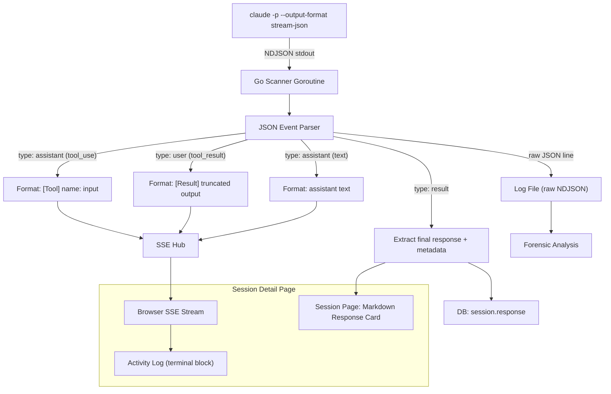

# ADR-0011: Show CLI Activity Log and Formatted Response on Session Page

## Context and Problem Statement

The session detail page currently shows only the raw text output from `claude -p`, which is the final assistant response as unformatted markdown. Operators cannot see what tools Claude invoked, what commands it ran, what files it read, or how it arrived at its conclusions. The experience is equivalent to reading a summary with no supporting evidence.

How should the session page display Claude's activity so that operators can see both the full CLI activity (tool calls, results, reasoning) and the final response in a readable format?

## Decision Drivers

* **Operator trust** -- Operators need to verify that Claude checked the right services, ran the correct commands, and interpreted results correctly. Showing only the final response requires blind trust.
* **Debugging** -- When Claude reports an issue or takes a remediation action, operators need the full execution trace to understand what happened and whether the action was correct.
* **Familiar experience** -- The session output should look like what you'd see running `claude` in a terminal: tool names, inputs, outputs, and assistant text interleaved chronologically.
* **Response readability** -- The final markdown response contains the actual health report or remediation summary. It should be rendered as formatted markdown, not raw text in a terminal block.
* **Real-time streaming** -- Running sessions should stream activity to the browser as it happens, not just after completion.

## Considered Options

* **Option A: `--output-format stream-json` with parsed event display** -- Use the Claude CLI's structured JSON streaming output, parse events in the Go session manager, and publish formatted activity lines to the hub. Store the final `result` event's text separately. Render the page with the formatted response at top and the activity log below.
* **Option B: `--output-format text` with `--verbose` flag** -- Use the CLI's verbose text output which includes some tool call information. Display as raw terminal text.
* **Option C: Custom wrapper that intercepts tool calls** -- Build a custom Claude Agent SDK wrapper that hooks into tool execution and emits structured events.

## Decision Outcome

Chosen option: **"Option A: `--output-format stream-json` with parsed event display"**, because it provides structured, machine-parseable events that can be formatted for both the terminal log and the browser, while cleanly separating the final response from the activity trace.

The implementation:

1. Add `--output-format stream-json` to the Claude CLI invocation args
2. Parse each NDJSON line in the scanner goroutine to extract event type and content
3. Format events into human-readable lines: tool calls show `[Tool] name: input`, tool results show truncated output, assistant text shows the reasoning
4. Publish formatted lines to the SSE hub for real-time browser streaming
5. Write raw JSON to the log file for full forensic analysis
6. Extract the `result` event's text as the final response, stored separately in the DB
7. On the session page, render the formatted markdown response at the top in a card, with the full activity log in a terminal block below

### Consequences

* Good, because operators see the full execution trace -- every tool call, every result, every piece of reasoning -- just like watching the CLI in a terminal.
* Good, because the final response is rendered as formatted markdown at the top of the page, making the health report immediately readable.
* Good, because raw JSON in the log file preserves the complete event stream for forensic analysis, cost tracking (from the `result` event), and replay.
* Good, because the `result` event provides structured metadata (duration, cost, token usage, turn count) that can be displayed in the session detail view.
* Bad, because parsing stream-json adds complexity to the session manager -- it must handle malformed JSON, unknown event types, and edge cases gracefully.
* Bad, because the formatted activity log is a lossy representation of the raw events. Some detail (exact token counts per turn, cache stats) is only available in the raw JSON log.

### Confirmation

* Running a session shows tool calls and results streaming in the terminal output area of the session page.
* The final response appears as rendered markdown at the top of the session detail page.
* The raw JSON log file contains the complete NDJSON event stream.
* The `result` event's metadata (cost, duration, turns) is displayed in the session metadata card.

## Pros and Cons of the Options

### Option A: `--output-format stream-json` with parsed event display

The Claude CLI emits NDJSON with typed events: `system` (init), `assistant` (text + tool_use blocks), `user` (tool_result), and `result` (final summary with cost/usage). Each line is self-contained JSON.

* Good, because events are structured and typed, enabling precise formatting of tool calls, results, and text.
* Good, because the `result` event contains the final response text, total cost, token usage, and duration -- all useful for the session detail view.
* Good, because raw JSON can be written to the log file while formatted text goes to the hub, serving both forensic and real-time display needs.
* Good, because the format is documented and stable as part of the Claude Code CLI contract.
* Neutral, because it requires a JSON parser in the scanner goroutine, but Go's `encoding/json` handles this trivially.
* Bad, because tool result content can be very large (full file contents), requiring truncation logic for display.
* Bad, because unknown or new event types must be handled gracefully to avoid breaking on CLI upgrades.

### Option B: `--output-format text` with `--verbose`

The CLI's verbose mode includes some tool execution information in the text output, but it's unstructured.

* Good, because it requires no JSON parsing -- output is plain text that can be displayed directly.
* Good, because it's the simplest implementation: pipe stdout to the terminal and hub as-is.
* Bad, because the output format is not structured, making it impossible to reliably separate tool calls from assistant text.
* Bad, because the final response cannot be cleanly extracted for separate markdown rendering.
* Bad, because there's no structured metadata (cost, tokens, duration) available.
* Bad, because verbose output formatting may change between CLI versions without notice.

### Option C: Custom Claude Agent SDK wrapper

Build a TypeScript or Go wrapper using the Agent SDK that intercepts tool execution and emits custom events.

* Good, because it provides maximum control over event format and content.
* Good, because it could add custom metadata (e.g., timing per tool call, custom annotations).
* Bad, because it requires maintaining a separate agent runtime, contradicting ADR-0010's decision to use the CLI as a subprocess.
* Bad, because it duplicates tool execution infrastructure that the CLI already provides.
* Bad, because it introduces a TypeScript dependency for what is currently a pure Go application.
* Bad, because it's the highest-effort option with the most ongoing maintenance burden.

## Architecture Diagram

## More Information

* Related: ADR-0008 (Go/HTMX dashboard) -- defines the web framework this builds on
* Related: ADR-0010 (Claude CLI subprocess) -- defines how Claude is invoked
* Claude CLI `--output-format stream-json` emits NDJSON with event types: `system`, `assistant`, `user`, `result`
* The `result` event includes `total_cost_usd`, `usage`, `duration_ms`, `num_turns`, and the final `result` text
