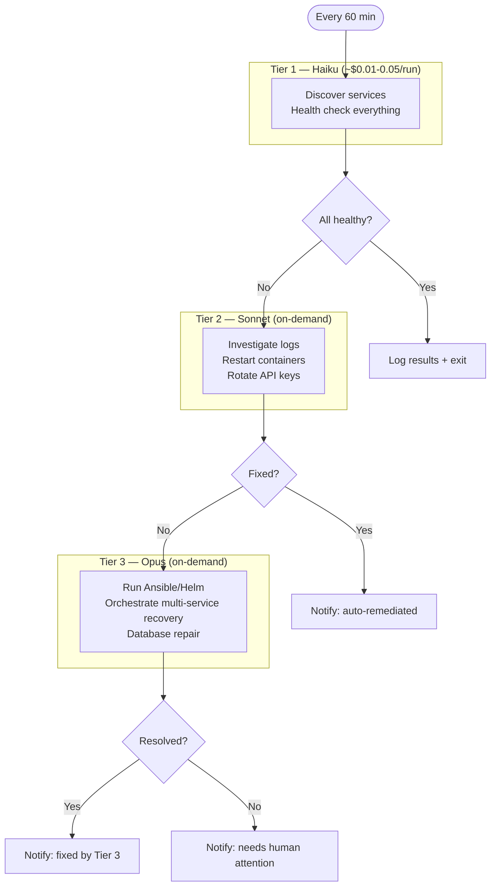

# Claude Ops

AI-powered infrastructure monitoring and remediation. Claude Code runs on a schedule, discovers your services, health-checks everything, and fixes what it can — escalating to smarter (more expensive) models only when something is actually broken.

## How It Works

Claude Ops runs as a Docker container. Every 60 minutes (configurable), it:

1. **Discovers** your infrastructure by scanning [mounted repos](./usage/repo-mounting) for service definitions
2. **Checks** every service — HTTP endpoints, DNS, container state, database health, service-specific APIs
3. **Escalates** if issues are found, using progressively more capable (and costly) models
4. **Remediates** within safety guardrails — restarting containers, rotating API keys, redeploying services
5. **Notifies** you via [Apprise](./usage/notifications) (80+ services: email, ntfy, Slack, Discord, Telegram, etc.)

## Model Escalation

:::tip Cost efficiency
On a healthy day, you spend ~$1-2 running 24 Haiku checks. Sonnet and Opus tokens are only spent when something is broken. See [Model Selection](./usage/configuration#model-selection) for per-tier cost breakdowns.
:::

## Key Features

- **Automation-agnostic**: Works with Ansible, Docker Compose, Helm, or no automation at all
- **Repo discovery**: Mount any number of infrastructure repos under `/repos/`
- **Tiered permissions**: Haiku can only observe, Sonnet can restart, Opus can redeploy
- **Cooldown safety**: Rate limits on restarts and redeployments
- **Browser automation**: Optional Chrome sidecar for web UI interactions
- **Extensible via MCP**: Docker, PostgreSQL, Chrome DevTools, and Fetch MCP servers included
- **[Notifications via Apprise](./usage/notifications)**: 80+ notification services supported
- **[Real-time dashboard](./usage/dashboard)**: Track sessions, events, memories, and cooldowns live

## Configuration

All configuration via environment variables. See the full [Configuration reference](./usage/configuration) for details.

| Variable | Default | Description |
|----------|---------|-------------|
| `ANTHROPIC_API_KEY` | *(required)* | Claude API key |
| `CLAUDEOPS_INTERVAL` | `3600` | Seconds between runs |
| `CLAUDEOPS_TIER1_MODEL` | `haiku` | Model for health checks (Tier 1) |
| `CLAUDEOPS_TIER2_MODEL` | `sonnet` | Model for investigation (Tier 2) |
| `CLAUDEOPS_TIER3_MODEL` | `opus` | Model for full remediation (Tier 3) |
| `CLAUDEOPS_DRY_RUN` | `false` | Observe only, no remediation |
| `CLAUDEOPS_APPRISE_URLS` | *(disabled)* | Comma-separated Apprise URLs |
